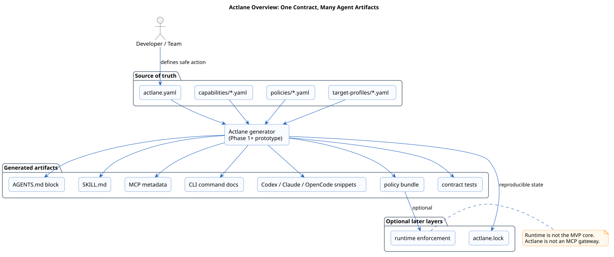

# Actlane

MCP gives agents hands. Actlane defines the safe lane for every action.

Actlane is a pre-alpha project for portable, policy-aware capability packs for AI agents. A first Go CLI MVP now exists for one OpenCode capability, but Actlane is not a production security control, hosted service, MCP gateway, or agent framework yet.

## The Problem

AI-agent safety rules are scattered across prompts, `AGENTS.md`, `SKILL.md`, MCP tool schemas, CLI/Codex/Claude/OpenCode configs, agent configs, gateway policies, CI scripts, and human memory.

That makes one capability hard to move, review, reproduce, and safely remove.

Actlane proposes one source of truth:

```text
actlane.yaml = desired capability contract
actlane.lock = exact generated/applied state
```

From that contract, Actlane can generate:

```text
AGENTS.md
SKILL.md
MCP metadata
CLI/Codex/Claude/OpenCode configs
IDE / agent snippets
policy bundles
contract tests
audit metadata
```

## First Practical Focus

The first RFC pack is:

```text
safe-gitops
```

The first working CLI MVP pack is:

```text
create-github-draft-pr
```

The first generated workflow is:

```text
create-github-draft-pr
```

The minimal proof:

```text
one actlane.yaml
one actlane.lock
generated OpenCode config snippet
generated OpenCode command
generated OpenCode agent instructions
generated policy bundle
```

## What Actlane Is Not

- Not an agent.
- Not an MCP gateway.
- Not a hosted SaaS.
- Not a marketplace-first project.
- Not a replacement for `AGENTS.md`, `SKILL.md`, MCP, or agent frameworks.

## Current Status

This repository is currently pre-alpha with a narrow working CLI MVP:

- manifesto;
- roadmap;
- proposed folder structure;
- PlantUML diagrams;
- early v1alpha1 spec notes;
- Go CLI MVP in `packages/cli`;
- OpenCode-only generator for `packs/create-github-draft-pr`;
- manual GitHub Actions release workflow for CLI artifacts.

Try the MVP locally:

```bash
cd packages/cli
go test ./...
go run ./cmd/actlane validate ../../packs/create-github-draft-pr
go run ./cmd/actlane generate ../../packs/create-github-draft-pr --target opencode --check
```

See [STATUS.md](STATUS.md).

## Repository Map

```text
docs/      concept, architecture, adoption, runtime, and pack docs
spec/      v1alpha1 schema source of truth
packs/     Phase 0 examples and the OpenCode CLI MVP pack
examples/  minimal and create-safe-draft-pr expected outputs
diagrams/  PlantUML sources and rendered SVGs
assets/    placeholder brand and image assets
packages/  Go CLI MVP and future package boundaries
```

## Start Here

- [MANIFESTO.md](MANIFESTO.md)
- [ROADMAP.md](ROADMAP.md)
- [docs/00-problem.md](docs/00-problem.md)
- [docs/01-concept.md](docs/01-concept.md)
- [docs/02-architecture.md](docs/02-architecture.md)

## We need your voice

Star the repo if your team also struggles with scattered agent prompts, MCP configs, skills, and policies.

Open an issue if you want Actlane to generate packs for a specific target such as Codex, Claude, OpenCode, or CLI agents.

Use the `Try Actlane on my setup` issue template. The first real adapters should be driven by actual user setups, not guesses.


