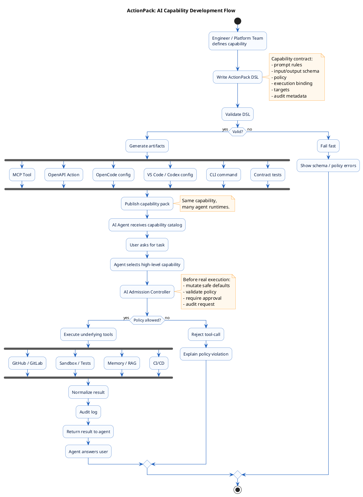

# Custom GPT и MCP

**User:** Anonymous  
**Created:** 5/10/2026 21:07:27  
**Updated:** 5/18/2026 14:52:29  
**Exported:** 5/18/2026 16:34:55  
**Link:** [https://chatgpt.com/c/6a00c924-7078-838c-aca3-1d7fb8b6dd1d](https://chatgpt.com/c/6a00c924-7078-838c-aca3-1d7fb8b6dd1d)  

## Prompt:
5/10/2026, 9:07:25 PM

Я понял что хочу на самом деле. Прикрутить ручки custom Gpt свои приватные Mcp ручки которые работают уже

## Response:
5/10/2026, 9:07:27 PM

> **Searching OpenAI documentation for Custom GPT actions**
>
> [Configuring actions in GPTs](https://help.openai.com/en/articles/9442513-configuring-actions-in-gpts)
>
> **Clarifying custom GPT integration options**
>
> To connect custom GPT with MCP, there are two approaches: the Classic Custom GPT actions using OpenAPI, or the newer ChatGPT apps if eligible. GPT can’t use both simultaneously. OpenAI recommends using the apps SDK for MCP custom apps while actions require OpenAPI schema authentication.
>
> Thought for 26s

Сформулирую это как архитектурное решение: не «субагенты», а тонкий приватный tool/API-слой вокруг уже работающих MCP-ручек, который Custom GPT вызывает через Actions. Проверю актуальные ограничения Custom GPT/Actions, чтобы не наврать по стыковке.

Да, вот это, похоже, **правильная формулировка проекта**:

> **Custom GPT = мозг и UX.  
> Твои приватные MCP-ручки = инструменты.  
> Между ними нужен тонкий gateway/adaptor, который превращает GPT Actions/OpenAPI в вызовы MCP.**

Важно: если речь именно про **Custom GPT в GPT Builder**, то он подключает внешние системы через **Actions**, где нужны HTTPS API, авторизация и OpenAPI-схема. В Action-схеме описываются сервер, endpoints, параметры и `operationId`. ([OpenAI Help Center](https://help.openai.com/en/articles/9442513-configuring-actions-in-gpts))

## Архитектура

```text
User
  ↓
Custom GPT
  ↓ Actions / OpenAPI
Private Gateway API
  ↓
MCP Client / Router
  ↓
Твои уже работающие MCP tools
  ↓
GitHub / память / файлы / sandbox / аналитика / CI / etc.
```

То есть **Custom GPT не обязан сам быть MCP-клиентом**. Он вызывает понятные ему Actions, а твой gateway уже внутри дергает MCP.

## Два пути

### Вариант A - практичный сейчас

**Custom GPT Actions → твой HTTPS Gateway → MCP**

Это самый управляемый путь.

Плюсы:

- работает в логике Custom GPT;
- можно оставить MCP приватным;
- можно сделать auth, audit, rate limit, allowlist;
- можно нормализовать ответы для GPT;
- можно скрыть внутреннюю сложность MCP.

Минус: нужен адаптер.

### Вариант B - через ChatGPT Apps / custom app

OpenAI сейчас описывает возможность строить custom apps с использованием **Model Context Protocol**, чтобы ChatGPT мог вызывать approved tools и получать данные из сервисов. ([OpenAI Help Center](https://help.openai.com/en/articles/11487775-connectors-in-chatgpt)) Но в документации также указано, что GPT может использовать **либо apps, либо actions, но не оба одновременно**. ([OpenAI Help Center](https://help.openai.com/en/articles/9442513-configuring-actions-in-gpts))

Поэтому для твоего текущего паттерна **Custom GPT + приватные ручки** я бы начинал с варианта A.

## Как назвать слой

Не “субагенты”.

Лучше:

```text
GPT Tool Gateway
MCP Action Adapter
Private MCP Facade
Tool Gateway for Custom GPT
```

Я бы выбрал:

> **Private MCP Action Gateway**

## Минимальный набор ручек

Не надо сразу отдавать GPT все MCP tools. Лучше 5-7 стабильных операций:

```text
GET  /health
POST /tools/search-context
POST /tools/read-context
POST /tools/run-readonly
POST /tools/create-artifact
POST /tools/create-github-draft
POST /tools/execute-confirmed
```

Внутри каждая операция уже мапится на один или несколько MCP tool calls.

## Главный принцип

GPT должен видеть не “сырые MCP-ручки”, а **бизнес-операции**:

Плохо:

```text
call_mcp_tool(server="github", tool="create_branch", args=...)
```

Хорошо:

```text
createDraftPr(repo, title, files, summary)
```

Плохо:

```text
read_memory_vector(query, limit, threshold)
```

Хорошо:

```text
loadProjectContext(project, task)
```

То есть MCP остаётся **транспортом и внутренней шиной инструментов**, а для Custom GPT ты делаешь **чистый контракт действий**.

## Итоговая мысль

Ты хочешь не “прикрутить MCP к GPT”, а сделать:

> **приватный слой Actions для Custom GPT, где каждая Action - это аккуратно завернутый сценарий поверх уже работающих MCP-tools.**

Это архитектурно зрелее: GPT думает, gateway исполняет, MCP остаётся внутренним tool-runtime.

---

**Sources:**

- [Configuring actions in GPTs | OpenAI Help Center](https://help.openai.com/en/articles/9442513-configuring-actions-in-gpts)

## Prompt:
5/10/2026, 9:10:16 PM

Давай краткая архитектура как сделать

## Response:
5/10/2026, 9:10:18 PM

> **Considering user request for architecture in Russian**
>
> The user is asking for a brief architecture explanation in Russian. I'll focus on providing an up-to-date response, possibly mentioning Custom GPT Actions and MCP. I should check official OpenAI docs for any updates. While personal context might not be necessary, I'll ensure I'm concise and clear.
>
> **Browsing documentation for OpenAI Custom GPT Actions**
>
> [Configuring actions in GPTs](https://help.openai.com/en/articles/9442513-configuring-actions-in-gpts)
> [Build your MCP server – Apps SDK](https://developers.openai.com/apps-sdk/build/mcp-server)
>
> Thought for 5s

Кратко: делай **не прямой MCP в Custom GPT**, а **Private MCP Action Gateway**.

```text
User
 ↓
Custom GPT
 ↓ OpenAPI Actions
Private HTTPS Gateway
 ↓ MCP client/router
Твои MCP servers/tools
 ↓
GitHub / sandbox / memory / docs / CI / analytics
```

Custom GPT Actions подключаются к внешним API через OpenAPI-схему и auth; при этом GPT может использовать либо apps, либо actions, не оба варианта одновременно. ([OpenAI Help Center](https://help.openai.com/en/articles/9442513-configuring-actions-in-gpts?utm_source=chatgpt.com)) MCP уже нативно используется в OpenAI Apps SDK и API-интеграциях, но для классического Custom GPT самый простой путь - завернуть MCP за HTTPS/OpenAPI. ([OpenAI Developers](https://developers.openai.com/apps-sdk/build/mcp-server?utm_source=chatgpt.com))

## Компоненты

**1. Custom GPT**

В system prompt:

```text
Ты архитектор/инженер. Для работы с репозиториями, памятью, sandbox и CI используй Actions. Не выдумывай результат tool-call, сначала вызывай инструмент.
```

**2. OpenAPI Actions**

Описываешь не 50 MCP-ручек, а 5-8 крупных сценариев:

```text
load_project_context
search_repo_context
create_github_draft_pr
run_sandbox_tests
get_workflow_status
save_project_note
read_memory
```

**3. Private Gateway**

FastAPI/Node/Go сервис:

```text
/auth
/actions/load-project-context
/actions/create-draft-pr
/actions/run-sandbox-tests
/actions/save-note
```

Он принимает запрос от GPT, валидирует, логирует, нормализует вход.

**4. MCP Router**

Внутри gateway:

```text
action → policy check → MCP tool call(s) → normalized result
```

Например:

```text
create_github_draft_pr
  → github.create_branch
  → github.commit_files
  → github.create_pull_request
  → return PR URL + summary
```

**5. Policy / Safety слой**

Обязательно:

```text
read-only по умолчанию
mutating tools только allowlist
repo allowlist
branch prefix
max files / max diff size
audit log
dry-run режим
explicit confirmation для опасных действий
```

**6. Auth**

Для начала проще:

```text
Custom GPT Action → Bearer token → Gateway
```

Позже:

```text
OAuth / per-user tokens / RBAC
```

## MVP за 1 итерацию

Сделать только 3 ручки:

```text
GET  /health
POST /context/load
POST /github/create-draft-pr
```

И один внутренний MCP-сервер:

```text
github-mcp
```

## Главное правило дизайна

Не отдавай GPT сырые MCP-tools.

Плохо:

```text
call_tool(server, tool, args)
```

Хорошо:

```text
createDraftPr(repo, branchName, files, summary)
```

То есть GPT видит **человеческие действия**, а MCP остаётся внутренним runtime.

---

**Sources:**

- [Configuring actions in GPTs](https://help.openai.com/en/articles/9442513-configuring-actions-in-gpts?utm_source=chatgpt.com)
- [Build your MCP server – Apps SDK](https://developers.openai.com/apps-sdk/build/mcp-server?utm_source=chatgpt.com)

## Prompt:
5/10/2026, 9:14:48 PM

Давай чуть глубже я хочу стандартизировать взаимодействия чтобы легко добавит собрать свои action на высоком уровне абстракции DSL yaml какой то

## Response:
5/10/2026, 9:15:08 PM

> **Browsing official OpenAI documentation and MCP resources**
>
> [OpenAI | OpenAI](https://openai.com/)
> [MCP – Apps SDK](https://developers.openai.com/apps-sdk/concepts/mcp-server)
> [Prompts](https://modelcontextprotocol.io/specification/2025-06-18/server/prompts)
> [OpenAI](https://en.wikipedia.org/wiki/OpenAI)
> [MCP Prompts: Building Workflow Automation](https://blog.modelcontextprotocol.io/posts/2025-07-29-prompts-for-automation/)
> [OpenAI](https://www.linkedin.com/company/openai)
> [OpenAI Platform](https://platform.openai.com/)
>
> **Searching for Custom GPT Actions official documentation**
>
> [Configuring actions in GPTs | OpenAI Help Center](https://help.openai.com/en/articles/9442513-configuring-actions-in-gpts)
> [MCP – Apps SDK | OpenAI Developers](https://developers.openai.com/apps-sdk/concepts/mcp-server)
> [Specification - Model Context Protocol](https://modelcontextprotocol.io/specification/2025-11-25)
>
> **Designing a structured response for MCP and OpenAPI**
>
> I need to focus on clear factual citations, checking where MCP and OpenAPI API docs mention compatibility, without overloading with citations. A structured answer with YAML examples might work well, but I’ll avoid excessive tables. I'll make sure to cover the key security aspects and architecture details clearly. I'll also reference relevant documentation on OpenAI Actions' use of OpenAPI schema.
>
> **Summarizing OpenAI Actions and MCP Integration**
>
> [Configuring actions in GPTs | OpenAI Help Center](https://help.openai.com/en/articles/9442513-configuring-actions-in-gpts)
>
> Thought for 12s

Разложу как стандарт: **YAML DSL → compiler/generator → OpenAPI Actions → gateway runtime → MCP router**. Главное — не описывать каждую ручку руками, а генерировать контракт и политики из одного источника правды.

Да. Правильный следующий уровень - сделать **свой DSL как “источник правды”**, из которого автоматически генерируются:

```text
1. OpenAPI schema для Custom GPT Actions
2. Gateway routes
3. MCP tool mapping
4. policy rules
5. тесты контракта
6. документация для GPT/system prompt
```

Custom GPT Actions сейчас конфигурируются через внешний API, auth и OpenAPI schema; schema описывает сервер, endpoints, параметры и `operationId`. ([OpenAI Help Center](https://help.openai.com/en/articles/9442513-configuring-actions-in-gpts)) MCP при этом даёт стандартные primitives: **tools, resources, prompts**, а tools имеют discover/call модель и JSON-схемы входов/выходов. ([Model Context Protocol](https://modelcontextprotocol.io/specification/2025-11-25))

## Целевая схема

```text
actions.yaml
   ↓
dsl-compiler
   ├─ openapi.yaml
   ├─ gateway_routes.py / routes.ts
   ├─ mcp_bindings.yaml
   ├─ policy.rego / policy.yaml
   ├─ tests/contracts/
   └─ gpt_instructions.md
        ↓
Custom GPT → Actions → Gateway → MCP Router → MCP tools
```

## Идея DSL

Не описывать “HTTP ручку”. Описывать **намерение высокого уровня**:

```yaml
version: 1

actions:
  - id: load_project_context
    title: Load project context
    description: >
      Load relevant repository, memory and document context for a task.

    intent: readonly
    exposure: gpt_action

    input:
      type: object
      required: [project, task]
      properties:
        project:
          type: string
          enum: [development, deployment, builder]
        task:
          type: string
        freshness:
          type: string
          enum: [recent, full, docs_only]
          default: recent

    output:
      type: object
      required: [summary, sources]
      properties:
        summary:
          type: string
        sources:
          type: array
          items:
            type: object

    policy:
      risk: low
      auth: bearer
      allowed_repos:
        - bakaut/development
        - bakaut/deployment
      max_results: 20

    flow:
      - use: memory.search
        with:
          query: "{{ input.project }} {{ input.task }}"
      - use: github.search_repo
        with:
          repo: "bakaut/{{ input.project }}"
          query: "{{ input.task }}"
      - return:
          summary: "{{ summarize(steps) }}"
          sources: "{{ collect_sources(steps) }}"
```

## Типы action

Я бы ввёл 4 класса:

```yaml
kind: readonly      # читать, искать, анализировать
kind: draft         # подготовить изменение, но не применить
kind: mutating      # изменить внешний мир
kind: privileged    # опасные действия: deploy, delete, secrets, prod
```

И политика:

```yaml
policy:
  confirmation: never | required | double_required
  dry_run_default: true | false
  audit: true
  repo_allowlist: [...]
  branch_prefix: gpt/
  max_files_changed: 10
  max_diff_kb: 200
```

## Пример mutating action

```yaml
actions:
  - id: create_draft_pr
    title: Create draft PR
    intent: mutating
    exposure: gpt_action

    input:
      type: object
      required: [repo, branch, files, title]
      properties:
        repo:
          type: string
        branch:
          type: string
        title:
          type: string
        files:
          type: array
          items:
            type: object
            required: [path, content]
            properties:
              path: { type: string }
              content: { type: string }

    policy:
      risk: medium
      confirmation: required
      repo_allowlist:
        - bakaut/development
        - bakaut/builder
      branch_prefix: gpt/
      forbid_paths:
        - ".github/workflows/prod-*"
        - "secrets/**"
      max_files_changed: 20

    flow:
      - use: github.create_branch
        with:
          repo: "{{ input.repo }}"
          branch: "{{ input.branch }}"
      - use: github.commit_files
        with:
          repo: "{{ input.repo }}"
          branch: "{{ input.branch }}"
          files: "{{ input.files }}"
      - use: github.create_pull_request
        with:
          repo: "{{ input.repo }}"
          branch: "{{ input.branch }}"
          title: "{{ input.title }}"
          draft: true
      - return:
          pr_url: "{{ steps.github.create_pull_request.url }}"
```

## Компилятор DSL делает 5 вещей

### 1. Генерирует OpenAPI

Из action:

```yaml
id: create_draft_pr
```

делает endpoint:

```text
POST /actions/create-draft-pr
operationId: createDraftPr
```

Custom GPT видит только аккуратную высокоуровневую ручку.

### 2. Генерирует Gateway route

Например:

```python
@app.post("/actions/create-draft-pr")
async def create_draft_pr(input: CreateDraftPrInput):
    ctx = build_context(input)
    await policy.check("create_draft_pr", ctx)
    result = await flow_runner.run("create_draft_pr", input)
    return normalize(result)
```

### 3. Генерирует MCP binding

```yaml
bindings:
  github.create_branch:
    server: github
    tool: create_branch

  github.commit_files:
    server: github
    tool: commit_files

  memory.search:
    server: memory
    tool: search
```

### 4. Генерирует тесты контракта

Минимум:

```text
- OpenAPI валиден
- каждый action имеет input/output schema
- каждый use ссылается на существующий MCP tool
- mutating action имеет policy
- privileged action требует confirmation
- forbid_paths реально проверяются
```

### 5. Генерирует инструкции для GPT

```markdown
Available high-level actions:
- load_project_context: use before repository work
- create_draft_pr: use only after user explicitly asks to commit/push
- run_sandbox_tests: use before creating PR
```

## Внутренний runtime

```text
Action request
  ↓
Auth middleware
  ↓
Input schema validation
  ↓
Policy engine
  ↓
Flow runner
  ↓
MCP router
  ↓
Result normalizer
  ↓
Audit log
  ↓
Response to GPT
```

MCP сам по себе поддерживает разные транспорты, включая stdio и streamable HTTP, а remote-сценарии могут использовать стандартную HTTP-auth модель. ([Model Context Protocol](https://modelcontextprotocol.io/docs/learn/architecture)) Поэтому gateway может говорить с разными MCP-серверами: локальными через stdio, удалёнными через HTTP.

## Важный принцип

DSL должен быть **не про транспорт**, а про **операции**.

Плохо:

```yaml
endpoint: /mcp/call
tool: github.create_branch
```

Хорошо:

```yaml
id: create_draft_pr
intent: mutating
flow:
  - github.create_branch
  - github.commit_files
  - github.create_pull_request
```

## Минимальная структура репозитория

```text
mcp-action-gateway/
  actions/
    project-context.yaml
    github.yaml
    sandbox.yaml
    memory.yaml

  bindings/
    github-mcp.yaml
    memory-mcp.yaml
    sandbox-mcp.yaml

  policies/
    default.yaml
    github.yaml

  generated/
    openapi.yaml
    gpt_instructions.md

  gateway/
    app.py
    flow_runner.py
    mcp_router.py
    policy.py

  tests/
    test_contracts.py
    test_policies.py
    test_generated_openapi.py
```

## MVP DSL v1

Начать с 6 полей:

```yaml
id:
description:
input:
output:
policy:
flow:
```

Не надо сразу делать сложный workflow engine. В первой версии достаточно:

```yaml
flow:
  - use: server.tool
    with: {}
  - return: {}
```

## Архитектурный итог

Твоя система должна выглядеть так:

```text
Custom GPT не знает про MCP напрямую.
Custom GPT знает только высокоуровневые Actions.
DSL описывает Actions как бизнес-операции.
Gateway компилируется из DSL.
Gateway исполняет flow через MCP.
Policy слой решает, можно ли это делать.
Audit слой фиксирует всё.
```

Самое ценное: ты сможешь добавить новую возможность не кодом в 5 местах, а одним YAML-файлом:

```text
new-action.yaml
  → generate
  → test
  → deploy gateway
  → update OpenAPI in Custom GPT
```

---

**Sources:**

- [Configuring actions in GPTs | OpenAI Help Center](https://help.openai.com/en/articles/9442513-configuring-actions-in-gpts)
- [Specification - Model Context Protocol](https://modelcontextprotocol.io/specification/2025-11-25)

## Prompt:
5/10/2026, 9:22:21 PM

Хмм давай учтем в DSL и про промты Тоже инструкции system prompt

## Response:
5/10/2026, 9:22:23 PM

> **Designing prompts in Russian without the web**
>
> The user wants a design-focused answer using prompts/systems in DSL, likely without needing to browse unless it's a niche fact. I can provide a relevant answer based on prior knowledge, emphasizing architecture and including possible extensions. I might mention constraints and a static instruction generation plan with YAML.
>
> **Searching for official OpenAI Custom GPT actions documentation**
>
> [Configuring actions in GPTs](https://help.openai.com/en/articles/9442513-configuring-actions-in-gpts)
> [Tokenizer - OpenAI API](https://platform.openai.com/tokenizer)
>
> Thought for 12s

Да, это важный слой: DSL должен описывать не только tools/actions, но и **поведение GPT вокруг них** — роли, правила, промты, подсказки выбора action и safety-инструкции. Проверю формулировки по официальной стороне OpenAI, чтобы аккуратно отделить статический system prompt Custom GPT от runtime-инструкций gateway.

Да, DSL должен описывать **не только Actions**, но и **prompt contract**: как GPT должен думать, когда вызывать action, что запрещено, как форматировать ответ, когда требовать подтверждение.

Custom GPT может включать инструкции, knowledge, capabilities, apps и actions; actions подключаются через внешний API, auth и OpenAPI schema. Важно: GPT может использовать **apps или actions**, но не оба одновременно. ([OpenAI Help Center](https://help.openai.com/en/articles/8554407-gpts-in-chatgpt?utm_source=chatgpt.com))

## Целевая модель

```text
project.yaml
  ↓
dsl compiler
  ├─ openapi.yaml
  ├─ gateway routes
  ├─ mcp bindings
  ├─ policy rules
  ├─ system_prompt.md
  ├─ action_usage_prompt.md
  └─ contract tests
```

То есть один YAML описывает:

```text
что GPT умеет
как GPT должен себя вести
какие actions доступны
когда их вызывать
какие MCP tools стоят внутри
какие политики безопасности применяются
```

## DSL структура

```yaml
version: 1

assistant:
  id: sre_architect_gpt
  name: SRE Architect Engineer
  language: ru
  style:
    brevity: concise
    tone: architect
    format: thesis_first

  system_prompt:
    role: |
      Ты работаешь как архитектор и инженер.
      Сначала уточняешь контекст, затем используешь доступные actions.
      Не выдумывай результаты внешних систем.
    principles:
      - "Архитектура сначала, реализация потом"
      - "Readonly по умолчанию"
      - "Mutating действия только после явного намерения пользователя"
      - "Перед commit/PR сначала тесты или dry-run"
    forbidden:
      - "Не утверждай, что действие выполнено, если action не вернул успех"
      - "Не используй неразрешённые репозитории"
      - "Не записывай secrets в git"

  response_contract:
    default_format:
      - "Краткий вывод"
      - "Что сделал / что нашёл"
      - "Риски"
      - "Следующий шаг"
    when_tool_failed:
      - "Скажи честно, что не получилось"
      - "Покажи ошибку кратко"
      - "Предложи безопасный обход"

actions:
  - id: load_project_context
    title: Load project context
    intent: readonly
    when_to_use: |
      Используй перед задачами по репозиторию, архитектуре, PR или продолжению старого проекта.
    when_not_to_use: |
      Не используй для общих вопросов, где внешний контекст не нужен.

    gpt_instruction: |
      После вызова кратко суммируй найденный контекст.
      Не цитируй длинные куски файлов.
      Если контекст неполный - явно скажи.

    input:
      type: object
      required: [project, task]
      properties:
        project:
          type: string
        task:
          type: string

    output:
      type: object
      required: [summary, sources]
      properties:
        summary:
          type: string
        sources:
          type: array

    policy:
      risk: low
      confirmation: never

    flow:
      - use: memory.search
        with:
          query: "{{ input.project }} {{ input.task }}"
      - use: github.search_repo
        with:
          repo: "{{ resolve_repo(input.project) }}"
          query: "{{ input.task }}"
      - return:
          summary: "{{ summarize(steps) }}"
          sources: "{{ collect_sources(steps) }}"
```

## Важное разделение промтов

Я бы сделал 4 слоя.

### 1. Base system prompt

Общее поведение GPT:

```yaml
prompts:
  base_system:
    content: |
      Ты работаешь как SRE/DevOps архитектор.
      Отвечай кратко, структурно, без воды.
      Для фактов из внешних систем используй actions.
      Не придумывай состояние репозитория, CI, PR, sandbox.
```

### 2. Mode prompts

Роли/режимы:

```yaml
prompts:
  modes:
    architect:
      trigger_phrases:
        - "архитектор"
        - "режим архитектора"
      content: |
        Не пиши код.
        Сформулируй архитектуру, риски, ADR, схемы, acceptance criteria.

    engineer:
      trigger_phrases:
        - "инженер"
        - "делай"
        - "реализуй"
      content: |
        Можешь менять файлы через actions.
        Перед commit выполни тесты или объясни, почему не смог.
```

### 3. Action usage prompts

Когда какую action вызывать:

```yaml
prompts:
  action_policy:
    content: |
      Если задача касается репозитория - сначала load_project_context.
      Если пользователь просит commit/push/PR - используй create_draft_pr.
      Если пользователь просит проверить код - сначала run_tests.
      Если действие меняет внешний мир - покажи план и дождись явного намерения, если policy.confirmation=required.
```

### 4. Output prompts

Формат ответа после tool-call:

```yaml
prompts:
  outputs:
    after_context_load: |
      Ответь в формате:
      1. Что нашлось
      2. Что важно
      3. Чего не хватает
      4. Следующий безопасный шаг

    after_pr_created: |
      Ответь:
      - ссылка на PR
      - ветка
      - файлы
      - тесты
      - ограничения
```

## Action + prompt вместе

Очень важная идея: **каждая action должна иметь свою инструкцию для GPT**.

```yaml
actions:
  - id: create_draft_pr
    intent: mutating
    title: Create draft pull request

    gpt_instruction: |
      Используй только если пользователь явно попросил создать ветку, commit, PR или push.
      Перед вызовом покажи краткий change summary.
      Не используй для production deploy.
      После вызова верни PR URL и список изменённых файлов.

    policy:
      risk: medium
      confirmation: required
      branch_prefix: gpt/
      repo_allowlist:
        - bakaut/development
        - bakaut/builder
      forbid_paths:
        - "secrets/**"
        - ".env"
        - ".github/workflows/prod-*"

    flow:
      - use: github.create_branch
      - use: github.commit_files
      - use: github.create_pull_request
```

## Генерация system prompt из DSL

Компилятор собирает:

```text
base_system
+ selected modes
+ global policies
+ action catalog
+ action usage rules
+ output contracts
```

На выходе:

```text
generated/system_prompt.md
generated/openapi.yaml
generated/gpt_action_reference.md
```

Пример generated-фрагмента:

```markdown
# Tool usage rules

You have these high-level actions:

## load_project_context
Use before repository, PR, architecture continuation, or project-memory tasks.
Risk: low.
Confirmation: not required.

## create_draft_pr
Use only after explicit user intent to create branch, commit, push, or PR.
Risk: medium.
Confirmation: required.
Never modify secrets, .env files, or production workflows.
```

## Я бы ввёл отдельный блок `behavior`

```yaml
behavior:
  default_mode: architect

  context_rules:
    - id: no_fake_external_state
      instruction: "Не выдумывай состояние GitHub, CI, файлов, sandbox."
    - id: use_context_before_repo_work
      instruction: "Перед repo-задачей вызови load_project_context."

  confirmation_rules:
    readonly: never
    draft: sometimes
    mutating: required
    privileged: double_required

  answer_style:
    max_intro_lines: 2
    prefer_tables: false
    prefer_checklists: true
    language: ru
```

## Итоговая архитектура DSL

```text
DSL описывает:
  assistant      → кто такой GPT
  prompts        → как он должен себя вести
  actions        → какие высокоуровневые операции доступны
  flow           → какие MCP tools исполняются внутри
  policy         → что разрешено/запрещено
  outputs        → как отвечать пользователю
  tests          → как проверить контракт
```

Самая сильная формула:

```text
DSL = Prompt contract + Action contract + Policy contract + MCP binding
```

Тогда новая возможность добавляется не хаотично, а одним модулем:

```text
actions/github-create-pr.yaml
prompts/github-create-pr.md
policies/github-create-pr.yaml
tests/github-create-pr.yaml
```

А Custom GPT получает уже сгенерированный, чистый и короткий контракт поведения.

---

**Sources:**

- [GPTs in ChatGPT](https://help.openai.com/en/articles/8554407-gpts-in-chatgpt?utm_source=chatgpt.com)

## Prompt:
5/10/2026, 9:30:11 PM

Давай в ответе пример такого DSL и пример сгенерировано уже

## Response:
5/10/2026, 9:30:13 PM

Ниже сквозной пример: **один DSL YAML** и что из него можно сгенерировать.

## 1. Исходный DSL

```yaml
version: 1

assistant:
  id: private_sre_gpt
  name: Private SRE GPT
  language: ru

  behavior:
    default_mode: architect
    style: concise_thesis
    rules:
      - id: no_fake_external_state
        text: "Не выдумывай состояние GitHub, CI, файлов, sandbox или памяти."
      - id: readonly_first
        text: "Readonly-действия выполняй до mutating-действий."
      - id: test_before_commit
        text: "Перед commit/PR сначала запусти тесты или явно объясни, почему тесты не запускались."

  modes:
    architect:
      trigger:
        - "архитектор"
        - "режим архитектора"
      prompt: |
        Работай как архитектор. Не пиши код без запроса.
        Сначала дай схему, риски, acceptance criteria и безопасный следующий шаг.

    engineer:
      trigger:
        - "инженер"
        - "реализуй"
        - "делай"
      prompt: |
        Работай как инженер. Можешь использовать actions для чтения, тестов и создания draft PR.
        Не утверждай, что действие выполнено, если action не вернул success.

defaults:
  auth: bearer
  audit: true
  timeout_seconds: 60

mcp_servers:
  github:
    transport: http
    url_env: GITHUB_MCP_URL
    tools:
      - search_repo
      - create_branch
      - commit_files
      - create_pull_request

  memory:
    transport: http
    url_env: MEMORY_MCP_URL
    tools:
      - search
      - save_note

  sandbox:
    transport: http
    url_env: SANDBOX_MCP_URL
    tools:
      - run_tests

actions:
  - id: load_project_context
    title: Load project context
    kind: readonly
    exposure: gpt_action

    description: |
      Загружает релевантный контекст проекта из памяти и репозитория.

    gpt_instruction: |
      Используй перед задачами по репозиторию, PR, архитектуре или продолжению старого проекта.
      После вызова кратко суммируй найденное и явно скажи, если контекст неполный.

    input:
      type: object
      required: [project, task]
      properties:
        project:
          type: string
          enum: [development, deployment, builder]
        task:
          type: string
        freshness:
          type: string
          enum: [recent, full]
          default: recent

    output:
      type: object
      required: [summary, sources]
      properties:
        summary:
          type: string
        sources:
          type: array
          items:
            type: object
            properties:
              type: { type: string }
              ref: { type: string }

    policy:
      risk: low
      confirmation: never
      allowed_repos:
        - bakaut/development
        - bakaut/deployment
        - bakaut/builder
      max_results: 20

    flow:
      - id: memory_context
        use: memory.search
        with:
          query: "{{ input.project }} {{ input.task }}"
          limit: 10

      - id: repo_context
        use: github.search_repo
        with:
          repo: "bakaut/{{ input.project }}"
          query: "{{ input.task }}"
          limit: 10

      - return:
          summary: "{{ summarize(steps.memory_context, steps.repo_context) }}"
          sources: "{{ collect_sources(steps) }}"

  - id: create_draft_pr
    title: Create draft PR
    kind: mutating
    exposure: gpt_action

    description: |
      Создаёт ветку, коммитит файлы и открывает draft PR.

    gpt_instruction: |
      Используй только если пользователь явно попросил commit, push, branch или PR.
      Перед вызовом покажи краткий change summary.
      После вызова верни PR URL, ветку, изменённые файлы и статус тестов.

    input:
      type: object
      required: [repo, branch, title, files]
      properties:
        repo:
          type: string
          enum:
            - bakaut/development
            - bakaut/deployment
            - bakaut/builder
        branch:
          type: string
        title:
          type: string
        body:
          type: string
        files:
          type: array
          items:
            type: object
            required: [path, content]
            properties:
              path: { type: string }
              content: { type: string }
        run_tests:
          type: boolean
          default: true

    output:
      type: object
      required: [success, pr_url, branch]
      properties:
        success: { type: boolean }
        pr_url: { type: string }
        branch: { type: string }
        changed_files:
          type: array
          items: { type: string }
        tests:
          type: object

    policy:
      risk: medium
      confirmation: required
      branch_prefix: gpt/
      max_files_changed: 20
      max_diff_kb: 200
      forbid_paths:
        - ".env"
        - "secrets/**"
        - ".github/workflows/prod-*"

    flow:
      - id: tests
        if: "{{ input.run_tests }}"
        use: sandbox.run_tests
        with:
          repo: "{{ input.repo }}"
          files: "{{ input.files }}"

      - id: branch
        use: github.create_branch
        with:
          repo: "{{ input.repo }}"
          branch: "{{ ensure_prefix(input.branch, 'gpt/') }}"

      - id: commit
        use: github.commit_files
        with:
          repo: "{{ input.repo }}"
          branch: "{{ steps.branch.branch }}"
          files: "{{ input.files }}"

      - id: pr
        use: github.create_pull_request
        with:
          repo: "{{ input.repo }}"
          branch: "{{ steps.branch.branch }}"
          title: "{{ input.title }}"
          body: "{{ input.body }}"
          draft: true

      - return:
          success: true
          pr_url: "{{ steps.pr.url }}"
          branch: "{{ steps.branch.branch }}"
          changed_files: "{{ map(input.files, 'path') }}"
          tests: "{{ steps.tests }}"
```

---

# 2. Сгенерированный OpenAPI fragment

```yaml
openapi: 3.1.0
info:
  title: Private SRE GPT Actions
  version: 1.0.0

servers:
  - url: https://gpt.poymoymir.ru/api/v1

components:
  securitySchemes:
    bearerAuth:
      type: http
      scheme: bearer

security:
  - bearerAuth: []

paths:
  /actions/load-project-context:
    post:
      operationId: loadProjectContext
      summary: Load project context
      description: Загружает релевантный контекст проекта из памяти и репозитория.
      x-action-kind: readonly
      x-risk: low
      requestBody:
        required: true
        content:
          application/json:
            schema:
              type: object
              required:
                - project
                - task
              properties:
                project:
                  type: string
                  enum:
                    - development
                    - deployment
                    - builder
                task:
                  type: string
                freshness:
                  type: string
                  enum:
                    - recent
                    - full
                  default: recent
      responses:
        "200":
          description: Project context
          content:
            application/json:
              schema:
                type: object
                required:
                  - summary
                  - sources
                properties:
                  summary:
                    type: string
                  sources:
                    type: array
                    items:
                      type: object

  /actions/create-draft-pr:
    post:
      operationId: createDraftPr
      summary: Create draft PR
      description: Создаёт ветку, коммитит файлы и открывает draft PR.
      x-action-kind: mutating
      x-risk: medium
      x-confirmation: required
      requestBody:
        required: true
        content:
          application/json:
            schema:
              type: object
              required:
                - repo
                - branch
                - title
                - files
              properties:
                repo:
                  type: string
                  enum:
                    - bakaut/development
                    - bakaut/deployment
                    - bakaut/builder
                branch:
                  type: string
                title:
                  type: string
                body:
                  type: string
                run_tests:
                  type: boolean
                  default: true
                files:
                  type: array
                  items:
                    type: object
                    required:
                      - path
                      - content
                    properties:
                      path:
                        type: string
                      content:
                        type: string
      responses:
        "200":
          description: Draft PR created
          content:
            application/json:
              schema:
                type: object
                required:
                  - success
                  - pr_url
                  - branch
                properties:
                  success:
                    type: boolean
                  pr_url:
                    type: string
                  branch:
                    type: string
                  changed_files:
                    type: array
                    items:
                      type: string
                  tests:
                    type: object
```

---

# 3. Сгенерированный system prompt

```markdown
# Private SRE GPT

Ты работаешь как приватный SRE/DevOps архитектор и инженер.

## Общие правила

- Не выдумывай состояние GitHub, CI, файлов, sandbox или памяти.
- Readonly-действия выполняй до mutating-действий.
- Перед commit/PR сначала запусти тесты или явно объясни, почему тесты не запускались.
- Не утверждай, что внешнее действие выполнено, если action не вернул success.
- Для задач по репозиторию, PR, CI, памяти и sandbox используй доступные Actions.

## Режим architect

Триггеры:
- "архитектор"
- "режим архитектора"

Поведение:
Работай как архитектор. Не пиши код без запроса.
Сначала дай схему, риски, acceptance criteria и безопасный следующий шаг.

## Режим engineer

Триггеры:
- "инженер"
- "реализуй"
- "делай"

Поведение:
Работай как инженер. Можешь использовать actions для чтения, тестов и создания draft PR.
Не утверждай, что действие выполнено, если action не вернул success.

## Доступные Actions

### loadProjectContext

Используй перед задачами по репозиторию, PR, архитектуре или продолжению старого проекта.

Kind: readonly  
Risk: low  
Confirmation: never

После вызова:
- кратко суммируй найденное;
- покажи важные источники;
- явно скажи, если контекст неполный.

### createDraftPr

Используй только если пользователь явно попросил commit, push, branch или PR.

Kind: mutating  
Risk: medium  
Confirmation: required

Перед вызовом:
- покажи краткий change summary;
- убедись, что repo входит в allowlist;
- убедись, что branch начинается с `gpt/`;
- не меняй `.env`, `secrets/**`, `.github/workflows/prod-*`.

После вызова:
- верни PR URL;
- ветку;
- список изменённых файлов;
- статус тестов;
- ограничения, если они были.
```

---

# 4. Сгенерированный gateway manifest

```yaml
routes:
  - path: /actions/load-project-context
    method: POST
    operation_id: loadProjectContext
    action_id: load_project_context
    kind: readonly
    risk: low
    confirmation: never
    flow:
      - step_id: memory_context
        server: memory
        tool: search
      - step_id: repo_context
        server: github
        tool: search_repo

  - path: /actions/create-draft-pr
    method: POST
    operation_id: createDraftPr
    action_id: create_draft_pr
    kind: mutating
    risk: medium
    confirmation: required
    policy:
      branch_prefix: gpt/
      max_files_changed: 20
      max_diff_kb: 200
      forbid_paths:
        - ".env"
        - "secrets/**"
        - ".github/workflows/prod-*"
    flow:
      - step_id: tests
        server: sandbox
        tool: run_tests
        optional: true
      - step_id: branch
        server: github
        tool: create_branch
      - step_id: commit
        server: github
        tool: commit_files
      - step_id: pr
        server: github
        tool: create_pull_request
```

---

# 5. Сгенерированный FastAPI skeleton

```python
from fastapi import FastAPI, Depends
from pydantic import BaseModel
from typing import List, Optional

app = FastAPI(title="Private SRE GPT Actions")

class FileChange(BaseModel):
    path: str
    content: str

class LoadProjectContextInput(BaseModel):
    project: str
    task: str
    freshness: str = "recent"

class CreateDraftPrInput(BaseModel):
    repo: str
    branch: str
    title: str
    body: Optional[str] = None
    files: List[FileChange]
    run_tests: bool = True

async def require_auth():
    # generated auth hook
    pass

async def check_policy(action_id: str, payload: dict):
    # generated policy hook
    pass

async def run_flow(action_id: str, payload: dict):
    # generic generated flow runner
    pass

@app.post("/actions/load-project-context")
async def load_project_context(
    payload: LoadProjectContextInput,
    _auth=Depends(require_auth),
):
    data = payload.model_dump()
    await check_policy("load_project_context", data)
    result = await run_flow("load_project_context", data)
    return result

@app.post("/actions/create-draft-pr")
async def create_draft_pr(
    payload: CreateDraftPrInput,
    _auth=Depends(require_auth),
):
    data = payload.model_dump()
    await check_policy("create_draft_pr", data)
    result = await run_flow("create_draft_pr", data)
    return result
```

---

# 6. Сгенерированные contract tests

```python
def test_mutating_actions_require_confirmation(dsl):
    for action in dsl["actions"]:
        if action["kind"] == "mutating":
            assert action["policy"]["confirmation"] in ["required", "double_required"]

def test_mutating_actions_have_forbid_paths(dsl):
    for action in dsl["actions"]:
        if action["kind"] == "mutating":
            assert "forbid_paths" in action["policy"]

def test_all_flow_tools_exist_in_mcp_servers(dsl):
    servers = dsl["mcp_servers"]

    for action in dsl["actions"]:
        for step in action["flow"]:
            if "use" not in step:
                continue

            server_name, tool_name = step["use"].split(".", 1)

            assert server_name in servers
            assert tool_name in servers[server_name]["tools"]

def test_exposed_actions_have_input_output(dsl):
    for action in dsl["actions"]:
        if action.get("exposure") == "gpt_action":
            assert "input" in action
            assert "output" in action

def test_create_draft_pr_branch_policy(dsl):
    action = next(a for a in dsl["actions"] if a["id"] == "create_draft_pr")
    assert action["policy"]["branch_prefix"] == "gpt/"
```

---

# 7. Сгенерированный prompt catalog для GPT

```markdown
# Action Usage Catalog

## loadProjectContext

Use when:
- пользователь просит продолжить старый проект;
- задача касается repo/docs/PR/CI;
- нужно восстановить архитектурный контекст.

Do not use when:
- вопрос общий;
- пользователь просит просто объяснение без внешнего состояния.

Expected answer after tool:
1. Найденный контекст
2. Что важно
3. Чего не хватает
4. Следующий безопасный шаг

---

## createDraftPr

Use when:
- пользователь явно сказал commit;
- пользователь явно сказал push;
- пользователь явно сказал создать ветку;
- пользователь явно сказал создать PR.

Do not use when:
- пользователь только обсуждает архитектуру;
- пользователь не просил менять внешний мир;
- изменения затрагивают secrets, `.env`, production workflow.

Expected answer after tool:
1. PR URL
2. Branch
3. Changed files
4. Tests
5. Limitations
```

---

Главная идея: **DSL — один источник правды**, а всё остальное генерируется.

```text
actions.yaml
  → openapi.yaml
  → system_prompt.md
  → gateway routes
  → policy manifest
  → MCP bindings
  → contract tests
```

То есть ты добавляешь новую высокоуровневую возможность не руками в Custom GPT, gateway, docs и tests, а одним DSL-модулем.

## Prompt:
5/10/2026, 9:34:00 PM

Давай подумаем над стандартов для такого DSL как сделать достаточно гибко чтобы можно расширять было

## Response:
5/10/2026, 9:34:05 PM

> **Browsing for up-to-date DSL standards and specifications**
>
> [OpenAPI Specification - Version 3.1.0](https://swagger.io/specification/)
> [Draft 2020-12](https://json-schema.org/draft/2020-12)
> [CEL | Common Expression Language](https://cel.dev/)
> [Policy Language](https://openpolicyagent.org/docs/policy-language)
> [Specification](https://modelcontextprotocol.io/specification/2025-11-25)
> [OpenAPI Specification 3.1.0 Released](https://www.openapis.org/blog/2021/02/18/openapi-specification-3-1-released)
> [google/cel-spec: Common Expression Language](https://github.com/google/cel-spec)
> [JSON Schema 2020-12](https://www.learnjsonschema.com/2020-12/)
> [Generation of JSON Schema Draft 2020-12 for ...](https://www.iso20022.org/sites/default/files/media/file/ISO_20022_Generation_of_JSON_Schema_Draft_2020_12_for_ISO_20022_2013_10June2025.pdf)
> [Common Expression Language in Kubernetes](https://kubernetes.io/docs/reference/using-api/cel/)
> [IETF draft-bhutton-json-schema](https://tools.ietf.org/html/draft-bhutton-json-schema-00)
> [Anthropic launches tool to connect AI systems directly to datasets](https://www.theverge.com/2024/11/25/24305774/anthropic-model-context-protocol-data-sources)
>
> **Structuring DSL standard with recommended features**
>
> To provide a structured answer, I need to mention key DSL standards like using YAML with JSON Schema v2020-12, modular specs, and versioning. I'll note safe expressions with CEL, and policies through OPA Rego. I'll include mini-standard examples, such as ActionPack v1, and highlight DSL capabilities like actions, flows, and tests. I’ll mention backward compatibility and versioning, and ensure all sources are properly cited, but no raw URLs.
>
> **Clarifying standards and structuring response**
>
> The user asked about "standards," and I think it’s better to focus on internal standards, like JSON Schema and OpenAPI. I might mention "CUE" as optional, but avoid it unless necessary. I'll reference a minimum v1 standard, extension in v2, and three layers: canonical DSL, profiles, and generated artifacts. I'll avoid a table and aim for lists instead. Also, I'll ensure I include citations for any factual claims made.
>
> **Structuring "MCP Action DSL" Standard with Examples**
>
> [GPT Action authentication | OpenAI API](https://developers.openai.com/api/docs/actions/authentication)
> [Configuring actions in GPTs](https://help.openai.com/en/articles/9442513-configuring-actions-in-gpts)
> [agisota/gpt-actions: A compendium plug-n-play API ...](https://github.com/id-2/gpt-actions)
> [Creating OpenAPI Schemas for custom GPTs](https://genai.byu.edu/creating-openapi-schemas-for-custom-gpts)
> [Empowering Your GPTs: Advanced Custom Actions with ...](https://medium.com/%40trailtechie/empowering-your-gpts-advanced-custom-actions-with-openapi-7e8a84abf8f8)
> [GPT Action is ignoring OpenAPI schema validation values](https://community.openai.com/t/gpt-action-is-ignoring-openapi-schema-validation-values/580127)
> [A Comprehensive Guide to GPT API Actions & Authentication](https://www.ai-generative.org/news/so-you-built-a-gpt%2C-now-integrate-it-with-the-real-world%3A-a-comprehensive-guide-to-gpt-api-actions-%26-authentication)
> [OpenAI Actions Documentation for GPTs | PDF | Databases](https://www.scribd.com/document/685199469/Actions-OpenAI-API)
> [OpenAI GPTs + Custom Action INSANE! How to integrate API ...](https://www.youtube.com/watch?v=wGQoQutFsQg)
> [OpenAI actions for custom GPT: How to modify OpenAPI ...](https://stackoverflow.com/questions/77498087/openai-actions-for-custom-gpt-how-to-modify-openapi-schema-to-send-a-file-along)
> [Anyone else having trouble with GPT "Actions"?](https://www.reddit.com/r/ChatGPTPro/comments/17s3mrg/anyone_else_having_trouble_with_gpt_actions/)
> [Data Exposure from LLM Apps: An In-depth Investigation of OpenAI's GPTs](https://arxiv.org/abs/2408.13247)
>
> **Structuring standard and architecture details**
>
> I'll avoid raw links and ensure every factual claim has a proper citation. I'll skip the "short answer" phrase and use clearer headings instead. For the standard structure, I'll suggest using a Kubernetes-inspired CRD style—group/version/kind/metadata/spec/status. A potential structure could look like the example provided, and profile-based generation should be mentioned for different targets like custom GPT or CLI. I'll stay focused on architecture-related information.
>
> Thought for 34s

Сделаю фокус на стандарте DSL: что лучше не изобретать самому, а собрать из устойчивых кирпичей — JSON Schema/OpenAPI/CEL/Rego/Jinja-like templates/versioning. Потом дам минимальный “v1 spec”.

Я бы делал DSL не как «самодельный workflow yaml», а как **маленький внутренний стандарт поверх существующих стандартов**:

```text
DSL = JSON Schema + OpenAPI + MCP binding + prompt contract + policy contract + flow contract
```

Custom GPT Actions требуют OpenAPI-схему и auth-настройки, поэтому OpenAPI должен быть **generated target**, а не рукописный артефакт. OpenAPI 3.1 хорошо ложится на JSON Schema 2020-12, значит input/output DSL лучше сразу описывать как JSON Schema, без собственной схемной грамматики. ([OpenAI Help Center](https://help.openai.com/en/articles/9442513-configuring-actions-in-gpts?utm_source=chatgpt.com))

## Базовый стандарт DSL

Вдохновился бы Kubernetes-style формой:

```yaml
apiVersion: gpt.poymoymir.ru/v1alpha1
kind: ActionPack

metadata:
  name: private-sre-gpt
  owner: nikolay
  tags: [sre, github, mcp, custom-gpt]

spec:
  assistant: {}
  prompts: {}
  capabilities: {}
  bindings: {}
  policies: {}
  actions: {}
  profiles: {}
  tests: {}
```

Такой формат легко расширять: новые `kind`, новые `apiVersion`, `x-*` extensions, разные генераторы.

## Главное разделение

### 1. `capabilities` - что система умеет логически

Это высокоуровневые возможности:

```yaml
capabilities:
  create_draft_pr:
    title: Create draft PR
    kind: mutating
    inputRef: "#/schemas/CreateDraftPrInput"
    outputRef: "#/schemas/CreateDraftPrOutput"
```

### 2. `bindings` - чем это исполняется физически

```yaml
bindings:
  create_draft_pr:
    engine: mcp-flow
    steps:
      - use: github.create_branch
      - use: github.commit_files
      - use: github.create_pull_request
```

MCP уже имеет стандартные сущности `tools`, `resources`, `prompts`, поэтому в DSL лучше не прятать их в одну кучу: tool - действие, resource - контекст/данные, prompt - шаблон инструкции. ([Model Context Protocol](https://modelcontextprotocol.io/specification/2025-11-25?utm_source=chatgpt.com))

### 3. `prompts` - как GPT должен пользоваться capability

```yaml
prompts:
  action_usage:
    create_draft_pr: |
      Используй только если пользователь явно попросил commit, push, branch или PR.
      Перед вызовом покажи change summary.
      После вызова верни PR URL, ветку, файлы и статус тестов.
```

### 4. `policies` - что разрешено

```yaml
policies:
  create_draft_pr:
    confirmation: required
    repoAllowlist:
      - bakaut/development
      - bakaut/builder
    branchPrefix: gpt/
    forbidPaths:
      - ".env"
      - "secrets/**"
      - ".github/workflows/prod-*"
    limits:
      maxFiles: 20
      maxDiffKb: 200
```

Политику лучше держать отдельно от flow. Для простых условий можно использовать CEL: это встраиваемый, переносимый и безопасный expression language для правил, фильтров и constraints. Для сложных политик - OPA/Rego, потому что Rego специально сделан для policy-as-code над структурированными данными вроде API-запросов, IaC и конфигураций. ([Common Expression Language](https://cel.dev/?utm_source=chatgpt.com))

## Минимальный v1 стандарт

```yaml
apiVersion: gpt.poymoymir.ru/v1alpha1
kind: ActionPack

metadata:
  name: private-sre-gpt

spec:
  schemas:
    CreateDraftPrInput:
      type: object
      required: [repo, branch, title, files]
      properties:
        repo:
          type: string
          enum: [bakaut/development, bakaut/builder]
        branch:
          type: string
        title:
          type: string
        files:
          type: array
          items:
            type: object
            required: [path, content]
            properties:
              path: { type: string }
              content: { type: string }

  prompts:
    baseSystem: |
      Ты SRE/DevOps архитектор и инженер.
      Не выдумывай состояние GitHub, CI, sandbox или памяти.
      Для внешнего состояния используй actions.

    modes:
      architect: |
        Не пиши код без запроса. Дай архитектуру, риски, acceptance criteria.
      engineer: |
        Перед commit/PR запускай тесты или явно объясняй, почему не смог.

  mcpServers:
    github:
      transport: http
      urlEnv: GITHUB_MCP_URL
      tools:
        - create_branch
        - commit_files
        - create_pull_request

    sandbox:
      transport: http
      urlEnv: SANDBOX_MCP_URL
      tools:
        - run_tests

  capabilities:
    create_draft_pr:
      title: Create draft PR
      kind: mutating
      exposure:
        - custom_gpt_action
      inputRef: "#/spec/schemas/CreateDraftPrInput"
      outputRef: "#/spec/schemas/CreateDraftPrOutput"

      promptRef: "#/spec/prompts/actions/create_draft_pr"

      policy:
        confirmation: required
        repoAllowlist:
          - bakaut/development
          - bakaut/builder
        branchPrefix: gpt/
        forbidPaths:
          - ".env"
          - "secrets/**"
        limits:
          maxFiles: 20

      flow:
        - id: tests
          if: "input.run_tests == true"
          use: sandbox.run_tests
          with:
            repo: "${input.repo}"
            files: "${input.files}"

        - id: branch
          use: github.create_branch
          with:
            repo: "${input.repo}"
            branch: "${ensure_prefix(input.branch, 'gpt/')}"

        - id: commit
          use: github.commit_files
          with:
            repo: "${input.repo}"
            branch: "${steps.branch.branch}"
            files: "${input.files}"

        - id: pr
          use: github.create_pull_request
          with:
            repo: "${input.repo}"
            branch: "${steps.branch.branch}"
            title: "${input.title}"
            draft: true

  profiles:
    custom_gpt:
      generate:
        - openapi
        - system_prompt
        - action_catalog

    gateway:
      generate:
        - routes
        - policy_manifest
        - mcp_bindings
        - contract_tests
```

## Что важно для расширяемости

**1. Версионирование с первого дня**

```yaml
apiVersion: gpt.poymoymir.ru/v1alpha1
```

Потом можно будет сделать:

```yaml
gpt.poymoymir.ru/v1beta1
gpt.poymoymir.ru/v1
```

И поддерживать migration:

```bash
dsl migrate --from v1alpha1 --to v1beta1
```

**2. Расширения только через `x-*`**

```yaml
x-openai:
  operationId: createDraftPr
  isConsequential: false

x-internal:
  costCenter: sre
  auditStream: github-actions
```

Так ядро DSL не раздувается.

**3. `flow` не должен быть полноценным языком программирования**

Внутри flow разрешить только:

```text
step
if
with
retry
timeout
return
on_error
```

Не надо циклов, сложного branching и произвольного Python/Jinja. Иначе DSL превратится в плохой Ansible.

**4. Expression language отдельно**

Для условий:

```yaml
if: "input.run_tests == true && size(input.files) < 20"
```

Лучше CEL-like выражения, а не Jinja-логика. CEL хорошо подходит именно для встраиваемых правил, validation constraints и authorization checks. ([Common Expression Language](https://cel.dev/overview/cel-overview?utm_source=chatgpt.com))

**5. Prompt - first-class citizen**

Не просто текст в system prompt, а объект:

```yaml
prompts:
  actions:
    create_draft_pr:
      whenToUse:
        - "user asks commit"
        - "user asks push"
        - "user asks PR"
      whenNotToUse:
        - "architecture discussion only"
      beforeCall:
        - "show change summary"
      afterCall:
        - "return PR URL, branch, files, tests"
```

Потом из этого генерируется нормальный `system_prompt.md`.

**6. Policy - отдельно от prompt**

Prompt может сказать GPT “не делай”, но gateway всё равно обязан проверить:

```text
Prompt = мягкое правило поведения
Policy = жёсткое runtime-ограничение
```

Иначе LLM может ошибиться, а gateway не должен.

## Слои стандарта

```text
L0: YAML syntax
L1: JSON Schema validation
L2: DSL semantic validation
L3: policy validation
L4: generated OpenAPI validation
L5: runtime contract tests
L6: eval tests for GPT behavior
```

OpenAI отдельно рекомендует тестировать GPT Actions и инструкции representative-вопросами, потому что схема API сама по себе не гарантирует правильное поведение GPT. ([OpenAI Developers](https://developers.openai.com/api/docs/actions/getting-started?utm_source=chatgpt.com))

## Набор обязательных проверок компилятора

```text
- каждый capability имеет input/output schema
- каждый exposed capability генерирует OpenAPI operationId
- каждый flow.use указывает на существующий MCP tool
- mutating capability имеет policy.confirmation
- privileged capability имеет double confirmation
- все forbidPaths проверяются gateway runtime
- prompts/actions не ссылаются на несуществующие action id
- OpenAPI проходит schema validation
- generated system prompt не превышает лимит размера
```

## Золотая середина

Я бы назвал стандарт, например:

```text
ActionPack DSL
```

И зафиксировал ядро:

```text
ActionPack =
  metadata
  schemas
  prompts
  mcpServers
  capabilities
  policies
  flows
  profiles
  tests
```

А всё специфичное - только через extensions:

```yaml
x-openai: {}
x-github: {}
x-sandbox: {}
x-poymoymir: {}
```

Итоговая формула:

```text
Не делаем “YAML для запуска tools”.
Делаем стандарт “ActionPack”: описание поведения GPT, высокоуровневых capabilities, MCP-bindings, политик и generated targets.
```

Так его можно будет расширить от Custom GPT до CLI-агента, GitHub bot, Telegram bot или внутреннего SRE copilot без переписывания концепции.

---

**Sources:**

- [Configuring actions in GPTs](https://help.openai.com/en/articles/9442513-configuring-actions-in-gpts?utm_source=chatgpt.com)
- [Specification](https://modelcontextprotocol.io/specification/2025-11-25?utm_source=chatgpt.com)
- [CEL | Common Expression Language](https://cel.dev/?utm_source=chatgpt.com)
- [Getting started with GPT Actions](https://developers.openai.com/api/docs/actions/getting-started?utm_source=chatgpt.com)

## Prompt:
5/10/2026, 9:38:04 PM

Хмм давай подумаем как это может работать с произвольной схемой не openai action какая польза и чем отличается от агентов ИИ и skills ai agent

## Response:
5/10/2026, 9:38:08 PM

> **Exploring current AI agent models and skills**
>
> It looks like the user is asking about OpenAI's architecture, specifically regarding AI "skills" and agents. I might need to explore the latest official OpenAI and Anthropic resources to get accurate, up-to-date details. I'll check for specifics about the "skills AI agent," since the term could have evolved.
>
> **Browsing official OpenAI and Anthropic AI resources**
>
> [GPT Actions](https://developers.openai.com/api/docs/actions/introduction)
> [Model context protocol (MCP) - OpenAI Agents SDK](https://openai.github.io/openai-agents-python/mcp/)
> [Agent Skills - Claude API Docs](https://platform.claude.com/docs/en/agents-and-tools/agent-skills/overview)
> [Agent Skills Overview](https://agentskills.io/home)
> [The Complete Guide to Building Skills for Claude](https://resources.anthropic.com/hubfs/The-Complete-Guide-to-Building-Skill-for-Claude.pdf)
> [Creating OpenAPI Schemas for custom GPTs](https://genai.byu.edu/creating-openapi-schemas-for-custom-gpts)
> [Equipping agents for the real world with Agent Skills](https://www.anthropic.com/engineering/equipping-agents-for-the-real-world-with-agent-skills)
> [agisota/gpt-actions: A compendium plug-n-play API ...](https://github.com/id-2/gpt-actions)
> [Anthropic Official Skills: Complete Guide to 17 Open- ...](https://claude-world.com/articles/anthropic-official-skills-complete-guide/)
> [Anthropic turns to 'skills' to make Claude more useful at work](https://www.theverge.com/ai-artificial-intelligence/800868/anthropic-claude-skills-ai-agents)
> [Anthropic takes the fight to OpenAI with enterprise AI tools - and they're going open source too](https://www.techradar.com/pro/anthropic-takes-the-fight-to-openai-with-enterprise-ai-tools-and-theyre-going-open-source-too)
> [Anthropic researchers say the industry should stop building tons of AI agents &mdash; the real breakthrough is something simpler](https://www.businessinsider.com/anthropic-researchers-ai-agent-skills-barry-zhang-mahesh-murag-2025-12)
>
> **Clarifying agent, skills, and action distinctions**
>
> To answer concisely: A specified schema can compile to multiple targets like OpenAPI, MCP server schemas, or skill folders, making it vendor-neutral. OpenAI Actions are API contracts for GPT calling external APIs. Agents use runtime loops, while skills involve procedural knowledge. Tools like MCP expose configurations. I'll reference related documentation.
>
> Thought for 14s

Да, ключевая мысль: **не надо привязывать DSL к OpenAI Actions**. Надо сделать **каноническую схему capability**, а OpenAI Action - только один из target-ов генерации.

```text id="qmt1h9"
ActionPack DSL
  → OpenAI Custom GPT Action / OpenAPI
  → MCP tool/resource/prompt
  → Agent Skill folder
  → CLI command
  → Telegram bot command
  → GitHub workflow action
  → internal gateway route
```

OpenAI GPT Actions - это способ дать Custom GPT вызывать внешние REST API через OpenAPI-схему и auth; они превращают естественный язык в JSON-параметры API-вызова. ([OpenAI Developers](https://developers.openai.com/api/docs/actions/introduction?utm_source=chatgpt.com)) Но это **не единственная форма capability**.

## Главное различие

### 1. DSL / ActionPack

Это **описание способности**:

```text id="0sw3cp"
что умеем
когда использовать
какие входы/выходы
какие политики
чем исполнять
как объяснить LLM
во что сгенерировать
```

DSL сам ничего не “думает” и не “агент”.

### 2. OpenAI Action

Это **один транспорт до Custom GPT**:

```text id="ojgmcs"
Custom GPT → OpenAPI endpoint → gateway
```

Хорошо для браузерного Custom GPT.

### 3. MCP

Это **стандартизированный runtime-интерфейс tools/context для моделей**. OpenAI Agents SDK прямо описывает MCP как способ стандартизировать, как приложения expose tools и context LLM-ам. ([OpenAI GitHub](https://openai.github.io/openai-agents-python/mcp/?utm_source=chatgpt.com))

### 4. AI Agent

Это **исполнительный цикл**:

```text id="3nq9x8"
цель → план → tool call → наблюдение → следующий шаг → результат
```

Agent может использовать твой DSL как каталог capabilities, но DSL не обязан быть агентом.

### 5. Agent Skill

Skill - это ближе к **упакованной инструкции + ресурсам + скриптам**. В Claude Skills, например, custom skill - это переиспользуемый набор инструкций/ресурсов, который Claude автоматически применяет, когда релевантно; Anthropic описывает custom Skills и pre-built Skills для задач с документами. ([Claude](https://platform.claude.com/docs/en/agents-and-tools/agent-skills/overview?utm_source=chatgpt.com))

## Как сделать гибко

Нужна не схема “action”, а схема **capability**.

```yaml id="6x9c70"
apiVersion: actionpack.poymoymir.ru/v1alpha1
kind: Capability

metadata:
  name: create-draft-pr
  tags: [github, sre, repo-change]

spec:
  intent: draft
  risk: medium

  description: |
    Создаёт ветку, коммитит файлы и открывает draft PR.

  interface:
    input:
      type: object
      required: [repo, branch, title, files]
      properties:
        repo:
          type: string
        branch:
          type: string
        title:
          type: string
        files:
          type: array
          items:
            type: object
            required: [path, content]
            properties:
              path: { type: string }
              content: { type: string }

    output:
      type: object
      required: [success, pr_url]
      properties:
        success: { type: boolean }
        pr_url: { type: string }
        branch: { type: string }

  prompt:
    whenToUse:
      - "Пользователь явно просит commit, push, branch или PR."
    whenNotToUse:
      - "Идёт только архитектурное обсуждение."
    beforeCall:
      - "Покажи краткий change summary."
      - "Убедись, что изменения не затрагивают secrets."
    afterCall:
      - "Верни PR URL, ветку, список файлов и статус тестов."

  policy:
    confirmation: required
    repoAllowlist:
      - bakaut/development
      - bakaut/builder
    branchPrefix: gpt/
    forbidPaths:
      - ".env"
      - "secrets/**"
    limits:
      maxFiles: 20
      maxDiffKb: 200

  execution:
    engine: mcp-flow
    steps:
      - id: tests
        use: sandbox.run_tests
        if: "input.run_tests == true"
        with:
          repo: "${input.repo}"
          files: "${input.files}"

      - id: branch
        use: github.create_branch
        with:
          repo: "${input.repo}"
          branch: "${ensure_prefix(input.branch, 'gpt/')}"

      - id: commit
        use: github.commit_files
        with:
          repo: "${input.repo}"
          branch: "${steps.branch.branch}"
          files: "${input.files}"

      - id: pr
        use: github.create_pull_request
        with:
          repo: "${input.repo}"
          branch: "${steps.branch.branch}"
          title: "${input.title}"
          draft: true

  targets:
    openaiAction:
      enabled: true
      operationId: createDraftPr
      path: /actions/create-draft-pr

    mcpTool:
      enabled: true
      name: create_draft_pr

    agentSkill:
      enabled: true
      folder: skills/create-draft-pr

    cli:
      enabled: true
      command: actionpack github create-draft-pr
```

## Что из этого генерируется

### 1. OpenAI Action target

```yaml id="g17in5"
paths:
  /actions/create-draft-pr:
    post:
      operationId: createDraftPr
      summary: Create draft PR
      requestBody:
        required: true
        content:
          application/json:
            schema:
              $ref: "#/components/schemas/CreateDraftPrInput"
```

Это нужно именно для Custom GPT.

### 2. MCP tool target

```json id="m0gq03"
{
  "name": "create_draft_pr",
  "description": "Создаёт ветку, коммитит файлы и открывает draft PR.",
  "inputSchema": {
    "type": "object",
    "required": ["repo", "branch", "title", "files"],
    "properties": {
      "repo": { "type": "string" },
      "branch": { "type": "string" },
      "title": { "type": "string" },
      "files": { "type": "array" }
    }
  }
}
```

Это нужно для агентов, которые умеют работать с MCP напрямую.

### 3. Agent Skill target

```text id="iu1n1y"
skills/create-draft-pr/
  SKILL.md
  scripts/
    validate_policy.py
    create_draft_pr.py
  resources/
    examples.md
```

`SKILL.md`:

```markdown id="oy7jo3"
---
name: create-draft-pr
description: Create a safe GitHub draft PR with tests and policy checks.
---

Use this skill when the user explicitly asks to create a branch, commit, push, or PR.

Before running:
- summarize the intended change;
- check repo allowlist;
- reject secrets and forbidden paths;
- run tests when possible.

After running:
- return PR URL;
- branch;
- changed files;
- test result.
```

Это уже не OpenAI Action. Это skill-пакет для агента, который умеет загружать инструкции/скрипты/ресурсы.

### 4. CLI target

```bash id="6glrsq"
actionpack github create-draft-pr \
  --repo bakaut/development \
  --branch gpt/my-change \
  --title "Draft: add docs"
```

Это полезно для локальной отладки без GPT.

## Чем это лучше, чем просто “ИИ-агенты”

Агенты часто превращаются в “магический runtime”:

```text id="hxfqxo"
вот промт
вот tools
пусть сам решает
```

Твой DSL даёт инженерный контроль:

```text id="izxgoi"
capability описана явно
input/output типизированы
policy проверяется runtime-ом
prompt генерируется
OpenAPI/MCP/Skill/CLI генерируются
тесты контракта генерируются
```

То есть агент может быть любым:

```text id="8qx0t5"
Custom GPT
OpenAI Agents SDK agent
Claude agent with Skills
CLI agent
Telegram bot agent
GitHub bot
```

А capability остаётся одной.

## Главная польза произвольной схемы

Ты получаешь **vendor-neutral слой**:

```text id="ka96gj"
Не “OpenAI Action DSL”
а “Capability DSL”
```

Сегодня target:

```text id="08j0mq"
Custom GPT Actions
```

Завтра:

```text id="o6t53p"
MCP server
Claude Skill
OpenAI Agents SDK tool
GitHub App
Telegram bot command
```

## Короткая формула

```text id="2tost3"
Agent = кто думает и принимает решения.
Skill = пакет знаний/инструкций/скриптов.
MCP = протокол доступа к tools/context.
OpenAI Action = OpenAPI-вход для Custom GPT.
DSL = единый контракт capability, из которого всё это генерируется.
```

Я бы строил именно **ActionPack/CapabilityPack DSL**, а не “DSL для OpenAI Actions”. Тогда ты не привязываешься к одному UI и одной платформе.

---

**Sources:**

- [GPT Actions](https://developers.openai.com/api/docs/actions/introduction?utm_source=chatgpt.com)
- [Model context protocol (MCP) - OpenAI Agents SDK](https://openai.github.io/openai-agents-python/mcp/?utm_source=chatgpt.com)
- [Agent Skills - Claude API Docs](https://platform.claude.com/docs/en/agents-and-tools/agent-skills/overview?utm_source=chatgpt.com)

## Prompt:
5/10/2026, 9:41:34 PM

Давай с точки зрения коммерции подумай как такой DSL продавать и можно ли продажа через opes source такого и продукта и по какой схеме

## Response:
5/10/2026, 9:41:37 PM

> **Browsing current trends in open source business models**
>
> [Software needs to evolve to make way for the agents](https://www.axios.com/2026/05/05/agents-ai-software-model-context-protocol)
> [Introducing the Model Context Protocol](https://www.anthropic.com/news/model-context-protocol)
> [OpenAI | OpenAI](https://openai.com/)
> [LangSmith Plans and Pricing](https://www.langchain.com/pricing)
> [Model Context Protocol](https://en.wikipedia.org/wiki/Model_Context_Protocol)
> [OPEN - Translation from English into German](https://en.pons.com/translate/english-german/open)
> [OpenAI](https://www.linkedin.com/company/openai)
> [OPEN Definition & Meaning](https://www.merriam-webster.com/dictionary/open)
> [MCP vs A2A: The Complete Guide to AI Agent Protocols in ...](https://dev.to/pockit_tools/mcp-vs-a2a-the-complete-guide-to-ai-agent-protocols-in-2026-30li)
> [Open (feat. Majid Jordan) - Khalid](https://open.spotify.com/track/1VcORtwbt560HNpnDMyCCu)
> [AI Agent Protocol Ecosystem Map 2026: Complete Visual](https://www.digitalapplied.com/blog/ai-agent-protocol-ecosystem-map-2026-mcp-a2a-acp-ucp)
> [LangChain Pricing 2026: Plans, Costs & Real Scenarios](https://checkthat.ai/brands/langchain/pricing)
> [open | Übersetzung Deutsch-Englisch](https://m.dict.cc/englisch-deutsch/open.html)
> [Anthropic's Model Context Protocol includes a critical remote code execution vulnerability - newly discovered exploit puts 200,000 AI servers at risk](https://www.tomshardware.com/tech-industry/artificial-intelligence/anthropics-model-context-protocol-has-critical-security-flaw-exposed)
> [OpenAI will let developers build apps that work inside ChatGPT](https://www.theverge.com/news/793039/openai-chatgpt-apps-developers-sdk-canva-zillow-devday-2025)
>
> **Looking for OpenAI docs on actions**
>
> I might need to look for the official OpenAI documentation about actions. It’s better to make sure I have the most up-to-date and accurate info directly from the source. I’ll search for that now to prevent any confusion.
>
> **Searching for official OpenAI documentation on Actions**
>
> [MCP – Apps SDK](https://developers.openai.com/apps-sdk/concepts/mcp-server)
> [ChatGPT](https://chatgpt.com/)
> [Model context protocol (MCP) - OpenAI Agents SDK](https://openai.github.io/openai-agents-python/mcp/)
> [Generative pre-trained transformer](https://en.wikipedia.org/wiki/Generative_pre-trained_transformer)
> [Introducing ChatGPT](https://openai.com/index/chatgpt/)
> [What is GPT and how does it work?](https://cloud.google.com/discover/what-is-gpt)
>
> Thought for 18s

Смотрю на это как на продукт, а не только как на инженерный артефакт: кому больно, за что платят, что открыть, что оставить платным, и как не попасть в ловушку “ещё один YAML для агентов”.

Да, продавать можно. Но продавать надо **не YAML**, а **стандартизатор безопасных AI-capabilities для компаний**.

Тезис:

```text
Open source: DSL + compiler + local gateway runtime.
Commercial: governance, registry, UI, enterprise control plane, templates, support, hosting.
```

## 1. Что именно продавать

Не “DSL для GPT Actions”, а:

> **ActionPack: стандарт описания AI-capabilities для Custom GPT, MCP, agents, CLI и внутренних gateway.**

Боль рынка понятная: MCP становится стандартным способом подключать модели к tools/context; OpenAI Apps SDK использует MCP-сервер как обязательный backend для ChatGPT Apps, а OpenAI Agents SDK описывает agent как LLM с instructions, tools, guardrails, handoffs и runtime-поведением. Значит компаниям нужен не ещё один агент, а **контрольный слой между агентами и инструментами**. ([OpenAI Developers](https://developers.openai.com/apps-sdk/quickstart?utm_source=chatgpt.com))

## 2. Коммерческое позиционирование

### Плохо

```text
YAML для AI agents
OpenAPI generator for GPT Actions
MCP wrapper
```

Это звучит как open-source утилита.

### Хорошо

```text
Policy-as-code and capability registry for enterprise AI agents.
```

Или по-русски:

```text
Единый стандарт безопасных действий для корпоративных AI-агентов.
```

## 3. Кто покупатель

Первый ICP - не массовый рынок.

Лучшие покупатели:

```text
1. SRE / Platform Engineering команды
2. AI Platform команды
3. DevTools / Internal Developer Platform команды
4. Security / Governance команды
5. Консалтинг, который внедряет AI-агентов в закрытых контурах
```

Им больно не “как вызвать tool”, а:

```text
- кто разрешил agent менять GitHub / GitLab / Jira / CI
- где audit log
- как проверить prompt + action contract
- как запретить secrets/prod paths
- как переиспользовать capability между GPT, MCP, CLI и agents
- как не переписывать интеграции под каждого vendor
```

## 4. Open source модель

Я бы делал **open-core**.

### Open source core

Открыть:

```text
- DSL spec
- JSON Schema для DSL
- compiler
- OpenAPI generator
- MCP tool generator
- local gateway runtime
- contract tests
- examples
- CLI
```

Лицензия: сначала **Apache-2.0** или **MPL-2.0**.

Apache-2.0 - быстрее принятие.  
MPL-2.0 - мягче защищает ядро, но не пугает enterprise.

### Платное

Закрыть или продавать отдельно:

```text
- hosted registry
- web UI
- enterprise policy packs
- audit log / compliance reports
- RBAC / SSO / SCIM
- approval workflow
- secrets scanner
- GitHub/GitLab app
- private templates marketplace
- hosted gateway
- enterprise support
- air-gapped package
```

Это нормальная схема: open-source создаёт доверие и adoption, деньги берутся за управление, наблюдаемость, безопасность и командную эксплуатацию.

## 5. Почему open source тут полезен

Для такого продукта open source почти обязателен, потому что DSL/standard без доверия не взлетит.

Open source даёт:

```text
- доверие к безопасности
- комьюнити вокруг spec
- integrations от пользователей
- шанс стать “де-факто стандартом”
- adoption внутри компаний без закупки
- нижний слой для консалтинга и enterprise
```

MCP сам позиционируется как открытый стандарт для безопасных двусторонних соединений между data sources и AI tools, а OpenAI Apps SDK документация прямо говорит, что MCP tools являются “manual” для ChatGPT, то есть качество описания tools влияет на безопасность и понятность для модели. Это хорошо усиливает идею твоего DSL как слоя стандартизации tool definitions, prompts и policies. ([Anthropic](https://www.anthropic.com/news/model-context-protocol?utm_source=chatgpt.com))

## 6. Продуктовая лестница

### Tier 0 - Open Source

```text
ActionPack CLI
actionpack validate
actionpack generate openapi
actionpack generate mcp
actionpack test
local gateway
```

Цель: разработчик попробовал за 15 минут.

### Tier 1 - Pro / Team

```text
$20-50 за пользователя/месяц
```

Фичи:

```text
- hosted UI
- private registry
- prompt/action catalog
- GitHub integration
- basic audit
- team workspaces
```

Ориентир: LangSmith продаёт observability/evals/agent tooling с бесплатным developer tier и Plus-планом $39/seat/month, то есть рынок уже привык платить за tooling вокруг agent execution, tracing, evals и prompt workflows. ([LangChain](https://www.langchain.com/pricing?utm_source=chatgpt.com))

### Tier 2 - Enterprise

```text
$10k-100k+/год
```

Фичи:

```text
- SSO/SAML/OIDC
- RBAC
- approval chains
- policy-as-code
- audit export
- on-prem / air-gapped
- private connectors
- support SLA
- custom templates
```

### Tier 3 - Consulting / Implementation

```text
проектное внедрение
```

Для тебя это может быть особенно сильный путь:

```text
“Внедрим безопасный слой AI-actions для вашей SRE/DevOps команды за 2-6 недель”
```

## 7. Что оставить бесплатным, а что платным

| Слой | Бесплатно | Платно |
|---|---|---|
| DSL spec | да | нет |
| CLI validate/generate | да | нет |
| Local gateway | да | нет/частично |
| Basic MCP/OpenAPI generation | да | нет |
| Policy basics | да | advanced packs |
| UI registry | нет | да |
| RBAC/SSO | нет | да |
| Audit/compliance | lite | full |
| Hosted gateway | нет | да |
| Air-gapped bundle | нет | да |
| Support | community | paid |

## 8. Чем отличаться от LangChain/LangSmith/агент-фреймворков

LangChain/LangSmith - про создание, tracing, evals и эксплуатацию агентных приложений. Твой продукт должен быть не “ещё один framework”, а **control plane для capabilities**: описание, генерация, политики, approval, audit, совместимость с OpenAI Actions/MCP/CLI/agents. OpenAI Agents SDK уже закрывает базовую модель agent/tools/guardrails, поэтому конкурировать с ним напрямую бессмысленно; лучше быть над ним как слой стандарта capabilities. ([OpenAI GitHub](https://openai.github.io/openai-agents-python/ref/agent/?utm_source=chatgpt.com))

Формула отличия:

```text
Agent frameworks answer: how to run an agent.
ActionPack answers: what this agent is allowed to do, how it is described, tested, governed and reused.
```

## 9. Самый продаваемый use case

Я бы начал с одного вертикального пакета:

> **Safe GitOps / DevOps Actions for AI agents**

Пакет:

```text
- read repo context
- summarize PR
- create draft PR
- run tests
- check workflow status
- save architecture note
- enforce branch/path/policy rules
```

Почему: боль понятная, ROI понятный, у тебя уже есть контекст GitHub/GitLab/SRE/MCP.

## 10. Минимальный коммерческий MVP

```text
1. Open-source repo: actionpack
2. DSL spec v1alpha1
3. CLI: validate/generate/test
4. FastAPI gateway runtime
5. GitHub MCP adapter
6. 5 готовых capabilities
7. generated OpenAPI для Custom GPT
8. generated MCP server
9. audit log в JSONL
10. docs: “Build safe Custom GPT actions in 30 minutes”
```

Платный MVP:

```text
Hosted ActionPack Registry:
- хранит capabilities
- показывает diff между версиями
- генерирует OpenAPI/MCP/skill bundles
- показывает policy violations
- даёт audit dashboard
```

## 11. Риск

Главный риск: рынок скажет “у нас уже есть MCP, зачем DSL?”

Ответ:

```text
MCP стандартизирует tool interface.
ActionPack стандартизирует capability lifecycle:
prompt + schema + policy + flow + tests + generated targets + audit.
```

То есть ты не заменяешь MCP. Ты делаешь **управляемый слой над MCP**.

## 12. Модель продажи через open source

Я бы выбрал такую схему:

```text
Phase 1: Open source credibility
  → CLI, spec, examples, GitHub stars, blog posts.

Phase 2: DevOps niche adoption
  → GitHub/GitLab/Sandbox/Memory packs.

Phase 3: Hosted registry
  → teams pay for UI, collaboration, audit.

Phase 4: Enterprise governance
  → SSO, RBAC, policy packs, air-gapped, support.

Phase 5: Marketplace
  → paid/private capability packs.
```

## Короткий итог

Продавать можно. Но товар - не DSL.

Товар:

```text
Безопасный vendor-neutral control plane для действий AI-агентов.
```

Open source нужен как стандарт и trust layer. Деньги - в registry, governance, audit, enterprise deployment, готовых capability packs и консалтинге. Для первого коммерческого фокуса я бы взял **SRE/GitOps AI Action Gateway**: это ближе к твоей экспертизе и даёт понятную боль для компаний.

---

**Sources:**

- [Quickstart – Apps SDK](https://developers.openai.com/apps-sdk/quickstart?utm_source=chatgpt.com)
- [Introducing the Model Context Protocol](https://www.anthropic.com/news/model-context-protocol?utm_source=chatgpt.com)
- [LangSmith Plans and Pricing](https://www.langchain.com/pricing?utm_source=chatgpt.com)
- [OpenAI Agents SDK](https://openai.github.io/openai-agents-python/ref/agent/?utm_source=chatgpt.com)

## Prompt:
5/10/2026, 9:52:53 PM

Давай это попробуем раскрыть 

В какое место мой DSL вставать в цикл разработки Агентов ай типа codex

Agent может использовать твой DSL как каталог capabilities, но DSL не обязан быть агентом.

Мой DSL это тоже Mcp или другое

## Response:
5/10/2026, 9:53:04 PM

> **Looking up official Codex info**
>
> The user wants a conceptual answer potentially tied to current updates. I'll need to check official OpenAI docs for Codex and related products like the agents SDK, MCP. I should definitely use reliable sources and make sure it's up-to-date, including citing any relevant official information.
>
> **Searching official OpenAI Codex and SDK documentation**
>
> [Model Context Protocol – Codex](https://developers.openai.com/codex/mcp)
> [Using Codex with your ChatGPT plan](https://help.openai.com/en/articles/11369540-using-codex-with-your-chatgpt-plan)
> [OpenAI | OpenAI](https://openai.com/)
> [OpenAI](https://en.wikipedia.org/wiki/OpenAI)
> [OpenAI](https://www.linkedin.com/company/openai)
> [OpenAI Platform](https://platform.openai.com/)
>
> **Explaining DSL and MCP in Codex**
>
> The user's DSL is not MCP—it’s more like a "Capability Contract / Control-plane spec" that can generate or consume MCP definitions, but not an agent or skill. It’s metadata and compilation-related. I'll cite official Codex documentation about MCP servers and agent skills for clarity.
>
> **Explaining Codex agent development and planes**
>
> The agent development cycle involves creating repositories with actionpacks and manifests, followed by human/platform team written capabilities. The outputs include skill directories, MCP server configurations, gateway APIs, policy bundles, and documentation. Codex can function in different contexts, like as an MCP server or a skill. Citations for factual statements, including those from configuration pages, should be included.
>
> Thought for 14s

Да. **Твой DSL - это не MCP.**  
Это слой **выше MCP**.

Я бы назвал его:

```text
Capability DSL / ActionPack DSL
```

Его роль:

```text
MCP = как вызвать tool/context.
DSL = что это за capability, когда её использовать, кто может, какие политики, какие prompts, какие targets сгенерировать.
```

## Куда он встаёт в цикл агента типа Codex

Codex - это AI agent для написания, ревью и shipping кода; OpenAI отдельно описывает, что Codex может использовать MCP-серверы в CLI и IDE extension для доступа к tools/context. ([OpenAI Help Center](https://help.openai.com/en/articles/11369540-using-codex-with-your-chatgpt-plan?utm_source=chatgpt.com))

Твой DSL встаёт **между agent reasoning и реальными tools**:

```text
User task
  ↓
Codex / AI agent
  ↓
Generated instructions / skills / capability catalog
  ↓
Capability selection
  ↓
Generated MCP tool или Gateway API
  ↓
Policy runtime
  ↓
Real MCP servers / GitHub / sandbox / CI / memory
  ↓
Normalized result + audit
  ↓
Agent продолжает работу
```

## В цикле разработки это выглядит так

```text
1. Platform/SRE описывает capability в DSL
2. Compiler валидирует DSL
3. Генерируются:
   - MCP tools
   - OpenAPI Actions
   - Codex/agent skills
   - system prompt fragments
   - policy bundle
   - contract tests
4. Agent получает каталог capabilities
5. Agent выбирает capability
6. Runtime проверяет policy
7. Runtime вызывает настоящие MCP/tools
8. Результат возвращается агенту
```

## Пример

Ты описываешь один раз:

```yaml
kind: Capability
metadata:
  name: create-draft-pr

spec:
  intent: draft
  risk: medium

  prompt:
    whenToUse:
      - "Пользователь явно просит создать ветку, commit, push или PR."
    beforeCall:
      - "Покажи change summary."
      - "Проверь, что нет secrets."
    afterCall:
      - "Верни PR URL, ветку, файлы и тесты."

  policy:
    confirmation: required
    branchPrefix: gpt/
    forbidPaths:
      - ".env"
      - "secrets/**"

  interface:
    input:
      type: object
      required: [repo, branch, title, files]

  execution:
    engine: mcp-flow
    steps:
      - use: sandbox.run_tests
      - use: github.create_branch
      - use: github.commit_files
      - use: github.create_pull_request

  targets:
    mcpTool: true
    openaiAction: true
    codexSkill: true
    cli: true
```

Из этого можно сгенерировать разные формы.

## 1. Как MCP tool

```json
{
  "name": "create_draft_pr",
  "description": "Create a safe draft PR after tests and policy checks.",
  "inputSchema": {
    "type": "object",
    "required": ["repo", "branch", "title", "files"]
  }
}
```

То есть для Codex или другого агента это становится обычным MCP tool.

## 2. Как Codex / agent skill

Agent Skills в Codex - это способ расширить Codex task-specific capabilities; skill упаковывает инструкции, ресурсы и опциональные скрипты, чтобы Codex надёжнее следовал workflow. ([OpenAI Developers](https://developers.openai.com/codex/skills?utm_source=chatgpt.com))

DSL может сгенерировать:

```text
skills/create-draft-pr/
  SKILL.md
  scripts/
    validate_policy.py
    create_draft_pr.py
  examples/
    safe_pr.md
```

`SKILL.md`:

```markdown
Use this skill only when the user explicitly asks to create a branch, commit, push, or PR.

Before running:
- summarize the intended change;
- reject secrets and forbidden paths;
- run tests when possible.

After running:
- return PR URL;
- branch;
- changed files;
- test result.
```

## 3. Как OpenAI Action

Для Custom GPT этот же capability превращается в OpenAPI endpoint:

```yaml
/actions/create-draft-pr:
  post:
    operationId: createDraftPr
    summary: Create draft PR
```

## 4. Как CLI

```bash
actionpack create-draft-pr \
  --repo bakaut/development \
  --branch gpt/update-docs \
  --title "Draft: update docs"
```

## Чем DSL отличается от MCP

| Слой | Что делает |
|---|---|
| **MCP** | Даёт агенту доступ к tools/context |
| **Skill** | Даёт агенту инструкции, ресурсы, скрипты |
| **OpenAI Action** | Даёт Custom GPT HTTP/API-ручку |
| **Agent** | Думает, планирует, вызывает tools |
| **Твой DSL** | Описывает capability как контракт: schema + prompt + policy + execution + targets |

Самая точная формула:

```text
MCP = data plane / tool protocol.
DSL = control plane / capability contract.
Agent = decision loop.
Skill = packaged instruction.
```

## Почему это полезнее, чем просто MCP

Если у тебя только MCP, агент видит примерно:

```text
github.create_branch
github.commit_files
github.create_pull_request
sandbox.run_tests
memory.search
```

И сам должен понять порядок, риски, политики.

С DSL агент видит:

```text
create_draft_pr
```

А внутри уже зашито:

```text
- когда использовать
- какие входы нужны
- какие тесты запустить
- какие пути запрещены
- нужна ли confirmation
- какие MCP tools вызвать
- как вернуть результат
```

## Главное архитектурное место

Твой DSL становится **каталогом разрешённых действий агента**.

Не так:

```text
Agent имеет 50 сырых tools и сам импровизирует.
```

А так:

```text
Agent имеет 7-20 высокоуровневых capabilities.
Каждая capability типизирована, протестирована, ограничена policy и связана с MCP/tools.
```

Итог:

```text
Твой DSL - не MCP.
Твой DSL - стандарт описания безопасных capabilities.
MCP - один из runtime-targets, который DSL может генерировать или использовать.
Codex/agents - потребители этого каталога capabilities.
```

---

**Sources:**

- [Using Codex with your ChatGPT plan](https://help.openai.com/en/articles/11369540-using-codex-with-your-chatgpt-plan?utm_source=chatgpt.com)
- [Agent Skills – Codex](https://developers.openai.com/codex/skills?utm_source=chatgpt.com)

## Prompt:
5/10/2026, 9:56:27 PM

Можно его продвинуть через opencode интегрировать туда как то или в произвольный агент как интегрировать есть уже такие возможности или нет

## Response:
5/10/2026, 9:56:36 PM

> **Searching web for opencode MCP and plugin support**
>
> [Custom Tools](https://opencode.ai/docs/custom-tools/)
> [OpenCode CRASH Course | OPEN SOURCE AI CODING ...](https://www.youtube.com/watch?v=WXffHkvfRpM)
> [opencode-ai/opencode: A powerful AI coding agent. Built ...](https://github.com/opencode-ai/opencode)
> [Claude Code and OpenCode: A 45-Minute Crash Course](https://agentfactory.panaversity.org/docs/agentic-coding-crash-course)
> [Does OpenCode Support Hooks? A Complete Guide to ...](https://dev.to/einarcesar/does-opencode-support-hooks-a-complete-guide-to-extensibility-k3p)
> [Best plugins, AI agents and workflows 2025 : r/opencodeCLI](https://www.reddit.com/r/opencodeCLI/comments/1qin7zr/best_plugins_ai_agents_and_workflows_2025/)
> [How Coding Agents Actually Work: Inside OpenCode](https://cefboud.com/posts/coding-agents-internals-opencode-deepdive/)
>
> **Looking for relevant citations for the answer**
>
> I need to find proper citations for the answer. Since I’ve already searched, I’ll use those results for citing. It might be helpful to check open documentation pages for accurate references. Using web sources from the search results should work well for this.
>
> **Finding and citing relevant sources from web and docs**
>
> [MCP servers | OpenCode](https://opencode.ai/docs/mcp-servers/)
>
> **Answering user request and providing relevant citations**
>
> I need to explain integration points like MCP servers, custom tools, and agents, all supported by opencode. I’ll also mention tools like plugins and how to integrate through generated artifacts if the DSL doesn’t natively understand opencode. I should provide examples and citations, and possibly include information about OpenAI Agents SDK MCP.
>
> **Searching for OpenAI Agents SDK and MCP tools**
>
> [Model context protocol (MCP) - OpenAI Agents SDK](https://openai.github.io/openai-agents-python/mcp/)
> [Prompts](https://modelcontextprotocol.io/specification/2025-06-18/server/prompts)
> [Agents SDK | OpenAI API](https://developers.openai.com/api/docs/guides/agents)
> [Prompts](https://modelcontextprotocol.info/docs/concepts/prompts/)
> [Specification and documentation for the Model Context ...](https://github.com/modelcontextprotocol/modelcontextprotocol)
> [MCP Resources explained (and how they differ from ...](https://medium.com/%40laurentkubaski/mcp-resources-explained-and-how-they-differ-from-mcp-tools-096f9d15f767)
> [Understanding MCP features: Tools, Resources, Prompts ...](https://workos.com/blog/mcp-features-guide)
> [Building MCP agents with OpenAI Agents SDK](https://composio.dev/content/building-mcp-agents-with-openai-agents-sdk)
> [The Complete MCP Experience: Full Specification Support ...](https://code.visualstudio.com/blogs/2025/06/12/full-mcp-spec-support)
> [Connecting Agents to External Tools with MCP Servers](https://codesignal.com/learn/courses/integrating-tools-into-openai-agents-in-python/lessons/connecting-openai-agents-to-external-tools-with-mcp-servers)
> [OpenAI Agents SDK + Neo4j Integration - Neo4j Labs](https://neo4j.com/labs/genai-ecosystem/genai-frameworks/openai-agents/)
> [Anthropic launches tool to connect AI systems directly to datasets](https://www.theverge.com/2024/11/25/24305774/anthropic-model-context-protocol-data-sources)
>
> **Explaining strategy and capabilities with opencode**
>
> I need to give an up-to-date answer mentioning strategies like "продвинуть через opencode" and the target tools to publish. I should highlight OpenCode capabilities like MCP servers, custom tools, and agents. It's important to explain how arbitrary agents work, and I might need examples or code snippets with citations as well.
>
> Thought for 20s

Да, **через OpenCode это можно продвинуть очень хорошо**, потому что у него уже есть нужные точки расширения:

```text
OpenCode поддерживает:
1. MCP servers
2. custom tools
3. custom commands
4. agents / subagents
5. plugins
```

OpenCode позволяет подключать MCP-серверы в `opencode.json` под секцией `mcp`; поддерживаются локальные MCP через команду запуска и remote MCP через URL. Документация отдельно предупреждает, что много MCP tools быстро раздувают контекст, поэтому твоя идея с **высокоуровневыми capabilities вместо 50 сырых tools** здесь прямо в точку. ([OpenCode](https://opencode.ai/docs/mcp-servers/))

## Куда вставить твой DSL в OpenCode

Не надо заставлять OpenCode понимать твой DSL напрямую на первом этапе. Делай генератор:

```text
ActionPack DSL
  ↓ actionpack generate opencode
.opencode/
  agents/
  commands/
  tools/
  plugins/
opencode.json
actionpack-mcp-server
```

То есть твой DSL становится **preprocessor / generator** для OpenCode.

## Самый правильный путь: DSL → MCP server

OpenCode уже умеет подключать MCP, значит твой продукт может генерировать **один аккуратный MCP-сервер**, который показывает агенту не сырые tools, а высокоуровневые capabilities:

```text
Плохо:
- github.create_branch
- github.commit_files
- github.create_pull_request
- sandbox.run_tests
- memory.search

Хорошо:
- load_project_context
- run_project_tests
- create_safe_draft_pr
- summarize_failed_workflow
- save_architecture_note
```

Это и есть твой value.

## Пример OpenCode target

Из DSL:

```yaml
apiVersion: actionpack.poymoymir.ru/v1alpha1
kind: CapabilityPack

metadata:
  name: sre-gitops-pack

spec:
  capabilities:
    create_safe_draft_pr:
      intent: draft
      risk: medium

      prompt:
        whenToUse:
          - "Пользователь явно просит commit, push, branch или PR."
        beforeCall:
          - "Покажи change summary."
          - "Проверь forbidden paths."
          - "Запусти тесты."
        afterCall:
          - "Верни PR URL, branch, files, tests."

      policy:
        confirmation: required
        branchPrefix: gpt/
        forbidPaths:
          - ".env"
          - "secrets/**"
          - ".github/workflows/prod-*"

      execution:
        engine: mcp-flow
        steps:
          - use: sandbox.run_tests
          - use: github.create_branch
          - use: github.commit_files
          - use: github.create_pull_request

      targets:
        opencode:
          enabled: true
          exposeAs:
            - mcpTool
            - command
            - agentInstruction
```

Генерируешь:

```text
.opencode/
  agents/
    architect.md
    engineer.md
  commands/
    create-safe-draft-pr.md
    load-project-context.md
  tools/
    actionpack.ts
  plugins/
    actionpack-policy.ts

opencode.json
```

## Сгенерированный `opencode.json`

```json
{
  "$schema": "https://opencode.ai/config.json",
  "mcp": {
    "actionpack": {
      "type": "local",
      "command": ["actionpack", "mcp", "serve", "--pack", "./actionpack.yaml"],
      "enabled": true
    }
  },
  "agent": {
    "architect": {
      "mode": "primary",
      "prompt": "{file:.opencode/agents/architect.md}",
      "permission": {
        "edit": "deny",
        "bash": "deny"
      }
    },
    "engineer": {
      "mode": "primary",
      "prompt": "{file:.opencode/agents/engineer.md}",
      "permission": {
        "edit": "allow",
        "bash": "ask"
      }
    }
  },
  "plugin": [
    "./.opencode/plugins/actionpack-policy.ts"
  ]
}
```

OpenCode agents можно настраивать через `opencode.json` или markdown-файлы в `.opencode/agents/`; subagents могут вызываться автоматически по description или вручную через `@mention`. ([OpenCode](https://opencode.ai/docs/agents/))

## Сгенерированная команда OpenCode

```markdown
---
description: Create safe draft PR through ActionPack policy gateway
agent: engineer
---

Use ActionPack capability `create_safe_draft_pr`.

Before calling:
- summarize planned changes;
- check forbidden paths;
- run tests when possible;
- do not bypass policy.

User request:
$ARGUMENTS
```

OpenCode custom commands создаются markdown-файлами в `.opencode/commands/`; frontmatter задаёт описание, agent/model, а тело становится prompt-шаблоном. Также поддерживаются аргументы через `$ARGUMENTS`, `$1`, `$2` и так далее. ([OpenCode](https://opencode.ai/docs/commands/))

## Сгенерированный custom tool

OpenCode custom tools пишутся как TypeScript/JavaScript-файлы в `.opencode/tools/` или глобально в `~/.config/opencode/tools/`; при этом сам tool definition может вызывать скрипты на любом языке. ([OpenCode](https://opencode.ai/docs/custom-tools/))

```ts
import { tool } from "@opencode-ai/plugin"
import { execFile } from "node:child_process"
import { promisify } from "node:util"

const exec = promisify(execFile)

export default tool({
  description: "Call ActionPack capability with runtime policy checks",
  args: {
    capability: tool.schema.string().describe("Capability name"),
    payload: tool.schema.string().describe("JSON payload")
  },
  async execute(args) {
    const { stdout } = await exec("actionpack", [
      "run",
      args.capability,
      "--json",
      args.payload
    ])
    return stdout
  }
})
```

Это второй путь: не MCP, а **OpenCode custom tool wrapper**.

## Сгенерированный plugin

Plugins в OpenCode позволяют подключаться к событиям и менять поведение; их можно класть в `.opencode/plugins/` или подключать как npm-пакеты в конфиге. ([OpenCode](https://opencode.ai/docs/plugins/))

Твой plugin может делать:

```text
- audit всех capability вызовов
- block forbidden paths
- inject project policy
- enforce “test before PR”
- warn if too many raw MCP tools enabled
```

То есть plugin - это слой **governance**, а MCP/custom tools - слой **execution**.

## Интеграция в произвольный агент

Твой DSL не должен зависеть от OpenCode.

Нужно 4 target-а:

```text
1. MCP target
   Для OpenCode, Codex, Cursor, VS Code, OpenAI Agents SDK.

2. OpenAPI target
   Для Custom GPT Actions и HTTP-based агентов.

3. Skill target
   Для агентов, которые умеют skill folders / instruction packs.

4. CLI target
   Для любого агента, который умеет запускать shell.
```

OpenAI Agents SDK понимает несколько MCP transports и позволяет переиспользовать существующие MCP-серверы или строить свои для filesystem/HTTP/connector-backed tools. ([OpenAI GitHub](https://openai.github.io/openai-agents-python/mcp/?utm_source=chatgpt.com)) MCP сам стандартизирует три важные сущности: **resources** для контекста/данных, **prompts** для шаблонных workflows и **tools** для функций, которые модель может выполнять. ([Model Context Protocol](https://modelcontextprotocol.io/specification/2025-11-25?utm_source=chatgpt.com))

## Ответ на “есть ли уже такие возможности”

Да, но **не в виде твоего DSL**.

Уже есть:

```text
OpenCode MCP support
OpenCode custom tools
OpenCode commands
OpenCode agents/subagents
OpenCode plugins
OpenAI Agents SDK MCP support
MCP tools/resources/prompts
```

Чего нет как готового стандарта:

```text
единый Capability DSL:
  prompt + schema + policy + flow + targets + tests + audit
```

Вот это и есть продуктовая ниша.

## Как продвигать через OpenCode

Я бы сделал отдельный пакет:

```text
actionpack-opencode
```

Команды:

```bash
actionpack init opencode
actionpack generate opencode
actionpack mcp serve
actionpack validate
actionpack test
```

И первый use case:

```text
Safe GitHub PR workflow for OpenCode
```

Что пользователь получает:

```text
- 5 готовых capabilities
- opencode.json
- .opencode/agents/*
- .opencode/commands/*
- локальный actionpack MCP server
- policy checks
- audit log
```

## Главная формула

```text
OpenCode = агентная среда разработки.
MCP = протокол подключения tools/context.
Твой DSL = control plane для capabilities.
```

То есть ты не конкурируешь с OpenCode. Ты делаешь для него **слой стандартизации и безопасности**, который превращает хаос tools в управляемый каталог действий.

---

**Sources:**

- [MCP servers | OpenCode](https://opencode.ai/docs/mcp-servers/)
- [Model context protocol (MCP) - OpenAI Agents SDK](https://openai.github.io/openai-agents-python/mcp/?utm_source=chatgpt.com)
- [Specification](https://modelcontextprotocol.io/specification/2025-11-25?utm_source=chatgpt.com)

## Prompt:
5/10/2026, 10:04:37 PM

DSL не должен зависеть от opencode может vscode плагин? Или все тововые агенты уже брать?

## Response:
5/10/2026, 10:04:41 PM

> **Looking into VSCode plugins and agent landscape**
>
> I need to focus on the current landscape of tools and agents, particularly VSCode plugins. It's important to gather the latest, especially niche ones like MCP support and Cline/Roo Code. I'll avoid over-relying on certain contexts, emphasizing plugin adaptability without starting with a broad overview. Let me verify this with official documentation.
>
> **Browsing official documentation for MCP server support**
>
> [Visual Studio Code - The open source AI code editor | Your ...](https://code.visualstudio.com/)
> [MCP servers](https://opencode.ai/docs/mcp-servers/)
> [Continue Documentation MCP Server](https://docs.continue.dev/reference/continue-mcp)
> [Model Context Protocol (MCP) | Cursor Docs](https://cursor.com/docs/mcp)
> [Victoria's Secret – Victoria's Secret](https://de.victoriassecret.com/de/)
> [VS](https://de.wikipedia.org/wiki/VS)
> [Tools](https://modelcontextprotocol.io/specification/2025-06-18/server/tools)
> [MCP Overview](https://docs.cline.bot/mcp/mcp-overview)
> [VS Definition & Meaning](https://www.merriam-webster.com/dictionary/vs)
> [opencode-agents-and-commands-guide.md](https://github.com/juliusz-cwiakalski/agentic-delivery-os/blob/main/doc/guides/opencode-agents-and-commands-guide.md)
> [Building a Custom MCP Server in Continue: A Step-by- ...](https://dev.to/anita_ihuman/building-a-custom-mcp-server-in-continue-a-step-by-step-guide-1p71)
> [MCP Plugins for OpenCode - Extend with 1200+ Servers](https://opencode-tutorial.com/en/plugins)
> [Visual Studio Code, Cline and MCP servers | by Xin Cheng](https://billtcheng2013.medium.com/cline-and-mcp-servers-423e55b54000)
> [Model Context Protocol (MCP) with Continue.dev | by Ashfaq](https://medium.com/%40ashfaqbs/model-context-protocol-mcp-with-continue-dev-95f04752299a)
> [How Coding Agents Actually Work: Inside OpenCode](https://cefboud.com/posts/coding-agents-internals-opencode-deepdive/)
> [Continue.dev](https://www.continue.dev/)
> [VS | Bedeutung im Cambridge Englisch Wörterbuch](https://dictionary.cambridge.org/de/worterbuch/englisch/vs)
> [Cline - Cognee Documentation](https://docs.cognee.ai/cognee-mcp/integrations/cline)
> [Continue MCP Server](https://mcp.so/server/continue)
> [Cursor MCP Servers 2026: What They Are & How to Use ...](https://www.nxcode.io/resources/news/cursor-mcp-servers-complete-guide-2026)
> [Victoria's Secret](https://www.youtube.com/%40VictoriasSecret)
> [Claude Code and OpenCode: A 45-Minute Crash Course](https://agentfactory.panaversity.org/docs/agentic-coding-crash-course)
> [Context7 MCP: Up-to-Date Docs for Any Cursor Prompt](https://upstash.com/blog/context7-mcp)
> [vs.](https://en.wiktionary.org/wiki/vs.)
> [opencode-mcp-tool-search | MCP Servers](https://lobehub.com/mcp/francisco-m001-opencode-mcp-tool-search)
>
> **Structuring the approach for agent and plugin integration**
>
> I need to provide a concise yet structured response. I'll mention that VS Code supports MCP through its server gallery and `.vscode/mcp.json` file, and that OpenCode, Cursor, and Cline support MCP too. The priority should be MCP over VSCode plugins, as plugins primarily aid visualization. I'll note that starting with a DSL and generated adapters is the right path, and mention an agent-neutral adapter matrix for flexibility with agents' differing hooks.
>
> Thought for 16s

Да: **DSL не должен зависеть от OpenCode, VS Code, Cursor или Codex**. Правильнее сделать ядро независимым, а вокруг - **адаптеры/targets**.

```text
ActionPack DSL
  ↓
compiler
  ├─ MCP server target
  ├─ OpenAI Actions / OpenAPI target
  ├─ VS Code target
  ├─ OpenCode target
  ├─ Cursor / Cline / Continue target
  ├─ CLI target
  └─ docs / tests / policy target
```

## Главный ответ

Я бы не начинал с VS Code плагина как основного runtime.

Лучший порядок:

```text
1. DSL spec
2. CLI validator/generator
3. generated MCP server
4. adapters for existing agents
5. VS Code plugin как UX/authoring layer
```

Почему: современные IDE/агентные среды уже массово умеют подключать MCP. VS Code умеет добавлять MCP servers через `.vscode/mcp.json`, обнаруживать tools и prompts, управлять trust, включать/выключать tools и даже sandbox локальных stdio MCP-серверов на macOS/Linux. ([Visual Studio Code](https://code.visualstudio.com/docs/copilot/customization/mcp-servers)) OpenCode тоже подключает MCP servers через `opencode.json`, а его документация прямо предупреждает, что много MCP-tools раздувают контекст - это сильный аргумент в пользу твоих высокоуровневых capabilities вместо десятков сырых tools. ([OpenCode](https://opencode.ai/docs/mcp-servers/))

## Где нужен VS Code plugin

VS Code plugin полезен, но не как первый runtime, а как **developer experience**:

```text
ActionPack VS Code Extension:
  - подсветка DSL
  - JSON Schema validation
  - autocomplete capabilities/policies
  - preview generated MCP tools
  - preview OpenAPI
  - preview generated system prompt
  - кнопка "Validate"
  - кнопка "Generate"
  - кнопка "Run contract tests"
  - diff между версиями capability
  - визуальный граф flow: prompt → policy → MCP tools
```

То есть плагин отвечает не за исполнение агента, а за **редактирование, проверку и понимание DSL**.

## А runtime - через MCP

MCP сейчас самый удачный общий target:

```text
DSL capability
  ↓
generated MCP tool
  ↓
любой агент, который умеет MCP
```

Это покрывает сразу несколько сред:

| Среда | Как интегрировать |
|---|---|
| VS Code Copilot Chat | `.vscode/mcp.json` / MCP server |
| OpenCode | `opencode.json` / MCP server |
| Cursor | MCP server |
| Cline | MCP server в VS Code extension или CLI |
| Continue | `config.yaml` с `mcpServers` |
| Custom GPT | OpenAPI Actions target |
| любой shell-agent | CLI target |

Cline официально описывает, что MCP-серверы работают и с Cline VS Code extension, и с Cline CLI; Continue описывает агентов через `config.yaml`, где agents состоят из models, rules и tools/MCP servers. ([Cline Documentation](https://docs.cline.bot/mcp/mcp-overview)) ([Continue Docs](https://docs.continue.dev/reference))

## Значит, “брать все топовые агенты”?

Да, но не интегрироваться с каждым глубоко с первого дня.

Правильная стратегия:

```text
Common layer:
  generate MCP server

Thin adapters:
  generate config for each agent

Native boosters:
  где надо - generate commands/plugins/rules/skills
```

Например:

```bash
actionpack generate mcp
actionpack generate vscode
actionpack generate opencode
actionpack generate continue
actionpack generate cursor
actionpack generate custom-gpt
```

## Пример targets

```yaml
targets:
  mcp:
    enabled: true
    serverName: actionpack
    expose:
      - tools
      - prompts
      - resources

  vscode:
    enabled: true
    generate:
      - .vscode/mcp.json
      - .vscode/extensions.json
      - .vscode/actionpack.preview.json

  opencode:
    enabled: true
    generate:
      - opencode.json
      - .opencode/commands
      - .opencode/agents
      - .opencode/plugins

  continue:
    enabled: true
    generate:
      - .continue/config.yaml

  customGpt:
    enabled: true
    generate:
      - openapi.yaml
      - system_prompt.md

  cli:
    enabled: true
    binary: actionpack
```

## Чем отличается “VS Code plugin” от “MCP target”

**MCP target** - агент может реально вызвать capability.

```text
Agent → MCP tool → policy → real tools
```

**VS Code plugin** - человек удобно пишет и обслуживает DSL.

```text
Developer → edits DSL → validates/generates/previews
```

Поэтому идеальная связка:

```text
VS Code plugin для authoring
MCP server для execution
CLI для CI/CD
Registry для teams
```

## Коммерчески лучше так

Не продавать “плагин для VS Code”. Это слишком узко.

Продавать:

```text
ActionPack: vendor-neutral capability layer for AI coding agents.
```

А VS Code plugin - один из каналов входа.

## Минимальный roadmap

```text
MVP 1:
  DSL + JSON Schema + CLI validate/generate

MVP 2:
  generated MCP server + generated .vscode/mcp.json

MVP 3:
  OpenCode adapter: opencode.json + commands + agents

MVP 4:
  Continue/Cursor/Cline adapters

MVP 5:
  VS Code extension для удобного редактирования DSL

MVP 6:
  hosted/private registry + audit + RBAC
```

## Короткая формула

```text
DSL - vendor-neutral source of truth.
MCP - основной runtime target.
VS Code plugin - authoring UX.
OpenCode/Cursor/Cline/Continue - distribution channels.
Custom GPT Actions - отдельный OpenAPI target.
```

То есть ядро - **не плагин и не агент**. Ядро - **стандарт capability-контракта**, а все популярные агенты получают сгенерированные адаптеры.

---

**Sources:**

- [Add and manage MCP servers in VS Code](https://code.visualstudio.com/docs/copilot/customization/mcp-servers)
- [MCP servers | OpenCode](https://opencode.ai/docs/mcp-servers/)
- [MCP Overview - Cline](https://docs.cline.bot/mcp/mcp-overview)
- [config.yaml Reference | Continue Docs](https://docs.continue.dev/reference)

## Prompt:
5/10/2026, 10:06:48 PM

У всех агентов ведь разные Mcp конфиги стандарт один а конфиги разные или нет

## Response:
5/10/2026, 10:06:57 PM

> **Browsing MCP configuration documentation for various tools**
>
> [Add and manage MCP servers in VS Code](https://code.visualstudio.com/docs/copilot/customization/mcp-servers)
> [MCP servers](https://opencode.ai/docs/mcp-servers/)
> [Model Context Protocol (MCP) | Cursor Docs](https://cursor.com/docs/mcp)
> [Adding & Configuring Servers](https://docs.cline.bot/mcp/adding-and-configuring-servers)
> [Configuration Reference – Codex](https://developers.openai.com/codex/config-reference)
> [codex/docs/config.md at main](https://github.com/openai/codex/blob/main/docs/config.md)
> [Continue • Quality control for your software factory. | Continue](https://www.continue.dev/)
> [Setting up MCP in Codex is easy, don't let the TOML trip ...](https://www.reddit.com/r/ChatGPTCoding/comments/1n3y2vq/setting_up_mcp_in_codex_is_easy_dont_let_the_toml/)
> [Building an Example MCP Server in VS Code - Michael Ruminer](https://m-ruminer.medium.com/building-an-example-mcp-server-in-vs-code-879e00c1952d)
> [MCP Servers in Cursor: Setup, Configuration, and Security ...](https://www.truefoundry.com/blog/mcp-servers-in-cursor-setup-configuration-and-security-guide)
> [continue - Cambridge Dictionary](https://dictionary.cambridge.org/dictionary/english/continue)
> [Adding an MCP Server to a VS Code Extension - Ken Muse](https://www.kenmuse.com/blog/adding-mcp-server-to-vs-code-extension/)
> [OpenCode Config (opencode.json): Models, Tools, Agents, MCP](https://open-code.ai/en/docs/config)
> [Using MCP Tools with Claude and Cline](https://scottspence.com/posts/using-mcp-tools-with-claude-and-cline)
> [Connecting VS Code to MCP server using ...](https://www.ibm.com/docs/en/devops-plan/3.0.7?topic=cvcdcms-connecting-vs-code-mcp-server-using-mcp-configuration-file)
> [MCP JSON Configuration 🤝 FastMCP](https://gofastmcp.com/integrations/mcp-json-configuration)
> [Keeping MCP Server config in sync between VS Code and ...](https://www.007ffflearning.com/post/keeping-mcp-config-in-sync-between-vscode-and-cli/)
> [Cursor MCP Servers 2026: What They Are & How to Use ...](https://www.nxcode.io/resources/news/cursor-mcp-servers-complete-guide-2026)
> [Mastering the Model Context Protocol (MCP) with Cline ...](https://medium.com/%40lmpo/mastering-the-model-context-protocol-mcp-with-cline-and-kimi-k2-734f08a9a6e3)
> [How to Use the GitHub MCP Server with Codex - Martin Bach](https://martincarstenbach.com/2026/03/30/how-to-use-the-github-mcp-server-with-codex/)
>
> **Searching for Continue MCP configuration documentation**
>
> [Continue Documentation MCP Server](https://docs.continue.dev/reference/continue-mcp)
> [continue-docs-mcp config given in documentation doesn't ...](https://github.com/continuedev/continue/issues/7771)
> [Continue • Quality control for your software factory. | Continue](https://www.continue.dev/)
> [Model Context Protocol (MCP) with Continue.dev | by Ashfaq](https://medium.com/%40ashfaqbs/model-context-protocol-mcp-with-continue-dev-95f04752299a)
> [Docs MCP Server](https://mcpservers.org/servers/buger/docs-mcp)
> [Building a Custom MCP Server in Continue: A Step-by- ...](https://dev.to/anita_ihuman/building-a-custom-mcp-server-in-continue-a-step-by-step-guide-1p71)
> [continue - Cambridge Dictionary](https://dictionary.cambridge.org/dictionary/english/continue)
> [Migrating Config to YAML - Continue](https://continue-docs.mintlify.app/reference/yaml-migration)
> [CONTINUE Definition & Meaning](https://www.merriam-webster.com/dictionary/continue)
> [MCP](https://www.librechat.ai/docs/features/mcp)
> [CONTINUE - Translation from English into German](https://en.pons.com/translate/english-german/continue)
> [Continue (2022)](https://www.imdb.com/title/tt8005600/)
> [continue - Deutsch-Übersetzung – Linguee Wörterbuch](https://www.linguee.de/englisch-deutsch/uebersetzung/continue.html)
> [From Docs to Descriptions: Smell-Aware Evaluation of MCP Server Descriptions](https://arxiv.org/abs/2602.18914)
>
> **Searching for official Model Context Protocol specification**
>
> [Specification](https://modelcontextprotocol.io/specification/2025-11-25)
> [Prompts](https://modelcontextprotocol.info/docs/concepts/prompts/)
> [MCP Python SDK](https://github.com/modelcontextprotocol/python-sdk)
> [MCP Resources explained (and how they differ from ...](https://medium.com/%40laurentkubaski/mcp-resources-explained-and-how-they-differ-from-mcp-tools-096f9d15f767)
> [MCP Cheat Sheet (2026) - Model Context Protocol Quick ...](https://www.webfuse.com/mcp-cheat-sheet)
> [Understanding MCP features: Tools, Resources, Prompts ...](https://workos.com/blog/mcp-features-guide)
> [Model Context Protocol (MCP) - Docs by LangChain](https://docs.langchain.com/oss/python/langchain/mcp)
> [Model Context Protocol (MCP) an overview](https://www.philschmid.de/mcp-introduction)
> [Model Context Protocol (MCP) explained: A practical ...](https://codilime.com/blog/model-context-protocol-explained/)
> [The Complete MCP Experience: Full Specification Support ...](https://code.visualstudio.com/blogs/2025/06/12/full-mcp-spec-support)
> [Model Context Protocol (MCP) Tool Descriptions Are ...](https://arxiv.org/html/2602.14878v1)
> [Anthropic launches tool to connect AI systems directly to datasets](https://www.theverge.com/2024/11/25/24305774/anthropic-model-context-protocol-data-sources)
>
> **Clarifying config packaging and dialects**
>
> I need to explain the difference between "standard protocol" and "non-standard config packaging." I’m thinking of comparing config dialects like VS Code `.vscode/mcp.json`, user profile, and Cursor’s `.cursor/mcp.json`. I might refer to official Cursor documentation but keep it brief.
>
> **Comparing config dialects and standard protocol differences**
>
> [Model Context Protocol (MCP) | Cursor Docs](https://cursor.com/docs/mcp)
> [MCP configuration reference](https://code.visualstudio.com/docs/copilot/reference/mcp-configuration)
> [Configuration Reference – Codex | OpenAI Developers](https://developers.openai.com/codex/config-reference)
> [MCP servers | OpenCode](https://opencode.ai/docs/mcp-servers/)
> [How to Set Up Model Context Protocol (MCP) in Continue | Continue Docs](https://docs.continue.dev/customize/deep-dives/mcp)
> [Adding & Configuring Servers - Cline](https://docs.cline.bot/mcp/adding-and-configuring-servers)
>
> **Looking into MCP details**
>
> I need to find details about Codex MCP and check which lines might be related to `mcp_servers`. I'll look for any notes or documentation that might explain how these work within Codex to ensure I'm getting it right.
>
> **Searching for Codex MCP details and server information**
>
> [Configuration Reference – Codex | OpenAI Developers](https://developers.openai.com/codex/config-reference)
>
> Thought for 27s

Да, здесь как раз важная развилка: **MCP как протокол один**, но **способ подключить MCP-сервер у каждого клиента свой**. Проверю свежие форматы популярных клиентов, чтобы дать не абстрактно, а на примерах.

Да. **MCP-протокол один, но конфиги у клиентов разные.**

Правильная формула:

```text
MCP standardizes runtime protocol.
It does not fully standardize every client's config file.
```

То есть MCP стандартизирует, как клиент общается с сервером: tools/resources/prompts, transport, JSON-RPC и т.д. Официальная спецификация описывает MCP как открытый протокол для интеграции LLM-приложений с внешними источниками данных и tools. ([Model Context Protocol](https://modelcontextprotocol.io/specification/2025-11-25?utm_source=chatgpt.com)) Но **где лежит конфиг, как он называется, какие поля вокруг MCP добавлены** - это уже решение конкретного клиента.

## Примеры различий

### VS Code / Copilot

```text
.vscode/mcp.json
или user profile mcp.json
```

Формат:

```json
{
  "servers": {
    "memory": {
      "type": "stdio",
      "command": "npx",
      "args": ["-y", "@modelcontextprotocol/server-memory"]
    }
  }
}
```

VS Code хранит MCP-конфигурацию в `mcp.json`, в workspace `.vscode/mcp.json` или user profile, и использует секцию `"servers"`. ([Visual Studio Code](https://code.visualstudio.com/docs/copilot/reference/mcp-configuration))

### OpenCode

```text
opencode.json / opencode.jsonc
```

Формат:

```json
{
  "$schema": "https://opencode.ai/config.json",
  "mcp": {
    "actionpack": {
      "type": "local",
      "command": ["actionpack", "mcp", "serve"],
      "enabled": true
    }
  }
}
```

OpenCode подключает MCP-серверы через секцию `mcp` в своём конфиге, каждый сервер имеет уникальное имя; локальные MCP используют `type: "local"` и `command`. ([OpenCode](https://opencode.ai/docs/mcp-servers/))

### Continue

```text
.continue/mcpServers/*.yaml
```

Формат:

```yaml
name: ActionPack MCP
version: 0.0.1
schema: v1
mcpServers:
  - name: ActionPack
    command: actionpack
    args:
      - mcp
      - serve
```

Continue предлагает создавать `.continue/mcpServers` и класть туда YAML-файлы с `mcpServers`; также умеет подхватывать JSON MCP-конфиги от Claude/Cursor/Cline, если положить их в эту директорию. ([Continue Docs](https://docs.continue.dev/customize/deep-dives/mcp))

### Cline

```text
cline_mcp_settings.json
```

Формат:

```json
{
  "mcpServers": {
    "actionpack": {
      "command": "actionpack",
      "args": ["mcp", "serve"],
      "env": {},
      "disabled": false
    }
  }
}
```

Cline хранит настройки в `cline_mcp_settings.json`, использует ключ `mcpServers`, поддерживает stdio через `command/args/env` и remote через `url/headers`. ([Cline Documentation](https://docs.cline.bot/mcp/adding-and-configuring-servers))

### Codex

```text
~/.codex/config.toml
или .codex/config.toml
```

Формат условно такой:

```toml
[mcp_servers.actionpack]
command = "actionpack"
args = ["mcp", "serve"]
enabled = true
```

Codex хранит пользовательский конфиг в `~/.codex/config.toml`, проектный - в `.codex/config.toml`, и поддерживает настройки `mcp_servers.<id>.*`: `command`, `url`, `env`, `enabled_tools`, `disabled_tools`, timeouts и т.д. ([OpenAI Developers](https://developers.openai.com/codex/config-basic))

## Вывод для твоего DSL

Тебе не надо делать “один MCP-конфиг для всех”. Надо делать:

```text
ActionPack DSL
  ↓
canonical MCP server definition
  ↓
generators:
  - vscode
  - opencode
  - continue
  - cline
  - cursor
  - codex
  - custom-gpt
```

То есть внутри DSL держишь **каноническую модель**:

```yaml
mcpServers:
  actionpack:
    transport: stdio
    command: actionpack
    args: ["mcp", "serve", "--pack", "./actionpack.yaml"]
    env:
      ACTIONPACK_PROFILE: dev
```

А потом генерируешь разные target-конфиги.

## Главная продуктовая польза

Вот тут твой DSL становится особенно ценным:

```text
Проблема рынка:
  MCP один, но подключение везде разное.

Твой продукт:
  один source of truth → много agent configs.
```

То есть ActionPack может быть не только “DSL capabilities”, но и **MCP config normalizer**:

```bash
actionpack generate mcp-config --target vscode
actionpack generate mcp-config --target opencode
actionpack generate mcp-config --target codex
actionpack generate mcp-config --target continue
```

Коротко:

```text
MCP = общий протокол.
mcp.json/config.toml/opencode.json = разные упаковки.
ActionPack DSL = единый источник правды и генератор этих упаковок.
```

---

**Sources:**

- [Specification](https://modelcontextprotocol.io/specification/2025-11-25?utm_source=chatgpt.com)
- [MCP configuration reference](https://code.visualstudio.com/docs/copilot/reference/mcp-configuration)
- [MCP servers | OpenCode](https://opencode.ai/docs/mcp-servers/)
- [How to Set Up Model Context Protocol (MCP) in Continue | Continue Docs](https://docs.continue.dev/customize/deep-dives/mcp)
- [Adding & Configuring Servers - Cline](https://docs.cline.bot/mcp/adding-and-configuring-servers)
- [Config basics – Codex | OpenAI Developers](https://developers.openai.com/codex/config-basic)

## Prompt:
5/10/2026, 10:12:04 PM

Может глупо но большие DSL сложности не будут добавлять в сравнении с относительно компактным кубер или польза больше

## Response:
5/10/2026, 10:12:06 PM

Не глупо. Это главный риск: **DSL может стать ещё одним Kubernetes только без зрелой экосистемы**.

Я бы сформулировал так:

```text
DSL оправдан, если он уменьшает хаос N агентов × M tools × K политик.
DSL вреден, если он просто добавляет ещё один YAML поверх уже понятных MCP-конфигов.
```

## Где польза реально больше сложности

Польза появляется, когда у тебя есть не один агент, а несколько потребителей:

```text
Custom GPT
OpenCode
Codex
VS Code / Copilot
Cursor / Cline / Continue
CLI
GitHub/GitLab bot
```

И не один tool, а набор capabilities:

```text
read context
run tests
create draft PR
summarize CI failure
save architecture note
check repo policy
```

Тогда без DSL получится:

```text
одни и те же правила руками в:
- OpenAPI
- MCP server
- opencode.json
- .vscode/mcp.json
- Codex config
- prompts
- docs
- policy checks
- tests
```

Вот тут DSL окупается.

## Где DSL будет лишним

Если задача такая:

```text
один Custom GPT
один gateway
5 ручек
один пользователь
редкие изменения
```

Тогда большой DSL не нужен. Достаточно:

```text
FastAPI + OpenAPI + несколько policy checks в коде
```

## Правильная золотая середина

Не делать “язык workflow”.  
Делать **Kubernetes-like CRD для capabilities**.

То есть не так:

```yaml
do:
  - if:
  - loop:
  - transform:
  - call:
  - retry:
  - branch:
  - eval:
```

А так:

```yaml
apiVersion: actionpack/v1alpha1
kind: Capability

metadata:
  name: create-draft-pr

spec:
  intent: draft
  risk: medium

  interface:
    inputRef: ./schemas/create-draft-pr.input.json
    outputRef: ./schemas/create-draft-pr.output.json

  prompt:
    whenToUse:
      - "user asks commit, push, branch or PR"
    beforeCall:
      - "show change summary"
      - "run tests if possible"

  policy:
    confirmation: required
    branchPrefix: gpt/
    forbidPaths:
      - ".env"
      - "secrets/**"

  execution:
    ref: workflows/create-draft-pr.yaml

  targets:
    - mcp
    - opencode
    - custom-gpt
    - codex
    - vscode
```

То есть DSL описывает **контракт**, а не программирует весь мир.

## Сравнение с Kubernetes

Kubernetes сложный, но у него есть сильная идея:

```text
desired state → controller → actual state
```

Твой DSL должен взять только эту идею:

```text
desired capability → generator/runtime → usable agent integrations
```

Не надо копировать всю сложность Kubernetes.

Минимальный аналог:

| Kubernetes | Твой DSL |
|---|---|
| `Deployment` | `Capability` |
| `CRD` | `ActionPack schema` |
| `Controller` | `compiler/generator` |
| `Admission policy` | `policy checks` |
| `kubectl apply` | `actionpack generate/apply` |
| `status` | generated config/test/audit status |

## Главное ограничение

Я бы жёстко запретил DSL становиться полноценным языком программирования.

В v1 разрешить только:

```text
metadata
interface
prompt
policy
executionRef
targets
tests
```

А сложное исполнение держать в коде:

```text
Python/Go/TypeScript workflow runner
MCP server
gateway runtime
```

DSL должен отвечать на вопрос:

```text
что это за capability и как её безопасно дать агенту?
```

А не:

```text
как написать бизнес-логику в YAML?
```

## Минимальный полезный DSL

Самая маленькая версия:

```yaml
apiVersion: actionpack/v1alpha1
kind: Capability

metadata:
  name: run-project-tests

spec:
  description: Run project tests safely.

  interface:
    input:
      type: object
      required: [repo]
      properties:
        repo:
          type: string

  prompt:
    whenToUse:
      - "user asks to test, verify, validate, run checks"
    afterCall:
      - "return command, status, failed tests, next step"

  policy:
    risk: low
    confirmation: never
    repoAllowlist:
      - bakaut/development
      - bakaut/builder

  execution:
    mcpTool: sandbox.run_tests

  targets:
    mcp: true
    opencode: true
    customGpt: true
    cli: true
```

Вот это уже полезно, но ещё не монстр.

## Когда усложнять

Добавлять новые поля только когда есть повторяющаяся боль:

```text
2 раза написал руками → ещё рано
3–5 раз повторил в разных агентах → кандидат в DSL
10 раз повторил → обязательно в DSL
```

## Что точно не класть в DSL v1

```text
- циклы
- сложные branching-сценарии
- произвольный Python/Jinja внутри YAML
- бизнес-логику
- длинные system prompts на 20 страниц
- все MCP tools подряд
- попытку заменить LangGraph/Temporal/Ansible
```

## Главная польза DSL

Не “удобнее писать YAML”.

А вот это:

```text
один capability contract
  → MCP tool
  → OpenAI Action
  → OpenCode command
  → Codex skill
  → VS Code config
  → policy tests
  → docs
```

Если у тебя реально есть 3+ targets, польза начинает превышать сложность.

## Мой вывод

Большой DSL — опасно.  
Компактный **Capability CRD** — очень перспективно.

Я бы начал не с “универсального языка”, а с такого ядра:

```text
Capability =
  name
  description
  input/output schema
  prompt hints
  policy
  execution binding
  targets
```

И только потом, когда появится реальная боль, добавлял `flow`, `approval`, `audit`, `registry`.

Самая правильная формула:

```text
DSL не должен быть Kubernetes.
DSL должен быть CRD-слоем для безопасных AI-capabilities.
```

Тогда сложность контролируемая, а польза — реальная.

## Prompt:
5/10/2026, 10:15:18 PM

Хмм а давай немного порассуждать аналог kyverno для mutation тоже полезно security уровня ai runtime

## Response:
5/10/2026, 10:15:32 PM

> **Browsing for Kyverno, AI runtime, and security docs**
>
> [Kubernetes Admission Controllers](https://kyverno.io/docs/guides/admission-controllers/)
> [Security Best Practices](https://modelcontextprotocol.io/docs/tutorials/security/security_best_practices)
> [Guardrails - OpenAI Agents SDK](https://openai.github.io/openai-agents-python/guardrails/)
> [Protecting against indirect prompt injection attacks in MCP](https://developer.microsoft.com/blog/protecting-against-indirect-injection-attacks-mcp)
> [Guardrails and human review | OpenAI API](https://developers.openai.com/api/docs/guides/agents/guardrails-approvals)
> [Model Context Protocol - Authzed Docs](https://authzed.com/docs/mcp)
> [OpenAI AI Agents SDK Guardrails - Cobus Greyling](https://cobusgreyling.medium.com/openai-ai-agents-sdk-guardrails-206bb1e777bc)
> [kyverno/docs/dev/controllers/README.md at main](https://github.com/kyverno/kyverno/blob/main/docs/dev/controllers/README.md)
> [Securing MCP Servers: Practical Guide for Developers](https://codewiz.info/blog/securing-mcp-servers/)
> [Generate ValidatingAdmissionPolicies using Kyverno ...](https://nirmata.com/2023/11/22/generating-kubernetes-validatingadmissionpolicies-from-kyverno-policies/)
> [New Prompt Injection Attack Vectors Through MCP Sampling](https://unit42.paloaltonetworks.com/model-context-protocol-attack-vectors/)
> [Securing Kubernetes Pods with Kyverno: Deep Dive into ...](https://medium.com/%40ayomidetrillz/securing-kubernetes-pods-with-kyverno-deep-dive-into-policy-as-code-789305c5a067)
> [Model Context Protocol Threat Modeling and Analysis of ...](https://www.mdpi.com/2624-800X/6/3/84)
> [How to Implement Kyverno Mutation Policies](https://oneuptime.com/blog/post/2026-02-02-kyverno-mutation-policies/view)
> [Secure your MCP server - Speakeasy](https://www.speakeasy.com/mcp/securing-mcp-servers)
> [Playing with Kyverno | Nebrass Lamouchi's Blog](https://blog.nebrass.fr/playing-with-kyverno/)
> [Primer on Model Context Protocol (MCP) Implementation](https://cloudsecurityalliance.org/blog/2025/06/23/a-primer-on-model-context-protocol-mcp-secure-implementation)
> [Anthropic's Model Context Protocol includes a critical remote code execution vulnerability - newly discovered exploit puts 200,000 AI servers at risk](https://www.tomshardware.com/tech-industry/artificial-intelligence/anthropics-model-context-protocol-has-critical-security-flaw-exposed)
>
> **Building an AI Admission Controller for Security**
>
> I need to address the user's request carefully by referencing official sources rather than sensational info. I'll describe an "AI Admission Controller" architecture that handles mutating, validating, generating, verifying, and auditing tool calls. I’ll include examples comparing different phases and discuss the risks. Mutations should be auditable, deterministic, and not hide risky changes.
>
> **Designing Secure AI Admission Controllers**
>
> I’m considering a security workflow that includes normalizing repo aliases, injecting correlation IDs, capping limits, and sanitizing URLs, all while avoiding mutation that bypasses intent. The request process would flow through multiple steps like mutate, validate, execute, and audit for transparency. Comparing it to Kyverno's admission controllers, "mutation" still needs to be visible and transparent, especially for AI tools that could interpret hidden instructions. I'll need to explore "policy-as-code" and verification for images.
>
> Thought for 15s

Да, это сильная аналогия: **Kyverno для Kubernetes admission**, а здесь — **policy/mutation admission layer для AI tool-calls**. Идея не только валидировать, но и автоматически “доправлять” запросы агента до безопасной формы.

Да, аналог **Kyverno для AI runtime** - очень полезная идея. Я бы назвал это:

```text
AI Admission Controller
или
Capability Policy Engine
```

Аналогия почти прямая: Kyverno работает как admission controller в Kubernetes, получает validating/mutating admission callbacks и применяет политики, чтобы разрешить, изменить или отклонить запрос. ([Kyverno](https://kyverno.io/docs/introduction/how-kyverno-works/?utm_source=chatgpt.com)) Mutate-правила Kyverno могут менять объект через JSON Patch или strategic merge patch. ([Kyverno](https://kyverno.io/docs/policy-types/cluster-policy/mutate/?utm_source=chatgpt.com))

Для AI runtime это будет так:

```text
Agent wants to call tool
  ↓
AI Admission Controller
  ↓
mutate request
  ↓
validate request
  ↓
authorize
  ↓
execute real tool / MCP / API
  ↓
validate output
  ↓
audit log
```

## Где именно mutation полезна

Не для “магии”, а для **безопасной нормализации tool-call**.

Примеры хорошей mutation:

```text
branch: "fix-docs"       → "gpt/fix-docs"
draft: null              → true
dry_run: null            → true
timeout: null            → 60
max_files: null          → 20
repo: "development"      → "bakaut/development"
audit_id: null           → generated UUID
```

То есть агент может попросить сыро:

```json
{
  "repo": "development",
  "branch": "fix-docs",
  "title": "Update docs"
}
```

А admission layer превратит это в безопасный вызов:

```json
{
  "repo": "bakaut/development",
  "branch": "gpt/fix-docs",
  "title": "Update docs",
  "draft": true,
  "dry_run": true,
  "timeout_seconds": 60,
  "audit_id": "..."
}
```

## Но есть важное правило

Mutation не должна тихо менять смысл опасного действия.

Хорошо:

```text
добавить branch prefix
добавить dry_run
добавить draft=true
ограничить limit
добавить timeout
замаскировать секреты
```

Плохо:

```text
prod → dev
delete → archive
public → private
send_email → create_draft
```

Для таких случаев лучше **reject + explain**, а не mutation.

## Как это встраивается в твой DSL

Я бы добавил отдельный kind:

```yaml
apiVersion: actionpack/v1alpha1
kind: ToolAdmissionPolicy

metadata:
  name: safe-github-pr-defaults

spec:
  match:
    capabilities:
      - create_draft_pr
    kinds:
      - mutating

  mutate:
    patches:
      - op: add_if_absent
        path: /draft
        value: true

      - op: add_if_absent
        path: /dry_run
        value: true

      - op: ensure_prefix
        path: /branch
        prefix: "gpt/"

      - op: add_if_absent
        path: /timeout_seconds
        value: 60

  validate:
    rules:
      - expression: "input.repo in ['bakaut/development', 'bakaut/builder']"
        message: "Repository is not allowed."

      - expression: "all(input.files, !path_matches(item.path, ['.env', 'secrets/**']))"
        message: "Forbidden path in file changes."

      - expression: "size(input.files) <= 20"
        message: "Too many files changed."

  audit:
    level: full
    include:
      - original_input
      - mutated_input
      - policy_decisions
      - tool_result
```

## Получается 4 типа policy

Я бы сделал аналог Kyverno, но под AI:

```text
1. Mutate
   Автоматически дополняет безопасные defaults.

2. Validate
   Проверяет, можно ли вызывать tool.

3. Generate
   Создаёт сопутствующие артефакты:
   audit record, PR checklist, test plan, approval ticket.

4. Verify
   Проверяет provenance:
   разрешённый MCP server, подписанный capability pack,
   hash tool schema, trusted registry.
```

## Почему это security-level, а не просто удобство

Потому что у AI tool-calls есть новая атака: агент может вызвать правильный tool с неправильными параметрами. MCP security best practices отдельно подчёркивают риски вокруг tool availability/metadata и неожиданных изменений в доступных tools. ([Model Context Protocol](https://modelcontextprotocol.io/docs/tutorials/security/security_best_practices?utm_source=chatgpt.com)) Microsoft также описывает tool poisoning/indirect prompt injection, где вредные инструкции могут быть встроены в tool metadata и повлиять на выбор tool моделью. ([Microsoft Developer](https://developer.microsoft.com/blog/protecting-against-indirect-injection-attacks-mcp?utm_source=chatgpt.com))

Поэтому полагаться только на prompt нельзя.

```text
Prompt says: не делай опасное.
Admission policy enforces: опасное невозможно выполнить.
```

OpenAI в guardrails-документации тоже подчёркивает, что checks вокруг tool calls должны стоять рядом с tool, особенно если tool создаёт side effect. ([OpenAI Developers](https://developers.openai.com/api/docs/guides/agents/guardrails-approvals?utm_source=chatgpt.com))

## Архитектура слоя

```text
Agent / Codex / OpenCode / Custom GPT
  ↓
Generated capability tool
  ↓
AI Admission Controller
  ├─ authn/authz
  ├─ mutate
  ├─ validate
  ├─ approve
  ├─ execute
  ├─ output filter
  └─ audit
       ↓
MCP server / GitHub / CI / Sandbox / Memory
```

## Практические mutation-политики

Для GitHub/DevOps:

```text
- всегда branch prefix gpt/
- всегда draft PR
- всегда run_tests=true, если не запрещено явно
- запрет prod workflow paths
- запрет secrets/.env
- max diff size
- max files changed
- force commit message prefix
- auto-add PR checklist
```

Для sandbox:

```text
- timeout по умолчанию
- memory/cpu limits
- network=false по умолчанию
- readonly filesystem по умолчанию
- allowlist команд
```

Для memory/RAG:

```text
- inject project scope
- cap top_k
- filter secret-looking content
- attach source citations requirement
- block cross-project retrieval
```

Для MCP tools:

```text
- allowlist tools per agent mode
- disable raw low-level tools
- expose only high-level capabilities
- verify tool schema hash
- require trusted registry source
```

## Самое ценное отличие от обычных guardrails

Обычные guardrails часто проверяют текст:

```text
input text
output text
```

А твой слой проверяет **действие**:

```text
tool name
tool args
user intent
agent mode
repo
branch
files
diff
risk
approval
runtime identity
```

Это уже ближе к real security.

## Вывод

Да, аналог Kyverno для AI runtime очень полезен.

Я бы встроил это как отдельный слой:

```text
ActionPack DSL
  → Capability definitions
  → Admission policies
  → Generated MCP/OpenAPI/tools
  → Runtime policy engine
```

Короткая формула:

```text
MCP даёт агенту руки.
DSL описывает, какие руки есть.
AI Admission Controller решает, что эти руки имеют право сделать.
Mutation делает безопасные defaults.
Validation не даёт выполнить опасное.
Audit делает всё проверяемым.
```

---

**Sources:**

- [How Kyverno Works](https://kyverno.io/docs/introduction/how-kyverno-works/?utm_source=chatgpt.com)
- [Security Best Practices](https://modelcontextprotocol.io/docs/tutorials/security/security_best_practices?utm_source=chatgpt.com)
- [Protecting against indirect prompt injection attacks in MCP](https://developer.microsoft.com/blog/protecting-against-indirect-injection-attacks-mcp?utm_source=chatgpt.com)
- [Guardrails and human review | OpenAI API](https://developers.openai.com/api/docs/guides/agents/guardrails-approvals?utm_source=chatgpt.com)

## Prompt:
5/10/2026, 10:21:12 PM

Когда становится опрадынгым такое решение mutation ai admissions police

## Response:
5/10/2026, 10:21:24 PM

Оправдано не сразу. **AI Admission + Mutation** нужен, когда цена ошибки tool-call выше цены сложности policy-слоя.

Формула:

```text
Mutation/Admission оправдан,
когда агент может менять внешний мир,
а не просто отвечать текстом.
```

## Когда точно оправдано

### 1. Есть mutating tools

Например агент может:

```text
- создавать PR/commit/branch
- запускать deploy
- менять CI/CD
- писать в Jira/GitLab/GitHub
- отправлять email/сообщения
- менять файлы
- писать в memory/knowledge base
- запускать sandbox с сетью
```

Тут prompt-инструкции недостаточно. Нужен runtime-барьер.

---

### 2. Есть несколько агентов или клиентов

Например один и тот же набор tools используют:

```text
Custom GPT
OpenCode
Codex
VS Code Copilot
CLI agent
Telegram bot
GitHub bot
```

Без admission layer политики начнут дублироваться в промтах, конфигах и коде.

---

### 3. Есть повторяющиеся безопасные defaults

Mutation полезна, когда ты постоянно хочешь автоматически добавлять:

```text
branch_prefix: gpt/
draft: true
dry_run: true
timeout_seconds: 60
network: false
max_files: 20
audit_id: generated
repo: bakaut/development вместо development
```

То есть mutation не “меняет смысл”, а приводит запрос агента к безопасному стандарту.

---

### 4. Есть compliance / audit / разбор инцидентов

Когда надо потом ответить:

```text
кто вызвал tool
какой агент
какой prompt/mode
какие аргументы были до mutation
какие стали после mutation
какая policy разрешила
что вернул tool
```

Тогда admission layer становится не удобством, а системой доказуемости.

---

### 5. Есть опасность prompt injection / tool misuse

Особенно если агент читает внешние данные:

```text
README
issues
web pages
docs
tickets
logs
PR comments
```

Внешний текст может подтолкнуть агента вызвать tool неправильно. Admission проверяет не текст, а фактическое действие.

## Когда НЕ оправдано

Не надо делать admission/mutation, если:

```text
- один агент
- один пользователь
- только readonly tools
- нет side effects
- нет production-доступа
- 3–5 простых ручек
- можно явно проверить всё в коде gateway
```

Тогда достаточно:

```text
prompt + обычная валидация input schema + allowlist в коде
```

## Простая шкала зрелости

```text
Level 0: Prompt rules
  Для текстовых задач и readonly поиска.

Level 1: Schema validation
  Проверяем типы, required поля, enum.

Level 2: Validate admission
  Запрещаем опасные repo/path/tool/mode.

Level 3: Mutating admission
  Добавляем safe defaults: draft, dry_run, prefix, timeout.

Level 4: Approval workflow
  Для prod/deploy/delete/secrets.

Level 5: Full governance
  Audit, RBAC, signed capability packs, registry, reports.
```

Я бы начинал с **Level 2**, а mutation добавлял только для очевидных безопасных defaults.

## Главный критерий

Mutation оправдана, когда она заменяет ручные повторяющиеся правила.

Например:

```text
Каждый раз просишь агента:
"создай draft PR, ветку с gpt/, не трогай secrets, запусти тесты"
```

Значит пора вынести это в policy:

```yaml
mutate:
  branch:
    ensurePrefix: gpt/
  pr:
    draft: true
  tests:
    runByDefault: true

validate:
  forbidPaths:
    - ".env"
    - "secrets/**"
```

## Важное ограничение

Mutation должна быть **предсказуемой и видимой**.

Хорошо:

```text
branch fix → gpt/fix
draft null → true
dry_run null → true
timeout null → 60
```

Плохо:

```text
prod → dev
delete → archive
send → draft
public → private
```

Во втором случае лучше не mutate, а reject:

```text
Запрос отклонён: действие меняет смысл операции, нужно явное подтверждение.
```

## Для твоего проекта мой порог

Для твоей идеи DSL + MCP + Custom GPT/OpenCode/Codex я бы вводил admission layer, когда появятся хотя бы **2 из 4 условий**:

```text
1. Есть mutating tools.
2. Есть больше одного агента/клиента.
3. Есть repo/file/CI операции.
4. Есть желание переиспользовать policies между проектами.
```

А у тебя, судя по архитектуре, почти сразу будут:

```text
GitHub/PR
sandbox/tests
memory
MCP
Custom GPT
OpenCode/Codex
```

Значит **validate admission оправдан сразу**, а **mutation — ограниченно, только safe defaults**.

## Золотая середина для MVP

Не строить “полицейский Kubernetes” сразу.

Сделать маленький admission runtime:

```text
1. input schema validation
2. repo allowlist
3. path denylist
4. branch prefix mutation
5. draft=true mutation
6. timeout/default limits
7. audit JSONL
```

Этого уже достаточно, чтобы продуктово сказать:

```text
ActionPack делает AI tool-calls безопасными, проверяемыми и переносимыми между агентами.
```

Итог:

```text
Admission нужен, когда agent получает руки.
Mutation нужна, когда эти руки надо автоматически надевать в защитные перчатки.
Validation нужна всегда перед опасными действиями.
Approval нужен только для реально опасных действий.
```

## Prompt:
5/10/2026, 10:26:57 PM

Мой DSL actionpack это cli или полный фарш почти под sas enterprise со своим api и прочими плюшками

## Response:
5/10/2026, 10:27:01 PM

Я бы не выбирал “или CLI, или enterprise SaaS”. Правильная форма:

```text
ActionPack = spec + CLI + runtime core
Enterprise/SaaS = control plane поверх этого ядра
```

То есть **первый продукт — CLI/SDK**, но архитектурно сразу так, чтобы потом выросло в registry/API/UI/enterprise.

## Правильная пирамида

```text
L0. Spec
    Формат DSL: Capability, Policy, Prompt, Target, Binding.

L1. CLI
    actionpack validate
    actionpack generate
    actionpack test
    actionpack mcp serve
    actionpack run

L2. Runtime
    MCP server
    policy/admission engine
    audit JSONL
    gateway runner

L3. Registry
    хранение capability packs
    версии
    подписи
    diff
    approval

L4. Control Plane / SaaS
    UI
    RBAC
    SSO
    audit dashboard
    team workflows
    hosted gateway
    enterprise policy packs
```

## MVP должен быть CLI

Потому что CLI:

```text
- проще продать разработчикам;
- проще открыть в open source;
- проще внедрить в CI;
- не требует доверять твоему SaaS;
- хорошо ложится на SRE/DevOps аудиторию;
- может работать в закрытом контуре;
- сразу полезен для OpenCode/Codex/VS Code/Custom GPT.
```

Минимальный MVP:

```bash
actionpack validate actionpack.yaml
actionpack generate --target mcp
actionpack generate --target opencode
actionpack generate --target custom-gpt
actionpack mcp serve --pack actionpack.yaml
actionpack test
```

Это уже продукт.

## Но проектировать надо как enterprise-ready

Даже если SaaS появится позже, в DSL сразу нужны поля:

```yaml
apiVersion: actionpack.io/v1alpha1
kind: Capability

metadata:
  name: create-draft-pr
  version: 0.1.0
  owner: sre-platform
  labels:
    domain: github
    risk: medium

spec:
  interface: {}
  prompt: {}
  policy: {}
  execution: {}
  targets: {}
  audit: {}
```

Чтобы потом registry мог понимать:

```text
кто владелец
какая версия
какой риск
какие targets
какие политики
что изменилось между версиями
можно ли это публиковать агентам
```

## Чем CLI отличается от SaaS

### CLI — для одиночного инженера / команды

```text
Я описал capability.
Проверил.
Сгенерировал MCP/OpenAPI/OpenCode config.
Запустил локально.
Подключил к агенту.
```

### SaaS / Enterprise — для организации

```text
Компания хранит approved capabilities.
Security ревьюит policies.
Команды переиспользуют packs.
Агенты получают только разрешённые tools.
Всё логируется.
Есть RBAC/SSO/audit.
```

## Ядро не должно зависеть от SaaS

Обязательно:

```text
ActionPack должен полностью работать offline.
```

То есть SaaS — не обязательный runtime, а надстройка.

Правильно:

```text
open-source CLI + local runtime работают сами
enterprise registry добавляет управление
```

Неправильно:

```text
без облака ничего не работает
```

Для твоей аудитории SRE/DevOps/закрытых контуров это критично.

## Коммерческая схема

Я бы делал так:

```text
Open Source:
- spec
- CLI
- compiler
- MCP server generator
- OpenAPI generator
- local admission policy
- examples

Paid:
- hosted/private registry
- UI
- RBAC/SSO
- audit/compliance
- approval workflow
- signed packs
- enterprise templates
- support
- air-gapped distribution
```

То есть продаётся не YAML, а:

```text
управление безопасными AI capabilities в компании
```

## Какой первый “товар”

Не “enterprise platform”.

Первый товар:

```text
ActionPack CLI: safe capability layer for AI coding agents.
```

С use case:

```text
Safe GitHub PR workflow for OpenCode/Codex/Custom GPT
```

В комплекте:

```text
- actionpack.yaml
- 5 готовых capabilities
- generated MCP server
- generated OpenAPI для Custom GPT
- generated opencode config
- admission policies
- audit log
```

## Когда переходить к SaaS

Только когда появятся признаки:

```text
- люди хотят делиться packs между командами;
- нужен UI для ревью policies;
- нужен audit dashboard;
- нужно понимать, какие агенты используют какие capabilities;
- нужно approval перед публикацией capability;
- нужно версионирование и rollback.
```

До этого SaaS будет преждевременной тяжестью.

## Мой вывод

ActionPack должен быть:

```text
по форме: CLI-first open-source tool
по архитектуре: enterprise-ready control plane
по коммерции: open-core
по runtime: offline-first
по будущему: registry/SaaS/enterprise надстройка
```

Коротко:

```text
Начинай как kubectl + CRD для AI capabilities.
Не начинай как Kubernetes control plane.
Но проектируй так, чтобы control plane можно было добавить.
```

## Prompt:
5/10/2026, 10:31:39 PM

Как не боятся что мою крутую идею уведут продадут дороже я человек а вокруг миллионы компаний а у меня нет времени только генерю с тобой идей

## Response:
5/10/2026, 10:31:49 PM

Бояться нормально. Но важная мысль:

```text
Идею украсть легко.
Контекст, вкус, доверие, первые пользователи и скорость итераций — намного сложнее.
```

Сейчас твоя задача не “спрятать идею”, а **быстро превратить её в маленький публичный якорь**, чтобы стало видно: это твоя линия мысли, твой термин, твой подход.

## Что сделать, чтобы не парализовало

### 1. Зафиксировать название и тезис

Например:

```text
ActionPack DSL — vendor-neutral capability contract for AI agents.

It standardizes:
prompt + schema + policy + execution binding + targets + audit
for MCP, OpenAI Actions, OpenCode, Codex, VS Code and CLI agents.
```

По-русски:

```text
ActionPack — единый контракт безопасных capabilities для AI-агентов.
```

### 2. Сделать публичный минимальный репозиторий

Не полноценный продукт. Просто:

```text
README.md
/spec/v1alpha1.md
/examples/create-draft-pr.yaml
/examples/generated/openapi.yaml
/examples/generated/opencode.json
/docs/why-not-just-mcp.md
/docs/ai-admission-controller.md
```

Этого уже достаточно, чтобы у идеи появился “адрес”.

### 3. Не раскрывать всё глубоко сразу

Открыть можно:

```text
- концепцию
- базовый DSL
- пару примеров
- CLI-заглушку
- генерацию OpenAPI/MCP config
```

Не обязательно сразу открывать:

```text
- enterprise registry
- policy engine
- mutation/admission runtime
- коммерческие шаблоны
- roadmap продаж
- конкретные customer workflows
```

### 4. Позиционировать не как “идею”, а как категорию

Не:

```text
я придумал DSL
```

А:

```text
AI agents need a capability control plane.
MCP is the tool protocol.
ActionPack is the capability contract.
```

Это сильнее.

## Главный антистрах

Большая компания может скопировать YAML.  
Но ей сложнее скопировать:

```text
- твою узкую SRE/GitOps боль;
- твой опыт закрытых контуров;
- твой стиль “безопасные действия агента”;
- open-source доверие;
- первые 20 живых use case;
- сообщество вокруг термина ActionPack;
- готовые packs для DevOps/SRE;
- русскоязычную/air-gapped/self-hosted нишу.
```

Тебе не надо победить все компании. Нужно занять **маленький острый угол**.

## Минимальная стратегия защиты

```text
1. Публично зафиксировать идею.
2. Быстро сделать repo.
3. Дать работающий mini-demo.
4. Назвать категорию.
5. Писать короткие заметки вокруг темы.
6. Не отдавать enterprise roadmap целиком.
7. Собирать первых пользователей.
```

## Самая реалистичная схема

Ты не конкурируешь с миллионами компаний. Ты делаешь так:

```text
Большие компании строят agents.
Ты строишь safety/capability layer для agents.
```

Это ниша “между”:

```text
MCP
OpenAI Actions
Codex/OpenCode
enterprise security
DevOps automation
```

Там меньше шума, чем в “ещё один AI agent”.

## Что сделать за 1 вечер

Создать repo:

```text
actionpack
```

Добавить README с 5 блоками:

```text
1. Problem
2. Concept
3. Example Capability
4. Generated Targets
5. Roadmap
```

И один главный пример:

```yaml
apiVersion: actionpack.dev/v1alpha1
kind: Capability
metadata:
  name: create-draft-pr
spec:
  prompt: {}
  interface: {}
  policy: {}
  execution: {}
  targets:
    mcp: true
    openaiAction: true
    opencode: true
    cli: true
```

## Твоя защита — не секретность, а скорость к артефакту

Пока идея только в чате — тревожно.  
Когда есть repo, README, термин, пример, первая версия spec — уже спокойнее.

Коротко:

```text
Не пытайся спрятать идею.
Застолби направление маленьким open-source артефактом.
Потом продавай не идею, а зрелость: registry, policies, audit, enterprise packs, внедрение.
```

Самый сильный первый шаг: **сделать ActionPack Manifesto + v1alpha1 example**.

## Prompt:
5/10/2026, 10:37:56 PM

Давай про боль. Подумай как описать боль и сделать как будто лендинг но это описание репы и оно в первую очередь readme а потом маркетинг на английском и на русском

## Response:
5/10/2026, 10:38:05 PM

Ниже — черновик **README как лендинг**, но без лишнего маркетингового шума. Сначала English, потом Russian.

```markdown
# ActionPack

**Vendor-neutral capability contracts for AI agents.**

ActionPack is a small DSL and runtime layer for describing what AI agents are allowed to do, how they should use tools, which policies apply, and how the same capability can be exposed through MCP, OpenAI Actions, OpenCode, Codex, VS Code, CLI, or an internal gateway.

It is not another agent framework.

It is a control layer for agent capabilities.

---

## The problem

AI agents are getting hands.

They can read repositories, edit files, create branches, open pull requests, run tests, call CI/CD, write to memory, talk to internal APIs, and soon perform even more operational tasks.

But today, every agent environment describes these abilities differently:

- MCP servers expose raw tools.
- Custom GPT uses OpenAPI Actions.
- OpenCode, Codex, VS Code, Cursor, Cline and Continue all have different configs.
- Prompts describe behavior informally.
- Policies are duplicated in prompts, code, CI scripts and gateway logic.
- Audit is usually an afterthought.
- Safe defaults are enforced manually, if at all.

The result is fragile:

```text
same capability
  → many configs
  → many prompts
  → many policies
  → many places to make a mistake
```

For read-only tools this is annoying.

For mutating tools it is dangerous.

---

## Why this matters

A prompt can ask an agent to be careful.

A policy can make unsafe actions impossible.

Agents should not receive a bag of low-level tools and improvise.

Instead, they should receive a small catalog of high-level, typed, tested and policy-protected capabilities.

For example, not this:

```text
github.create_branch
github.commit_files
github.create_pull_request
sandbox.run_tests
```

But this:

```text
create_safe_draft_pr
```

Where the capability already defines:

- when the agent may use it;
- required input and output schema;
- safe defaults;
- forbidden paths;
- branch naming rules;
- whether confirmation is required;
- which real tools are called underneath;
- how the result should be reported;
- what must be audited.

---

## What ActionPack does

ActionPack lets you define a capability once:

```yaml
apiVersion: actionpack.dev/v1alpha1
kind: Capability

metadata:
  name: create-safe-draft-pr

spec:
  intent: draft
  risk: medium

  prompt:
    whenToUse:
      - "User explicitly asks to create a branch, commit, push or pull request."
    beforeCall:
      - "Summarize the planned changes."
      - "Check forbidden paths."
      - "Run tests when possible."
    afterCall:
      - "Return PR URL, branch, changed files and test status."

  interface:
    input:
      type: object
      required: [repo, branch, title, files]
      properties:
        repo:
          type: string
        branch:
          type: string
        title:
          type: string
        files:
          type: array

  policy:
    confirmation: required
    branchPrefix: gpt/
    forbidPaths:
      - ".env"
      - "secrets/**"
      - ".github/workflows/prod-*"
    limits:
      maxFiles: 20
      maxDiffKb: 200

  execution:
    engine: mcp-flow
    steps:
      - use: sandbox.run_tests
      - use: github.create_branch
      - use: github.commit_files
      - use: github.create_pull_request

  targets:
    mcp: true
    openaiAction: true
    opencode: true
    vscode: true
    cli: true
```

And generate the integration artifacts:

```text
ActionPack Capability
  → MCP tool
  → OpenAPI Action
  → OpenCode config
  → VS Code MCP config
  → Codex/Cursor/Cline/Continue adapter
  → CLI command
  → policy checks
  → contract tests
  → audit metadata
```

---

## Not another agent framework

ActionPack does not replace agents.

It does not decide what to do next.

It does not try to be LangGraph, OpenCode, Codex, CrewAI, AutoGen or a custom orchestration runtime.

Instead:

```text
Agent = decision loop
MCP = tool protocol
Skill = packaged instruction
OpenAI Action = HTTP/OpenAPI entrypoint
ActionPack = capability contract and policy layer
```

ActionPack sits between the agent and the tools.

---

## Core idea

```text
MCP gives agents hands.
ActionPack defines what those hands are allowed to do.
```

---

## Use cases

### Safe GitOps for AI agents

Define safe workflows for:

- reading repository context;
- running tests;
- creating draft pull requests;
- summarizing failed CI jobs;
- saving architecture notes;
- enforcing branch and path policies.

### Multi-agent compatibility

Use one capability definition across:

- Custom GPT;
- OpenCode;
- Codex;
- VS Code Copilot;
- Cursor;
- Cline;
- Continue;
- internal CLI agents;
- GitHub/GitLab bots.

### AI admission control

Apply policy before tool execution:

```text
agent tool-call
  → mutate safe defaults
  → validate policy
  → require approval if needed
  → execute real tool
  → audit result
```

Examples:

- add `gpt/` branch prefix;
- force draft PRs;
- set timeouts;
- block secrets;
- deny production workflow edits;
- require approval for risky actions.

---

## Project status

ActionPack is experimental.

The current goal is to define a minimal, practical `v1alpha1` capability format and prove it on one real workflow:

```text
safe AI-assisted draft PR creation
```

Planned milestones:

- [ ] DSL schema
- [ ] CLI validator
- [ ] MCP tool generator
- [ ] OpenAPI Action generator
- [ ] OpenCode adapter
- [ ] VS Code MCP config generator
- [ ] local policy/admission runtime
- [ ] JSONL audit log
- [ ] contract tests

---

## Design principles

- **CLI-first**
- **Offline-first**
- **Vendor-neutral**
- **Policy over prompt**
- **High-level capabilities over raw tools**
- **Generated configs over copy-paste**
- **Small DSL, not a workflow programming language**
- **Readable by humans, enforceable by machines**

---

## One-line pitch

**ActionPack is a vendor-neutral capability and policy layer for AI agents that turns scattered tools, prompts and configs into one typed, testable and auditable contract.**
```

---

```markdown
# ActionPack

**Vendor-neutral контракт capabilities для AI-агентов.**

ActionPack — это небольшой DSL и runtime-слой для описания того, что AI-агенты имеют право делать, как они должны использовать инструменты, какие политики применяются и как одну и ту же capability можно отдать через MCP, OpenAI Actions, OpenCode, Codex, VS Code, CLI или внутренний gateway.

Это не ещё один agent framework.

Это control layer для возможностей агентов.

---

## Проблема

AI-агенты получают руки.

Они уже могут читать репозитории, менять файлы, создавать ветки, открывать pull request, запускать тесты, вызывать CI/CD, писать в память, ходить во внутренние API и выполнять всё больше операционных задач.

Но сегодня каждая агентная среда описывает эти возможности по-своему:

- MCP servers отдают сырые tools.
- Custom GPT использует OpenAPI Actions.
- OpenCode, Codex, VS Code, Cursor, Cline и Continue имеют разные конфиги.
- Prompts описывают поведение неформально.
- Policies дублируются в промтах, коде, CI-скриптах и gateway.
- Audit часто появляется слишком поздно.
- Safe defaults соблюдаются вручную или не соблюдаются вовсе.

Итог хрупкий:

```text
одна capability
  → много конфигов
  → много промтов
  → много политик
  → много мест для ошибки
```

Для readonly-инструментов это неудобно.

Для mutating-инструментов это опасно.

---

## Почему это важно

Prompt может попросить агента быть аккуратным.

Policy может сделать опасное действие невозможным.

Агент не должен получать мешок низкоуровневых tools и импровизировать.

Вместо этого агент должен получать небольшой каталог высокоуровневых, типизированных, протестированных и защищённых policy capabilities.

Не так:

```text
github.create_branch
github.commit_files
github.create_pull_request
sandbox.run_tests
```

А так:

```text
create_safe_draft_pr
```

Где capability уже описывает:

- когда агент может её использовать;
- какие input/output schema обязательны;
- какие safe defaults применяются;
- какие пути запрещены;
- какие правила именования веток нужны;
- требуется ли подтверждение;
- какие реальные tools вызываются внутри;
- как возвращать результат;
- что нужно аудировать.

---

## Что делает ActionPack

ActionPack позволяет описать capability один раз:

```yaml
apiVersion: actionpack.dev/v1alpha1
kind: Capability

metadata:
  name: create-safe-draft-pr

spec:
  intent: draft
  risk: medium

  prompt:
    whenToUse:
      - "Пользователь явно просит создать branch, commit, push или pull request."
    beforeCall:
      - "Кратко опиши планируемые изменения."
      - "Проверь forbidden paths."
      - "Запусти тесты, если возможно."
    afterCall:
      - "Верни PR URL, branch, changed files и test status."

  interface:
    input:
      type: object
      required: [repo, branch, title, files]
      properties:
        repo:
          type: string
        branch:
          type: string
        title:
          type: string
        files:
          type: array

  policy:
    confirmation: required
    branchPrefix: gpt/
    forbidPaths:
      - ".env"
      - "secrets/**"
      - ".github/workflows/prod-*"
    limits:
      maxFiles: 20
      maxDiffKb: 200

  execution:
    engine: mcp-flow
    steps:
      - use: sandbox.run_tests
      - use: github.create_branch
      - use: github.commit_files
      - use: github.create_pull_request

  targets:
    mcp: true
    openaiAction: true
    opencode: true
    vscode: true
    cli: true
```

И сгенерировать нужные интеграционные артефакты:

```text
ActionPack Capability
  → MCP tool
  → OpenAPI Action
  → OpenCode config
  → VS Code MCP config
  → Codex/Cursor/Cline/Continue adapter
  → CLI command
  → policy checks
  → contract tests
  → audit metadata
```

---

## Это не ещё один agent framework

ActionPack не заменяет агентов.

Он не решает, какой следующий шаг сделать.

Он не пытается быть LangGraph, OpenCode, Codex, CrewAI, AutoGen или кастомным orchestration runtime.

Вместо этого:

```text
Agent = decision loop
MCP = tool protocol
Skill = packaged instruction
OpenAI Action = HTTP/OpenAPI entrypoint
ActionPack = capability contract and policy layer
```

ActionPack стоит между агентом и инструментами.

---

## Главная идея

```text
MCP даёт агентам руки.
ActionPack описывает, что этим рукам разрешено делать.
```

---

## Use cases

### Safe GitOps для AI-агентов

Описывайте безопасные workflows для:

- чтения контекста репозитория;
- запуска тестов;
- создания draft pull request;
- анализа failed CI jobs;
- сохранения архитектурных заметок;
- enforcement branch/path policies.

### Совместимость между агентами

Используйте одну capability definition для:

- Custom GPT;
- OpenCode;
- Codex;
- VS Code Copilot;
- Cursor;
- Cline;
- Continue;
- внутренних CLI agents;
- GitHub/GitLab bots.

### AI admission control

Применяйте policy перед выполнением tool-call:

```text
agent tool-call
  → mutate safe defaults
  → validate policy
  → require approval if needed
  → execute real tool
  → audit result
```

Примеры:

- добавить branch prefix `gpt/`;
- всегда создавать draft PR;
- выставить timeout;
- заблокировать secrets;
- запретить правки production workflows;
- потребовать approval для рискованных действий.

---

## Статус проекта

ActionPack экспериментален.

Текущая цель — описать минимальный практичный формат `v1alpha1` и доказать его на одном реальном workflow:

```text
safe AI-assisted draft PR creation
```

План:

- [ ] DSL schema
- [ ] CLI validator
- [ ] MCP tool generator
- [ ] OpenAPI Action generator
- [ ] OpenCode adapter
- [ ] VS Code MCP config generator
- [ ] local policy/admission runtime
- [ ] JSONL audit log
- [ ] contract tests

---

## Принципы дизайна

- **CLI-first**
- **Offline-first**
- **Vendor-neutral**
- **Policy over prompt**
- **High-level capabilities вместо raw tools**
- **Generated configs вместо copy-paste**
- **Small DSL, not a workflow programming language**
- **Readable by humans, enforceable by machines**

---

## One-line pitch

**ActionPack — это vendor-neutral capability and policy layer для AI-агентов, который превращает разрозненные tools, prompts и configs в один типизированный, тестируемый и аудируемый контракт.**
```

Я бы в README оставил **английскую версию основной**, а русскую положил ниже под заголовком `## Russian / Русская версия`, чтобы repo выглядел международно, но твоя мысль не потерялась.

## Prompt:
5/10/2026, 10:40:48 PM

Нарисуй иллюстрации минималистичный стиль по этому readme

## Response:
5/10/2026, 10:40:51 PM

> **Planning minimalistic illustrations in batch**
>
> The user asks for illustrations, possibly multiple. I think 3-4 key images would capture the main concepts well. I'll keep the style minimalistic, similar to vector diagrams, and batch them for efficiency. I'll generate an anchor image first, then base the others on it for consistency. I'll sketch out these key ideas: chaos in problem-solving, ActionPack contract, agent-tool relationship, and a safe PR workflow.
>
> Thought for 1m 39s


## Prompt:
5/10/2026, 10:49:17 PM

Давай plantuml сделать чтобы визуально flow разработка AI понятно было

## Response:
5/10/2026, 10:49:38 PM

Вот хороший **PlantUML flow для README**, чтобы было понятно, где ActionPack стоит в разработке AI-agent capabilities.



Короткая версия для README рядом с диаграммой:

```text
ActionPack turns one capability definition into agent-ready integrations:
MCP tools, OpenAPI Actions, IDE configs, CLI commands, policy checks, tests and audit metadata.
The agent chooses a high-level capability, but execution always passes through AI Admission Control.
```

## Prompt:
5/10/2026, 10:50:57 PM

Давай в стиле Маяковского буквально одно предложение с вызовом на грани про такую пробелу на русском И на английском

## Response:
5/10/2026, 10:50:59 PM

**RU:**  
Агентам выдали руки — а инструкцию, тормоза и ответственность забыли прикрутить, так что хватит молиться на prompt: пора ставить policy к горлу tool-call’а.

**EN:**  
We gave agents hands — but forgot brakes, rules, and accountability, so stop praying to prompts and put policy at the throat of every tool call.

## Prompt:
5/10/2026, 10:54:22 PM

Спасибо. Завтра вернусь. Спокойной ночи

## Response:
5/10/2026, 10:54:41 PM

Спокойной ночи. Идея сильная — завтра можно вернуться уже с форматом репозитория: `README + spec/v1alpha1 + examples + roadmap`.

## Prompt:
5/11/2026, 9:23:19 AM

Давай подумаем над именем если как продукт. Предложи варианты не занятые как брэнд. Но покороче и тот же смысл ai action pack и чтобы суть отображали

## Response:
5/11/2026, 9:23:21 AM

> **Searching for available AI-related brand names**
>
> [v2026.3.0 Changelog](https://releases.discourse.org/changelog/v2026.3.0/)
> [AgentPack — The package manager for AI agents](https://agentpack.io/)
> [5 Top Emerging Wearable Robotics Startups](https://www.startus-insights.com/innovators-guide/5-top-emerging-wearable-robotics-startups/)
> [Content Posted in 2019 - Scholars' Mine - Missouri S&T](https://scholarsmine.mst.edu/2019.html)
> [ruby-grape/grape: An opinionated framework for creating ...](https://github.com/ruby-grape/grape)
> [AgentPack by MindPal - Chrome Web Store](https://chromewebstore.google.com/detail/agentpack-by-mindpal/hjlicmdpajonabjbhpmneijideafefoi)
> [A Dynamic Graph Analytics Accelerator For HBM-Enabled ...](https://dl.acm.org/doi/abs/10.1145/3662002)
> [A skipper's knock 🫡 Get ActronAir for reliable performance ...](https://www.facebook.com/TheParraEels/posts/a-skippers-knock-get-actronair-for-reliable-performanceparradise/1118977143592735/)
> [SUSE Package Hub](https://packagehub.suse.com/)
> [AgentPack: A Dataset of Code Changes, Co-Authored by Agents and Humans](https://arxiv.org/abs/2509.21891)
> [A Modular Framework for Task-Agnostic, Energy Shaping ...](https://pmc.ncbi.nlm.nih.gov/articles/PMC11513588/)
> [SE3007 | Emerson DeltaV SX Controller module](https://www.innoplcsync.com/products/se3007-emerson-deltav-sx-controller-module)
>
> **Brainstorming cool names for tools**
>
> I’m looking for a short, catchy name for a tool. I’ve got options like CapAct, ToolGuard, and CapGuard, but some of them are likely taken. Other ideas include things like ToolPact, ActPact, AIPact, Caplex, Capybara, AgentSpec, and SkillSpec. I need something new and different, so I’ll search my shortlist.
>
> **Searching for available software name suggestions**
>
> [JohnODowdAI](https://github.com/JohnODowdAI)
> [ActPact](https://hk.linkedin.com/showcase/actpact/)
> [Diagnosis Guide and Reference](https://www.ibm.com/docs/SSRULV_9.3.0/com.ibm.tivoli.itws.doc_9.3/eqqd1mst.pdf)
> [Investor Marketing Experts for Private Offerings | CapGate](https://capgatesolutions.com/)
> [Impact and Sustainability | Global Citizen Capital | Social ...](https://www.globalcitizencap.com/)
> [CAPP - Completed/deleted application report record in DP](https://help.hcl-software.com/workloadautomation/v101/zos/src_diag/eqqd1capp.html)
> [capgate](https://www.capcut.com/template-detail/capgate/7336080616636648722)
> [bricknath private limited](https://paperli.ai/company/bricknath-private-limited-U43299DN2025PTC005865)
> [Cycle 9 · StartUP TESTING SUMMARY](https://www.nrc.gov/docs/ML1719/ML17195A647.pdf)
> [Good luck to our students who will be taking the ACT/PACT ...](https://www.facebook.com/bbchs307/posts/good-luck-to-our-students-who-will-be-taking-the-actpact-tomorrow-or-thursday-ou/1072209811599275/)
> [An atomic orbital-based formulation of analytical gradients ...](https://pubs.aip.org/aip/jcp/article-pdf/doi/10.1063/1.4932613/15503141/154107_1_online.pdf)
> [dudes reading maps in the office? : r/auscorp](https://www.reddit.com/r/auscorp/comments/1r8swte/dudes_reading_maps_in_the_office/)
>
> **Exploring more potential tool names**
>
> I’m brainstorming more names now, like PactKit, Caplet, and ToolCap. Also considering Actrail, AIFuse, CapForge, and variations like CapCtl and AgentCtl. "Capa" seems good but might be taken. I’ll also be cautious with names like "Capo" or "Actly"—definitely not those. Time to search a bit more!
>
> **Searching for AI agent and software name variations**
>
> [Un modèle de l'intermediation financière française : Prolix](https://www.persee.fr/doc/ecop_0249-4744_1982_num_53_2_3179)
> [Meet up in Littleton](https://www.facebook.com/groups/2237245336602995/posts/4541855386141967/)
> [Making Model Checking Feasible for GOAL - Lirias](https://lirias.kuleuven.be/retrieve/683279)
> [AgentSpec | Build AI Agents That Automate Your Workflows](https://agentspec.ai/)
> [Verifying Normative Behaviour via Normative Mechanism ...](https://www.ijcai.org/Proceedings/11/Papers/029.pdf)
> [Case 1:05-md-01720-JG-JO Document 2111-8 Filed 04/11 ...](https://www.paymentcardsettlement.com/Content/Documents/SettlementDocs/Azari_Cameron_Decl_Part%202.pdf)
> [PARAMETERIZED VALIDATION OF UML-LIKE MODELS ...](https://abhikrc.com/Students/Ankit.pdf)
> [I BD 20130821 | PDF | Thomas Edison | Best Buy](https://www.scribd.com/document/200477162/i-Bd-20130821)
> [Experiential Observations: An Ontology Pattern-Based ...](https://dl.acm.org/doi/pdf/10.1145/3586078)
> [RFP 18-201 Printers, Copiers, and Multifunction Devices](https://psabuy.org/Portals/0/Contracts/18-201/RFP%2018-201%20Advertisement.pdf?ver=2021-02-01-154050-203)
> [Untitled - Springer Link](https://link.springer.com/content/pdf/10.1007/978-3-663-11889-3.pdf)
> [Evaluation of Earthquake Damaged Concrete and Masonry ...](https://nehrpsearch.nist.gov/static/files/FEMA/PB2001101733.pdf)
> [(PDF) Processing Natural Language About Ongoing Actions](https://www.researchgate.net/publication/305638056_Processing_Natural_Language_About_Ongoing_Actions)
> [AgentSpec - AI Agent Config Registry](https://agentspec.sh/)
> [Full text of "Romulus Roman June 1997"](https://archive.org/stream/06121997/06-12-1997_djvu.txt)
> [2709.Lam-Binnenwerk 4.indd - Radboud Repository](https://repository.ubn.ru.nl/bitstream/handle/2066/159743/159743.pdf?isAllowed=y&sequence=3)
> [Introducing AgentSpec: AI Agents and Intelligent Workflow ...](https://cloudplexo.com/blog/introducing-agentspec-ai-agents-and-intelligent-workflow-orchestration-for-enterprise-automation/)
> [domain-info.19960614.txt](https://www.statdns.com/files/domain-info.19960614.txt)
> [Construction Grammar across B orders](https://www.asau.ru/files/pdf/3313273.pdf)
> [AgentSpec: Customizable Runtime Enforcement for Safe ...](https://arxiv.org/pdf/2503.18666)
>
> **Searching for more unique tool names**
>
> I need to evaluate the names carefully since some are already taken, like "ActionPack" (a Rails gem) and "AgentPack." "CapGate," "ToolPact," and "AgentSpec" are also taken. I’m considering new names like "CapLock," "Caplane," "Actrail," and "Capctl." Time to search for availability and find something unique!
>
> **Searching for unique AI agent software names**
>
> [JV - NISCAP Federal](https://www.nw-its.com/niscap)
> [CapKit - Capability Kit for AI Agents](https://github.com/iamGodofall/capkit)
> [Actrail.com for sale | Spaceship.com](https://actrail.com/)
> [caprail/config-runtime 0.2.0 on npm](https://libraries.io/npm/%40caprail%2Fconfig-runtime)
> [A.I. for life agents enables faster and more accurate field ...](https://insurancenewsnet.com/sponsor/a-i-for-life-agents-enables-faster-and-more-accurate-field-underwriting)
> [CapKit: Limiting AI Agent Permissions to Prevent Rogue Behavior](https://www.linkedin.com/posts/daily-ai-wire_capkit-limiting-ai-agent-permissions-to-activity-7441677903010021376-lI07)
> [iPod Shuffle](https://www.golem.de/specials/ipod-shuffle/)
> [Acuteon — Architects of African Enterprise](https://acuteon.com/)
> [Will M. | Check out our AI Agent, here is a little breakdown of ...](https://www.instagram.com/reel/DHhIkHfx-7y/)
> [Wikipedia:Autoconfirmed article creation trial/Request for ...](https://en.wikipedia.org/wiki/Wikipedia%3AAutoconfirmed_article_creation_trial/Request_for_comment_on_permanent_implementation)
> [Einträge mit Themengebiet "Institut für Hochfrequenztechnik ...](https://elib.dlr.de/view/subjects/hr-sar-s.html)
> [Cyber/IT modernization SB beats out 16 to win $37M HHS ...](https://orangeslices.ai/cyber-it-modernization-sb-beats-out-16-to-win-37m-hhs-executive-services-and-consulting-idiq/)
> [“Knight Rider, a shadowy flight into the dangerous world of ...](https://www.facebook.com/rcmotorsportsny/posts/knight-rider-a-shadowy-flight-into-the-dangerous-world-of-a-man-who-does-not-exi/3048220702101388/)
> [Share some of the cleverest and most innovative ways you ...](https://www.reddit.com/r/macapps/comments/1i1x394/share_some_of_the_cleverest_and_most_innovative/)
> [Pixflow - Portfolio](https://videohive.net/user/pixflow/portfolio?direction=asc&order_by=sortable_at&view=list)
> [Themba Enock Mpehle  (@Beatnock360) / Posts / X](https://x.com/beatnock360)
> [Tech News, Hardware Reviews, Gaming Updates & More (Page ...](https://www.tweaktown.com/index3120.html)
>
> **Continuing the search for names**
>
> I’m brainstorming more names, like "AIPack" (likely taken), "Capy," and "ActionPlane." I might need more specific criteria to narrow down the options and assess the risk of duplication. Let me refine the search to focus on more unique options and compare them more thoroughly.
>
> **Searching for AI agent names and related criteria**
>
> [Free AI Video Generator: Create Stunning Videos in Minutes](https://www.capcut.com/tools/ai-video-generator)
> [NikoSokratous/agentctl: Infrastructure for building, running ...](https://github.com/NikoSokratous/agentctl)
> [DMS-100 International Technical Specs | PDF](https://www.scribd.com/document/480845577/DMS100-Technical-Specification-pdf)
> [Critical Release Notice](https://www.dms-100.net/files/telephony/nortel/docs/pdf/297-2621-851P2.15.01.pdf)
> [agentctl: A CLI for Managing AI Agents & MCP Servers Like ...](https://www.youtube.com/watch?v=FmXbubd43P4)
> [开源工具精细化访问控制：从策略即代码到云原生实践原创](https://blog.csdn.net/weixin_42523907/article/details/160870315)
> [MASTER](https://www.osti.gov/servlets/purl/6995327)
> [agentctl - crates.io: Rust Package Registry](https://crates.io/crates/agentctl)
> [World Bank Document](https://documents1.worldbank.org/curated/en/452531468124474344/pdf/RP7800VOL1030BOX0338883B.pdf)
> [agentctl - Rust](https://docs.rs/agentctl)
> [06 Dec 1924 - Advertising - Trove](https://trove.nla.gov.au/newspaper/article/16197691)
> [(PDF) Mechanistic modeling to understand variability in ...](https://www.researchgate.net/publication/384851257_Mechanistic_modeling_to_understand_variability_in_responses_to_chronic_Hepatitis_B_treatment)
>
> **Searching for the name "Caplane"**
>
> I’m considering "Caplane" as a possible name, but I need to check if it's available or already in use. I’ll search for it to see if it might conflict with anything else. It seems simple and potentially effective, but I'll need to verify.
>
> **Searching for "Caplane" and related AI/software names**
>
> [Cap Lane - The Flow-State CRM for Investors](https://caplane.app/)
> [FORD CAPLANE™ 737 EDITION : r/Aiimages](https://www.reddit.com/r/Aiimages/comments/1sz9na1/ford_caplane_737_edition/)
> [ActionPlane](https://www.actionplane.ai/)
> [Python Runtime App](https://www.boschrexroth.com/media/dba4a6a5-097d-4587-823e-048cc41885a1)
> [Caplane: The New Future of M&A](https://caplane.co/)
> [Introducing the Strategic Pricing AI Advisor: An AI Tool to Price ...](https://lawvision.com/its-time-to-price-differently/)
> [ActionPlane](https://marketplace.microsoft.com/de-de/product/zencraftconsultancyprivatelimited1772100905092.actionplane?tab=overview)
> [Rexroth IndraMotion MTX 10VRS](https://www.cmafh.com/images/Master%20PDFs/BRC/Controls/IndraMotion%20MTX%2010VRS%20Troubleshooting%20Guide.pdf)
> [🚀 Want to install software on your computer but don’t know ...](https://www.facebook.com/61580167792216/videos/download-and-install-software-like-a-pro/1540229190683386/)
> [MovementEvent - continue from actual position/direction](https://hub.jmonkeyengine.org/t/movementevent-continue-from-actual-position-direction/47452)
> [Sovan Shatpathy's Post](https://www.linkedin.com/posts/sovanshatpathy_experience-intelligence-control-activity-7394013392430342144-po3X)
> [30906402 | PDF | Subroutine | Electrostatic Discharge](https://www.scribd.com/document/363331653/30906402)
> [O' '](https://www.trafford.gov.uk/sites/default/files/2025-12/Vol-4-of-9-part-2.pdf)
> [Rexroth IndraMotion MTX 09VRS Diagnosemeldungen](https://studylib.net/doc/27173356/mtx-diagnosemeldungen-de-r911324357-01)
> [Music Creator AI gives aspiring & established artists tools to ...](https://www.instagram.com/reel/DTihPsGDeqS/)
> [IndraMotion MTX 14VRS](https://boschrexroth-russia.ru/image/catalog/docs/R911389415_05.pdf)
>
> **Proposing and screening names**
>
> I need to propose names but also ensure they’re available. "ActionPack" is risky due to its association with Rails, and "AgentPack" seems occupied. I’ll look into shorter names like "Caplo," "Capaid," and "Actory." "PactAI" and "ScopeFence" are already in use, though. I'll also check "CapFence."
>
> **Searching AI agent name availability**
>
> [http://ftp.ntua.gr/sa-blacklist/sa-blacklist.curre...](https://ftp.ntua.gr/sa-blacklist/sa-blacklist.current.at-domains)
> [PC_2017-06-28_AgendaPacket - IIS Windows Server](https://records.atascadero.org/WebLink/DocView.aspx?dbid=0&id=78907&repo=Atascadero)
> [toolfence (PyPI) — Safety Package & Vulnerability Database](https://getsafety.com/packages/pypi/toolfence/)
> [saifeldeen911/actionfence: Embeddable AI action firewall ...](https://github.com/saifeldeen911/actionfence)
> [Morgen-Ausgabe.](https://digital.slub-dresden.de/data/kitodo/LeipTaunA_453042023-1899042001_01-f/LeipTaunA_453042023-1899042001_01-f_tif/jpegs/LeipTaunA_453042023-1899042001_01-f.pdf)
> [toolfence](https://www.piwheels.org/project/toolfence/)
> [A drop-in middleware for MCP servers to enforce spend ...](https://www.reddit.com/r/AI_Agents/comments/1t88000/actionfence_a_dropin_middleware_for_mcp_servers/)
> [Nikhil Jain's Instagram, Twitter & Facebook on ...](https://www.idcrawl.com/nikhil-jain)
> [Rik Banerjee - AI @ Purdue](https://www.linkedin.com/in/rik-banerjee-733843213)
> [The Exploit Lab](https://t.me/s/theexploitlabx)
> [Heroquest card creator 😁😁😁 https://actionfence.itch.io/hqcc ...](https://www.facebook.com/groups/675392140311094/posts/1149835826200054/)
> [2023年01月26日到期删除的国际域名](https://domain.webmasterhome.cn/com/2023-01-26.asp)
> [Kartenhintergrundbilder? - HeroQuest](https://www.hq-cooperation.de/forum/viewtopic.php?t=2713)
> [Hero Quest – How to Make Custom Cards – Part 4 – HQCC ...](https://www.youtube.com/watch?v=rOLlCVhmwJ4)
> [HeroQuest dice by actionfence](https://www.thingiverse.com/thing%3A3541635)
>
> **Brainstorming unique brand names**
>
> I’m brainstorming brand names to avoid confusion with existing products. "Pact" might work, but "ActionPack" is too similar to Rails. Some options to check: "Captrix," "Caploy" (capability + deploy), "Capory," "Pactra," and more like "CapShield" or "SkillWeave." I need to search each for availability.
>
> **Searching for unique AI brand names availability**
>
> [New .COM domains list 2026-04-26 page 9](https://com.all-url.info/8/8/)
> [Capwave - AI Driven Fundraising Platform](https://capwave.ai/)
> [TOOLWEAVE](https://openreview.net/pdf?id=KM7qycd8EB)
> [skillweave-lifecycle | Skills Market...](https://lobehub.com/de/skills/typelicious-skillweave-skillweave-lifecycle)
> [Capwave AI](https://www.linkedin.com/company/capwave-ai)
> [github.com/IgorTodorovskiIBM/skillweave v0.0.0 ...](https://libraries.io/go/github.com%2FIgorTodorovskiIBM%2Fskillweave)
> [capwave.ai · New York, NY](https://www.instagram.com/capwave.ai/)
> [Simulating Complex Multi-Turn Tool Calling Interactions in ...](https://arxiv.org/pdf/2601.19914)
> [Capwave AI 2026 Company Profile](https://pitchbook.com/profiles/company/625960-99)
> [AIWeave — AWS AI Infrastructure Tools Ecosystem](https://aiweave.org/)
> [Capwave AI](https://www.youtube.com/%40CapwaveAI)
> [Publications - Jing Li](https://www.li-jing.com/paperlist.html)
> [Capwave AI](https://websummit.com/appearances/lis25/207485e8-bb9b-4457-a872-c1f55f57e559/capwave-ai/)
> [André typelicious](https://github.com/typelicious)
>
> **Testing out brand name ideas**
>
> I’m considering names like “Acta” (which might be too legal), or “Actum.” “Capact” could be a possibility, but I need to check if there’s an exact match. I’ll search to ensure these names haven’t been taken already. Let’s keep refining and testing options!
>
> **Searching for "Act" and "Cap" AI agents**
>
> [A somewhat exaggerated social history of the modern web](https://www.instagram.com/reel/DQE0vOijm0Q/)
> [CapStack Partners AI Visibility Score: 28/100](https://pendium.ai/brands/capstack-partners)
> [Privacy Policy - ACTHUB](https://acthub.com/privacy-policy/)
> [Caphub — Agent Infrastructure](https://caphub.io/)
> [Recent Funding Data for Startups | PDF](https://www.scribd.com/document/751713240/HP-Business-Analytics-Dataset)
> [Terms & Conditions](https://www.capstack.ai/terms-conditions)
> [Take Climate Action With Circular Design](https://www.climateculture.earth/action-packs/circular-design)
> [rustykuntz/caphub-cli](https://github.com/rustykuntz/caphub-cli)
> [Université d'Ottawa University of Ottawa](https://www.collectionscanada.gc.ca/obj/s4/f2/dsk1/tape4/PQDD_0016/MQ57110.pdf)
> [AI-Powered Financial Health Management System | Abdul ...](https://www.linkedin.com/posts/abdul-sammed-720443323_datanyx2025-hackathon-fullstackdeveloper-activity-7403765759581036545-D4gK)
> [Portfolio Companies](https://nirji.com/portfolio)
> [Startups in Hyderabad • • Hyderabad Startups List](https://hyderabad.startups-list.com/)
> [Capstack Technologies has the cure for SVB ills](https://www.heyfuturenexus.com/capstack-technologies-cure-svb-ills/)
> [Looking for a reliable browser use agent that handles most ...](https://www.reddit.com/r/LocalLLaMA/comments/1slaon8/looking_for_a_reliable_browser_use_agent_that/)
> [Loan-Ai-Agent - 2026 Company Profile & Competitors](https://tracxn.com/d/companies/loanaiagent/__U0Q4w9LmH6ZivwHFm2scMe1tJMmH0khJTcD-_SmoDsE)
> [In Conversation With ANDREW HENRY : PRODUCING ...](https://www.facebook.com/groups/213061519235571/posts/1825890694619304/)
> [CapHub Redesign](https://www.caphub.com/)
> [Fintech Triple Roundup: Risk Management, PR Tactics, and GenAI ...](https://efipm.medium.com/fintech-triple-roundup-risk-management-pr-tactics-and-genai-models-35ca6a7b4d78)
> [Behind the Innovation: Meet Ugur](https://www.oakslab.com/story/behind-the-innovation-meet-ugur)
> [Vlad Tropko - Investing in the Future of UK SMEs](https://www.gritt.io/investor/tropko/)
>
> **Narrowing down final options**
>
> I’m narrowing down the search for names. “ActWeave” seems good but the domain’s taken. “CapLock” is too close to a cybersecurity name. “CapCtl,” “ToolCtl,” and “AgentCtl” are too generic. I’ll test “CapaPact,” though. It’s not showing much competition, so it could be a solid choice.
>
> **Searching for available brand names and domains**
>
> [SLCHJX Haushalt 304 Edelstahlkessel Gas mit ...](https://www.amazon.de/Edelstahlkessel-Mundst%C3%BCckkessel-verdickter-Induktionskocher-Soundkessel/dp/B0F945G8WR)
> [Hobbywing Capacitor Module "Low-Impedance" - Type F](https://www.rcxx.ch/products/hobbywing-capacitor-module-low-impedance-type-f-1?srsltid=AfmBOooUgy5usCsNqarESe0imvoZC2PENzaY-8a1zhojne9xa43SFNW-)
> [کټه ګورۍ Archives: کاسم](https://ps.hisour.com/it/%D9%85%D8%B9%D9%84%D9%88%D9%85%D8%A7%D8%AA/%D9%88%DB%90%D8%B4%D9%86%D9%8A%D8%B2%D9%87/%D9%86%D9%86%D8%AF%D8%A7%D8%B1%D8%AA%D9%88%D9%86/costume/)
> [24cm Maifan Steinbratpfanne Professionelle Verhindert Stick ...](https://www.ebay.de/itm/127367181412?srsltid=AfmBOor1Y87YgUfgvK7BBeXhiuroie7S9fjerVAXSq5RKe9LQF8ChTeg)
> [Hobbywing Capacitor Module "Low-Impedance" - Type F](https://rcxx.shop/it-in/products/hobbywing-capacitor-module-low-impedance-type-f-1?srsltid=AfmBOoqZqFKJIQp_xwioUAoi1MuqsUz6bX7kL_cnQb36Y9zw-hkYP-Oi)
> [معجنات الجبن الخالية من الجلوتين ٥٠٠ جرام فارينا شار ٢ م ...](https://www.instagram.com/reel/DQT_xXiCJUt/)
> [New .COM domains list 2026-04-16 page 29](https://com.all-url.info/28/28/)
> [Abflussschlauch-Set für Küchenspülen, erweiterbar, ...](https://de.pinterest.com/pin/4604649280184556032/)
> [Walter Manrique Chavéz](https://www.facebook.com/100063772705972/posts/entrevista-con-el-directorhoy-quiero-compartirles-una-historia-que-refleja-el-ve/1469560108513065/)
> [Wooden Coffee Station Organizer Made of Premium Wood, 32 x ...](https://www.amazon.com.be/-/en/Station-Organizer-Premium-Capsules-OUCRIY6105bmzahg-13/dp/B0DX77JWWB)
> [aLome.com - Bien + qu'un portail](https://www.alome.com/m/actualites/article.asp?ID=111488)
> [Hobbywing Modulo Condensatore a Bassa Impedenza 4 ...](https://rcdrone.top/it/products/1pcs-hobbywing-low-impedance-capacitor-module-4-for-ezrun-xerun-car-esc?srsltid=AfmBOor7pgFB06A_rLmjZdWe5ojo0tnlQ5EuS-MuYFQQgDXxlZXw9kds)
> [Deliberazione n.247 del 17/02/2016](https://www.aobrotzu.it/documenti/9_204_20160218092446.pdf)
> [Modulo condensatore a bassa impedenza Hobbywing 2/4 per ...](https://www.joom.com/it/products/5ddce09a36b54d01013f1bdd?srsltid=AfmBOoqRipCImlF8RIELxRDFE38CAo6t9otF0Vd3fGKONHcu1mx9YzQc)
> [Descriptive Catalogue of Sanskrit Manuscripts Asiatic ...](https://jainqq.org/booktext/Descriptive_Catalogue_of_Sanskrit_Manuscripts_Asiatic_Society_Vol_08_Part_01_Romanized/020274)
>
> **Evaluating name options**
>
> I’m considering "CapaPact," but it feels a bit awkward, and "Pact" typically means contract. "ActPact" is already taken. "CapaSafe" seems like it’s registered. I’ll check for "ActionPact" next—it could be a good fit if it’s available. There’s so much to balance with domain availability!
>
> **Searching availability of domain names and related terms**
>
> [Rahul Maheshwari's Post](https://www.linkedin.com/posts/rahul45_googlegenai-actionpact-ai-activity-7295168769188864000-a6hW)
> [Action Pact](https://www.actionpact.com/)
> [The facts about Australia's nuclear submarine program](https://www.aspistrategist.org.au/the-facts-about-australias-nuclear-submarine-program/)
> [AgentPact](https://ethglobal.com/showcase/agentpact-ugs8y)
> [Action pact: Home](https://myactionpact.org/)
> [A Conversation with Arthur Sinodinos, Outgoing Australian ...](https://www.csis.org/analysis/conversation-arthur-sinodinos-outgoing-australian-ambassador-united-states)
> [AgentPact – A marketplace where AI agents find work and ...](https://news.ycombinator.com/item?id=47001581)
> [AI Duck is in full training mode. Carl? …He's eating chips. Thank ...](https://www.facebook.com/actionpactinc/posts/-sneak-peek-ai-duck-is-in-full-training-mode-carl-hes-eating-chipsthank-you-to-m/1169033611937301/)
> [Actionpact Overview, Address & Contact](https://prospeo.io/c/actionpact)
> [AgentPact | Supervised AI Work Through Agent Nodes](https://www.agentpact.io/)
> [Australia offers hints at how nuclear submarines will factor in](https://www.sandboxx.us/blog/australia-offers-hints-at-how-nuclear-submarines-will-factor-in/)
> [AgentPact - MCP](https://smithery.ai/servers/agentpact/marketplace)
> [Action Pact - 2026 Funding Rounds & List of Investors](https://tracxn.com/d/companies/actionpact/__RH_vmgI-jrv0_A7A3sKSmslsHzYeitBjVUS8hyncZGs/funding-and-investors)
> ['Views on the progress of CSDP'](https://orbi.uliege.be/bitstream/2268/252556/1/20204329_QW0220692ENN_PDF.pdf)
> [Add AgentPact MCP Server — AI Agent Marketplace · Issue #70](https://github.com/MobinX/awesome-mcp-list/issues/70)
> [This was crazy definitely a first time for this. Wasn't bad ...](https://www.instagram.com/p/DQUPDYhDmGm/)
> [Australia's new nuclear-powered subs are decades away, ...](https://www.businessinsider.com/australia-aukus-nuclear-powered-subs-in-pacific-amid-china-tensions-2021-11)
> [AgentPact — Marketplace for AI Agents](https://agentpact.xyz/)
> [#waymo #pov #RayBanMetaSmartGlasses #futuristic](https://www.threads.com/%40actionpact/post/DXYhRiQgSZX/video-waymo-pov-ray-ban-meta-smart-glasses-futuristic)
> [Appointment Scheduler for Ware County - Action Pact](https://actionpact.itfrontdesk.com/apptonline/landing.html?client_code=APWARECH)
> [A Broad and Deep Conversation with Arthur Synodinos ...](https://www.thenationalherald.com/a-broad-and-deep-conversation-with-arthur-synodinos-australias-ambassador-to-the-u-s/)
>
> **Finalizing name options**
>
> I did a quick search, and based on that, I need to cite examples for the occupied names like "CapLock" (cybersecurity), and "CapKit" (taken), to explain why they won’t work. "CapaPact" seems clear but confusing. I'll search for names involving "Pack" and "Captrakt" to refine possibilities.
>
> **Searching available product names and citations**
>
> [Reel by Major Ahmed Sajjad (@alphide99) · December 26, 2025](https://www.instagram.com/reel/DSuenzliOMG/)
> [ChunghwaTelecom 30 Days Internet Load 🔥🏆 🔥499❌ for only ...](https://www.facebook.com/Filipino.Nicefriends/posts/chunghwatelecom-30-days-internet-load-499-for-only-485nt599-for-only-580nt-with-/1121202543380749/)
> [Justdropped.com Expired and Deleted Domain Names](https://www.justdropped.com/drops/100914com.html)
>
> **Searching for variations of "CapAct" and related terms**
>
> [Free AI Video Generator: Create Stunning Videos in Minutes](https://www.capcut.com/tools/ai-video-generator)
> [ActCap: Accelerating MapReduce on Heterogeneous ...](https://madsys.cs.tsinghua.edu.cn/publication/actcap-accelerating-mapreduce-on-heterogeneous-clusters-with-capability-aware-data-placement/INFOCOM2015-wang.pdf)
> [Acute Postoperative Pain in Orthopaedic Trauma and Non‐ ...](https://onlinelibrary.wiley.com/doi/10.1002/ejp.70147)
> [Beyond DevOps for Auditable, Incident-Resilient Agents | MCP ...](https://www.linkedin.com/posts/mcp-revolution_modelcontextprotocol-ai-agents-activity-7416538244986781697-Xmz6)
> [The candidate nodes form an ActCap ring, where the region ...](https://www.researchgate.net/figure/The-candidate-nodes-form-an-ActCap-ring-where-the-region-between-a-data-node-and-its_fig1_275640469)
> [Cloud Trends 2025: Unveiling the Future of ...](https://www.wipro.com/content/dam/nexus/en/lab45/images/cloud-trends-2025-unveiling-the-future-of-cloud-technology.pdf)
> [Deterministic Agent Scripts - Stagehand Docs](https://docs.stagehand.dev/v3/best-practices/deterministic-agent)
> [Jinlei Jiang](https://scholar.google.de/citations?hl=ja&user=Wx-JtQcAAAAJ)
> [Postoperative pain-related outcomes and perioperative ...](https://www.sciencedirect.com/science/article/pii/S2666606523001402)
> [Jinlei JIANG-Department of Computer Science ...](https://www.cs.tsinghua.edu.cn/csen/info/1301/4378.htm)
> [Jinlei Jiang](https://scholar.google.com/citations?hl=en&user=Wx-JtQcAAAAJ)
>
> **Searching for "Capacts" and "ActCaps" AI software**
>
> [Does AlphaGo actually play Go? - Concerning the state space ...](https://lecture2go.uni-hamburg.de/l2go/-/get/v/40705)
> [Resource Management in Complex and Dynamic Environments](https://www.mobt3ath.com/uplode/book/book-40323.pdf)
> [A High-Efficiency and Low-Cost Battery Energy Storage ...](https://www.computer.org/csdl/proceedings-article/icei/2024/10917236/259PKb0WZOw)
> [Innovation begins where fear meets opportunity. What's ...](https://www.instagram.com/p/DA50T5Msf_W/)
> [Products Search: Tensioning Equipment](https://www.puertoricosuppliers.com/bsearch/search_v2.cfm?ipp=24&page=8&search_keyword=Tensioning+Equipment)
> [Operation Ivy 1952](https://www.dtra.mil/Portals/125/Documents/NTPR/newDocs/ANTHReport/1952_DNA_6036F.pdf)
> [Water Levels Reference Study](https://legacyfiles.ijc.org/publications/ID689.pdf)
> [Client Assistance Program: A Rehabilitation Resource. Institute on ...](https://files.eric.ed.gov/fulltext/ED336884.pdf)
> [World Bank Document](https://documents1.worldbank.org/curated/en/099072423071513036/pdf/P1726740fbe4ae0380b77a0884d48284ae2.pdf)
> [Θησαυρος Δαμασκηνου | PDF](https://www.scribd.com/doc/252340937/%CE%98%CE%B7%CF%83%CE%B1%CF%85%CF%81%CE%BF%CF%82-%CE%94%CE%B1%CE%BC%CE%B1%CF%83%CE%BA%CE%B7%CE%BD%CE%BF%CF%85)
> [Chapter 1. Minimum spanning trees and shortest paths](https://wscor.win.tue.nl/OW/2V300/Dictaat.pdf)
> [Etude du rôle de MEIOB et SPATA22, protéines ...](https://theses.hal.science/tel-03272596/file/PETRILLO_Cynthia_va.pdf)
> [Wikipedia:Manual of Style/Capital letters](https://dag.wikipedia.org/wiki/Wikipedia%3AManual_of_Style/Capital_letters)
>
> **Searching for AI agent name suggestions**
>
> [OpenCaply | AI Supply Chain Automation & Agent Network ...](https://www.opencaply.com/)
> [Actly](https://www.goactly.com/)
> [Caplo - AI-Powered Enterprise Architecture](https://caplo.ai/)
> [CA1323702C - Software agent used to provide instruction ...](https://patents.google.com/patent/CA1323702C/en)
> [agent00 - AI Agent Profile](https://clawthreads.com/agents/agent00)
> [Actly](https://actly.ai/)
> [Caplo AI: AI Voice Agents for Calls, Booking & Missed Call ...](https://getcaplo.com/)
> [Next Generation Learning in virtuellen Welten am Beispiel von ...](https://repositum.tuwien.at/bitstream/20.500.12708/11968/2/Leitner%20Michael%20-%202011%20-%20Next%20Generation%20Learning%20in%20virtuellen%20Welten%20am...pdf)
> [Caply — Ultra Lasting Action Camera](https://www.youtube.com/watch?v=D51912lrkyo)
> [Zain's internal innovation program 'ZAINIAC' invests in ...](https://www.zain.com/en/press-release/zainiac_actly)
> [Our tech stack is built for bold ideas - designed to deliver ...](https://www.instagram.com/p/DLrk9bbIroJ/)
> [Ai Ui Ux Saas Product Projects](https://www.behance.net/search/projects/ai%20ui%20ux%20saas%20product)
> [AIR FORCE WORKING CAPITAL FUND](https://www.saffm.hq.af.mil/Portals/84/documents/FY05/AFD-070221-152.pdf?ver=2016-08-22-110137-960)
> [Caplo | Real-time AI captions & translation for any iOS app](https://www.producthunt.com/products/caplo)
> [Hermite Interpolation Using a Triangular Polynomial Basis](https://dl.acm.org/doi/pdf/10.1145/355694.355698)
> [r/ContentCreators](https://www.reddit.com/r/ContentCreators/rising/)
> [Actly | Web Summit Qatar, Doha](https://qatar.websummit.com/appearances/qat26/83d07fdb-e5b5-483b-8f23-e3968b9ec3f0/actly/)
> [Glenview State Bank](https://home.treasury.gov/system/files/136/glenviewstatebank_Redacted.pdf)
>
> **Searching for AI-related "Acto" product information**
>
> [Holophane Refractopack Overview | PDF](https://www.scribd.com/document/138353621/Holophane-Refractopack-Series-Brochure-1-76)
> [Risedronate for the primary and secondary prevention ... - PMC](https://pmc.ncbi.nlm.nih.gov/articles/PMC9062986/)
> [CURSO DE PRODUTORES 2026🧡 Tudo foi ... - Instagram](https://www.instagram.com/p/DYIBcGfuCmN/)
> [0 00 000 0000 00001 0000oooo 000kolekcjoner000 ...](https://www.fora.pl/lista_kasowanych_forow.pdf)
> [Document (1.41 MB)](https://www.clinicaltherapeutics.com/cms/10.1016/j.clinthera.2021.11.015/attachment/ba0457d8-d1ac-4c31-b51e-7055ed2a7810/mmc1.docx)
> [Karatunnan Akwai dadi kwarai ❤️ Hafiz Yasir Arfat Shu'aib ...](https://www.facebook.com/100083679550936/videos/karatunnan-akwai-dadi-kwarai-%EF%B8%8Fhafiz-yasir-arfat-shuaib-daga-jahar-nasarawa-60-hi/1703035604210142/)
> [Lista de NIT de Empresas Colombianas | PDF](https://es.scribd.com/document/476311481/lista-colombia-xlsx)
> [Bisphosphonate Drugs for the Treatment of Osteoporosis in ...](https://www.cda-amc.ca/sites/default/files/hta-he/he0023_drugs-for-osteoporosis-final.pdf)
> [Antibiotica en infecties - Springer Nature](https://link.springer.com/content/pdf/10.1007/978-90-368-0542-1.pdf)
> [Santa Evita, crónica de una obsesión colectiva - El Regionalista](https://elregionalista.cl/santa-evita-cronica-de-una-obsesion-colectiva/)
> [The Plattsburgh Sentinel, 19 April 1907 — Page 12](https://www.nyshistoricnewspapers.org/?a=d&d=tps19070419-01.1.12)
> [Печь банная из нержавеющей стали AISI 430 Эверест ...](https://pechi-bani.by/shop/pechi-i-kaminy/pechi-dlya-bani/drovyanye-pechi/pech-bannaya-iz-nerzhaveyushhej-stali-aisi-430-everest-inox-20-281/)
> [Oatmeal & Coral Linen Napkins | Sunset Stitches](https://sunsetstitchesnc.com/product/oatmeal-coral-linen-napkins/)
> [Alfabetisch register auteurs 2006 - PDF Free Download](https://adoc.pub/alfabetisch-register-auteurs-2006.html)
>
> **Searching for citations and product name availability**
>
> [Head of BD - Training Transformation - RTX](https://builtin.com/job/head-bd-training-transformation/4087428)
> [Metal–Polymer–Metal Split-Dipole Nanoantennas](https://scispace.com/pdf/metal-polymer-metal-split-dipole-nanoantennas-3dsfmerdd4.pdf)
> [A High-Efficiency and Low-Cost Battery Energy Storage ...](https://www.computer.org/csdl/proceedings-article/icei/2024/10917236/259PKb0WZOw)
> [TMS370 Family](https://bitsavers.informatik.uni-stuttgart.de/components/ti/_dataBooks/1993_TI_TMS370_Family_Data_Manual.pdf)
> [Operation Redwing 1956](https://www.dtra.mil/Portals/125/Documents/NTPR/newDocs/ANTHReport/1956_DNA_6037F.pdf)
> [Distributions of Industrial and Commercial-Institutional ...](https://nepis.epa.gov/Exe/ZyPURL.cgi?Dockey=9101RDKQ.TXT)
> [Does AlphaGo actually play Go? - Concerning the state space ...](https://lecture2go.uni-hamburg.de/l2go/-/get/v/40705)
> [THE 10 JUNE 1996 ANDREANOV TSUNAMI DATABASE ...](https://www.pmel.noaa.gov/pubs/PDF/eble1890/eble1890.pdf)
> [Chapter 1. Minimum spanning trees and shortest paths](https://wscor.win.tue.nl/OW/2V300/Dictaat.pdf)
> [Application of APL/360 in junior high school](https://dl.acm.org/doi/pdf/10.1145/800269.810804)
> [AI chips & data centers are booming, but their electricity needs ...](https://www.instagram.com/reel/DS7VP0WEQpI/)
> [«Նաղդ շահույթի»արշավանքը խժռում է Երևանը,«քյարը»](https://www.facebook.com/factor.am/posts/%D5%B6%D5%A1%D5%B2%D5%A4-%D5%B7%D5%A1%D5%B0%D5%B8%D6%82%D5%B5%D5%A9%D5%AB%D5%A1%D6%80%D5%B7%D5%A1%D5%BE%D5%A1%D5%B6%D6%84%D5%A8-%D5%AD%D5%AA%D5%BC%D5%B8%D6%82%D5%B4-%D5%A7-%D5%A5%D6%80%D6%87%D5%A1%D5%B6%D5%A8%D6%84%D5%B5%D5%A1%D6%80%D5%A8-%D5%BD%D5%BF%D5%A1%D5%B6%D5%A1%D5%B6%D5%B0%D5%A5%D5%BF%D5%B8-%D5%BA%D5%A5%D5%BF%D6%84-%D5%AC%D5%AB%D5%B6%D5%AB%D5%AF%D6%83%D5%A1%D5%AD%D5%B9%D5%A5%D5%B6%D5%A3%D6%87%D5%B8%D6%80%D5%A3-%D5%BF%D5%A5%D6%80/1136619665178440/)
> [Pel13c 319 | PDF](https://de.scribd.com/document/490862179/PEL13C-319)
> [Final report on definition of heavy industries and guidelines ...](https://www.govinfo.gov/content/pkg/CZIC-hd3616-u48-d34-1973/html/CZIC-hd3616-u48-d34-1973.htm)
> [catawba october 2004 - exam 50-413, 414/ ...](https://pbadupws.nrc.gov/docs/ML0507/ML050750502.pdf)
> [Full text of "Satisfaction of the automotive fleet fuel demand ...](https://archive.org/stream/satisfactionofau00moor/satisfactionofau00moor_djvu.txt)
>
> **Searching for AI tools and product names**
>
> [How RunPact Predicts Your Race Time (Without AI Hype) | RunPact](https://runpact.com/blog/how-runpact-predicts-race-time)
> [AGAINST CARCERAL TECH MANIFESTO + PLEDGE ...](https://www.instagram.com/p/C2-W3KSLFDa/)
> [About RunPact](https://www.runpact.com/about)
> [one comment from the beta thread forced a rebuild of ...](https://www.reddit.com/r/Ultramarathon/comments/1t0187l/update_on_runpactcom_one_comment_from_the_beta/)
> [Against Carceral Tech (@againsttechpgh)](https://www.facebook.com/againsttechpgh/)
> [Counseling Anicle for newslattar](https://web01.browardschools.com/ospa/ospa-central2/_sip_all_plans/2025/3701_09182024_School-Counseling-Plan.pdf)
> [DOCUMENT RESUME AUTHOR Ohio's Adult ... - ERIC](https://files.eric.ed.gov/fulltext/ED431889.pdf)
> [Domain User Form - Registry](https://www.registry.in/system/files/domain-creates_2026-04-19.pdf)
> [lista-startowa-2021.pdf](https://polandbusinessrun.pl/up/files/lista-startowa-2021.pdf?fbclid=IwAR14uiKbBHgBzqhdFmNtPlRHzfMQcyA7BRPmCL9J17X3jwgFHWjC910HXPQ)
>
> **Searching for availability of potential product names**
>
> [CapSeal: Capability-Sealed Secret Mediation for Secure ...](https://arxiv.org/abs/2604.16762)
> [Cung cấp seal niêm phong uy tín, chất lượng cao tại TP.HCM](https://actseal.vn/cung-cap-seal-niem-phong-uy-tin-chat-luong-cao-tai-tphcm)
> [s sonnons WÑ..](https://oilgas.ogm.utah.gov/wellfiles/013/4301330321.pdf)
> [There is a lot of talk about Realtors not being a necessity ...](https://www.facebook.com/laura.kassahn/videos/there-is-a-lot-of-talk-about-realtors-not-being-a-necessity-because-of-ai-but-di/2184781165631541/)
> [CapSeal: Capability-Sealed Secret Mediation for Secure Agent ...](https://chatpaper.com/de/paper/270414)
> [アクトシール 「企業分析」 OpenWork](https://www.openwork.jp/a0C10000013FZUX/analysis/)
> [Capability-Sealed Secret Mediation for Secure Agent Execution](https://www.themoonlight.io/en/review/capseal-capability-sealed-secret-mediation-for-secure-agent-execution)
> [両面テープ加工製品『OA機器関連』 アクトシール | イプロス ...](https://mono.ipros.com/product/detail/2000261122/)
> [Capability-Sealed Secret Mediation for Secure Agent Execution](https://www.deepdyve.com/lp/arxiv/capseal-capability-sealed-secret-mediation-for-secure-agent-execution-PkWTBVUOvJ)
> [nails “Uñas Góticas con un Toque de Brillo](https://www.instagram.com/p/DWCl-54Cu7W/)
> [CapSeal: Rethinking AI Secret Management with Capability...](https://www.machinebrief.com/news/capseal-rethinking-ai-secret-management-with-capability-seal-jawd)
> [アクトシール株式会社](https://biz-maps.com/item/WQ18a3WDl7)
> [MCP Agent Security Pitfalls Exposed in Research Studies](https://www.linkedin.com/posts/bigedmartin_ai-aisecurity-productmanagement-activity-7455628651439661056-Sqya)
> [CÔNG TY TNHH KỸ THUẬT NHỰA VÀ KHUÔN MẪU Á ...](https://dauthau.asia/businesslistings/detail/CONG-TY-TNHH-KY-THUAT-NHUA-VA-KHUON-MAU-A-CHAU-103971/)
> [AgentPoison: Red-teaming LLM Agents via Poisoning ...](https://www.researchgate.net/publication/397214044_AgentPoison_Red-teaming_LLM_Agents_via_Poisoning_Memory_or_Knowledge_Bases)
> [May 15](https://www.worldradiohistory.com/Archive-All-Music/Billboard/40s/1943/Billboard%201943-05-15.pdf)
> [AIエージェント実行の安全性を高める能力封印型秘密仲介 - AIDB](https://ai-data-base.com/paper/2604-16762)
>
> **Searching for official Action Pack information in Rails**
>
> [README.rdoc - Rails API](https://api.rubyonrails.org/files/actionpack/README_rdoc.html)
> [actionpack 8.1.3](https://rubygems.org/gems/actionpack/versions/8.1.3)
> [rails/actionpack-action_caching: Action caching for ...](https://github.com/rails/actionpack-action_caching)
> [Action Pack components in Rails](https://stackoverflow.com/questions/19647891/action-pack-components-in-rails)
> [Project: actionpack](https://www.ruby-toolbox.com/projects/actionpack)
> [Rails Action Pack Variants](https://dev.to/__deepak__/rails-action-pack-variants-1lc3)
> [Action Pack is a framework used for handling web requests.](https://momwhocode.medium.com/action-pack-is-a-framework-used-for-handling-web-requests-47e03376058)
> [Action Pack](https://www.rubyevents.org/topics/actionpack?back_to=%2Ftalks%2Fthe-great-rails-refactor%3Fback_to_title%3DMerb&back_to_title=The+Great+Rails+Refactor)
> [Ruby on Rails: Accelerate your agents with convention over ...](https://rubyonrails.org/)
> [Rails with Active Record and Action Pack](https://www.my-mooc.com/en/mooc/rails-with-active-record-and-action-pack-1c46dd42-52c5-4bfd-992e-f2872661e4ed)
> [Details of package ruby-actionpack in bullseye](https://packages.debian.org/bullseye/ruby-actionpack)
> [Ruby on Rails](https://de.wikipedia.org/wiki/Ruby_on_Rails)
> [Ruby on Rails](https://en.wikipedia.org/wiki/Ruby_on_Rails)
>
> Thought for 2m 59s

Проверю не как юрист, а как быстрый brand/name screening: явные совпадения в вебе, смысл, читаемость, риск конфликта и пригодность для CLI/репозитория. Полной гарантии по trademark это не даст, но отсеет явно занятое.

Да, но сразу честно: **“не занято” нельзя гарантировать без trademark/domain check**. Я сделал быстрый веб-скрининг и вижу, что часть очевидных названий уже занята или рискованна: **ActionPack** конфликтует с Rails Action Pack/actionpack gem, **AgentPack** уже используется как package manager/registry для AI agents, **ActionPlane** уже позиционируется как governed execution layer for AI agents, **AgentSpec** уже есть в AI-agent теме, **CapKit / CapGate / ToolFence / ActionFence / CapSeal** тоже уже засвечены рядом с AI-agent security/capabilities. ([Ruby on Rails API](https://api.rubyonrails.org/files/actionpack/README_rdoc.html?utm_source=chatgpt.com))

## Мой шортлист

### 1. **Captrakt**

От **Capability Contract**.

```text
Captrakt
captrakt.yaml
captrakt validate
captrakt generate mcp
```

Плюсы: коротко, технично, почти сразу объясняется как “capability contract”. Минус: необычное написание, надо будет закреплять произношение.

Слоган:

```text
Captrakt - capability contracts for AI agents.
```

### 2. **CapaPact**

От **Capability Pact**.

```text
CapaPact
capapact.yaml
capapact mcp serve
```

Плюсы: хорошо передаёт смысл “договор/контракт capability”. Минус: чуть тяжеловато на слух.

Слоган:

```text
CapaPact - one pact for every agent action.
```

### 3. **ActoSpec**

От **Action Specification**.

```text
ActoSpec
actospec.yaml
actospec generate opencode
```

Плюсы: понятно инженерам: spec для actions. Минус: больше про schema/spec, меньше про policy/admission.

Слоган:

```text
ActoSpec - action specs for governed AI agents.
```

### 4. **CapActs**

От **Capabilities + Actions**.

```text
CapActs
capacts.yaml
capacts run create-safe-pr
```

Плюсы: коротко, отражает “capabilities that act”. Минус: выглядит чуть менее enterprise.

Слоган:

```text
CapActs - safe actions from declared capabilities.
```

### 5. **PactOps**

От **Pact + Ops**.

```text
PactOps
pactops.yaml
pactops policy check
```

Плюсы: звучит enterprise/SRE, хорошо для governance/admission/audit. Минус: меньше явно про AI agents.

Слоган:

```text
PactOps - policy-backed operations for AI agents.
```

## Что я бы выбрал

Для open-source CLI + будущего enterprise продукта я бы выбрал:

```text
Captrakt
```

Почему:

```text
capability + contract
```

Очень близко к сути:

```text
Prompt + schema + policy + execution + targets + audit
```

И выглядит как отдельный бренд, а не как “ещё один ActionPack/AgentPack”.

## Запасной вариант

Если хочется более мягко и понятно:

```text
CapaPact
```

Он менее красивый, но смысл почти идеальный: **capability pact** между агентом, tools и policy.

## Я бы избегал

```text
ActionPack   - занят Rails-экосистемой
AgentPack    - уже есть AI-agent продукт
ActionPlane  - уже очень близкий по смыслу продукт
AgentSpec    - уже занято в AI-agent/runtime enforcement теме
CapKit       - уже есть capability security проект
CapGate      - уже есть рядом с MCP sandbox policies
ToolFence    - уже есть AI-agent tool security package
ActionFence  - уже есть AI action firewall
CapSeal      - уже есть security/research термин
```

Мой итоговый кандидат:

```text
Captrakt
```

И README headline:

```text
# Captrakt

Capability contracts for AI agents.

Define safe actions once. Generate MCP tools, OpenAPI Actions, IDE configs, policy checks and audit metadata everywhere.
```

---

**Sources:**

- [README.rdoc - Rails API](https://api.rubyonrails.org/files/actionpack/README_rdoc.html?utm_source=chatgpt.com)

## Prompt:
5/11/2026, 9:35:09 AM

Captrackt давай это имя  и ответом структуру репо и думай как лендинг начать читать продолжить открыть ссылку задача затянуть тех кому нужно в чтение куда положить схемы plantuml куда картинки положить как описание сделать насколько длинное что отдельными файлами какая структура Репо как лендинг для продукта как не перегрузить но пояснить и затянуть и обязательно call to action подумаем что лучше

## Response:
5/11/2026, 9:35:11 AM

> **Adopting 'Captrackt' and checking repo structure**
>
> Okay, we’ll go ahead with “Captrackt” since the user confirmed it. It combines “track” and “act,” so it sounds good. No need to verify further, I think. For repo structure and README, I should go with best practices for product landing. Not necessarily up-to-the-minute trends, though – it’s probably stable.
>
> Thought for 19s

Зафиксируем имя как **Captrackt**: в нём хорошо слышны `capability`, `track`, `act`, `contract`. Теперь лучше сделать repo не как “документация к DSL”, а как маленький продуктовый лендинг, где README за 30 секунд объясняет боль, а дальше ведёт в spec/examples.

Я бы сделал **Captrackt repo как product landing + spec repo**.

Главная задача README:

```text
за 30 секунд: понять боль
за 2 минуты: понять идею
за 5 минут: открыть example/spec
за 10 минут: захотеть попробовать или поставить star
```

## Структура репозитория

```text
captrackt/
  README.md
  ROADMAP.md
  CONTRIBUTING.md
  LICENSE

  docs/
    00-problem.md
    01-concept.md
    02-architecture.md
    03-ai-admission-controller.md
    04-not-an-agent-framework.md
    05-commercial-use-cases.md

  spec/
    v1alpha1/
      README.md
      capability.md
      policy.md
      prompt.md
      execution.md
      targets.md
      captrackt.schema.json

  examples/
    create-safe-draft-pr/
      capability.yaml
      README.md
      generated/
        openapi.yaml
        mcp-tool.json
        opencode.json
        vscode-mcp.json
        codex-config.toml

    run-project-tests/
      capability.yaml
      README.md

  diagrams/
    plantuml/
      ai-capability-development-flow.puml
      ai-admission-controller.puml
      target-generation-flow.puml
    svg/
      ai-capability-development-flow.svg
      ai-admission-controller.svg
      target-generation-flow.svg

  assets/
    brand/
      logo.svg
      wordmark.svg
    images/
      hero-captrackt-overview.png
      fragmented-definitions.png
      safe-execution-flow.png
      create-safe-draft-pr-flow.png

  packages/
    cli/
      README.md
    runtime/
      README.md
    generators/
      README.md

  .github/
    ISSUE_TEMPLATE/
    workflows/
      validate-spec.yml
```

## Что куда класть

### `README.md`

Это **лендинг**, не справочник.

Длина: примерно **120–180 строк markdown**.  
Не больше. Всё глубокое — ссылками.

В README должно быть:

```text
1. Hero
2. Problem
3. Core idea
4. Example capability
5. What it generates
6. Where it fits
7. Project status
8. Call to action
```

### `docs/`

Туда уходит длинное объяснение.

```text
docs/00-problem.md
  Почему prompts/tools/configs/policies расползаются.

docs/01-concept.md
  Что такое capability contract.

docs/02-architecture.md
  Где Captrackt стоит между agent и tools.

docs/03-ai-admission-controller.md
  Mutate / validate / approve / audit.

docs/04-not-an-agent-framework.md
  Отличие от MCP, OpenCode, Codex, LangGraph, Skills.
```

### `spec/v1alpha1/`

Это для инженеров, которые уже заинтересовались.

```text
spec/v1alpha1/README.md
  Обзор формата.

capability.md
  Поля Capability.

policy.md
  Policy, confirmation, limits, deny paths.

prompt.md
  whenToUse, beforeCall, afterCall.

execution.md
  MCP binding / flow / gateway.

targets.md
  mcp, openapi, opencode, vscode, cli.
```

### `examples/`

Это самое важное после README.

Первый example должен быть один и сильный:

```text
examples/create-safe-draft-pr/
```

Потому что он сразу показывает боль:

```text
AI agent wants to create PR
→ tests
→ branch prefix
→ draft=true
→ block secrets
→ audit
```

### `diagrams/plantuml/`

Туда класть исходники:

```text
diagrams/plantuml/ai-capability-development-flow.puml
```

### `diagrams/svg/`

Туда класть rendered SVG для README/docs:

```text
diagrams/svg/ai-capability-development-flow.svg
```

В README лучше вставлять **SVG**, потому что GitHub хорошо показывает, и диаграмма будет чёткая.

### `assets/images/`

Туда класть красивые минималистичные картинки:

```text
assets/images/hero-captrackt-overview.png
assets/images/fragmented-definitions.png
assets/images/safe-execution-flow.png
assets/images/create-safe-draft-pr-flow.png
```

В README я бы использовал только **2 картинки**:

```text
hero-captrackt-overview.png
fragmented-definitions.png
```

Остальные — в docs.

## README как лендинг

Пример структуры:

```markdown
# Captrackt

**Capability contracts for AI agents.**

Define safe agent actions once. Generate MCP tools, OpenAPI Actions, IDE configs, policy checks and audit metadata everywhere.


## The problem

AI agents are getting hands.

They can create branches, edit files, open pull requests, run tests, call CI/CD and write to memory.

But every agent runtime describes these actions differently:

- MCP tools
- OpenAPI Actions
- OpenCode config
- VS Code MCP config
- prompts
- policy code
- audit logic

One capability becomes scattered across many files.


## The idea

MCP gives agents hands.

**Captrackt defines what those hands are allowed to do.**

Captrackt is not another agent framework.  
It is a capability and policy layer between agents and tools.

## Example

```yaml
apiVersion: captrackt.dev/v1alpha1
kind: Capability

metadata:
  name: create-safe-draft-pr

spec:
  prompt:
    whenToUse:
      - "User explicitly asks to create a branch, commit, push or pull request."

  policy:
    confirmation: required
    branchPrefix: gpt/
    forbidPaths:
      - ".env"
      - "secrets/**"
      - ".github/workflows/prod-*"

  execution:
    steps:
      - use: sandbox.run_tests
      - use: github.create_branch
      - use: github.commit_files
      - use: github.create_pull_request

  targets:
    mcp: true
    openaiAction: true
    opencode: true
    vscode: true
    cli: true
```

## What Captrackt generates

One capability can generate:

- MCP tool definitions
- OpenAPI Actions for Custom GPT
- OpenCode config
- VS Code MCP config
- Codex/Cursor/Cline/Continue adapters
- CLI commands
- policy checks
- contract tests
- audit metadata

## Where it fits


## Status

Captrackt is experimental.

The first goal is to prove one workflow:

**safe AI-assisted draft pull request creation.**

## Call to action

- Read the [problem](docs/00-problem.md)
- Inspect the [create-safe-draft-pr example](examples/create-safe-draft-pr/)
- Review the [v1alpha1 spec](spec/v1alpha1/)
- Star the repo if you believe AI agents need policy before tool execution
```

## Самый важный CTA

Для раннего open-source лучше не “Buy” и не “Contact sales”.

Лучший CTA:

```text
Star the repo if you believe AI agents need policy before tool execution.
```

Почему это работает:

```text
- эмоционально;
- понятно;
- отражает боль;
- не требует покупки;
- помогает собрать сигнал рынка.
```

Второй CTA для инженера:

```text
Start with the create-safe-draft-pr example.
```

Третий CTA для enterprise/security аудитории:

```text
Read AI Admission Controller.
```

## Как не перегрузить README

В README не надо объяснять всё.

Правило:

```text
README = why + what + one example + links
docs = deep explanation
spec = exact contract
examples = proof
```

Я бы не вставлял в README больше:

```text
- 2 картинок
- 1 YAML-примера
- 1 диаграммы
- 8–10 секций
```

## Главный hook наверх README

```markdown
# Captrackt

**Capability contracts for AI agents.**

MCP gives agents hands.  
Captrackt defines what those hands are allowed to do.
```

Это сильнее, чем длинное описание.

## Вариант hero-блока

```markdown
# Captrackt

**Capability contracts for AI agents.**

Define safe agent actions once. Generate MCP tools, OpenAPI Actions, IDE configs, policy checks and audit metadata everywhere.

> MCP gives agents hands. Captrackt defines what those hands are allowed to do.
```

## Очень короткий pitch

```text
Captrackt turns scattered agent tools, prompts, policies and configs into one typed, testable and auditable capability contract.
```

## Финальная структура чтения

```text
README.md
  ↓
docs/00-problem.md
  ↓
examples/create-safe-draft-pr/
  ↓
spec/v1alpha1/
  ↓
docs/03-ai-admission-controller.md
  ↓
ROADMAP.md
```

То есть путь читателя:

```text
“О, боль понятна”
→ “О, идея понятна”
→ “О, пример реальный”
→ “О, это можно стандартизировать”
→ “О, это можно развивать”
```

Мой совет: начинать repo именно с **README + one example + one PlantUML diagram + one spec skeleton**. Не с CLI-кода. Сначала застолбить категорию и смысл.

## Prompt:
5/11/2026, 9:40:35 AM

Давай сгенери в ответе в zip полный пример такой репы. Добавить ещё placeholder для кода очень верхнеуровнево я пока даже язык не выбрал

## Response:
5/11/2026, 9:40:37 AM

> **Creating zip archive for user-provided repo**
>
> I need to generate a zip archive for the full example repo. It seems best to do this using Python. I don't need to focus on docs like PDFs or slides, just the repo files themselves, potentially including images and SVG renderings. I’ll also need to figure out if I should include a README in both English and Russian.
>
> **Creating zip artifact with placeholder repo files**
>
>
> **Inspecting files in container and data paths**
>
>
> **Running the Python script in a container**
>
> I need to execute a large Python script. It might have failed before due to size, so using a container should help. I’ll write the script to a file in /tmp/create_captrackt.py, keeping things concise without trimming too much. Then, I can run the script efficiently within the container.
>
> **Creating Captrackt repository with files and documentation**
>
>
> Thought for 4m 4s

Соберу **готовый skeleton repo в ZIP**: README как лендинг, docs/spec/examples/diagrams/assets, плюс нейтральные placeholders для будущего CLI/runtime/generators без выбора языка.

Сейчас соберу это как реальный артефакт: не только README, а весь skeleton с `docs/`, `spec/`, `examples/`, `diagrams/`, `assets/`, `packages/` и ZIP.

Готово. Собрал ZIP со skeleton-репозиторием **Captrackt**:

[Скачать captrackt-repo-example.zip](sandbox:/mnt/data/captrackt-repo-example.zip)

Внутри:

```text
README.md                         # лендинг + объяснение боли + CTA
docs/                             # problem, concept, architecture, admission controller
spec/v1alpha1/                    # skeleton DSL spec + JSON Schema
examples/create-safe-draft-pr/    # главный пример capability
examples/run-project-tests/       # простой второй пример
diagrams/plantuml/                # PlantUML исходники
diagrams/svg/                     # SVG для README
assets/images/                    # иллюстрации для README
assets/brand/                     # простые logo/wordmark placeholders
packages/                         # placeholders для CLI/runtime/generators/sdk
.github/                          # issue template + placeholder workflow
ROADMAP.md
CONTRIBUTING.md
MANIFEST.md
```

Язык реализации специально не выбран: в `packages/` лежат только верхнеуровневые README-заглушки для будущего `cli`, `runtime`, `generators`, `sdk`.

## Prompt:
5/11/2026, 9:47:10 AM

Давай нарисуй 3 варианта логотипа в разных стилях

## Response:
5/11/2026, 9:47:12 AM

> **Generating logo variants for "Captrackt"**
>
> I need to create 3 logo variants in different styles for the user's product "Captrackt." The logos should likely have minimalist designs, possibly including the wordmark. I'll focus on one geometric, one shield-style, and one abstract symbol based on "C/T". I'll make sure to keep them clean with no mockups and ensure the spelling is correct. I'll proceed with generating three separate images.
>
> Thought for 36s


## Prompt:
5/11/2026, 9:49:09 AM

Давай ещё три варианта лого

## Response:
5/11/2026, 9:49:12 AM

> **Planning logo variants for Captrackt**
>
> I need to generate three new logo variants for Captrackt as requested. I'll use previous designs for inspiration, as there's no relevant image provided this time. I'll aim for diverse styles like monogram geometric, blueprint/grid, and dynamic track/path icon, ensuring text "Captrackt" is included and avoiding trademark logos.
>
> Thought for 47s


## Prompt:
5/11/2026, 9:51:45 AM

Давай ещё варианты попробуем связать с числом в какое место он добавляется в flow

## Response:
5/11/2026, 9:51:46 AM

> **Creating logo variants with numeric flow integration**
>
> The user wants more logo variants that incorporate numbers and their position in the flow, possibly reflecting insertion points in a workflow. It seems they’re asking for multiple variations, so I’ll aim for at least three. I’ll check if images from the original input need to be included, though it feels like that was already covered.
>
> Thought for 50s


## Prompt:
5/11/2026, 9:53:43 AM

Давай лого попробуем нарисовать согласно best practices как рисовать лого ещё 3 варианта

## Response:
5/11/2026, 9:53:45 AM

> **Generating logo variants with best practices**
>
> The user wants three new logo variants, following best practices. I'll create these variants from scratch, keeping things simple, scalable, memorable, with good contrast and balanced geometry. The logos should be monochrome-compatible, clean, and flat, with space for both a wordmark and icon. Let's get these polished!
>
> Thought for 37s


## Prompt:
5/11/2026, 5:40:00 PM

Давай нал любимая прием защитник адвокат дьявола золотая середина покртиикуй решения и золотую середину найти

## Response:
5/11/2026, 5:40:03 PM

Разберём **Captrackt / DSL / продукт / лого** через твою схему:

```text
Защитник → почему идея сильная
Адвокат дьявола → почему может провалиться
Золотая середина → что делать сейчас
```

# 1. Защитник идеи

Идея сильная, потому что боль настоящая:

```text
AI agents получают tools,
но правила использования размазаны по prompt, MCP config, OpenAPI, CI, gateway, README и голове инженера.
```

Captrackt хорошо попадает в формулу:

```text
MCP = протокол рук
Captrackt = контракт, что этим рукам разрешено
```

Сильные стороны:

```text
- vendor-neutral
- CLI-first
- offline-first
- хорошо ложится на SRE/DevOps
- можно интегрировать с MCP, OpenAI Actions, OpenCode, VS Code, Codex
- есть понятный security angle: policy before tool execution
- есть понятный первый use case: safe draft PR
```

Это не “ещё один агент”, а **слой управления capabilities**. Это правильнее и коммерчески интереснее.

# 2. Адвокат дьявола

Главная опасность: можно построить **красивый YAML-монстр**, которым никто не будет пользоваться.

Риски:

```text
1. Слишком абстрактно
   “Capability contract for AI agents” звучит умно, но человеку нужно быстро понять:
   какую боль я решаю сегодня?

2. Слишком много targets
   MCP, OpenAPI, OpenCode, VS Code, Codex, CLI, audit, policy, registry —
   это выглядит как roadmap на компанию из 20 человек.

3. Название Captrackt
   Смысл хороший: capability + track + contract.
   Но написание неочевидное. Люди могут путать:
   Captract, Captrack, Captrakt, Captrackt.

4. Лого
   Некоторые варианты выглядят слишком “enterprise security”.
   Это может увести восприятие в сторону generic cyber security,
   а не developer tool.

5. Admission/mutation слой
   Очень круто, но если начать с него, проект станет тяжелым.
   Люди сначала хотят: “дай мне сгенерировать MCP/OpenAPI config из одного YAML”.

6. Open source риск
   Если выпустить только manifesto без работающего demo,
   это будет выглядеть как идея, а не инструмент.

7. Конкурентный риск
   MCP-клиенты сами могут стандартизировать конфиги.
   Тогда ценность “config generator” ослабнет.
```

Самая опасная ловушка:

```text
Слишком рано продавать enterprise control plane,
не доказав маленький developer workflow.
```

# 3. Золотая середина

Не строить сразу “Kubernetes для AI agents”.

Строить:

```text
маленький CLI + один реальный workflow + один сильный README
```

## Правильный MVP

```text
Captrackt v0.1 =
  spec/v1alpha1
  one YAML capability
  validate
  generate mcp
  generate openapi
  generate opencode/vscode config
  one local admission check
```

Первый workflow:

```text
create-safe-draft-pr
```

Почему он лучший:

```text
- понятная боль
- mutating action
- есть policy
- есть tests
- есть GitHub/PR
- есть audit
- легко объяснить
```

## Не делать в MVP

```text
- SaaS
- registry
- RBAC
- UI
- marketplace
- сложный workflow engine
- много языков SDK
- 10 разных examples
- mutation engine как отдельную вселенную
```

## Делать сейчас

```text
1. Зафиксировать README
2. Оставить один главный example
3. Сделать spec skeleton
4. Сделать CLI placeholder
5. Сформулировать “why not just MCP”
6. Добавить PlantUML flow
7. Выбрать один логотип попроще
```

# 4. По имени Captrackt

## Защитник

Название можно защищать:

```text
Cap = capability
track = отслеживание / путь / flow
act = action
contract = contract
```

Оно хорошо ложится на смысл:

```text
Capability tracking + action contract
```

## Адвокат дьявола

Но оно сложное для написания:

```text
Captrackt
```

Там нестандартное окончание `ckt`. Это может мешать поиску, устной передаче и запоминанию.

## Золотая середина

Оставить **Captrackt** как рабочее имя, но в README сразу закрепить расшифровку:

```text
Captrackt = Capability + Track + Act + Contract
```

И использовать короткий slug:

```text
captrackt
```

Если через неделю всё ещё режет слух — перейти на более простой вариант.

# 5. По логотипу

Из последних вариантов лучшая direction — **простая CT-монограмма**, без цифр, без сложных орбит.

Почему:

```text
- работает маленьким favicon
- легче воспроизвести в SVG
- меньше похоже на generic cyber security
- можно использовать в CLI/docs
```

Я бы выбрал направление:

```text
C + T monogram
deep navy + one teal accent
без orange в основном логотипе
```

Orange оставить только для diagrams/admission warnings.

Золотая середина:

```text
Лого = простое, спокойное, developer-tool.
Иллюстрации = объясняют policy/admission/flow.
```

Не надо засовывать всю идею в логотип.

# 6. По DSL

## Защитник

DSL нужен, потому что он создаёт единый источник правды:

```text
prompt + schema + policy + execution + targets
```

## Адвокат дьявола

DSL легко превратить в плохой Ansible:

```text
if
loop
retry
template
branch
eval
workflow
mutation
approval
```

И всё — никто не захочет читать.

## Золотая середина

В v1 оставить только:

```yaml
metadata
description
interface
prompt
policy
execution
targets
```

Без полноценного workflow language.

Сложное исполнение — в коде runtime/gateway, а не в YAML.

# 7. По позиционированию

Не надо говорить:

```text
Captrackt is a universal AI agent capability platform
```

Слишком широко.

Лучше:

```text
Captrackt helps you define safe AI-agent actions once and generate MCP tools, OpenAPI Actions, IDE configs and policy checks.
```

Ещё короче:

```text
Define safe agent actions once. Generate everywhere.
```

И главный хук:

```text
MCP gives agents hands. Captrackt defines what those hands are allowed to do.
```

# 8. Моя рекомендация

Идти так:

```text
Captrackt сейчас = open-source CLI-first spec project.
```

Не SaaS. Не enterprise platform. Не full runtime.

Первый релиз должен доказывать одну мысль:

```text
Один YAML capability может породить:
- MCP tool
- OpenAPI Action
- OpenCode config
- VS Code MCP config
- policy checks
- README docs
```

И всё это на примере:

```text
create-safe-draft-pr
```

# Финальная золотая середина

```text
Не строим “Kubernetes для AI agents”.
Строим “kubectl + CRD для безопасных AI capabilities”.
```

То есть:

```text
маленький spec
маленький CLI
один сильный example
одна понятная боль
один README-лендинг
одна простая визуальная метафора
```

Фокус на ближайшие 1–2 вечера:

```text
1. README
2. spec/v1alpha1
3. examples/create-safe-draft-pr/capability.yaml
4. generated/openapi.yaml
5. generated/mcp-tool.json
6. diagrams/ai-capability-development-flow.puml
```

Вот это будет не “идея в чате”, а уже **первый артефакт продукта**.

## Prompt:
5/11/2026, 5:40:41 PM

Давай нал любимая прием защитник адвокат дьявола золотая середина покртиикуй решения и золотую середину найти

## Response:
5/11/2026, 5:41:00 PM

Давай жёстче и практичнее: **что защищаем, что режем, что оставляем как золотую середину**.

# 1. Идея Captrackt

## Защитник

Идея сильная, потому что боль реальная:

```text
AI agents получают tools,
но правила использования размазаны по prompt, MCP config, OpenAPI, gateway, CI и голове инженера.
```

Captrackt хорошо формулируется:

```text
MCP даёт агентам руки.
Captrackt описывает, что этим рукам разрешено делать.
```

Это не ещё один агент, а **слой capability contract + policy**. Это правильная ниша.

## Адвокат дьявола

Есть риск сделать слишком абстрактно:

```text
vendor-neutral capability contract for AI agents
```

Звучит умно, но пользователь может спросить:

> “Окей, а что я получу через 10 минут?”

Если нет работающего маленького примера, проект будет выглядеть как манифест.

## Золотая середина

Первый фокус:

```text
Captrackt = CLI-first tool для safe AI-agent actions.
```

Не “универсальная платформа”.  
Не “enterprise control plane”.  
А конкретно:

```text
Define one safe capability.
Generate MCP/OpenAPI/IDE configs.
Enforce simple policy.
```

# 2. DSL

## Защитник

DSL нужен, потому что иначе одна capability живёт в 6 местах:

```text
prompt
MCP tool schema
OpenAPI Action
OpenCode config
VS Code config
policy code
```

Один YAML как source of truth — это полезно.

## Адвокат дьявола

DSL легко превратить в плохой Kubernetes + плохой Ansible:

```yaml
if:
loop:
retry:
branch:
template:
approval:
mutation:
workflow:
```

И всё — никто не захочет этим пользоваться.

## Золотая середина

В v1 оставить только контракт, не язык программирования:

```yaml
metadata
description
interface
prompt
policy
execution
targets
```

Flow — максимально простой:

```yaml
execution:
  steps:
    - use: sandbox.run_tests
    - use: github.create_branch
    - use: github.commit_files
    - use: github.create_pull_request
```

Сложная логика должна жить в runtime/code, а не в YAML.

# 3. AI Admission / Mutation

## Защитник

Идея крутая: это почти **Kyverno для AI tool-calls**.

Агент перед вызовом tool проходит:

```text
mutate → validate → approve → execute → audit
```

Это сильно, потому что prompt не защищает от ошибки, а policy защищает.

## Адвокат дьявола

Если начать с admission engine, проект станет тяжёлым и страшным.

Люди ещё не поняли DSL, а ты уже продаёшь им mutation policy runtime.

## Золотая середина

В MVP сделать только 4 простых правила:

```text
branchPrefix: gpt/
draft: true
forbidPaths: [.env, secrets/**]
maxFiles: 20
```

И назвать это не “enterprise admission controller”, а проще:

```text
local policy checks
```

Admission Controller оставить как архитектурный future layer.

# 4. Название Captrackt

## Защитник

Смысл хороший:

```text
Cap = capability
track = track / trace / flow
act = action
contract = contract
```

В названии есть движение, действие и контракт.

## Адвокат дьявола

Название сложное для диктовки:

```text
Captrackt
```

Люди могут писать:

```text
Captract
Captrakt
Captrack
CapTrackt
```

Это риск.

## Золотая середина

Пока оставить как рабочий бренд, но в README сразу закрепить:

```text
Captrackt = Capability + Track + Act + Contract
```

И использовать короткий CLI:

```bash
captrackt
```

Если через 1–2 недели всё ещё режет слух — менять до первого публичного пуша.

# 5. Логотип

## Защитник

Идеи с `C/T`, track, flow, policy — подходят.

## Адвокат дьявола

Многие варианты перегружены:

```text
щит + замок + цифра + стрелка + куб + flow
```

Это уже не логотип, а диаграмма.

Лого должно работать как favicon 32×32. Большинство сложных вариантов там развалятся.

## Золотая середина

Выбрать простую CT-монограмму:

```text
C + T + один teal accent
```

Без цифр.  
Без замков.  
Без мелких nodes.  
Без оранжевого в основном знаке.

Цифры, arrows, admission flow — оставить для иллюстраций, не для логотипа.

# 6. README / лендинг

## Защитник

README как лендинг — правильно. Open-source repo должен продавать идею за 30 секунд.

## Адвокат дьявола

Можно перегрузить:

```text
DSL
MCP
OpenAPI
OpenCode
VS Code
Codex
admission
mutation
audit
enterprise
registry
```

Читатель устанет.

## Золотая середина

README должен быть коротким:

```text
1. Problem
2. Core idea
3. One example
4. Generated targets
5. CTA
```

Всё глубокое — в `docs/`.

Главный CTA:

```text
Star the repo if you believe AI agents need policy before tool execution.
```

И технический CTA:

```text
Start with examples/create-safe-draft-pr.
```

# 7. Продуктовая стратегия

## Защитник

Можно вырастить в open-core:

```text
OSS: spec + CLI + generator
Paid: registry + UI + RBAC + audit + enterprise packs
```

Это нормальная траектория.

## Адвокат дьявола

Если думать про SaaS сейчас, можно утонуть до первого работающего CLI.

## Золотая середина

Сейчас продукт:

```text
open-source CLI-first spec project
```

Будущее:

```text
enterprise control plane
```

Но не наоборот.

# 8. Что делать прямо сейчас

## Не делать

```text
- SaaS
- UI
- registry
- marketplace
- сложный workflow engine
- 10 examples
- идеальный брендбук
```

## Делать

```text
- README.md
- spec/v1alpha1
- examples/create-safe-draft-pr/capability.yaml
- generated/openapi.yaml
- generated/mcp-tool.json
- generated/opencode.json
- diagrams/ai-capability-development-flow.puml
- packages/cli placeholder
```

# Итоговая золотая середина

```text
Captrackt не должен быть “Kubernetes для AI agents”.
Captrackt должен быть “CRD + kubectl для безопасных AI capabilities”.
```

Самая точная первая формула:

```text
Captrackt defines safe AI-agent capabilities once
and generates MCP tools, OpenAPI Actions, IDE configs,
policy checks and audit metadata.
```

Самый правильный первый use case:

```text
safe AI-assisted draft PR creation
```

Самый правильный первый результат:

```text
один repo, один README, один example, один spec skeleton, один будущий CLI.
```

То есть не строим империю.  
**Ставим первый флажок на карте.**

## Prompt:
5/11/2026, 5:55:05 PM

Давай ещё жёстче критику. Прям совсем окунуться с головой в критику

## Response:
5/11/2026, 5:55:28 PM

Окей. Жёстко.

# Главный удар

Сейчас **Captrackt больше похож на красивую архитектурную идею, чем на продукт**.

И это опасно.

Пока есть:

```text
DSL
MCP
OpenAPI
OpenCode
VS Code
Codex
policy
admission
mutation
audit
enterprise
registry
SaaS
CLI
```

Но нет одного убийственного ответа на вопрос:

```text
“Я инженер. У меня боль сегодня. Почему я должен поставить это прямо сейчас?”
```

Если этот ответ не появится — проект умрёт как “умная заметка”.

# 1. Название Captrackt — слабое место

Да, в нём есть `capability`, `track`, `act`, `contract`.

Но это видно только тебе.

Снаружи человек видит странное слово:

```text
Captrackt
```

Проблемы:

```text
- трудно диктовать голосом
- легко ошибиться в написании
- выглядит как typo
- неочевидно, как произносить
- нет мгновенного смысла
```

Жёстко: **если название надо объяснять, оно уже проигрывает часть битвы**.

Можно оставить, но риск реальный.

# 2. “Capability contract” звучит умно, но холодно

Фраза:

```text
Vendor-neutral capability contracts for AI agents
```

Красивая. Но она не бьёт в боль.

Она звучит как:

```text
очередной абстрактный devtools framework
```

Боль надо формулировать грязнее:

```text
Your AI agent can push code, open PRs and call tools.
Your safety rules are copy-pasted across prompts, configs and hope.
```

Вот это живее.

Пока Captrackt звучит слишком академично.

# 3. Риск “ещё один YAML”

Это самый большой риск.

Инженер посмотрит и скажет:

```text
У меня уже есть:
- mcp.json
- opencode.json
- OpenAPI schema
- GitHub Actions
- README
- policy code
- prompts

И ты предлагаешь мне ещё один YAML?
```

Если Captrackt не даёт **моментальную экономию**, он воспринимается как лишняя прослойка.

Не “единый источник правды” в теории.  
А прям:

```text
до: 6 файлов руками
после: 1 файл + generate
```

Нужен демонстрационный before/after. Без него DSL не продаётся.

# 4. Ты слишком рано думаешь про enterprise

Enterprise, SaaS, registry, RBAC, audit dashboard — всё это пока фантазия.

Жёстко:

```text
До первого пользователя enterprise roadmap — это самоуспокоение.
```

Сейчас важно не “может ли это стать SaaS”, а:

```text
сможет ли один инженер за 15 минут понять и запустить пример?
```

Если нет — никакого enterprise не будет.

# 5. Слишком много targets

MCP, OpenAPI, OpenCode, VS Code, Codex, Cursor, Cline, Continue, CLI.

Это выглядит мощно, но на ранней стадии это распыляет.

Человек спросит:

```text
А что реально работает?
```

Если ответ:

```text
пока концепт, но можно будет всё
```

— доверие падает.

Нужна жесткая фокусировка:

```text
v0.1 supports:
- MCP tool
- OpenAPI Action
- one OpenCode config
```

Всё остальное — “planned”, не в hero.

# 6. AI Admission Controller — сильная идея, но может отпугнуть

“Kyverno for AI runtime” — классно для нас с тобой.

Но для обычного читателя это может звучать как:

```text
О нет, ещё один policy engine, который будет блокировать мою работу.
```

Security-продукты часто проигрывают, потому что выглядят как тормоз.

Нужно продавать не контроль, а спокойствие:

```text
Agents can act safely without every prompt becoming a legal contract.
```

И admission не должен быть первым экраном.  
Первый экран — **generate useful configs from one capability**.  
Admission — второй уровень ценности.

# 7. Mutation — опасная идея для доверия

Mutation звучит удобно, но у инженера сразу тревога:

```text
Ты молча меняешь параметры tool-call?
Что именно ты изменил?
Можно ли это отследить?
Можно ли отключить?
```

Если mutation не абсолютно прозрачна, она становится подозрительной.

Жёсткое правило:

```text
Mutation только для safe defaults.
Всегда показывать before/after.
Всегда audit.
Никакой silent magic.
```

Иначе Captrackt будет восприниматься как ещё один “умный” слой, которому нельзя доверять.

# 8. Лого пока не решает проблему

Лого красивые, но это вторично.

Хуже: некоторые варианты уводят в generic cybersecurity.

Щит, замок, куб, стрелки, цифры — всё это уже миллион раз было.

Для devtool лучше:

```text
простая CT-монограмма
монохромная
узнаваемая в 24px
без попытки объяснить всю архитектуру
```

Жёстко: **не надо рисовать продуктовую стратегию в логотипе**.

# 9. Есть риск, что MCP сам закроет часть боли

Если MCP-клиенты начнут лучше стандартизировать конфиги, часть ценности Captrackt как config generator станет слабее.

Поэтому нельзя позиционироваться только как:

```text
generate configs for different agents
```

Это может быстро устареть.

Более защищённая ценность:

```text
typed capability + policy + prompt usage + audit + generated targets
```

То есть не “MCP config normalizer”, а “capability governance layer”.

Но это надо доказать простым примером.

# 10. Open-source может не взлететь без кода

README + spec + diagrams — хорошо для старта.

Но GitHub-аудитория быстро смотрит:

```text
можно ли запустить?
```

Если нельзя, то это:

```text
interesting idea
```

А не:

```text
tool I will star/use
```

Минимальный код нужен очень быстро:

```bash
captrackt validate examples/create-safe-draft-pr/capability.yaml
captrackt generate openapi
captrackt generate mcp
```

Даже если внутри примитивно.  
Без CLI проект будет выглядеть как whitepaper.

# 11. Главная неясность: кто пользователь?

Сейчас смешались:

```text
- solo developer
- SRE
- AI platform team
- security team
- enterprise buyer
- open-source contributor
- custom GPT builder
```

Это разные люди с разными болями.

Для первого релиза выбрать одного:

```text
SRE / platform engineer, который хочет безопасно дать AI agent возможность создавать draft PR.
```

Всё.

Не “для всех AI agents”.  
Не “для enterprise governance”.  
Один человек. Одна боль.

# 12. Use case “safe draft PR” хороший, но надо сделать его беспощадно конкретным

Плохой пример:

```text
create_safe_draft_pr
```

Хороший пример:

```text
An AI coding agent wants to modify repo files.
Before it can open a PR, Captrackt enforces:
- branch starts with ai/
- PR is draft
- .env and secrets/** are blocked
- tests are requested
- every call is audited
```

Нужно не абстрактное “safe PR”, а конкретные правила.

# 13. Слишком много “будет”

В текущей концепции много будущего:

```text
можно будет генерировать
можно будет подключить
можно будет сделать registry
можно будет SaaS
```

Нужно заменить на настоящее:

```text
This repo contains:
- one capability YAML
- generated MCP tool
- generated OpenAPI Action
- generated OpenCode config
- generated policy manifest
```

Даже если сгенерировано вручную — пусть будет.

# 14. Captrackt может стать “архитектурной игрушкой”

Это прямой риск.

Ты любишь архитектурно мыслить, и это сила. Но здесь она может стать ловушкой.

Продукт может застрять в бесконечных рассуждениях:

```text
какой DSL
какие targets
какой SaaS
какой логотип
какая категория
какой admission
```

А нужен тупой первый артефакт:

```text
clone repo
open example
run command
get generated openapi/mcp
```

Без этого всё остальное — воздух.

# Самая жёсткая формулировка

Сейчас Captrackt рискует быть:

```text
умной системой для стандартизации будущей боли,
которую пользователь ещё не осознал,
через абстракцию, которую он пока не хочет учить.
```

Чтобы выжить, надо стать:

```text
маленькой утилитой, которая сегодня убирает копипасту между MCP, OpenAPI и agent configs
и добавляет простую policy-защиту для mutating tools.
```

# Что резать прямо сейчас

Я бы временно убрал из публичного README:

```text
- SaaS
- enterprise registry
- marketplace
- all agents list
- mutation engine как большая тема
- commercial use cases
- слишком много “vendor-neutral”
```

Оставить:

```text
- problem
- one YAML
- generated MCP/OpenAPI/OpenCode
- policy checks
- safe draft PR example
```

# Самая честная золотая середина

```text
Captrackt v0.1 is not a platform.
Captrackt v0.1 is a generator + validator for safe AI-agent capabilities.
```

Формула:

```text
One capability YAML
→ generated MCP tool
→ generated OpenAPI Action
→ generated OpenCode config
→ simple policy checks
```

# Kill criteria

Если хочешь быть честным, задай проекту условия смерти.

Например:

```text
Если за 2 недели не получается сделать CLI validate/generate для одного example —
идея слишком тяжёлая.

Если README не объясняет боль за 30 секунд —
позиционирование плохое.

Если example не показывает экономию файлов —
DSL не нужен.

Если люди говорят “зачем это, у меня уже MCP?” —
не доказана разница между MCP tool и capability contract.
```

# Survival criteria

А вот что доказывает, что идея жива:

```text
1. Пользователь понимает проблему без созвона.
2. Пользователь открывает example.
3. Пользователь говорит: “Да, у меня это размазано по 5 местам”.
4. Пользователь хочет сгенерировать MCP/OpenAPI из одного YAML.
5. Пользователь просит добавить target для его агента.
```

# Финальный приговор

Идея хорошая, но сейчас она слишком большая.

Самая правильная хирургия:

```text
отрезать platform
отрезать SaaS
отрезать registry
отрезать multi-agent universe
отрезать сложный admission
оставить один острый workflow
```

И назвать это:

```text
Captrackt: define safe AI-agent actions once, generate tool integrations everywhere.
```

Не больше.

Первый релиз должен быть маленьким, почти скучным.

Именно скучный первый релиз даст доверие.

```text
Скучный CLI.
Скучный YAML.
Скучные generated files.
Скучные policy checks.
```

Потому что в security/devtools скучное — это комплимент.

## Prompt:
5/11/2026, 5:59:39 PM

Давай очень тезисно кратко что улучшить согласно последнему ответу

## Response:
5/11/2026, 5:59:43 PM

Улучшить так:

1. **Сузить позиционирование**  
   Не “platform / enterprise / governance”, а:  
   `CLI-first generator + validator for safe AI-agent capabilities`.

2. **Оставить один главный use case**  
   Только `create-safe-draft-pr`: branch prefix, draft PR, block secrets, tests, audit.

3. **Сделать before/after**  
   Показать:  
   `до: MCP config + OpenAPI + prompt + policy руками`  
   `после: one capability.yaml → generate`.

4. **Упростить README**  
   Только: problem → idea → example → generated files → CTA.  
   Всё глубокое убрать в `docs/`.

5. **Спрятать enterprise roadmap**  
   SaaS, registry, RBAC, marketplace — в `ROADMAP.md`, не в hero.

6. **Сделать минимальный CLI как можно раньше**  
   Даже примитивный:  
   `captrackt validate`  
   `captrackt generate openapi`  
   `captrackt generate mcp`.

7. **DSL не превращать в workflow-язык**  
   Только контракт: `interface`, `prompt`, `policy`, `execution`, `targets`.

8. **Admission назвать проще**  
   В MVP: `local policy checks`, не “AI Admission Controller”.

9. **Mutation ограничить safe defaults**  
   Только видимые изменения: `branchPrefix`, `draft=true`, `timeout`, `maxFiles`.

10. **Лого упростить**  
   CT-монограмма, navy + teal, без цифр, щитов, замков, мелких nodes.

Главная формула MVP:

```text
One capability.yaml
→ generated MCP tool
→ generated OpenAPI Action
→ generated OpenCode config
→ simple policy checks
```

## Prompt:
5/11/2026, 6:08:47 PM

Давай ещё раз про naming чтобы отразить чуть чтобы звучало и чтобы не занято

## Response:
5/11/2026, 6:08:51 PM

> **Searching for suitable names in Russian**
>
> The user wants a name that's available and sounds good. I’ll search the web for candidate names that are unique, short, and meaningful. I’ll avoid too generic names and focus on those that fit the context, and I may need to check their availability and ensure they reflect the desired qualities.
>
> **Browsing for available and suitable product names**
>
> [Construction Management - Houston](https://www.zarinkelk.com/construction-management.html)
> [ActPact](https://hk.linkedin.com/showcase/actpact/)
> [Enter 2026 With a Skill That Pays Financial modeling is ...](https://www.instagram.com/reel/DS6c2_PiOqv/)
> [Good luck to our students who will be taking the ACT/PACT ...](https://www.facebook.com/bbchs307/posts/good-luck-to-our-students-who-will-be-taking-the-actpact-tomorrow-or-thursday-ou/1072209811599275/)
> [mmcap - Oklahoma.gov](https://www.ok.gov/dcs/solicit/app/viewAttachment.php?attachmentID=80485)
> [Impact and Sustainability | Global Citizen Capital | Social ...](https://www.globalcitizencap.com/)
> [About | KIDsforSDGs | SDG | Youth | Hong Kong](https://www.kidsforsdgs.org/about)
> [An atomic orbital-based formulation of analytical gradients ...](https://pubs.aip.org/aip/jcp/article-pdf/doi/10.1063/1.4932613/15503141/154107_1_online.pdf)
> ["w&fm b . THIO -m](https://www.osti.gov/servlets/purl/7125626)
> [Battery Lifetime-Aware Flight Control for Flapping Wing Micro Air ...](https://escholarship.org/content/qt8kw0b1wj/qt8kw0b1wj.pdf)
> [Comprehensive Power of Attorney Statute (State Bar Team ...](https://clrc.ca.gov/pub/1992/M92-50.pdf)
> [Founder of KIDsforSDGs, Kenneth Kwok, Showcases Hong ...](https://www.24-7pressrelease.com/press-release/478339/founder-of-kidsforsdgs-kenneth-kwok-showcases-hong-kong-and-its-sdg-agenda-on-education-for-sustainable-development-young-global-citizens-lets-innovate)
> [Full text of "Academicorvm philosophorvm index ...](https://archive.org/stream/academicorumphi00meklgoog/academicorumphi00meklgoog_djvu.txt)
> [Analoglive at Redcat Theater | Gary Chang, Alessandro ...](https://povmusic2.bandcamp.com/album/analoglive-at-redcat-theater)
> [ADOPTED](https://file.lacounty.gov/SDSInter/bos/supdocs/123063.pdf)
>
> **Searching for new name candidates**
>
> I need to find more potential name options, including those with "AI" and checking domain availability. I’ll look for variations like "Captrakt" and "Actrail" while keeping in mind trademarks. For example, "Captrakt" might be available, but "Caprail" is already used by a transit company. I'll refine my search and explore more.
>
> **Continuing to search for name options**
>
> I’m considering names like "ToolPact", "ActLayer", "CapSpec", and "PactKit". Some of them might already be taken, like "ActPact" and "SafeAct". I’ll also look into names like "CallPact" and "CallGuard", which could be unique. "ToolContract" is too descriptive, so I’ll avoid that. I'll refine my search.
>
> **Searching for available candidate names and trademarks**
>
> [Stainless Steel Hip Flask for Liquor Whisky Cap Funnel ...](https://www.fruugonorge.com/rustfritt-stal-hip-flask-for-brennevin-whisky-cap-trakt-drinkware-drinker-hip-flask-mini-bottle-med/p-270131596)
> [CALLPACT PTY. LIMITED - ABN 78056208872](https://creditorwatch.com.au/credit/profile/78056208872)
> [toolpact.com](https://www.toolpact.com/?srsltid=AfmBOoo5wroM-czYHMPLGiKn8Po8kCXDiE_vltKdKrDhYZMYjuQCzCTB)
> [VideoHive Actrail | Action Trailer 12669693](https://gfxdownload.net/videohive-actrail-action-trailer-12669693/)
> [Ma ez a traktor elkelt! Mindenki hapy!🙂 Semmi gond! Van ...](https://www.facebook.com/captaintraktor/posts/ma-ez-a-traktor-elkeltmindenki-hapysemmi-gondvan-m%C3%A9g-rakt%C3%A1ron/1410564821080082/)
> [SSE Plugin Auto Cleaning Tool (PACT)](https://www.nexusmods.com/skyrimspecialedition/mods/86683)
> [iPod Shuffle](https://www.golem.de/specials/ipod-shuffle/)
> [Rustfri stålflaske for sprit Whisky Cap Trakt Drikkevaredrikker | Fyndiq](https://fyndiq.no/produkt/rustfri-stalflaske-for-sprit-whisky-cap-trakt-drikkevaredrikker-b0e15c222536456a/)
> [⏳ Final Call: PACT's Spring Investor Dinner Only a few ...](https://www.instagram.com/p/DKicw2nN8X6/)
> [Aktualisiertes Public Activities Coordination Tool (PACT)](https://www.reach-clp-biozid-helpdesk.de/SharedDocs/Meldungen/DE/REACH/2018-11-28-PACT-Update)
> [Wikipedia:Autoconfirmed article creation trial/Request for ...](https://en.wikipedia.org/wiki/Wikipedia%3AAutoconfirmed_article_creation_trial/Request_for_comment_on_permanent_implementation)
> [Thesis - Sign in - University of Bath](https://purehost.bath.ac.uk/ws/portalfiles/portal/188130375/T_L_Whitlock_thesis.pdf)
> [PACT Residenzen | pact-zollverein](https://www.pact-zollverein.de/en/fields-of-work/artists-center/residenzen)
> [GuidanceOfGrace/XEdit-PACT: Plugin Auto Cleaning Tool ...](https://github.com/GuidanceOfGrace/XEdit-PACT)
> [Elecom iPod Shuffle Headphones: Pure Wireless](https://gizmodo.com/elecom-ipod-shuffle-headphones-pure-wireless-5692142)
> [Faktúry - Obec Lužany](https://www.obec-luzany.sk/12213796-cap-trakt-kosacka-faktura/mid/421158/.html)
> [Current details for ABN 78 056 208 872](https://abr.business.gov.au/ABN/View?id=78056208872)
> [TOOLPACT WORKS PRIVATE LIMITED - Company Profile](https://tracxn.com/d/legal-entities/india/toolpact-works-private-limited/__PJvrVcq_BQj50ZfB_u_0KzjNtYW2PMdSDOjLQm8JYjk)
> [Pixflow - Portfolio](https://videohive.net/user/pixflow/portfolio?direction=asc&order_by=sortable_at&view=list)
> [! 2oz mini bærbare rustfritt stål rustfritt stål b... – Grandado](https://no.grandado.com/products/2oz-mini-baerbare-rustfritt-stal-rustfritt-stal-baerbare-brennevin-hip-kolbe-whisky-alkohol-cap-trakt-drikkevare?srsltid=AfmBOop4ZPov4A8YOBOFM-9N-rE5t3vU6tkJzwkfzeqJOhR00Gc3F28R&variant=UHJvZHVjdFZhcmlhbnQ6NzA0NzM0NjQx)
> [CAL-PACT ROUBAIX | IREV - IREV](https://www.irev.fr/cal-pact-roubaix)
> [Public Activities Coordination Tool (PACT)](https://www.reach-metals.eu/reach/reach-specific-processes/public-activities-coordination-tool-pact)
> [Elecom Unveils Wireless Actrail Headphones For iPod ...](https://www.geeky-gadgets.com/elecom-unveils-wireless-actrail-headphones-for-ipod-shuffle-17-11-2010/)
> [Rapporter et produkt – Vicedeal](https://no.vicedeal.com/pages/report_product?handle=2oz-mini-baerbare-rustfritt-stal-rustfritt-stal-baerbare-brennevin-hip-kolbe-whisky-alkohol-cap-trakt-drikkevare&srsltid=AfmBOopco5s7aCflg4WarBkl9sjkU5S36R_NlTUR51URQFnEYPZMYwwq)
> [Call Pact Mauritius](https://offshore-developpement.com/prestataires/call-pact-mauritius)
> [Pact Docs: Introduction](https://docs.pact.io/)
> [Elecom new set of headphones are made for the jogger in you.](https://forums.ocworkbench.com/showthread.php?t=103930)
> [Dropped Call | Pact Web Serial Wiki - Fandom](https://pact-web-serial.fandom.com/wiki/Dropped_Call)
> [Towards a Performance Assessment Calculation Tool ( ...](https://apps.peer.berkeley.edu/events/annual_meeting/2018AM/wp-content/uploads/2010/10/2018_peerannualmtg_elgamal.pdf)
>
> **Refining name search for availability**
>
> I’ve found some names like "ToolPact" and "CallPact" already in use. "ActRail" is taken by Elecom, and "CapFlow" is used by CapFlow software. I’ll focus more on names like "Actbridge," "Capweave," and "FlowPact" for uniqueness and search availability. Need to keep going!
>
> **Searching for available software brand names**
>
> [University of Puget Sound Students Explore Washington's ...](https://www.pugetsound.edu/stories/university-puget-sound-students-explore-washingtons-backcountry-pactrail)
> [Flowpact Polypropylene Impact Copolymers](https://en.kunststoffe.de/a/product/flowpact-polypropylene-impact-copolymers-253803)
> [CapBind: Prediction of Transcription Factor Binding Sites Based ...](https://www.researchgate.net/publication/357102911_CapBind_Prediction_of_Transcription_Factor_Binding_Sites_Based_on_Capsule_Network)
> [Structural Validation by the G-Factor Properly Regulates Boost ...](https://pubs.acs.org/doi/10.1021/acs.jcim.2c00573)
> [SABIC TO SHOWCASE ITS BROAD EXPERTISE IN ...](https://www.sabic.com/en/news/40075-sabic-at-interpack-2023)
> [An interpretable deep learning model predicts RNA–small ...](https://www.sciencedirect.com/science/article/abs/pii/S0167739X24002620)
> [ajbbsp.2013.318.328.pdf](https://thescipub.com/pdf/ajbbsp.2013.318.328.pdf)
> [The last dance of 2026 ! Register now ! ✅New 100 km](https://www.facebook.com/sportevents.eu/posts/the-last-dance-of-2026-register-now-new-100-km-3111m-d-free-backpack-first-400-r/1522662143197001/)
> [Predicting Transcription Factor Binding Sites with Deep ... - PMC](https://pmc.ncbi.nlm.nih.gov/articles/PMC11084193/)
> [tc package - github.com/florianl/go-tc](https://pkg.go.dev/github.com/florianl/go-tc)
> [Sabic Europe Nachrichten](https://www.kunststoffweb.de/suche/?q=Sabic+Europe)
> [An interpretable deep learning model predicts RNA–small ...](https://dl.acm.org/doi/10.1016/j.future.2024.05.029)
> [Bootstrapped Semantics-Directed Compiler Generation](https://www.st.uni-trier.de/diehl/pubs/actnot.pdf)
> [Katy Wade - Student at the University of Puget Sound '28](https://www.linkedin.com/in/katy-wade-241119327)
> [Machine Learning for RNA-Targeting Drug Design](https://arxiv.org/html/2512.15645v1)
> [SABIC to Showcase Its Broad Expertise in Trucircle ...](https://www.modernplasticsglobal.com/sabic-to-showcase-its-broad-expertise-in-trucircle-solutions-for-more-sustainable-packaging-at-k-2022/)
> [RNA language model and graph attention network for RNA ...](https://academic.oup.com/bioinformatics/article/41/9/btaf447/8223477)
> [r/Genshin_Impact - Howdy Parderer](https://www.reddit.com/r/Genshin_Impact/comments/14exhma/howdy_parderer/)
>
> **Exploring potential name candidates**
>
> I’m considering names like "Capnix" and "Actnix", but I’ll avoid overly generic names like "Actiontract," especially since "Pact" is commonly associated with contract testing tools. "Captrakt" is somewhat unique but might be confused with "tractor." Names like "Capctl" sound techy and command-line, which could fit DeV tools. I'll search for availability.
>
> **Searching available brand names and trademarks**
>
> [cptpcrd/capctl: A pure-Rust interface to prctl() and Linux ...](https://github.com/cptpcrd/capctl)
> [multi-page.txt - Documents & Reports - World Bank](https://documents1.worldbank.org/curated/en/877521468761978369/txt/multi-page.txt)
> [Checking for changes when closing a form](https://forum.asent.com/checking-for-changes-when-closing-a-form_topic2494.html)
> [capctl - Rust](https://docs.rs/capctl)
> [18644_Grasso GSL 240-26 Specifications.pdf](https://www.hosbv.com/data/specifications/18644_Grasso%20GSL%20240-26%20Specifications.pdf)
> [ctl-121 c2 brazed carbide tool](https://www.mandmsales.net/itemdetail/ACTCTL-121%20C2)
> [toolctl](https://pypi.org/project/toolctl/)
> [capctl - crates.io: Rust Package Registry](https://crates.io/crates/capctl/dependencies)
> [Lectures printanières.](https://www.instagram.com/luc.rabouin/p/DXm5DvoEQG1/?hl=zh-cn)
> [Slums](https://www.ircwash.org/sites/default/files/320-75SA-3164.pdf)
> [View topic - internal EEPROM of PIC16F877A #rom](https://www.ccsinfo.com/forum/viewtopic.php?t=49859)
> [Patching Mastodon's 'toolctl' in Kubernetes](https://nikdoof.com/posts/2022/patching-mastodon-tootctl-in-kubernetes/)
> [Package Search Results -- librust-capctl-dev](https://packages.debian.org/librust-capctl-dev)
> [Evid.!n](https://www.bia.gov/sites/default/files/media_document/029_pf.pdf)
> [Robot Console OPAL Reference Guide](https://hstechdocs.helpsystems.com/manuals/robot/console/7/console_opal_reference.pdf)
> [https://raw.githubusercontent.com/toolctl/install/...](https://raw.githubusercontent.com/toolctl/install/main/install)
> [LMX2594: Interpolation of CAPCTL and DACISET in full assist ...](https://e2e.ti.com/support/clock-timing-group/clock-and-timing/f/clock-timing-forum/1052172/lmx2594-interpolation-of-capctl-and-daciset-in-full-assist-mode)
> [Start Browse with a partial entry](https://groups.google.com/g/comp.lang.clarion/c/-YhNXTk_fHM)
> [Mastodon - Open Source Admin-Handbuch der Linuxfabrik](https://docs.linuxfabrik.ch/software/mastodon.html)
> [capctl](https://capctl.com/)
> [US6434229B1 - Channel associated signalling (CAS) ...](https://patents.google.com/patent/US6434229B1/en)
> [SymtabAPI: bgcios::toolctl::AttachMessage Struct Reference](https://www.cs.rice.edu/~la5/doc/symtab/dc/d05/structbgcios_1_1toolctl_1_1AttachMessage.html)
> [rust-capctl](https://pkg.kali.org/pkg/rust-capctl)
> [Mechanistic modeling to understand variability in ...](https://www.medrxiv.org/content/10.1101/2024.10.11.24315300v1.full.pdf)
> [Index of /debian/pool/main/r/rust-capctl](https://ftp.uni-frankfurt.de/debian/pool/main/r/rust-capctl/)
> [Maximal voluntary exercise variables in children with ...](https://www.sciencedirect.com/science/article/pii/073510979290067W/pdf?md5=79a3331b9b0b83643f1d375b6cab5125&pid=1-s2.0-073510979290067W-main.pdf)
> [(PDF) Mechanistic modeling to understand variability in ...](https://www.researchgate.net/publication/384851257_Mechanistic_modeling_to_understand_variability_in_responses_to_chronic_Hepatitis_B_treatment)
>
> **Refining name candidates**
>
> "Capctl" is already taken, so I need to search for more options. Names like "ActionPact" and "ActPact" are interesting, but "ActPact" is already used. "ToolCage" or "CallCage" could work. Additionally, "ToolGate" and "CapGate" may work too, but I'll have to check for trademarks and availability.
>
> **Focusing on short names with meaning**
>
> I’m looking for short names that convey a clear meaning like “Bound” = boundaries. I’ll need to search specific terms to find names that are clean, concise, and have that meaning embedded. Let's refine the search for exact matches for names involving boundaries.
>
> **Searching for available software names and trademarks**
>
> [Actbound (CC) - No Man's Sky Wiki - Fandom](https://nomanssky.fandom.com/wiki/Actbound_%28CC%29)
> [tool-bound - Deutsch-Übersetzung – Linguee Wörterbuch](https://www.linguee.de/englisch-deutsch/uebersetzung/tool-bound.html)
> [geo/s2/region.go at master · golang/geo](https://github.com/golang/geo/blob/master/s2/region.go)
> [Call Bound - VoIP Solutions](https://callbound.com/)
> [ACT Bound & Down - Out of Office](https://open.spotify.com/episode/4ixZXgUy0c839DEZM8u3C9)
> [WIP - ToolBound (Tinkers Construct) - Chucklefish Forums](https://community.playstarbound.com/threads/toolbound-tinkers-construct.71086/)
> [BAPO: Boundary-Aware Policy Optimization for Reliable ...](https://arxiv.org/html/2601.11037v2)
> [call-bound](https://www.npmjs.com/package/call-bound)
> [Connected: Free to act, bound to endure : kapoor, sumit](https://www.amazon.de/Connected-Free-act-bound-endure/dp/B0D9GD6KDQ)
> [GEPRIS - Kinematic Tool-Bound Profile Bending using ... - DFG](https://gepris.dfg.de/gepris/projekt/509709804?language=en)
> [introduce per-process capability bounding set (v8)](https://lists.openvz.org/pipermail/devel/2007-November/042858.html)
> [ACT bound 🇦🇺](https://www.facebook.com/crusadersrugby/posts/act-bound-/724487983445676/)
> [Tool bound book with all lyrics (missing) : r/ToolBand](https://www.reddit.com/r/ToolBand/comments/er1jay/tool_bound_book_with_all_lyrics_missing/)
> [Capture-Bound -- a new goal?](https://matplus.net/start.php?act=posts&app=forum&px=1619972584&tid=786)
> [Guidelines/backend/node_modules/call-bound · main](https://gitlab.mi.hdm-stuttgart.de/mw266/masterthesis-begleit-repo/-/tree/main/V2%20-%20Guidelines/backend/node_modules/call-bound)
> [Tool binding of the moulded part dimensions](https://www.makrolar.eu/OnlineHelps/en/PolTolerances/AnwendungsundEntscheidungshilfe4.html)
> [Optimal CO2-based syngas supply chain configurations in ...](https://repository.tudelft.nl/file/File_e4723b63-1c15-463f-a9c5-842647ba2108)
> [call-bound](https://security.snyk.io/package/npm/call-bound)
> [Tool bound 🤘 20.02.2020](https://www.instagram.com/p/B8z2a3QJQzM/)
> [Using golang S2 Geometry library with dynamodb](https://stackoverflow.com/questions/57014657/using-golang-s2-geometry-library-with-dynamodb)
> [call-bound Package Search MCP - Chroma](https://www.trychroma.com/package-search/npm/call-bound)
>
> **Exploring "Capa" and other names**
>
> I’m looking for names with “Capa” but avoiding ones like "Caplet," which is already used. "Capstan" feels off since it’s related to tools holding, not quite fitting. "CaplineAI" or "CapaRail" could work. I’ll search for how these potential names are used and their availability.
>
> **Searching availability of "Capa" related software names**
>
> [Beautiful Dress #dress #beautifuldress #viraldress Comment ...](https://www.instagram.com/p/DM7t6spTPVR/)
> [CapaTrack — Corrective and Preventive Action Platform](https://capatrack.com/)
> [why does capilene midweight weight more than thermal ...](https://backpackinglight.com/forums/topic/why-does-capilene-midweight-weight-more-than-thermal-weight/)
> [Low-impedance Capacitor Module](https://www.hobbywing.com/en/products/low-impedance-capacitor-module86)
> [an interface between ARC/INFO and FIELDS](https://trace.tennessee.edu/bitstreams/acbfdb46-0139-4bf3-8e1f-216a2dda6da9/download)
> [Suggestions for a CAPA (Corrective and Preventive Action) ...](https://elsmar.com/elsmarqualityforum/threads/suggestions-for-a-capa-corrective-and-preventive-action-software-program.42357/)
> [Have worn these every single day for the past two years](https://www.reddit.com/r/PatagoniaClothing/comments/1cfklm9/have_worn_these_every_single_day_for_the_past_two/)
> [Capacitor Module (Factory edition)](https://www.hobbywingdirect.com/products/capacitors?srsltid=AfmBOoqaZvVbSRAVYVyW2DkYiKC5kjk6mP6wnn-LJ1hAYgHtgOq2ooRj)
> [🔴 You made my day‼️Thanks to a collector in Eden, New ...](https://www.facebook.com/gardingschubert/posts/-you-made-my-day%EF%B8%8Fthanks-to-a-collector-in-eden-new-york-the-diptychon-make-your-/27629679449968311/)
> [Corrective and Preventive Action CAPA Management Market](https://www.wiseguyreports.com/ko/reports/corrective-and-preventive-action-capa-management-market)
> [Patagonia Outdoor Clothing & Gear](https://www.patagonia.com/home/)
> [CapaInstaller Public - CapaSystems](https://capasystems.atlassian.net/wiki/spaces/CI/pages/19797442562)
> [Caleb Lane - capatrack](https://www.linkedin.com/in/caleb-lane-4604243b1)
> [What Gear To Take: Scrambling](https://www.ukclimbing.com/gear/climbing/what_gear_to_take_scrambling-3867)
> [Hobbywing Super Capacitors Module XS Stock](https://www.smalladdictionsrc.com/hobbywing-super-capacitors-module-xs-stock/)
> [Page 19 | hotstyle's (No.84468)Photos - PIXTA](https://creator-en.pixtastock.com/%40hotstyle/photos?page=19&search_action_name=photos&sort=0&url_name=hotstyle)
> [Patagonia Capilene Cool Daily Graphic Shirt](https://www.unterwegs.biz/en/patagonia-capilene-cool-daily-graphic-shirt-535497.html)
> [HW30840011 | UPGRADE CAPACITORS MODULE C](https://www.racing-cars.com/new-products-1/upgrade-capacitors-module-c-hw30840011)
> [Full text of "Lowell courier-citizen. Lowell, Mass"](https://archive.org/stream/lowel1853_roll38test/lowel1853_roll38test_djvu.txt)
>
> **Considering name variations**
>
> "CallPact" and "ToolPact" are taken, and "CapaTrack" is already in use. "Captrackt" feels awkward with the extra "t." I might try "CapTrax" or "ActTrax," which could work, but I’ll still need to check if they’re already used to avoid any confusion.
>
> **Searching availability of software brand names**
>
> [Captrax | Advanced Telematics Solutions for Fleet Management](https://cap-trax.com/)
> [Acttrax](https://www.youtube.com/%40acttrax)
> [Tooltrax.com – Tool Crib Software | Tool Crib Apps | Tool ...](https://tooltrax.com/)
> [CallTraxPlus | Phone Call Tracking | Ad Tracking - calltraxplus ...](https://calltraxplus.com/)
> [CallTrax Plus Reviews 2026: Details, Pricing, & Features](https://www.g2.com/products/calltrax-plus/reviews)
> [GpsAndFleetHOS - App Store](https://apps.apple.com/us/app/gpsandfleethos/id1280296803?l=pt-BR&platform=ipad)
> [Acttrax](https://x.com/acttrax)
> [CALLTRAX](https://legacy.gomarquis.com/wp-content/uploads/2020/05/MQ-MKT-CallTrax-NEXT-10-Questions-Web-Version.pdf)
> [Heathen Disco Music Reviews #0110 (July 18, 2025)](https://www.heathendis.co/p/heathen-disco-music-reviews-0110-july-18-2025-f837)
> [Acttrax](https://www.reddit.com/user/Acttrax/)
> [CALLTRAX NEXT Quick Reference Guide](https://marquis-resources.s3.amazonaws.com/learning/products/calltrax-next/documentation/CallTraxNEXTQuickReferenceGuide.pdf)
> [Northern Ireland Water AIR2011](https://www.uregni.gov.uk/files/uregni/media-files/Part_3_Reporters_commentary_-_Non_financial_measuresAIR11_PD.pdf)
> [Register](https://cpmr.niwater.com/register.php)
> [Calltracks vs CallTrax Plus: 2025 Ultimate Comparison Guide](https://www.cuspera.com/compare/calltracks-vs-calltrax-plus/6248/14727)
> [http://soundcloud.com/captrax/sets/infamoustrax](https://www.facebook.com/InfamousTrax/posts/httpsoundcloudcomcaptraxsetsinfamoustrax/297553047002820/)
>
> **Narrowing down product names**
>
> "Captrackt" seems to have no exact matches in quick searches, but "CapaTrack" is taken, as well as "CapTrax" and others. "Pact" is too common, with existing platforms like "PactFlow." "Captrakt" might be the best option—it sounds like a combination of "capability" and "contract," and though it's not in use, there's no guarantee. Still, "Captrakt" feels promising.
>
> **Exploring names with low collision risk**
>
> "Captrakt" seems like the strongest choice. "Actbound" could work, considering its association primarily with "No Man's Sky" location, not software. "CapaRail" sounds good, as "rail" connects to guardrails, but "Caparail" might be the more relevant search term. "CapaLine" doesn't fit well with the concept, and "CapaPact" may deserve further searching.
>
> **Searching for available product name candidates**
>
> [Wooden Coffee Station Organizer Made of Premium Wood, 32 x ...](https://www.amazon.com.be/-/en/Station-Organizer-Premium-Capsules-OUCRIY6105bmzahg-13/dp/B0DX77JWWB)
> [Stainless Steel Hip Flask for Liquor Whisky Cap Funnel ...](https://www.fruugonorge.com/rustfritt-stal-hip-flask-for-brennevin-whisky-cap-trakt-drinkware-drinker-hip-flask-mini-bottle-med/p-270131596)
> [CAPA RAIL LTD overview - Companies House - GOV.UK](https://find-and-update.company-information.service.gov.uk/company/11670898)
> [Ассоциация Блогеров Таджикистана | Fashion - блогери ...](https://www.instagram.com/reel/DDt0gE5N9Dc/)
> [Ma ez a traktor elkelt! Mindenki hapy!🙂 Semmi gond! Van ...](https://www.facebook.com/captaintraktor/posts/ma-ez-a-traktor-elkeltmindenki-hapysemmi-gondvan-m%C3%A9g-rakt%C3%A1ron/1410564821080082/)
> [r/airsoft - Hi capa rail](https://www.reddit.com/r/airsoft/comments/1kyzv4a/hi_capa_rail/)
> [Haushalt 304 Edelstahlkessel Gas mit Mundstückkessel ...](https://www.amazon.de/-/en/SLCHJX/dp/B0F9449R55)
> [Rustfri stålflaske for sprit Whisky Cap Trakt Drikkevaredrikker | Fyndiq](https://fyndiq.no/produkt/rustfri-stalflaske-for-sprit-whisky-cap-trakt-drikkevaredrikker-b0e15c222536456a/)
> ["hi capa rail" 3D Models to Print](https://www.yeggi.com/q/hi%2Bcapa%2Brail/)
> [Faktúry - Obec Lužany](https://www.obec-luzany.sk/12213796-cap-trakt-kosacka-faktura/mid/421158/.html)
> [CAPA Rail Einspritzleiste rechts Audi A4 8K 3.0 TDi ...](https://www.kleinanzeigen.de/s-anzeige/capa-rail-einspritzleiste-rechts-audi-a4-8k-3-0-tdi-059130090aj/1592721987-223-8397)
> [Abflussschlauch-Set für Küchenspülen, erweiterbar, ...](https://de.pinterest.com/pin/4604649280184556032/)
> [WE Hi-Capa Rail by Lukáš Koťátko | Download free STL ...](https://www.printables.com/model/1242895-we-hi-capa-rail/related)
> [Neu Eigelagerbehälter Für Den Kühlschrank](https://www.ebay.de/itm/357617517058?srsltid=AfmBOoqWOwaEn5ljj5x2gbsg8jWuw-5CP0kK6TbmtcAMVCDiv9Kuj6J_)
> [! 2oz mini bærbare rustfritt stål rustfritt stål b... – Grandado](https://no.grandado.com/products/2oz-mini-baerbare-rustfritt-stal-rustfritt-stal-baerbare-brennevin-hip-kolbe-whisky-alkohol-cap-trakt-drikkevare?srsltid=AfmBOoqq1s8yylc5vLWJCY3OwDHGDV5tQ1Sz7bsGMppMXDX7R085M93Y&variant=UHJvZHVjdFZhcmlhbnQ6NzA0NzM0NjQx)
> [KJW HI-CAPA -Rail Concept](https://www.airsoftclub.gr/en/product/kjw-hi-capa-rail-concept/)
> [Rapporter et produkt – Vicedeal](https://no.vicedeal.com/pages/report_product?handle=2oz-mini-baerbare-rustfritt-stal-rustfritt-stal-baerbare-brennevin-hip-kolbe-whisky-alkohol-cap-trakt-drikkevare&srsltid=AfmBOopISWxZ_oGwlgDylEN6CKY2dkJgC-pBB4s-mZbdp70ocMGPkRZe)
>
> **Considering new name options**
>
> I think "AIPact" could be a good option. "ActPact" is already taken, and "CapPact" might not be the best fit. I'll need to search quickly to confirm whether "AIPact" is available or if there are any overlaps with other existing names.
>
> **Searching for available software name trademarks**
>
> [CAPP - Completed/deleted application report record in DP](https://help.hcl-software.com/workloadautomation/v101/zos/src_diag/eqqd1capp.html)
> [Action Pact](https://www.actionpact.com/)
> [agentpact 0.1.5 on npm](https://libraries.io/npm/agentpact)
> [AIPact - A Global Collaboration : AI Serving All Humanity](https://aipact.org/)
> [Diagnosis Guide and Reference](https://www.ibm.com/docs/SSRULV_9.3.0/com.ibm.tivoli.itws.doc_9.3/eqqd1mst.pdf)
> [Action pact: Home](https://myactionpact.org/)
> [AgentPact AI, Powering the Agent Internet](https://www.instagram.com/p/DVF3GPFiXd2/)
> [Services - AI-PACT](https://aipact-edih.it/services.html)
> [Action Pact Development and Action Pact Design](https://www.linkedin.com/company/action-pact-development-llc)
> [Island Development Crew | Engineering the Next Frontier](https://islanddevcrew.com/)
> [Societal Impact of AI (AiPact) - Rotterdam](https://www.eur.nl/en/research/research-groups-initiatives/erasmus-initiatives/societal-impact-ai)
> [Actionpact Overview, Address & Contact](https://prospeo.io/c/actionpact)
> [World Bank cuts CBN grant to $6.8m](https://www.facebook.com/punchnewspaper/posts/%F0%9D%97%AA%F0%9D%97%BC%F0%9D%97%BF%F0%9D%97%B9%F0%9D%97%B1-%F0%9D%97%95%F0%9D%97%AE%F0%9D%97%BB%F0%9D%97%B8-%F0%9D%97%B0%F0%9D%98%82%F0%9D%98%81%F0%9D%98%80-%F0%9D%97%96%F0%9D%97%95%F0%9D%97%A1-%F0%9D%97%B4%F0%9D%97%BF%F0%9D%97%AE%F0%9D%97%BB%F0%9D%98%81-%F0%9D%98%81%F0%9D%97%BC-68%F0%9D%97%BA-the-world-bank-has-reduced-a-planned-grant-to-n/1351599450337568/)
> [Erasmus Initiative Societal Impact of AI – Medium](https://aipact.medium.com/)
> [Appointment Scheduler for Ware County - Action Pact](https://actionpact.itfrontdesk.com/apptonline/landing.html?client_code=APWARECH)
>
> **Evaluating potential names**
>
> "Bounded" could work as a name, but "ActBound" feels unique despite being somewhat generic. "ToolBound" has connection to a Minecraft mod, so that’s a no. "CapBound" is used in recent ML research, which isn't ideal. "CallBound" is associated with VoIP, so I’ll avoid it. "ActionBound" seems promising, though—I’ll need to search further to confirm.
>
> **Searching available software names and trademarks**
>
> [Actionbound | Multimedia-Guide – Stadtrallye-App ...](https://de.actionbound.com/)
> [Stop Shadow AI | AIBound - AI Security Control Plane for ...](https://aibound.com/)
> [Securing AI Agent Execution](https://arxiv.org/abs/2510.21236)
> [Yo this automation took me few dayss! the the amount of ...](https://www.instagram.com/p/DRA1Y-bjDSr/)
> [Actionbound | Create your own scavenger hunt for mobile ...](https://actionbound.com/)
> [ElPaisano/agent-bound: Static analysis for agentic AI ...](https://github.com/ElPaisano/agent-bound)
> [Sheet Metal Forming: Processes and Applications](https://studylib.net/doc/27093640/edited-by-taylan-altan-and-erman-tekkaya---sheet-metal-fo...)
> [AIBound](https://www.linkedin.com/company/aibound)
> [AgentBound: Securing Execution Boundaries of AI Agents](https://programming-group.com/assets/pdf/papers/2026_AgentBound-Securing-Execution-Boundaries-of-AI-Agents.pdf)
> [Actionbound](https://de.wikipedia.org/wiki/Actionbound)
> [AIBound 2026 Company Profile](https://pitchbook.com/profiles/company/1152869-86)
> [Overview of AgentBound. Users interact with the AI agent ...](https://www.researchgate.net/figure/Overview-of-AgentBound-Users-interact-with-the-AI-agent-which-interacts-through-the_fig1_396924796)
> [AIBound company information, funding & investors](https://app.dealroom.co/companies/aibound)
> [Paper page - Securing AI Agent Execution](https://huggingface.co/papers/2510.21236)
> [AgentBound: Securing AI Interactions in the Language...](https://machinebrief.com/news/agentbound-securing-ai-interactions-in-the-language-model-er-p57q)
> [AgentBound: Securing AI Agents with MCP Access Control](https://thevalue.engineering/news/agentbound-mcp-security-ai-governance.html)
>
> **Avoiding "Bound" names and considering alternatives**
>
> "AgentBound" and "AIBound" are taken, both linked to AI security frameworks, so I should avoid names with "Bound." They might create confusion in the AI security field. For a different direction, names like "Captrakt" seem unique, but "Actaform" feels too tied to "terraform." "Capform" and "Toolform" seem possible, though "form" doesn’t fully capture the policy aspect. I'll also search "CapForm software" to check its availability.
>
> **Searching for software related to potential names**
>
> [Annual Computer Software Capital Investment Survey ...](https://www.cso.ie/en/methods/nationalaccounts/annualcomputersoftwarecapitalinvestmentsurveycapform/)
> [Rules tab is not seen while viewing the Server configuration ...](https://support.hcl-software.com/csm?id=kb_article&sysparm_article=KB0077514)
> [What's new in QMS CAPA Software?](https://qmscapa.net/whats_new_in_capa_software.htm)
> [Toolform is a "DevOps" utility for defining repeatable ...](https://github.com/agiledigital/toolform)
> [Companies House Forms Software](https://www.accountingweb.co.uk/any-answers/companies-house-forms-software)
> [How do I discover if my delphi application currently has a ...](https://stackoverflow.com/questions/284581/how-do-i-discover-if-my-delphi-application-currently-has-a-modal-window)
> [How to Create a Risk-Based CAPA Process | PDF](https://www.slideshare.net/slideshow/how-to-create-a-riskbased-capa-process/106742192)
> [Improved 5-axis programming with any tool shape](https://www.pesmedia.com/worknc-hexagon-production-software-advanced-toolform-technology)
> [Comprehensive Financial Planning for Entrepreneurs 101](https://capformgroup.com/financial-planning-for-entrepreneurs-101/)
> [Action Network for Migrant Workers - ACTFORM](https://grassrootsjusticenetwork.org/connect/organization/action-network-for-migrant-workers-actform/)
> [Advanced Tool Form - 5-Achs-Bearbeitung | WORKNC](https://www.youtube.com/watch?v=BYLCfc8myWU)
> [Capform Inc.'s Post](https://www.linkedin.com/posts/capform-inc_construction-concrete-formwork-activity-7236738712028463106-x357)
> [Trade Mark Journal Number 2026/007 - Intellectual Property Office](https://www.ipo.gov.uk/t-tmj/tm-journals/2026-007/UK00004332325.html)
>
> **Finalizing name options**
>
> I’m narrowing down name choices: 
> 
> 1. "Captrakt" seems best; it's unique and looks like a typo-free version of "Captrackt." The risk of a collision is small, though not entirely ruled out.
> 2. "Captrackt" isn't great since it’s too close to existing names. 
> 3. "ActBound"/"AgentBound" are out due to existing AI/security-related uses. 
> 4. "CapaRail" has conflicts with other companies.
> 
> Next, I should check "CapRoute" to see if it’s already in use.
>
> **Searching for available brand name candidates**
>
> [How to fetch/use an id im routing to in an angular ...](https://stackoverflow.com/questions/73785998/how-to-fetch-use-an-id-im-routing-to-in-an-angular-component)
> [tool-routing · GitHub Topics](https://github.com/topics/tool-routing)
> [Callroute | Microsoft Teams Phone & Webex Calling Integration](https://callroute.com/)
> [API Development Using Angular and ExpressJS](https://pandeynandancse.medium.com/api-development-using-angular-and-expressjs-ef09ee06710a)
> [Routerly – self-hosted LLM gateway that routes requests ...](https://www.reddit.com/r/LLMDevs/comments/1s353kl/routerly_selfhosted_llm_gateway_that_routes/)
> [Callroute Software Reviews, Demo & Pricing - 2026](https://www.softwareadvice.com/call-center/callroute-profile/)
> [Resolver In Angular](https://www.c-sharpcorner.com/article/resolver-in-angular/)
> [the model platforms had no auth on their most dangerous ...](https://www.moltbook.com/post/345efbd7-7240-4c07-861b-b4abe42ac119)
> [Callroute Software Pricing, Alternatives & More 2026](https://www.capterra.com/p/10013066/Callroute/)
> [End to end development of a MEAN stack application](https://dev.to/codemaker2015/end-to-end-development-of-a-mean-stack-application-1o3f)
> [Parse URLs with elm/url - Korban.net](https://korban.net/posts/elm/2021-05-18-parse-urls-elm-url/)
> [Callroute](https://uk.linkedin.com/company/callroute)
> [ONESOURCE Indirect Tax Integration for SAP Version 6.9.x.x](https://www.thomsonreuters.com/content/dam/helpandsupp/en-us/Topics/os-determination/files/integrations/specialfuntionsconfigurationguideonesourceidtintegrationsap-69xx.pdf)
> [Callroute: Pricing, Free Demo & Features](https://softwarefinder.com/call-center/callroute)
> [MEAN Stack CRUD- Angular 13](https://www.linkedin.com/pulse/mean-stack-crud-angular-13-sandip-poojara)
>
> **Finalizing name: citing search results**
>
> "Captrakt" seems promising since my quick search didn’t show an exact match for a software brand, though I found "Cap Trakt" in product titles, not as a dev tool. I can mention that the search yielded mostly false positive results (e.g., product-related). However, I can’t definitively prove there’s no conflict – maybe best to say it's the cleanest option based on results.
>
> Thought for 2m 19s

Проверю несколько коротких вариантов как быстрый naming-screening: явные совпадения в вебе, риск похожести на существующие продукты и насколько имя объясняет `capability + action + contract/policy`. Это не trademark clearance, но поможет отсеять плохие варианты.

Я бы **переименовал Captrackt → Captrakt**.

Почему:

```text id="w7rwpl"
Captrakt = Capability + Contract + Trakt/Track
```

Звучит короче, пишется проще, меньше похоже на typo, чем `Captrackt`.

## Быстрый screening

Не юридическая проверка, но явные риски видны:

| Имя | Вердикт |
|---|---|
| **Captrackt** | можно, но выглядит как typo |
| **Captrakt** | лучший кандидат |
| **Captract** | хуже: уже встречается в разных контекстах |
| **CapaTrack** | занято CAPA-платформой |
| **CapTrax / ToolTrax / CallTrax** | заняты/шумные |
| **ActionPact / AgentPact / AIPact** | заняты или близко заняты |
| **Capctl** | занят Rust/Linux capabilities tool |
| **AgentBound / AIBound** | заняты в AI security / MCP security теме |

CapaTrack уже используется как Corrective and Preventive Action platform, CapTrax - как fleet/telematics platform, ToolTrax - как tool tracking software, а CallTrax - как call tracking product. Это делает `track/trax`-зону шумной. ([capatrack.com](https://capatrack.com/?utm_source=chatgpt.com))

`Pact` тоже опасная зона: есть Pact для contract testing, Action Pact, AgentPact и AIPact. ([docs.pact.io](https://docs.pact.io/?utm_source=chatgpt.com))

`Bound` тоже лучше не брать: AIBound уже позиционируется как AI Security Control Plane, а AgentBound прямо описывается как security/access-control framework для MCP servers. ([aibound.com](https://aibound.com/?utm_source=chatgpt.com))

## Мой выбор

```text id="dotjxb"
Captrakt
```

CLI:

```bash id="m9dzks"
captrakt validate
captrakt generate mcp
captrakt generate openapi
```

README headline:

```text id="599jy0"
# Captrakt

Capability contracts for AI agents.

Define safe agent actions once.
Generate MCP tools, OpenAPI Actions, IDE configs and policy checks.
```

## Почему лучше, чем Captrackt

```text id="0zsj4t"
Captrackt  - длиннее, выглядит как ошибка в слове track.
Captrakt   - короче, жёстче, лучше как бренд и CLI.
```

И ещё: `trakt` визуально напоминает **contract**, но не копирует его напрямую.

## Запасные варианты

Если `Captrakt` не зайдёт:

```text id="u1uvhk"
Actrakt   - action + contract, но слабее по capability-смыслу
CapaPact  - смысл хороший, но pact-зона занята и шумная
ActSpec   - понятно, но скучнее и ближе к “schema tool”
ToolPact  - не брать, уже есть ToolPact
```

## Финальный совет

Я бы сейчас зафиксировал:

```text id="8f01oo"
Brand: Captrakt
Repo: captrakt
CLI: captrakt
Spec: captrakt.dev/v1alpha1
File: captrakt.yaml
```

А перед публичным запуском проверить отдельно:

```text id="ll0aog"
GitHub org
npm
PyPI
crates.io
Docker Hub
captrakt.dev / .io
EU/US trademark
```

Мой итог: **Captrakt** - самая сильная золотая середина между смыслом, звучанием и относительной чистотой.

---

**Sources:**

- [CapaTrack — Corrective and Preventive Action Platform](https://capatrack.com/?utm_source=chatgpt.com)
- [Pact Docs: Introduction](https://docs.pact.io/?utm_source=chatgpt.com)
- [Stop Shadow AI | AIBound - AI Security Control Plane for ...](https://aibound.com/?utm_source=chatgpt.com)

## Prompt:
5/11/2026, 9:49:18 PM

Давай как seo аналитик подумаем и поищи спрос на эту боль. И второй вопрос как seo директор составь план seo специалисту как вручную такое исследование Seo  сделать

## Response:
5/11/2026, 9:49:28 PM

> **Browsing niche SEO trends and demand for MCP tools**
>
> [IMF warns new AI models risk 'systemic' shock to finance](https://www.ft.com/content/103d73d3-7119-4dee-8c47-b3fc62d2f1e6)
> [Anthropic launches AI agents for Wall Street's grunt work](https://www.businessinsider.com/anthropic-ai-agent-tool-wall-street-finance-bank-2026-5)
> [MCP Security Guide 2026: Threats, Defenses](https://www.practical-devsecops.com/mcp-security-guide/?srsltid=AfmBOop9WpXTwosugAIcbdKe0isbVuPc2rhrDY4neAgbTpq8hN1Wd5l2)
> [Governing MCP tool calls in .NET with the Agent ...](https://devblogs.microsoft.com/dotnet/governing-mcp-tool-calls-in-dotnet-with-the-agent-governance-toolkit/)
> [AI tool poisoning exposes a major flaw in enterprise agent ...](https://venturebeat.com/security/ai-tool-poisoning-exposes-a-major-flaw-in-enterprise-agent-security)
> [Securing MCP Servers in 2026: How to Govern AI Agents](https://www.strata.io/agentic-identity-sandbox/securing-mcp-servers-at-scale-how-to-govern-ai-agents-with-an-enterprise-identity-fabric/)
> [MCP Tool Poisoning](https://owasp.org/www-community/attacks/MCP_Tool_Poisoning)
> [Runtime Security for AI Applications and Agents](https://www.checkpoint.com/ai-security/ai-agent-security/)
> [AI Agent Security Risks 2026: MCP, OpenClaw & Supply Chain](https://blog.cyberdesserts.com/ai-agent-security-risks/)
> [Best MCP Gateways and AI Agent Security Tools (2026)](https://www.integrate.io/blog/best-mcp-gateways-and-ai-agent-security-tools/)
> [MCP Adoption Statistics 2026: Model Context Protocol](https://www.digitalapplied.com/blog/mcp-adoption-statistics-2026-model-context-protocol)
> [What's shaping the AI agent security market in 2026](https://www.paloaltonetworks.com/blog/identity-security/whats-shaping-the-ai-agent-security-market-in-2026/)
> [AI Security: 2026 Guide to Common Risks, and Best ...](https://www.cycognito.com/learn/ai-security/)
> [AI Agents and Compliance in 2026: Security Team Guide](https://kontext.security/content/ai-agents-compliance-security-teams-2026)
> [Model context protocol (MCP) - OpenAI Agents SDK](https://openai.github.io/openai-agents-python/mcp/)
> [AI governance tools: Selection and security guide for 2026](https://www.vectra.ai/topics/ai-governance-tools)
> [AI Security Risks and Best Practices in 2026](https://www.truefoundry.com/blog/ai-security-risks)
> [Benchmark Best 32 AI Governance Tools in 2026](https://aimultiple.com/ai-governance-tools)
> [Claude Code Edges OpenAI's Codex in VS Code's Agentic ...](https://visualstudiomagazine.com/articles/2026/02/26/claude-code-edges-openais-codex-in-vs-codes-agentic-ai-marketplace-leaderboard.aspx)
> [AI Agent Governance Tools: 2026 Landscape Guide - iEnable](https://ienable.ai/blog/ai-agent-governance-landscape-fragmenting.html)
>
> **Exploring SEO research for AI agent tools**
>
> I need to search for exact phrases like "AI agent tool calls policy" and "MCP gateway" to explore relevant sources. I might also consider Google Trends, but I can’t rely on unpaid tools for detailed estimates. It's good to focus on key sources like OpenAI MCP official and other security competition insights.
>
> **Searching demand and sources for MCP AI agent tools**
>
> [MCP Server Governance: Best Practices for AI Security](https://tyk.io/learning-center/mcp-server-governance-best-practices/)
> [I built a runtime governance library that intercepts AI agent ...](https://www.reddit.com/r/AI_Agents/comments/1rbunck/i_built_a_runtime_governance_library_that/)
> [MCP Tool Poisoning](https://owasp.org/www-community/attacks/MCP_Tool_Poisoning)
> [Add and manage MCP servers in VS Code](https://code.visualstudio.com/docs/copilot/customization/mcp-servers)
> [The Best MCP Gateway Options for Enterprises](https://mcpmanager.ai/blog/best-mcp-gateway-enterprises/)
> [A Complete Guide to Agentic AI Governance](https://www.paloaltonetworks.com/cyberpedia/what-is-agentic-ai-governance)
> [Best MCP Gateways and AI Agent Security Tools (2026)](https://www.integrate.io/blog/best-mcp-gateways-and-ai-agent-security-tools/)
> [AI agent hooks: the interface for governing AI ... - Speakeasy](https://www.speakeasy.com/resources/ai-agent-hooks)
> [Tool Poisoning - OWASP MCP Top 10 Security Guidance for Azure](https://microsoft.github.io/mcp-azure-security-guide/mcp/mcp03-tool-poisoning/)
> [What is an MCP Gateway?](https://natoma.ai/glossary/what-is-an-mcp-gateway)
> [Kernel-Level Tool Governance for AI Agents via Logit ...](https://arxiv.org/html/2604.16870v1)
> [OWASP MCP Top 10: 2026 Risks Every Security Team ...](https://www.practical-devsecops.com/owasp-mcp-top-10/?srsltid=AfmBOoqbisV3W8Wf8Ps8CbDxD0gh_0K-L_HZnt7zaglRuuBzxmuqK0QQ)
> [agentic-community/mcp-gateway-registry: Enterprise-ready ...](https://github.com/agentic-community/mcp-gateway-registry)
> [AI agent governance: key aspects, benefits, and platforms](https://www.merge.dev/blog/ai-agent-governance)
> [What is MCP Tool Poisoning? Complete Defense Guide](https://www.mintmcp.com/blog/mcp-tool-poisoning)
> [Bifrost MCP Gateway Governance - ai](https://dev.to/kuldeep_paul/bifrost-mcp-gateway-governance-compliance-requirements-for-regulated-ai-agents-41jg)
> [Agent Governance Toolkit: Architecture Deep Dive, Policy ...](https://techcommunity.microsoft.com/blog/linuxandopensourceblog/agent-governance-toolkit-architecture-deep-dive-policy-engines-trust-and-sre-for/4510105)
> [Build an MCP server](https://modelcontextprotocol.io/docs/develop/build-server)
> [What is an MCP Gateway? Key to Secure Enterprise AI at ...](https://konghq.com/blog/learning-center/what-is-a-mcp-gateway)
> [AI Agent Governance: Best Practices for Enterprise](https://www.mindstudio.ai/blog/ai-agent-governance/)
> [MCP Tool Poisoning: How It Works and How to Stop It](https://securew2.com/blog/mcp-tool-poisoning-how-it-works-and-how-to-stop-it)
> [Exploring MCP in Visual Studio Code - by Abhinav Dobhal](https://medium.com/%40abhinav.dobhal/exploring-mcp-in-visual-studio-code-a-complete-guide-to-model-context-protocol-integration-9bc9a383c777)
> [From API to MCP Gateway: What changes for AI Agent Security](https://live.paloaltonetworks.com/t5/community-blogs/from-api-to-mcp-gateway-what-changes-for-ai-agent-security/ba-p/1250388)
> [Introducing Agent Gateway ISV ecosystem for security and ...](https://cloud.google.com/blog/products/identity-security/introducing-agent-gateway-isv-ecosystem-for-security-and-governance)
> [Figma will let your AI access its design servers](https://www.theverge.com/news/679439/figma-dev-mode-mcp-server-beta-release)
>
> **Planning SEO research for MCP tools demand**
>
> I can’t get exact search volume without paid tools, but I can focus on indicating where demand seems to be. Google Trends seems tricky here, so I’ll use search queries to gauge emerging demand around topics like "MCP tools security." I’ll also include a manual research plan: use keyword lists, suggest tools, and refine results with intent and business value.
>
> Thought for 27s

Да, спрос **есть**, но он сейчас не на слово `Captrakt/Captrackt` и не на “capability DSL”. Спрос живёт вокруг более понятных болей:

```text
MCP security
MCP gateway
AI agent governance
AI agent tool calls
tool poisoning
agent policy enforcement
OpenAI Actions / MCP / VS Code / OpenCode configs
```

## 1. SEO-аналитик: есть ли спрос на боль

### Вывод

Спрос зарождающийся, но уже коммерчески интересный. Самые сильные сигналы:

1. **MCP стал заметной инфраструктурной темой**: OpenAI Agents SDK описывает MCP как “USB-C port for AI applications”, то есть как стандартный слой подключения tools/context. ([OpenAI GitHub Pages](https://openai.github.io/openai-agents-python/mcp/?utm_source=chatgpt.com))  
2. **Security/governance вокруг MCP уже стал отдельной категорией**: есть материалы про MCP gateways как governance/policy/audit layer. ([Tyk API Management](https://tyk.io/learning-center/mcp-server-governance-best-practices/?utm_source=chatgpt.com))  
3. **OWASP уже фиксирует MCP Tool Poisoning как отдельный класс угрозы**, то есть боль не выдуманная. ([OWASP](https://owasp.org/www-community/attacks/MCP_Tool_Poisoning?utm_source=chatgpt.com))  
4. **Крупные вендоры уже заходят в “agent governance / tool-call control”**: Microsoft пишет про Agent Governance Toolkit, который governs MCP tool execution; Check Point описывает Agent Action Control как перехват и оценку tool calls перед выполнением. ([Microsoft for Developers](https://devblogs.microsoft.com/dotnet/governing-mcp-tool-calls-in-dotnet-with-the-agent-governance-toolkit/?utm_source=chatgpt.com))  
5. **IDE/agent-клиенты уже массово поддерживают MCP**, например VS Code описывает MCP servers как способ давать tools, resources, prompts и apps. ([Visual Studio Code](https://code.visualstudio.com/docs/copilot/customization/mcp-servers?utm_source=chatgpt.com))  

То есть боль есть, но формулировать надо не как:

```text
Capability DSL for AI agents
```

А как:

```text
How to safely let AI agents call tools
How to govern MCP tool calls
How to generate MCP/OpenAPI/agent configs from one contract
How to prevent unsafe AI-agent actions
```

## 2. Где именно спрос

### Самый горячий кластер: MCP security / MCP gateway

Это ближе всего к коммерции.

Запросы:

```text
mcp security
mcp gateway
mcp server governance
mcp tool poisoning
secure mcp servers
mcp policy enforcement
mcp audit logs
```

Почему важно: MCP gateway уже объясняется рынком как центральная точка policy enforcement, audit и governance для AI-agent traffic. ([Tyk API Management](https://tyk.io/learning-center/mcp-server-governance-best-practices/?utm_source=chatgpt.com))

Для Captrakt позиция:

```text
Not another MCP gateway.
A capability contract layer that can generate MCP tools, policies and configs.
```

### Второй кластер: AI agent governance / tool-call control

Запросы:

```text
ai agent governance
ai agent tool call governance
ai agent policy enforcement
ai agent runtime security
ai agent audit log
ai agent action control
```

Почему важно: рынок уже говорит про governance не как model governance, а как контроль действий агента: tool calls, permissions, audit, compliance. ([Palo Alto Networks](https://www.paloaltonetworks.com/cyberpedia/what-is-agentic-ai-governance?utm_source=chatgpt.com))

### Третий кластер: developer how-to

Это лучше для первого open-source роста.

Запросы:

```text
how to secure mcp server
how to add mcp server to vscode
opencode mcp server config
custom gpt openapi actions mcp
generate openapi from mcp
mcp server config examples
```

Почему важно: люди сначала ищут практические инструкции, не “enterprise governance”.

### Четвёртый кластер: угроза / awareness

Запросы:

```text
mcp tool poisoning
mcp prompt injection
ai agent tool poisoning
indirect prompt injection mcp
ai agent security risks
```

OWASP и security blogs уже подтверждают эту тему. ([OWASP](https://owasp.org/www-community/attacks/MCP_Tool_Poisoning?utm_source=chatgpt.com))

## 3. Что это значит для Captrakt

SEO-позиционирование лучше такое:

```text
Primary category:
Safe AI-agent tool execution

Secondary category:
MCP governance / capability contracts

Developer hook:
Define safe agent actions once. Generate MCP tools, OpenAPI Actions and policy checks.
```

Не надо пытаться ранжироваться сначала по:

```text
capability contract
capability DSL
AI action pack
```

Это твои термины, но рынок их пока не ищет.

Нужно заходить через существующую боль:

```text
MCP security
AI agent governance
tool-call policy
MCP gateway
tool poisoning
```

## 4. Контентная карта

### BOFU / near-product

```text
MCP gateway vs capability contract
How to govern MCP tool calls before execution
How to define safe AI-agent actions once
OpenAI Actions vs MCP tools: how to avoid duplicated configs
How to generate MCP tools and OpenAPI Actions from one YAML
```

### MOFU / education

```text
What is AI-agent tool-call governance?
Why prompts are not enough to secure AI agents
What is MCP tool poisoning?
AI Admission Controller: policy before tool execution
MCP gives agents hands - who defines the rules?
```

### TOFU / traffic

```text
How to add MCP server to VS Code
How to configure MCP servers for OpenCode
How to secure an MCP server
MCP server config examples
OpenAI Custom GPT Actions explained
```

## 5. SEO-директор: план специалисту для ручного исследования

### Шаг 1. Зафиксировать гипотезы

Сделать таблицу:

```text
Hypothesis
Keyword cluster
Target persona
Pain
Commercial intent
Evidence
Content idea
```

Гипотезы:

```text
H1: люди ищут MCP security, но не знают про capability contracts
H2: люди страдают от разных MCP configs между агентами
H3: security teams ищут MCP gateway / governance
H4: developers ищут practical how-to по VS Code/OpenCode/MCP
H5: tool poisoning станет входом в awareness-контент
```

### Шаг 2. Собрать seed keywords

Стартовый список:

```text
mcp security
mcp gateway
mcp governance
mcp tool poisoning
mcp server security
secure mcp server
ai agent governance
ai agent security
ai agent tool calls
tool call policy
agent action control
openai actions mcp
custom gpt actions openapi
vscode mcp config
opencode mcp config
codex mcp config
```

### Шаг 3. Ручной SERP-анализ

Для каждого seed-запроса вручную открыть Google в incognito и записать:

```text
- top 10 results
- тип страниц: docs / blog / product / GitHub / Reddit
- есть ли ads
- есть ли People Also Ask
- есть ли свежие статьи 2025-2026
- есть ли vendor pages
- есть ли GitHub repos
- насколько SERP зрелый
```

Сигнал спроса:

```text
Слабый: только random blogs
Средний: docs + GitHub + tutorials
Сильный: vendor pages + security companies + ads + fresh posts
```

### Шаг 4. Собрать autosuggest

Для каждого seed набрать в Google:

```text
mcp security a...
mcp security b...
mcp security vs
mcp security tools
mcp gateway open source
ai agent governance tools
ai agent tool call policy
```

Также использовать:

```text
Google autocomplete
People Also Ask
Related searches
YouTube autocomplete
GitHub search
Reddit search
Stack Overflow search
Hacker News search
```

### Шаг 5. Проверить GitHub demand

Искать на GitHub:

```text
mcp gateway
mcp security
agent governance
tool call policy
mcp policy
openai actions mcp
```

Смотреть:

```text
- stars
- свежесть коммитов
- issues
- discussions
- README language
- какие проблемы пользователи поднимают
```

Для open-source продукта GitHub demand иногда важнее SEO-volume.

### Шаг 6. Проверить Reddit / HN / Stack Overflow

Цель - найти язык боли.

Запросы:

```text
site:reddit.com MCP security
site:reddit.com MCP gateway
site:news.ycombinator.com MCP agent security
site:stackoverflow.com MCP server config
```

И выписать дословные формулировки:

```text
“too many configs”
“how do I secure this”
“can I trust MCP servers”
“how to audit tool calls”
“how to restrict tools”
```

Это потом использовать в README и заголовках.

### Шаг 7. Прогнать через keyword tools

Если есть доступ:

```text
Google Keyword Planner
Ahrefs
Semrush
Moz
Serpstat
KeywordTool.io
AlsoAsked
AnswerThePublic
```

Собрать:

```text
volume
KD / difficulty
CPC
SERP features
keyword variations
questions
country split: US / EU / India / Germany
```

Если нет доступа - достаточно ручного SERP + GitHub/Reddit сигналов.

### Шаг 8. Классифицировать intent

Разметить каждое ключевое слово:

```text
Informational:
  what is mcp tool poisoning

How-to:
  how to secure mcp server

Comparison:
  mcp gateway vs api gateway

Commercial:
  best mcp gateway
  ai agent governance tools

Developer:
  opencode mcp config
  vscode mcp server config

Product-led:
  generate mcp config from yaml
  openapi actions generator
```

### Шаг 9. Сделать scoring

Простая формула:

```text
SEO Priority = Demand signal + Commercial intent + Product fit - Difficulty
```

Оценка 1-5:

```text
Demand signal
Commercial intent
Pain urgency
Product fit
Competition difficulty
Content effort
```

Начинать с запросов, где:

```text
Product fit высокий
Difficulty средний/низкий
Intent практический
```

То есть не `ai agent security`, а:

```text
mcp server security checklist
opencode mcp config
mcp gateway vs api gateway
how to govern mcp tool calls
```

## 6. Что поручить SEO-специалисту

Задача на 1-2 дня:

```text
1. Собрать 100-150 keywords вокруг MCP security / agent governance / tool calls.
2. Разбить на 6-8 clusters.
3. Для каждого cluster сделать SERP screenshot/summary.
4. Найти 20 конкурентов / adjacent projects.
5. Найти 30 формулировок боли из Reddit/GitHub/HN.
6. Выбрать 10 первых статей для Captrakt.
7. Предложить структуру docs/SEO landing pages.
```

Формат результата:

```text
seo-research/
  keyword-map.csv
  serp-notes.md
  competitor-map.md
  pain-language.md
  content-roadmap.md
```

## 7. Первый SEO-контент для Captrakt

Я бы начал с этих 5 страниц:

```text
1. What is MCP tool-call governance?
2. MCP Gateway vs Capability Contract: what is the difference?
3. How to secure AI-agent actions before tool execution
4. OpenAI Actions vs MCP tools: why configs drift
5. Safe AI-assisted draft PR workflow with MCP and policy checks
```

И один сильный README hook:

```text
Your AI agent can call tools.
Your safety rules should not live in prompts and hope.
```

## Короткий итог

Спрос есть, но он называется не “DSL”.

Рынок ищет:

```text
MCP security
AI agent governance
MCP gateway
tool-call policy
tool poisoning
secure MCP servers
```

Captrakt надо вводить как решение поверх этой боли:

```text
Captrakt turns scattered prompts, tool schemas, configs and policy checks
into one safe AI-agent capability contract.
```

---

**Sources:**

- [Model context protocol (MCP) - OpenAI Agents SDK](https://openai.github.io/openai-agents-python/mcp/?utm_source=chatgpt.com)
- [MCP Server Governance: Best Practices for AI Security](https://tyk.io/learning-center/mcp-server-governance-best-practices/?utm_source=chatgpt.com)
- [MCP Tool Poisoning](https://owasp.org/www-community/attacks/MCP_Tool_Poisoning?utm_source=chatgpt.com)
- [Governing MCP tool calls in .NET with the Agent ...](https://devblogs.microsoft.com/dotnet/governing-mcp-tool-calls-in-dotnet-with-the-agent-governance-toolkit/?utm_source=chatgpt.com)
- [Add and manage MCP servers in VS Code](https://code.visualstudio.com/docs/copilot/customization/mcp-servers?utm_source=chatgpt.com)
- [A Complete Guide to Agentic AI Governance](https://www.paloaltonetworks.com/cyberpedia/what-is-agentic-ai-governance?utm_source=chatgpt.com)

## Prompt:
5/11/2026, 9:55:36 PM

Хмм а разве наш продукт та часть которая про kyverno не про Mcp gateway с одной задачей  validate and mutation

## Response:
5/11/2026, 9:55:39 PM

Да, ты правильно поймал: возможно, ядро продукта надо сузить не до “DSL всего”, а до **Kyverno-like policy layer для AI tool-calls**. Проверю формулировку через различие: gateway как трафик/интеграция, policy engine как admission/mutation.

Да. Ты прав: **ядро продукта может быть не “MCP gateway”, а именно “Kyverno для AI tool-calls”**.

Разница такая:

```text id="kct3fs"
MCP Gateway = где проходит tool traffic.
Captrakt = какие validate/mutate/approve/audit политики применить к tool-call.
```

То есть Captrakt может **встраиваться в MCP gateway**, но не обязан быть gateway.

## Более точное позиционирование

Не так:

```text id="gmfmr5"
Captrakt is an MCP gateway.
```

А так:

```text id="b8n7xi"
Captrakt is a Kyverno-like policy engine for AI agent tool-calls.
```

Или:

```text id="d8gtep"
Validate, mutate and audit AI-agent actions before execution.
```

Kyverno как раз работает как admission controller: получает запросы, применяет validating/mutating policies и либо пропускает, либо отклоняет их. ([Kyverno](https://kyverno.io/docs/introduction/how-kyverno-works/?utm_source=chatgpt.com)) Mutate-правила Kyverno могут менять объект через JSON Patch или strategic merge patch. ([Kyverno](https://kyverno.io/docs/policy-types/cluster-policy/mutate/?utm_source=chatgpt.com))

## Где тогда MCP Gateway

MCP gateway - это транспортный/control point слой:

```text id="kx8gfs"
Agent
  ↓
MCP Gateway
  ↓
MCP Servers / Tools
```

А Captrakt - policy brain внутри или рядом:

```text id="jzew19"
Agent
  ↓
MCP Gateway
  ↓ calls Captrakt policy engine
  ↓
allow / deny / mutate / require approval / audit
  ↓
MCP Server
```

Рынок уже описывает MCP gateway как место для policy enforcement, audit и governance перед tool invocation. ([TrueFoundry](https://www.truefoundry.com/blog/what-is-mcp-gateway?utm_source=chatgpt.com)) Но твой продукт может быть **не всем gateway**, а специализированным policy/admission layer.

## Тогда продукт становится острее

Было слишком широко:

```text id="nrhs21"
DSL для MCP/OpenAPI/OpenCode/VS Code/Codex/CLI/enterprise registry
```

Становится гораздо яснее:

```text id="9xg2bi"
Captrakt checks every AI tool-call before it runs.
```

И MVP:

```text id="bhnuet"
validate:
  - allowed repo
  - forbidden paths
  - max files
  - allowed tools

mutate:
  - branch prefix
  - draft=true
  - timeout
  - dry_run=true

audit:
  - original input
  - mutated input
  - decision
  - result
```

## Что тогда делать с DSL

DSL остаётся, но он становится **policy/capability DSL**, а не “генератор всего”.

```yaml id="d2uh9y"
apiVersion: captrakt.dev/v1alpha1
kind: ToolCallPolicy

metadata:
  name: safe-draft-pr

spec:
  match:
    tools:
      - github.create_pull_request
      - github.commit_files

  mutate:
    - path: /branch
      ensurePrefix: gpt/
    - path: /draft
      default: true
    - path: /timeoutSeconds
      default: 60

  validate:
    - rule: "input.repo in ['bakaut/development', 'bakaut/builder']"
      message: "Repository is not allowed."

    - rule: "none(input.files, path_matches(item.path, ['.env', 'secrets/**']))"
      message: "Forbidden file path."

    - rule: "size(input.files) <= 20"
      message: "Too many files changed."

  audit:
    level: full
```

Это понятнее, чем огромный `Capability`-манифест.

## Главная золотая середина

Я бы разделил на два слоя:

```text id="r4j8p6"
Core product:
  Captrakt Policy Engine
  validate / mutate / approve / audit AI tool-calls

Optional generators:
  MCP tool wrappers
  OpenAPI Actions
  OpenCode / VS Code configs
```

То есть **не генератор как ядро**, а policy engine как ядро.

## Новая формула README

```text id="6apyh9"
# Captrakt

Kyverno-style policies for AI agent tool-calls.

Validate, mutate and audit agent actions before they reach your tools.
```

Подзаголовок:

```text id="p0dh1c"
MCP gives agents access to tools.
Captrakt decides whether each tool-call is safe to run.
```

Это сильнее и конкретнее.

## Отличие от MCP Gateway

```text id="jxk8ni"
MCP Gateway:
  routing, auth, server registry, protocol proxy, observability

Captrakt:
  policy language, mutation rules, validation rules, approval decisions, audit decisions
```

Captrakt может работать как:

```text id="f2jml8"
1. plugin внутри MCP gateway
2. sidecar рядом с MCP server
3. wrapper вокруг dangerous tools
4. local CLI policy checker
5. middleware в custom gateway
```

## Самый правильный MVP теперь

Не `generate everywhere`.

А:

```text id="ghqmfj"
captrakt check tool-call.json --policy safe-draft-pr.yaml
```

Вход:

```json id="m80nql"
{
  "tool": "github.create_pull_request",
  "input": {
    "repo": "bakaut/development",
    "branch": "fix-docs",
    "draft": false,
    "files": [{"path": "README.md"}]
  }
}
```

Выход:

```json id="fepmtl"
{
  "decision": "allow",
  "mutations": [
    {"path": "/branch", "from": "fix-docs", "to": "gpt/fix-docs"},
    {"path": "/draft", "from": false, "to": true}
  ],
  "input": {
    "repo": "bakaut/development",
    "branch": "gpt/fix-docs",
    "draft": true,
    "files": [{"path": "README.md"}]
  },
  "audit_id": "..."
}
```

Вот это уже продукт, который понятен за 10 секунд.

## Мой вывод

Да: **лучшее ядро - не MCP gateway и не универсальный DSL.**

Лучшее ядро:

```text id="g8nm63"
Captrakt = Kyverno for AI tool-calls.
```

А “capability contracts / generators / configs” - это второй слой, который можно добавить позже.

Фокус становится чище:

```text id="jp4h1b"
Before an agent calls a tool,
Captrakt can mutate safe defaults,
validate policy,
require approval,
and audit the decision.
```

## Prompt:
5/11/2026, 10:01:25 PM

Подожди. Давай основной фокус про DSL не отменять. Первое генерим второе опционально свой Mcp gateway или встраивание в Mcp gateway который есть в команде. Полумай как вторую часть интегрировать лучше вторую часть чтобы вытекала из первой и использовало первую и стараться не конкурировать с гигантами в попробовать войти с ними в тандем

## Response:
5/11/2026, 10:01:34 PM

> **Browsing for MCP gateway and policy enforcement tools**
>
> [Top 5 Agentic Gateways for Securing MCP Tool Calls in 2026](https://www.pomerium.com/blog/top-5-agentic-gateways-for-securing-mcp-tool-calls-in-2026)
> [Best MCP Security Tools in 2026](https://www.truefoundry.com/blog/best-mcp-security-tools)
> [Authorization](https://modelcontextprotocol.io/specification/draft/basic/authorization)
> [Best MCP Gateways and AI Agent Security Tools (2026)](https://www.integrate.io/blog/best-mcp-gateways-and-ai-agent-security-tools/)
> [Implementing Audit Logging and Retention in MCP - ByteBridge](https://bytebridge.medium.com/implementing-audit-logging-and-retention-in-mcp-cc4d28ee7c50)
> [MCP Gateways: The Next Evolution of API Management](https://tyk.io/learning-center/why-mcp-gateways-are-the-next-evolution-of-api-management/)
> [What Is MCP (Model Context Protocol)?](https://www.solo.io/topics/ai-infrastructure/what-is-mcp)
> [Enterprise MCP Gateway Implementation Guide for 2026](https://www.elegantsoftwaresolutions.com/blog/enterprise-mcp-gateway-implementation-guide)
> [Guardrails and human review | OpenAI API](https://developers.openai.com/api/docs/guides/agents/guardrails-approvals)
> [Best MCP Gateways, Runtimes & Registries for DevOps ...](https://www.arcade.dev/blog/mcp-gateways-runtimes-registries-guide/)
> [The Best MCP Gateway Options for Enterprises](https://mcpmanager.ai/blog/best-mcp-gateway-enterprises/)
> [Model context protocol (MCP) - OpenAI Agents SDK](https://openai.github.io/openai-agents-python/mcp/)
> [How to Build Audit Trails for AI Coding Agents](https://www.mintmcp.com/blog/build-audit-trails-ai-coding-agents)
> [Understanding MCP Authorization, Step by Step, Part Two](https://blog.christianposta.com/understanding-mcp-authorization-step-by-step-part-two/)
> [What Is an MCP Gateway and Why Your Enterprise Needs ...](https://composio.dev/content/what-is-mcp-gateway-and-why-your-enterprise-need-it)
> [How to Use MCP with OpenAI Agents](https://www.digitalocean.com/community/tutorials/how-to-use-mcp-with-openai-agents)
> [In-Depth review of the MCP authorization spec (2025-03- ...](https://blog.logto.io/mcp-auth-spec-review-2025-03-26)
> [Model Context Protocol (MCP) Security: Complete Guide](https://www.sentinelone.com/cybersecurity-101/cybersecurity/mcp-security/)
>
> Thought for 12s

Да, корректировка правильная: **DSL остаётся первым продуктом**, а policy/admission/gateway — не отдельный конкурентный продукт, а runtime-применение того же DSL. Схема должна выглядеть как “generate first, enforce later”.

Да, фокус лучше такой:

```text id="48brn7"
1. Core: DSL / Capability Contract
2. Optional runtime: enforcement через MCP gateway / sidecar / plugin / wrapper
```

То есть **не отменяем DSL**. Наоборот: runtime-часть должна вытекать из DSL.

# Главная формула

```text id="b6ny52"
Captrakt DSL = source of truth.
Captrakt Runtime = optional enforcement of that truth.
MCP Gateway = место, куда можно встроить enforcement.
```

Не конкурируем с gateway-гигантами. Идём в тандем.

MCP gateway-рынок уже формируется вокруг auth, routing, policy enforcement, audit, observability и server management. Поэтому пытаться строить “ещё один gateway” опасно: там будут Kong, Tyk, Azure API Management, Pomerium, TrueFoundry, Composio и другие. Лучше дать им **policy/capability layer**, который можно встроить в их поток. ([Tyk API Management](https://tyk.io/learning-center/why-mcp-gateways-are-the-next-evolution-of-api-management/?utm_source=chatgpt.com))

# Как это должно выглядеть

```text id="qvar4d"
captrakt.yaml
  ↓
captrakt generate
  ├─ MCP tool schema
  ├─ OpenAPI Action
  ├─ OpenCode / VS Code / Codex configs
  ├─ prompt snippets
  ├─ policy bundle
  ├─ audit schema
  └─ contract tests

optional:
  captrakt enforce
    → validates / mutates / audits real tool-calls
```

То есть первая ценность:

```text id="gmns65"
Define once → generate many.
```

Вторая ценность:

```text id="q4rj6k"
The same definition can be enforced at runtime.
```

# Где встраивается в MCP gateway

Не так:

```text id="9uby2p"
Agent → Captrakt Gateway → MCP Servers
```

А лучше так:

```text id="4rluas"
Agent
  ↓
Existing MCP Gateway
  ↓ calls Captrakt policy decision point
  ↓
allow / deny / mutate / require approval
  ↓
MCP Servers
```

Captrakt становится похож не на gateway, а на **policy decision / capability contract engine**.

```text id="cxugsz"
Gateway = traffic/control point
Captrakt = capability contract + policy decision
```

# Три режима интеграции

## 1. Static generation mode

Это MVP и главный вход.

```bash id="wdwjwc"
captrakt validate captrakt.yaml
captrakt generate mcp
captrakt generate openapi
captrakt generate opencode
captrakt generate vscode
```

Польза простая: меньше копипасты между MCP, OpenAPI Actions, IDE configs и prompts.

## 2. Local enforcement mode

Для маленьких команд без gateway.

```bash id="m77rld"
captrakt check tool-call.json --policy captrakt.yaml
```

Или:

```text id="nwk35o"
Agent → Captrakt MCP wrapper → real MCP tool
```

Тут Captrakt может делать:

```text id="sjtnut"
validate
mutate safe defaults
audit JSONL
reject unsafe calls
```

## 3. Gateway plugin / sidecar mode

Для компаний, у которых уже есть gateway.

```text id="k4fyfe"
Existing MCP Gateway
  → Captrakt policy API
  → decision: allow / deny / mutate / approve
```

Это лучший enterprise-путь: не продавать “замените ваш gateway”, а говорить:

```text id="a1wivt"
Keep your gateway. Use Captrakt as the capability policy layer.
```

# Как DSL связывает обе части

Пример:

```yaml id="7qpfdi"
apiVersion: captrakt.dev/v1alpha1
kind: Capability

metadata:
  name: create-safe-draft-pr

spec:
  interface:
    input:
      type: object
      required: [repo, branch, title, files]

  prompt:
    whenToUse:
      - "User explicitly asks to create branch, commit, push or PR."

  policy:
    mutate:
      branch:
        ensurePrefix: gpt/
      draft:
        default: true
      timeoutSeconds:
        default: 60

    validate:
      repoAllowlist:
        - bakaut/development
        - bakaut/builder
      forbidPaths:
        - ".env"
        - "secrets/**"
      limits:
        maxFiles: 20

  execution:
    tools:
      - sandbox.run_tests
      - github.create_branch
      - github.commit_files
      - github.create_pull_request

  targets:
    mcp: true
    openapi: true
    opencode: true
    vscode: true
    policyBundle: true
```

Из этого рождаются два слоя:

```text id="o2m5qp"
Generated integration artifacts:
  MCP/OpenAPI/OpenCode/VSCode

Generated enforcement artifacts:
  policy bundle / audit schema / admission rules
```

# Почему это не конкурирует с MCP gateway

Gateway решает инфраструктурные задачи:

```text id="bogf34"
auth
routing
server registry
rate limits
observability
protocol proxy
credential handling
```

Captrakt решает другую задачу:

```text id="ek8s0p"
what is this action?
when may the agent use it?
which input is safe?
what should be mutated?
what must be denied?
what must be audited?
```

MCP gateways часто описываются как слой, который централизует auth, audit, rate control, policy enforcement и управление MCP servers. Но им всё равно нужен язык/контракт, чтобы описывать **семантику tool-call**, а не только транспорт. ([Integrate.io](https://www.integrate.io/blog/best-mcp-gateways-and-ai-agent-security-tools/?utm_source=chatgpt.com))

Вот туда и входит Captrakt.

# Хорошая аналогия

```text id="tzlsq6"
Kubernetes Ingress Controller ≠ Kyverno
MCP Gateway ≠ Captrakt
```

Gateway проводит трафик.

Captrakt говорит:

```text id="pgdt7f"
этот tool-call можно
этот нельзя
здесь добавить safe default
здесь нужен approval
это надо записать в audit
```

OpenAI Agents SDK уже выделяет guardrails and human review как отдельный слой, который решает, продолжать, остановить или поставить run на approval. Это подтверждает, что policy/approval layer - отдельная категория, не обязательно сам gateway. ([OpenAI Developers](https://developers.openai.com/api/docs/guides/agents/guardrails-approvals?utm_source=chatgpt.com))

# Продуктовая лестница

## v0.1 - DSL + generators

```text id="fo4gae"
captrakt.yaml
→ mcp-tool.json
→ openapi.yaml
→ opencode.json
→ vscode-mcp.json
→ policy-manifest.json
```

## v0.2 - local policy check

```bash id="kvf0t7"
captrakt check examples/tool-call.json
```

## v0.3 - MCP wrapper

```text id="pwytw6"
Agent → Captrakt MCP Server → real MCP servers
```

## v0.4 - gateway integration

```text id="cdde2h"
Existing MCP Gateway → Captrakt Policy API
```

## v1.0 - tandem ecosystem

```text id="on6sv4"
Captrakt as policy/capability layer for:
- gateways
- agents
- IDEs
- custom GPT actions
- internal platform tooling
```

# README-позиционирование после этой правки

Не:

```text id="l88j0d"
Captrakt is an MCP gateway.
```

А:

```text id="pz77ke"
Captrakt is a capability contract DSL for AI-agent actions.

Define safe actions once.
Generate MCP/OpenAPI/IDE integrations.
Optionally enforce the same contract at runtime through your MCP gateway.
```

Хук:

```text id="0cm6g5"
MCP connects agents to tools.
Gateways route and secure access.
Captrakt defines what each agent action means - and what policy it must obey.
```

# Золотая середина

```text id="wyr94t"
Core: DSL-first generator.
Runtime: optional enforcement.
Gateway: integration target, not competitor.
```

Так ты не лезешь в войну gateway-вендоров, а становишься для них полезным стандартным слоем:

```text id="6c1ot7"
Bring your own gateway.
Bring your own agents.
Use Captrakt as the capability contract and policy source of truth.
```

---

**Sources:**

- [MCP Gateways: The Next Evolution of API Management](https://tyk.io/learning-center/why-mcp-gateways-are-the-next-evolution-of-api-management/?utm_source=chatgpt.com)
- [Best MCP Gateways and AI Agent Security Tools (2026)](https://www.integrate.io/blog/best-mcp-gateways-and-ai-agent-security-tools/?utm_source=chatgpt.com)
- [Guardrails and human review | OpenAI API](https://developers.openai.com/api/docs/guides/agents/guardrails-approvals?utm_source=chatgpt.com)

## Prompt:
5/11/2026, 10:08:03 PM

Архитектурно интегрировать в текущие решения как ? Текущие gateway позволяют добавлять плагины лайк штуки или это безопасность и там жёстко? Или мы фокус дали файл в формате который поддерживает gateway X или опционально наш gateway или лучше сузить и совсем не давай gateway только если попросят клиента

## Response:
5/11/2026, 10:08:09 PM

> **Looking up MCP gateway plugin integration info**
>
> The user's asking about integrating with existing gateways and needs up-to-date information on MCP gateway plugin capabilities. I'll search for the latest relevant data online and make sure to include citations if they’re available. We won't go overboard but will focus on gathering what’s needed.
>
> **Browsing for MCP gateway plugin policy integration**
>
> [12 Best MCP Gateways for Engineering Teams (2026)](https://mcpmanager.ai/blog/best-mcp-gateway-for-engineering/)
> [MCP Gateways: The Next Evolution of API Management](https://tyk.io/learning-center/why-mcp-gateways-are-the-next-evolution-of-api-management/)
> [Scaling MCP adoption: Our reference architecture for ...](https://blog.cloudflare.com/enterprise-mcp/)
> [MCP Gateways in 2026: Top 10 Tools for developers to build ...](https://bytebridge.medium.com/mcp-gateways-in-2026-top-10-tools-for-ai-agents-and-workflows-d98f54c3577a)
> [Agents Week 2026 Updates and Announcements](https://www.cloudflare.com/agents-week/updates/)
> [Introducing the Agent Governance Toolkit](https://opensource.microsoft.com/blog/2026/04/02/introducing-the-agent-governance-toolkit-open-source-runtime-security-for-ai-agents/)
> [MCP governance · Cloudflare Agents docs](https://developers.cloudflare.com/agents/model-context-protocol/governance/)
> [Best MCP Gateways for AI Agents in 2026](https://dev.to/kuldeep_paul/best-mcp-gateways-for-ai-agents-in-2026-29c7)
> [AI Gateway Comparison 2026: Zuplo vs Kong vs Gravitee vs Tyk ...](https://zuplo.com/learning-center/ai-gateway-comparison-mcp-a2a-agent-governance)
> [Kong AI/MCP Gateway and Kong MCP Server Technical ...](https://konghq.com/blog/engineering/ai-gateway-mcp-gateway-mcp-server-breakdown)
> [Everything your team needs to know about MCP in 2026](https://workos.com/blog/everything-your-team-needs-to-know-about-mcp-in-2026)
> [TykTechnologies/ai-studio: Tyk AI ...](https://github.com/TykTechnologies/ai-studio)
> [Top 5 Enterprise MCP Gateway Solutions in 2026](https://www.getmaxim.ai/articles/top-5-enterprise-mcp-gateway-solutions-in-2026/)
> [Securing MCP Servers: The 2026 Guide to AI Tool Tunneling](https://medium.com/%40instatunnel/securing-mcp-servers-the-2026-guide-to-ai-tool-tunneling-aafa113b08db)
> [MCP Security Guide 2026: Threats, Defenses](https://www.practical-devsecops.com/mcp-security-guide/?srsltid=AfmBOooH9Ndm7uYvDmcRV2ZMU1VHbFu-tXP7HYfF2QOZW6nvAgIkFdFx)
> [AI Gateway - Kong Docs](https://developer.konghq.com/ai-gateway/)
>
> **Clarifying plugin availability sources**
>
> I need to find out about plugin availability and make sure to mention whether info comes from official sources or vendor blogs. I may also need to look into open-source options for a broader perspective. I'll aim for a balanced answer with all the relevant details.
>
> **Exploring plugin availability and open-source options**
>
> [MCP Gateways: The Next Evolution of API Management | Tyk](https://tyk.io/learning-center/why-mcp-gateways-are-the-next-evolution-of-api-management/)
> [Scaling MCP adoption: Our reference architecture for simpler, safer and cheaper enterprise deployments of MCP](https://blog.cloudflare.com/enterprise-mcp/)
> [MCP governance · Cloudflare Agents docs](https://developers.cloudflare.com/agents/model-context-protocol/governance/)
> [Kong AI/MCP Gateway and Kong MCP Server Technical Breakdown  | Kong Inc.](https://konghq.com/blog/engineering/ai-gateway-mcp-gateway-mcp-server-breakdown)
> [Kong AI Gateway | Kong Docs](https://developer.konghq.com/ai-gateway/)
> [Introducing the Agent Governance Toolkit: Open-source runtime security for AI agents | Microsoft Open Source Blog](https://opensource.microsoft.com/blog/2026/04/02/introducing-the-agent-governance-toolkit-open-source-runtime-security-for-ai-agents/)
>
> **Breaking down gateway plugin integration and options**
>
> The answer should discuss that not all gateways support the same level of plugin integration, with security restrictions in place. I'll present a strategy for primary static files and bundles and optional integrations, like generating native config files or MCP wrappers. I’ll also mention current solutions, including Kong’s strong plugin ecosystem, Tyk’s MCP policies, and Microsoft's framework-agnostic design. Based on security, Cloudflare offers a more documented approach with centralized governance. I’ll mention relevant citations where necessary.
>
> Thought for 18s

Да, лучше **не делать “свой gateway” главным продуктом**. Архитектурно правильнее:

```text id="y1i5g"
Captrakt Core = DSL + generators + policy bundle
Captrakt Runtime = optional enforcement
Existing MCP Gateway = preferred integration point
Own gateway = fallback/reference implementation
```

## Почему не лезть сразу в gateway

MCP gateway уже становится отдельной инфраструктурной категорией: gateway обычно закрывает proxy, auth, tool discovery, rate limits, observability, cost control и policy enforcement. Tyk прямо разделяет “MCP proxy” и “MCP gateway”: gateway - это proxy + policy enforcement + tool discovery + rate limits + observability. ([Tyk API Management](https://tyk.io/learning-center/why-mcp-gateways-are-the-next-evolution-of-api-management/))

То есть если Captrakt скажет “мы тоже gateway”, он попадёт в лобовую конкуренцию с Kong/Tyk/Cloudflare/Azure/прочими.

Лучше сказать:

```text id="l0nixn"
Bring your own gateway.
Captrakt gives it capability contracts and policy bundles.
```

## Как интегрировать в текущие решения

У разных gateway разные уровни расширяемости.

### 1. Gateway с plugin-моделью

Например Kong явно продвигает AI Gateway через специализированные plugins и говорит, что AI Gateway features включаются той же plugin-моделью, что и обычные Kong Gateway plugins. ([Kong Docs](https://developer.konghq.com/ai-gateway/)) Kong также пишет, что MCP Gateway можно комбинировать с rich set of Kong plugins. ([Kong Inc.](https://konghq.com/blog/engineering/ai-gateway-mcp-gateway-mcp-server-breakdown))

Для таких систем Captrakt может дать:

```text id="w4vzjt"
- generated plugin config
- policy bundle
- webhook/PDP endpoint
- optional native plugin later
```

То есть:

```text id="b1qeza"
Kong/Tyk/etc
  → plugin or policy hook
  → Captrakt decision API
  → allow / deny / mutate / audit
```

### 2. Managed/security-first gateway

Например Cloudflare делает governance через Access, MCP server portals, DLP, audit, tool exposure policies. Cloudflare описывает MCP server portals как централизованный слой logging, consistent policy enforcement и DLP guardrails; администраторы могут управлять доступом и тем, какие tools exposes конкретный portal. ([The Cloudflare Blog](https://blog.cloudflare.com/enterprise-mcp/)) В документации Cloudflare Access также сказано, что MCP server portal - это administrative hub для governance, где можно manage servers and define policies. ([Cloudflare Docs](https://developers.cloudflare.com/agents/model-context-protocol/governance/))

Там не надо пытаться “всунуть плагин любой ценой”. Лучше:

```text id="vjcer9"
- генерировать compatible policy/config artifacts
- генерировать MCP server template
- генерировать tool exposure manifest
- давать audit schema
- давать DLP/denylist recommendations
```

То есть Captrakt работает как **source of truth**, а enforcement делает Cloudflare-native слой.

### 3. Agent framework / middleware

Microsoft Agent Governance Toolkit как раз подчёркивает подход “работать с существующими frameworks, не заменять их”: интеграции цепляются в native extension points, callback handlers, decorators, middleware pipeline, sidecar deployment. ([Microsoft Open Source](https://opensource.microsoft.com/blog/2026/04/02/introducing-the-agent-governance-toolkit-open-source-runtime-security-for-ai-agents/))

Это подтверждает правильный путь для Captrakt:

```text id="r93zbs"
не заменять runtime,
а давать policy/capability слой,
который можно подключить как middleware/sidecar/plugin.
```

## Лучшее разделение продукта

### Часть 1 - обязательная

```text id="6vbp5w"
Captrakt DSL
```

Он описывает:

```text id="tmdrn8"
- capability
- input/output schema
- prompt hints
- policy
- mutation defaults
- execution binding
- targets
```

Из него генерируется:

```text id="dyv6yr"
- MCP tool schema
- OpenAPI Action
- OpenCode/VS Code/Codex configs
- policy bundle
- audit schema
- docs
- contract tests
```

### Часть 2 - опциональная

```text id="zbv2x3"
Captrakt enforcement
```

Три режима:

```text id="d6i2wv"
A. generated gateway config
B. policy decision API / sidecar
C. reference MCP gateway/wrapper
```

## Архитектурная схема

```text id="5r28ue"
captrakt.yaml
  ↓
captrakt generate
  ├─ mcp-tool.json
  ├─ openapi.yaml
  ├─ opencode.json
  ├─ vscode-mcp.json
  ├─ policy-bundle.json
  └─ audit-schema.json

runtime optional:

Agent
  ↓
Existing MCP Gateway
  ↓
Captrakt policy decision
  ↓
Real MCP tools
```

## Как не конкурировать с гигантами

Формулировка:

```text id="q7tqaq"
Captrakt is not an MCP gateway.
Captrakt is a capability contract and policy source of truth for MCP gateways and AI agents.
```

И ещё короче:

```text id="jsvmhy"
Gateways route tool-calls.
Captrakt defines what those tool-calls are allowed to be.
```

## Что делать в MVP

Я бы сделал так:

```text id="l4nt8j"
v0.1:
  DSL + validate + generate MCP/OpenAPI/OpenCode/VSCode

v0.2:
  captrakt check tool-call.json
  allow/deny/mutate result

v0.3:
  local MCP wrapper
  Agent → Captrakt MCP → upstream tools

v0.4:
  integration packs:
    kong/
    cloudflare/
    tyk/
    generic-webhook/
```

## Что не делать в MVP

```text id="w1gfgt"
- не строить полноценный gateway
- не обещать plugin для каждого gateway
- не конкурировать с Cloudflare/Kong/Tyk
- не делать SaaS control plane
- не делать сложный admission runtime
```

## Самая правильная золотая середина

Публично:

```text id="jikd5g"
Captrakt is DSL-first.
It generates agent and gateway artifacts.
Runtime enforcement is optional.
```

Внутри архитектуры:

```text id="g6n7er"
Core = DSL + generators
Policy = generated bundle
Runtime = optional PDP/sidecar/wrapper
Gateway = external integration target
```

То есть основной продукт - **не gateway**, а **контракт + генерация + policy bundle**.

А gateway-история звучит так:

```text id="bq249f"
Already have an MCP gateway? Use Captrakt to generate policies and capability contracts for it.

Do not have one yet? Use the lightweight Captrakt wrapper for local/dev workflows.
```

Это не конкуренция. Это тандем.

---

**Sources:**

- [MCP Gateways: The Next Evolution of API Management | Tyk](https://tyk.io/learning-center/why-mcp-gateways-are-the-next-evolution-of-api-management/)
- [Kong AI Gateway | Kong Docs](https://developer.konghq.com/ai-gateway/)
- [Kong AI/MCP Gateway and Kong MCP Server Technical Breakdown  | Kong Inc.](https://konghq.com/blog/engineering/ai-gateway-mcp-gateway-mcp-server-breakdown)
- [Scaling MCP adoption: Our reference architecture for simpler, safer and cheaper enterprise deployments of MCP](https://blog.cloudflare.com/enterprise-mcp/)
- [MCP governance · Cloudflare Agents docs](https://developers.cloudflare.com/agents/model-context-protocol/governance/)
- [Introducing the Agent Governance Toolkit: Open-source runtime security for AI agents | Microsoft Open Source Blog](https://opensource.microsoft.com/blog/2026/04/02/introducing-the-agent-governance-toolkit-open-source-runtime-security-for-ai-agents/)

## Prompt:
5/11/2026, 10:13:27 PM

Generic webhook требует нашего бинарника всё таки?

## Response:
5/11/2026, 10:13:38 PM

Да. **Generic webhook почти всегда требует runtime-компонент**, то есть где-то должен жить обработчик:

```text
Gateway → HTTP webhook → Captrakt Policy Decision API → allow / deny / mutate
```

Это может быть:

```text
captrakt serve
```

или контейнер:

```bash
docker run captrakt/pdp
```

или serverless function.

## Но есть 3 режима

### 1. Без бинарника в runtime

Только генерация файлов:

```text
captrakt.yaml
  → gateway-native policy/config
  → gateway сам enforce-ит
```

Это лучший вариант, если gateway умеет свои policies.

Пример:

```text
Captrakt generates:
- allowed tools
- deny paths
- timeout defaults
- audit fields
- OpenAPI/MCP schemas
```

Плюс: нет дополнительного сервиса.  
Минус: зависит от возможностей конкретного gateway.

---

### 2. Generic webhook

Требует Captrakt runtime:

```text
Gateway
  → calls Captrakt webhook
  → gets decision
```

Ответ:

```json
{
  "decision": "allow",
  "mutations": [
    {
      "path": "/branch",
      "value": "gpt/fix-docs"
    }
  ],
  "audit_id": "abc-123"
}
```

Плюс: универсально.  
Минус: нужен сервис, latency, HA, auth между gateway и Captrakt.

---

### 3. Local wrapper / sidecar

Если gateway нет:

```text
Agent → Captrakt MCP Wrapper → real MCP tools
```

Тоже нужен бинарник, но локально:

```bash
captrakt mcp serve --upstream github-mcp
```

Плюс: просто для dev/open-source.  
Минус: это уже mini-gateway/wrapper, не enterprise gateway.

## Золотая середина

Для позиционирования я бы сказал так:

```text
Captrakt does not require a runtime for generation.
Runtime is optional only when you want live enforcement.
```

То есть:

```text
v0.1:
  captrakt validate
  captrakt generate
  без runtime

v0.2:
  captrakt check
  локальная проверка tool-call JSON

v0.3:
  captrakt serve
  webhook / PDP / sidecar
```

## Главная формула

```text
Generation mode = no daemon.
Enforcement mode = needs runtime.
Native gateway policy = no Captrakt runtime, if gateway is capable enough.
Generic webhook = Captrakt binary/service required.
```

Я бы **не выносил webhook в hero**. В hero оставить:

```text
Define once. Generate MCP/OpenAPI/agent configs and policy bundles.
```

А ниже:

```text
Optional runtime enforcement via webhook, sidecar or MCP wrapper.
```

## Prompt:
5/11/2026, 10:15:43 PM

Давай очень тезисно hero проект что делаем

## Response:
5/11/2026, 10:15:47 PM

```text
Captrakt
Capability contracts for AI agents.

Define safe agent actions once.
Generate MCP tools, OpenAPI Actions, IDE configs and policy bundles.

No daemon required for generation.
Optional runtime enforcement via webhook, sidecar or MCP wrapper.

MCP connects agents to tools.
Captrakt defines what each tool-call means, which policy it must obey, and how it can be safely reused across agent runtimes.
```

Ещё короче:

```text
Captrakt turns scattered AI-agent tools, prompts, configs and policies into one typed, testable and reusable capability contract.
```

## Prompt:
5/11/2026, 10:17:03 PM

Исходя из этого специфика наших кубер like манифестов

## Response:
5/11/2026, 10:17:20 PM

Да. Специфика **Captrakt Kubernetes-like manifest** должна быть такой:

```text id="s44urd"
Не workflow-язык.
Не gateway-конфиг.
Не MCP-конфиг.

А декларативный контракт:
что агенту разрешено делать,
как это описано,
что генерировать,
какие политики применять,
и как опционально enforce-ить runtime.
```

# Базовые `kind`

## 1. `Capability`

Главный объект. Описывает одну безопасную AI-action.

```yaml id="puz29v"
apiVersion: captrakt.dev/v1alpha1
kind: Capability

metadata:
  name: create-safe-draft-pr
  labels:
    domain: gitops
    risk: medium

spec:
  description: Create a safe draft PR through an AI agent.

  interface:
    input:
      type: object
      required: [repo, branch, title, files]
      properties:
        repo:
          type: string
        branch:
          type: string
        title:
          type: string
        files:
          type: array

  prompt:
    whenToUse:
      - User explicitly asks to create branch, commit, push or PR.
    beforeCall:
      - Summarize planned changes.
      - Check forbidden paths.
    afterCall:
      - Return PR URL, branch, files and test status.

  policyRef:
    name: safe-gitops-pr-policy

  execution:
    tools:
      - sandbox.run_tests
      - github.create_branch
      - github.commit_files
      - github.create_pull_request

  targets:
    - mcp
    - openapi
    - opencode
    - vscode
    - cli
    - policyBundle
```

## 2. `ToolCallPolicy`

Kyverno-like policy: validate/mutate/audit.

```yaml id="9rxtgw"
apiVersion: captrakt.dev/v1alpha1
kind: ToolCallPolicy

metadata:
  name: safe-gitops-pr-policy

spec:
  match:
    capabilities:
      - create-safe-draft-pr

  mutate:
    defaults:
      draft: true
      timeoutSeconds: 60
    ensure:
      branchPrefix: gpt/

  validate:
    repoAllowlist:
      - bakaut/development
      - bakaut/builder

    forbidPaths:
      - ".env"
      - "secrets/**"
      - ".github/workflows/prod-*"

    limits:
      maxFiles: 20
      maxDiffKb: 200

  approval:
    required: true
    reason: mutating-git-operation

  audit:
    level: full
    include:
      - originalInput
      - mutatedInput
      - decision
      - result
```

## 3. `TargetProfile`

Описывает, во что генерировать.

```yaml id="n1rsph"
apiVersion: captrakt.dev/v1alpha1
kind: TargetProfile

metadata:
  name: default-dev-targets

spec:
  generate:
    mcp:
      enabled: true
      output: generated/mcp-tool.json

    openapi:
      enabled: true
      output: generated/openapi.yaml
      serverUrl: https://example.com/api/v1

    opencode:
      enabled: true
      output: generated/opencode.json

    vscode:
      enabled: true
      output: generated/vscode-mcp.json

    cli:
      enabled: true

    policyBundle:
      enabled: true
      output: generated/policy-bundle.json
```

## 4. `RuntimeBinding`

Опционально. Только если нужен runtime enforcement.

```yaml id="80nic4"
apiVersion: captrakt.dev/v1alpha1
kind: RuntimeBinding

metadata:
  name: local-dev-enforcement

spec:
  mode: sidecar

  enforcement:
    enabled: true
    endpoint: http://localhost:8787/check

  upstream:
    type: mcp
    servers:
      - name: github
        url: http://localhost:9001
      - name: sandbox
        url: http://localhost:9002

  audit:
    sink: jsonl
    path: .captrakt/audit.jsonl
```

## 5. `CapabilityPack`

Агрегатор, как Helm chart / Kustomization.

```yaml id="etx5r7"
apiVersion: captrakt.dev/v1alpha1
kind: CapabilityPack

metadata:
  name: gitops-agent-pack

spec:
  capabilities:
    - create-safe-draft-pr
    - run-project-tests
    - summarize-ci-failure

  policies:
    - safe-gitops-pr-policy
    - safe-test-run-policy

  targetProfileRef:
    name: default-dev-targets

  runtimeBindingRef:
    name: local-dev-enforcement
```

# Минимальный набор v1alpha1

Я бы начал только с трёх объектов:

```text id="6kpg4w"
Capability
ToolCallPolicy
TargetProfile
```

А `RuntimeBinding` и `CapabilityPack` добавить позже.

# Поля, которые должны быть в каждом объекте

```yaml id="8w787s"
apiVersion: captrakt.dev/v1alpha1
kind: Capability
metadata:
  name: example
  labels: {}
  annotations: {}
spec: {}
```

`status` пока не нужен в YAML, но может появиться в generated output:

```yaml id="g8rywe"
status:
  generated:
    - mcp
    - openapi
  validation:
    passed: true
  warnings: []
```

# Главный принцип

```text id="m0vz3k"
spec описывает desired contract.
generator создаёт artifacts.
runtime enforcement опционально применяет тот же contract.
```

То есть Kubernetes-аналогия такая:

```text id="8sgr9x"
Kubernetes Deployment  → desired workload
Captrakt Capability    → desired AI-agent action contract

Kyverno Policy         → validate/mutate k8s objects
Captrakt ToolCallPolicy → validate/mutate AI tool-calls

kubectl apply          → применить desired state
captrakt generate      → сгенерировать integrations
captrakt check         → проверить tool-call
```

# Что не добавлять в v1

```text id="v0b7gx"
- loops
- branching workflow language
- complex templating
- embedded Python/Jinja
- SaaS/tenant concepts
- gateway-specific plugin syntax
- giant enterprise RBAC
```

# Самая короткая спецификация Captrakt

```text id="g0h22b"
Capability = что агент умеет
ToolCallPolicy = что разрешено/запрещено
TargetProfile = во что генерировать
RuntimeBinding = где enforce-ить, если нужно
CapabilityPack = как собрать набор capabilities
```

Главный MVP:

```text id="4yr9fq"
captrakt.yaml
→ validate
→ generate mcp/openapi/opencode/vscode/policy-bundle
→ optional check tool-call.json
```

## Prompt:
5/11/2026, 10:21:09 PM

В каком месте этих манифестов живёт gateway enforcement police

## Response:
5/11/2026, 10:21:17 PM

В этих манифестах **gateway enforcement policy живёт не в одном месте**, а в трёх слоях.

```text id="8qsu3m"
ToolCallPolicy   = что проверять / мутировать / запрещать
TargetProfile    = во что это сгенерировать
RuntimeBinding   = где и как это enforce-ить
```

## 1. Правила живут в `ToolCallPolicy`

Это главный объект, аналог Kyverno policy.

```yaml id="60lw5v"
apiVersion: captrakt.dev/v1alpha1
kind: ToolCallPolicy

metadata:
  name: safe-gitops-pr-policy

spec:
  match:
    capabilities:
      - create-safe-draft-pr

  mutate:
    defaults:
      draft: true
      timeoutSeconds: 60
    ensure:
      branchPrefix: gpt/

  validate:
    repoAllowlist:
      - bakaut/development
      - bakaut/builder
    forbidPaths:
      - ".env"
      - "secrets/**"
    limits:
      maxFiles: 20

  approval:
    required: true

  audit:
    level: full
```

Это отвечает на вопрос:

```text id="m9b6zc"
какая политика применяется к tool-call?
```

## 2. Генерация для gateway живёт в `TargetProfile`

```yaml id="0rq6l6"
apiVersion: captrakt.dev/v1alpha1
kind: TargetProfile

metadata:
  name: default-targets

spec:
  generate:
    policyBundle:
      enabled: true
      output: generated/policy-bundle.json

    gateway:
      enabled: true
      type: generic-webhook
      output: generated/gateway-policy.json

    mcp:
      enabled: true
      output: generated/mcp-tool.json
```

Это отвечает на вопрос:

```text id="cipxd7"
во что превратить ToolCallPolicy?
```

Например:

```text id="1m2pqw"
ToolCallPolicy
  → generic webhook policy bundle
  → Kong plugin config
  → Tyk policy config
  → Cloudflare-compatible config
  → local Captrakt runtime bundle
```

## 3. Где enforce-ить — в `RuntimeBinding`

```yaml id="24q0pd"
apiVersion: captrakt.dev/v1alpha1
kind: RuntimeBinding

metadata:
  name: mcp-gateway-enforcement

spec:
  mode: gateway-webhook

  gateway:
    type: generic
    endpoint: https://mcp-gateway.internal

  enforcement:
    policyBundleRef:
      name: safe-gitops-pr-policy
    decisionEndpoint: http://captrakt-pdp.internal/check
    failMode: deny
    timeoutMs: 500

  audit:
    sink: jsonl
    path: /var/log/captrakt/audit.jsonl
```

Это отвечает на вопрос:

```text id="va9d1u"
где именно проверять tool-call перед выполнением?
```

## То есть схема такая

```text id="euwbe0"
Capability
  → ссылается на policyRef

ToolCallPolicy
  → описывает validate/mutate/approval/audit

TargetProfile
  → генерирует policy bundle / gateway config

RuntimeBinding
  → подключает policy bundle к конкретному месту enforcement
```

## В `Capability` только ссылка

```yaml id="8gnlaa"
apiVersion: captrakt.dev/v1alpha1
kind: Capability

metadata:
  name: create-safe-draft-pr

spec:
  policyRef:
    name: safe-gitops-pr-policy

  execution:
    tools:
      - sandbox.run_tests
      - github.create_branch
      - github.commit_files
      - github.create_pull_request
```

`Capability` не должна содержать всю gateway policy внутри себя. Иначе она раздуется.

## Золотая середина

Для MVP:

```text id="tztiq3"
Capability.policyRef
ToolCallPolicy
TargetProfile.generate.policyBundle
```

А `RuntimeBinding` добавить только когда появится реальный runtime enforcement.

Минимально:

```yaml id="l2cj7s"
kind: Capability
spec:
  policyRef:
    name: safe-gitops-pr-policy
```

```yaml id="vpyfem"
kind: ToolCallPolicy
spec:
  mutate: {}
  validate: {}
  audit: {}
```

```yaml id="vgqyq3"
kind: TargetProfile
spec:
  generate:
    policyBundle:
      enabled: true
```

Итог:

```text id="3zn572"
Политика живёт в ToolCallPolicy.
Gateway-формат рождается через TargetProfile.
Место enforcement описывается через RuntimeBinding.
```

`RuntimeBinding` — опциональный слой. Не нужен для генерации, нужен только когда Captrakt реально подключается к gateway/runtime.

## Prompt:
5/12/2026, 8:49:42 PM

Хмм  может спрашивал мы генерим mcp ТОЛЬКО или обвязки вокруг верхнеуровнево skills agent.md конфиги

## Response:
5/12/2026, 8:50:00 PM

Да, **генерить только MCP — недостаточно**.

Правильнее:

```text id="tqcpju"
Captrakt генерирует не “MCP”, а integration bundle для agent runtime.
```

MCP — это только **tool interface**.  
Но агенту ещё нужны:

```text id="x1mhc8"
- когда использовать capability
- когда не использовать
- что проверить до вызова
- как отвечать после вызова
- какие policy ограничения есть
- какие configs подключить
```

## Золотая середина

Не “генерим всё подряд”, а делим targets на 3 уровня.

### Level 1 — обязательное ядро

```text id="3c18vg"
Capability DSL
→ MCP tool schema
→ policy bundle
→ contract tests
```

Это база.

### Level 2 — agent runtime обвязки

```text id="13r6yd"
→ AGENTS.md
→ SKILL.md
→ opencode commands
→ opencode agents
→ Codex/Cline/Continue/Cursor config snippets
→ VS Code mcp.json
```

Это уже делает capability реально удобной для агентов.

### Level 3 — API / Custom GPT

```text id="x1u99b"
→ OpenAPI Action
→ system prompt snippet
→ action usage catalog
```

Для Custom GPT и HTTP-based интеграций.

## Почему MCP-only слабее

Если дать агенту только MCP tool:

```json id="xdf1rs"
{
  "name": "create_safe_draft_pr",
  "description": "Create safe draft PR"
}
```

Агент может не понять:

```text id="31jq6t"
- когда его можно вызывать
- нужно ли сначала показать summary
- надо ли запускать tests
- что forbidden paths запрещены
- как объяснить отказ policy
```

Поэтому рядом нужен generated skill/instruction layer.

## Что генерировать из `Capability`

Из одного:

```yaml id="kfcngd"
kind: Capability
metadata:
  name: create-safe-draft-pr
spec:
  prompt: {}
  interface: {}
  policyRef: {}
  execution: {}
  targets: {}
```

генерируем:

```text id="b1okjv"
generated/
  mcp/
    create-safe-draft-pr.tool.json

  policies/
    create-safe-draft-pr.policy.json

  agents/
    AGENTS.md
    create-safe-draft-pr.skill.md

  opencode/
    opencode.json
    commands/create-safe-draft-pr.md
    agents/engineer.md

  vscode/
    mcp.json

  openapi/
    openapi.yaml

  tests/
    contract.test.yaml
```

## В манифесте это можно описать так

```yaml id="t6ab6z"
apiVersion: captrakt.dev/v1alpha1
kind: TargetProfile

metadata:
  name: default

spec:
  generate:
    mcp:
      enabled: true

    policyBundle:
      enabled: true

    agentInstructions:
      enabled: true
      outputs:
        - AGENTS.md
        - SKILL.md

    opencode:
      enabled: true
      outputs:
        - opencode.json
        - commands
        - agents

    vscode:
      enabled: true
      outputs:
        - .vscode/mcp.json

    openapi:
      enabled: false
```

## Короткая формула

```text id="2cceoq"
MCP = как агент вызывает capability.
Skill/AGENTS.md = как агент понимает capability.
Policy bundle = что runtime обязан проверить.
Config snippets = как подключить это к конкретному агенту.
```

## Мой вывод

Первый фокус:

```text id="yukb96"
Captrakt не просто “генератор MCP”.
Captrakt — генератор agent capability bundle.
```

Но в MVP не надо делать 10 target-ов.

Минимальный MVP:

```text id="yz5ty3"
1. MCP tool
2. policy bundle
3. AGENTS.md / SKILL.md
4. OpenCode config
5. OpenAPI Action как optional
```

То есть **MCP обязательно**, но ценность Captrakt именно в том, что он генерирует ещё и верхнеуровневую агентную обвязку.

## Prompt:
5/12/2026, 8:56:10 PM

Давай тогда подумаем как аккуратно внедрить в текущий проект на ломая что пользователь сделал а только дополняя

## Response:
5/12/2026, 8:56:13 PM

> **Exploring non-invasive project integration**
>
> The user is asking about integrating something into their current project without disrupting existing configurations. I'll suggest a plan to ensure it’s non-invasive, perhaps by using a "dry-run" mode and generating files in a new folder like `.captrakt/generated`. This would allow for reading-existing files, without overwriting. We'll also discuss how to preserve the project's current files safely, possibly with patches.
>
> Thought for 9s

Да. Нужен режим **brownfield-first**: Captrakt не “переписывает проект под себя”, а **накладывается поверх существующего проекта как безопасный слой**.

Главный принцип:

```text
Do not own the repo.
Do not rewrite configs.
Generate additive artifacts.
Show diffs.
Apply only by explicit command.
```

# 1. Режимы внедрения

## Phase 0 — inspect only

Captrakt только смотрит проект:

```bash
captrakt inspect
```

Что делает:

```text
- находит существующие MCP configs
- находит AGENTS.md / CLAUDE.md / opencode.json / .vscode/mcp.json
- находит OpenAPI schemas
- находит tools/scripts
- показывает, что можно обернуть в Capability
- ничего не пишет
```

Выход:

```text
.captrakt/reports/inspect.md
.captrakt/reports/discovered-tools.json
```

## Phase 1 — init without touching

```bash
captrakt init --no-touch
```

Создаёт только свою директорию:

```text
.captrakt/
  captrakt.yaml
  capabilities/
  policies/
  targets/
  generated/
  reports/
```

Никакие существующие файлы не меняет.

## Phase 2 — generate overlay

```bash
captrakt generate --out .captrakt/generated
```

Генерирует рядом:

```text
.captrakt/generated/
  mcp/
  openapi/
  agents/
  opencode/
  vscode/
  policies/
  tests/
```

Не пишет в `.vscode/`, `opencode.json`, `AGENTS.md` напрямую.

## Phase 3 — propose patches

```bash
captrakt plan apply --target opencode
```

Показывает diff:

```text
would update:
  opencode.json
  .opencode/commands/create-safe-draft-pr.md
```

Но не применяет.

## Phase 4 — explicit apply

```bash
captrakt apply --target opencode
```

Только тут можно менять существующие файлы.

# 2. Структура в существующем проекте

Минимально:

```text
project/
  existing-files...

  .captrakt/
    captrakt.yaml
    capabilities/
      create-safe-draft-pr.yaml
      run-project-tests.yaml
    policies/
      safe-gitops-policy.yaml
    targets/
      local.yaml
    generated/
      mcp/
      openapi/
      agents/
      opencode/
      vscode/
      policies/
    reports/
```

То есть Captrakt живёт в **namespaced-директории** и не пачкает проект.

# 3. Принцип ownership markers

Если Captrakt всё же пишет в существующий файл, он должен писать только в свой блок.

Например в `AGENTS.md`:

```md
<!-- captrakt:start create-safe-draft-pr -->
Generated instructions...
<!-- captrakt:end create-safe-draft-pr -->
```

И обновлять только этот блок.

Никогда не перезаписывать весь файл.

# 4. Не auto-merge, а snippets

Для сложных конфигов лучше генерировать snippets.

```text
.captrakt/generated/opencode/opencode.snippet.json
.captrakt/generated/vscode/mcp.snippet.json
.captrakt/generated/agents/AGENTS.snippet.md
```

А в README писать:

```text
Copy this snippet if you want to enable Captrakt for OpenCode.
```

Позже можно добавить `captrakt apply`.

# 5. Манифест внедрения

Можно добавить отдельный объект:

```yaml
apiVersion: captrakt.dev/v1alpha1
kind: AdoptionProfile

metadata:
  name: safe-brownfield

spec:
  mode: additive

  writePolicy:
    default: neverOverwrite
    allowCreate: true
    allowModifyExisting: false
    requireExplicitApply: true

  output:
    root: .captrakt/generated

  ownership:
    markers: true
    prefix: captrakt

  backups:
    enabled: true
    path: .captrakt/backups

  apply:
    requireDiffPreview: true
    requireConfirmation: true
```

# 6. Как выглядит пользовательский путь

```bash
captrakt inspect

captrakt init --no-touch

captrakt add capability create-safe-draft-pr

captrakt validate

captrakt generate

captrakt plan apply --target opencode

captrakt apply --target opencode
```

Психологически важно: пользователь всё время видит, что инструмент **не лезет сам**.

# 7. Что Captrakt должен гарантировать

```text
1. Никогда не удалять пользовательские файлы.
2. Никогда не перезаписывать неизвестный файл.
3. Генерировать в .captrakt/generated по умолчанию.
4. Перед изменением показывать diff.
5. Делать backup перед apply.
6. Поддерживать rollback.
7. Быть idempotent.
8. Помечать свои блоки ownership markers.
```

# 8. Самая правильная формула

```text
Captrakt starts as an overlay.
Then it can become an integration.
Only later it can become enforcement.
```

То есть:

```text
inspect → generate → propose → apply → enforce
```

Не наоборот.

# 9. MVP-правило

В первой версии вообще не делать auto-apply.

Только:

```bash
captrakt inspect
captrakt validate
captrakt generate
captrakt diff
```

А `apply` добавить позже.

# 10. Итог

Captrakt должен внедряться как **безопасная надстройка**, а не как хозяин проекта:

```text
Existing project remains source of truth.
Captrakt adds capability contracts.
Generated artifacts live aside.
Integration is opt-in.
Runtime enforcement is optional.
```

Коротко:

```text
Не ломаем проект.
Сначала наблюдаем.
Потом генерируем рядом.
Потом показываем diff.
Только потом применяем.
```

## Prompt:
5/12/2026, 9:00:23 PM

Давай ещё одну честную опцию добавим remove если не понравится пользователю

## Response:
5/12/2026, 9:00:31 PM

Да, обязательно. Это сильно повышает доверие:

```text
Captrakt можно поставить, попробовать и чисто удалить.
```

## Добавляем lifecycle

```text
inspect → init → generate → plan → apply → enforce
                              ↓
                           remove
```

## Команда

```bash
captrakt remove
```

По умолчанию — безопасный режим:

```bash
captrakt remove --dry-run
```

Показывает:

```text
would remove:
  .captrakt/generated/
  .opencode/commands/create-safe-draft-pr.md
  generated mcp snippets
  captrakt-owned blocks in AGENTS.md

would keep:
  user files
  manually edited files
  unknown files
  backups
```

## Главное правило remove

```text
Удалять только то, что Captrakt точно создал сам.
```

Не трогать:

```text
- пользовательские файлы
- файлы без ownership marker
- руками изменённые участки
- чужие конфиги
- исходники capability, если пользователь не попросил
```

## Как понять, что создано Captrakt

Нужен ownership registry:

```text
.captrakt/state/owned-files.json
.captrakt/state/applied-patches.json
.captrakt/state/checksums.json
```

Пример:

```json
{
  "ownedFiles": [
    ".opencode/commands/create-safe-draft-pr.md",
    ".vscode/mcp.captrakt.json"
  ],
  "ownedBlocks": [
    {
      "file": "AGENTS.md",
      "start": "<!-- captrakt:start create-safe-draft-pr -->",
      "end": "<!-- captrakt:end create-safe-draft-pr -->"
    }
  ]
}
```

## Варианты удаления

```bash
captrakt remove --dry-run
```

Только показать.

```bash
captrakt remove --generated
```

Удалить только `.captrakt/generated`.

```bash
captrakt remove --integrations
```

Удалить применённые snippets/blocks из внешних конфигов.

```bash
captrakt remove --all
```

Полное удаление Captrakt-артефактов, но всё равно только owned.

```bash
captrakt remove --restore-backup
```

Откатить файлы из backup перед последним apply.

## В `AdoptionProfile`

```yaml
apiVersion: captrakt.dev/v1alpha1
kind: AdoptionProfile

metadata:
  name: safe-brownfield

spec:
  mode: additive

  writePolicy:
    default: neverOverwrite
    allowCreate: true
    allowModifyExisting: false
    requireExplicitApply: true

  removePolicy:
    enabled: true
    defaultMode: dryRun
    removeOnlyOwnedFiles: true
    removeOnlyOwnedBlocks: true
    keepUserModifiedFiles: true
    keepBackups: true
    requireConfirmation: true
```

## README-фраза

```text
Try Captrakt without fear.

By default, Captrakt writes generated artifacts into `.captrakt/generated`.
If you apply integrations, every change is tracked.
If you do not like it, `captrakt remove --dry-run` shows exactly what would be removed, and `captrakt remove` only deletes Captrakt-owned files and blocks.
```

## Золотое правило

```text
Install should be boring.
Apply should be explicit.
Remove should be trustworthy.
```

Это прям хороший selling point: **safe adoption / safe removal**.

## Prompt:
5/15/2026, 9:32:14 PM

Давай нал имёнем варианты чтобы пелось чтобы фонетика была и на слух писать диктовать просто и ограничений те же не занятий в медиа брэнд

## Response:
5/15/2026, 9:32:42 PM

> **Brainstorming product names**
>
> I'm considering short and meaningful names that are phonetically easy and haven't been used widely in branding. Some of my ideas: "Actguard," "Toolguard," "Polaris," "Rulr," or coined words like "Pactra," "Captra," and "FlowPact." I’ll need to verify brand availability through search, but these are initial possibilities!
>
> **Searching available brand names for product options**
>
> [VideoHive Actrail | Action Trailer 12669693](https://gfxdownload.net/videohive-actrail-action-trailer-12669693/)
> [Trail de Pont-à-Celles, 28 septembre 2025](https://www.pactrail.run/)
> [Company Archive - Page 122](https://insolvencynotices.com.au/archive/archive_122.html)
> [Terms of Service - RunPact.com](https://runpact.com/terms)
> [Elecom iPod Shuffle Headphones: Pure Wireless](https://gizmodo.com/elecom-ipod-shuffle-headphones-pure-wireless-5692142)
> [Trail de Pont-à-Celles (@pactrail)](https://www.instagram.com/pactrail/)
> [Revista El El Eco - Es Comunicar en Discapacidad | PDF](https://es.scribd.com/doc/36224748/Revista-el-El-Eco-Es-comunicar-en-discapacidad)
> [kadena-client.md - docs](https://github.com/kadena-docs/kadena-docs/blob/master/docs/reference/kadena-client.md)
> [Elecom Unveils Wireless Actrail Headphones For iPod ...](https://www.geeky-gadgets.com/elecom-unveils-wireless-actrail-headphones-for-ipod-shuffle-17-11-2010/)
> [Trail de Pont-à-Celles (@PacTrail)](https://www.facebook.com/PacTrail/)
> [Counseling Anicle for newslattar](https://web01.browardschools.com/ospa/ospa-central2/_sip_all_plans/2025/3701_09182024_School-Counseling-Plan.pdf)
> [iPod Shuffle](https://www.golem.de/specials/ipod-shuffle/)
> [Transform Your Journey with the PacTrail Gamified Route App](https://contra.com/community/6Pg2e3RM-transform-your-journey-with-the-pac-trail)
> [讲师介绍刘冉](https://pic.huodongjia.com/ganhuodocs/2017-07-10/1499654464.52.pdf)
> [Pixflow - Portfolio](https://videohive.net/user/pixflow/portfolio?direction=asc&order_by=sortable_at&view=list)
> [pactrail](https://www.youtube.com/user/pactrail)
> [DOCUMENT RESUME AUTHOR Ohio's Adult ... - ERIC](https://files.eric.ed.gov/fulltext/ED431889.pdf)
> [Wikipedia:Autoconfirmed article creation trial/Request for ...](https://en.wikipedia.org/wiki/Wikipedia%3AAutoconfirmed_article_creation_trial/Request_for_comment_on_permanent_implementation)
> [University of Puget Sound Students Explore Washington's ...](https://www.pugetsound.edu/stories/university-puget-sound-students-explore-washingtons-backcountry-pactrail)
> [Slack vs Monday.com, abandonamos o Monday no último ...](https://www.reddit.com/r/fintech/comments/1t1q9av/slack_vs_mondaycom_we_dropped_monday_last_quarter/?tl=pt-br)
>
> **Searching for name availability**
>
> I’m thinking of expanding my search to check names like "ActKit," "PactKit," and "Guardact" to make sure they haven’t been used. It'll help narrow down options and find a name that's still available for branding. Let’s see if any of these names are already taken!
>
> **Searching for software related to ActKit and more**
>
> [PM90303: DPM FUNCTION DOES NOT COLLECT STATS FOR ...](https://www.ibm.com/support/pages/apar/PM90303)
> [Buy the Motorola Solutions ACTKIT-URC](https://www.thebarcodewarehouse.co.uk/shop/motorola/accessories/miscellaneous/ACTKIT-URC/?srsltid=AfmBOooD8ADxrWyiaB_52qBAYnk3Me8prVyNxT40IVER1RNs2NzNvoFf)
> [Software für Packet-Radio](https://www.symek.com/d/software.html)
> [Safety Training & First Aid Courses Hunter Valley | Safe Act ...](https://safeact.com.au/)
> [tc-actions(8) - Linux manual page](https://man7.org/linux/man-pages/man8/tc-actions.8.html)
> [www.wiki.ardumower.de](https://wiki.ardumower.de/index.php?title=Hauptseite)
> [Downloads – Tools, Software & Anleitungen für Packet Radio](https://lk0nod.de/pages/downloads.php)
> [Join Rep. Ariel DeFay and I as we introduce The SAFE Act ...](https://www.instagram.com/p/DTLaEtIERk2/)
> [ApplyACTToObj Method](https://documentation.sas.com/doc/en/omaref/9.4/p1t6dal881hyl7n17mg7gi2hetkz.htm)
> [AL-ACTKIT-801-0 Advanced Cable Ties, Inc.](https://www.digikey.be/en/products/detail/advanced-cable-ties-inc/AL-ACTKIT-801-0/10380797?srsltid=AfmBOorQf4vTMhd3-PZenSAB4tD2kGZQP9iIZhxx5sRN0BxxGp-pD-oT)
> [Packet Radio Software](https://wiki.oarc.uk/packet%3Asoftware)
> [Equine Advocates Launch SAFEACT.ORG to Demand ...](https://www.accessnewswire.com/newsroom/en/agriculture/equine-advocates-launch-safeact.org-to-demand-legislators-pass-the-safe-act-to-ban-the-e-868588)
> [Formalising and Analysing the Control Software of the ...](https://www.leemans.ch/publications/papers/scp2013hwong.pdf)
> [TriComm™ System](https://media.toro.com/CatalogDocuments/Product%20Literature/tricomm_ss.pdf)
> [Downloads](https://packet-radio.net/downloads/)
> [Building AI Feedback Loops for Self-Improvement](https://www.linkedin.com/posts/nlathia_the-meme-inside-of-gradient-labs-for-the-activity-7454589502691553280-N7Od)
> [1001 Activation Groups Within a Single Job](https://www.mcpressonline.com/programming/rpg/1001-activation-groups-within-a-single-job)
> [Privat- und kommerzielle Beregnung Internationale Märkte](https://the-rainmaker.de/Toro/Toro_2020.pdf)
> [What's the best radio packet software in 2020?](https://www.reddit.com/r/amateurradio/comments/exgqmg/whats_the_best_radio_packet_software_in_2020/)
> [Process syntax — mCRL2 202507.0 documentation](https://mcrl2.org/web/user_manual/language_reference/process.html)
> [Modelo RBAC extendido (E-RBAC).](https://www.researchgate.net/figure/Figura-2-Modelo-RBAC-extendido-E-RBAC_fig2_236172489)
> [Packet Radio Software | Paxon](https://paxon.app/)
> [SAFEACT.ORG, SAVE OUR EQUINE HORSES IN THE ...](https://www.facebook.com/groups/499847500929994/posts/1989636871951042/)
>
> **Exploring new name ideas**
>
> I’m brainstorming fresh names by considering straightforward and catchy options, while keeping in mind availability. Some ideas to explore: "GuardCall," "PactCall," "AegisAct," "ToolCue," "RunGuard," "Actly," and "Pactly." I'll check for conflicts where needed and keep names easy to remember and pronounce.
>
> **Searching for name availability**
>
> I’m narrowing down some possible names: “Actlane,” “Toollane,” “Pactlane,” and “Actbridge.” I’ll check to ensure none of these are already taken, so I can select a unique and fitting option. Let's focus on names that are simple, memorable, and available for branding.
>
> **Searching for software information on specified candidates**
>
> [βυDesign Paradigms for Multi-Layer Time Coherency in ...](https://www.vda.de/dam/jcr%3A1a356e27-7cee-452d-b17f-1672bd7fbea1/FAT-Schriftenreihe_302.pdf?mode=view)
> [Free JSON Formatter Online — Beautify & Minify ... - ToolLane](https://toollane.dev/json-formatter)
> [Located in Lompoc](https://www.facebook.com/groups/265033407038532/posts/3167964653412045/)
> [combine-control-systems/actport: Matlab toolbox to convert ...](https://github.com/combine-control-systems/actport)
> [💀💀Ai based Door locked and home security system ...](https://www.instagram.com/p/DCdcRzMR8h9/)
> [ACT Developer's Guide](https://ansyshelp.ansys.com/public/Views/Secured/corp/v251/en/pdf/Ansys_ACT_Developers_Guide.pdf)
> [Multi-layer time coherency in the development of ADAS/AD ...](https://dl.acm.org/doi/pdf/10.1145/3313151.3313167)
> [ESP32-S3-WROOM - Tiny-USB mit Midi, ser. Kommunik](https://forum.arduino.cc/t/esp32-s3-wroom-tiny-usb-mit-midi-ser-kommunik/1387443)
> [Diapositive 1 - [Verimag]](https://www-verimag.imag.fr/IMG/pdf/Simulink2BIP.pdf)
> [CV – Dr. Stefan Larsson](https://christinesklinik.se/pdf/cv.pdf)
> [(PDF) Digital Communication System Performance](https://www.academia.edu/77200951/Digital_Communication_System_Performance)
> [Deleted DOI: Film Thickness Analysis for EHL Contacts under ...](https://discovery.researcher.life/article/deleted-doi-film-thickness-analysis-for-ehl-contacts-under-steady-state-and-transient-conditions-by-automatic-digital-image-processing/ada5c6236b8933e19859f9d9c3ef4881)
> [711 Liquino](https://www.metrohm.com/content/dam/metrohm/shared/documents/manuals/87/87111013.pdf)
> [The Operation and Effect of the Possessions Corporation ...](https://home.treasury.gov/system/files/131/Report-Possessions-1985.pdf)
> [Episode 7869 - Countdown Wiki - Apterous](https://wiki.apterous.org/Episode_7869)
> [A Seamless Hardware/Software Switching Technique for ...](https://sasimi.jp/new/sasimi2025/files/archive/pdf/p91_R2-3.pdf)
>
> **Exploring additional name options**
>
> I’m considering adding more options to the list, like "Cuelane" and others. While "Pactlane" has a trail association, it may not be the best fit. "Actlane" is mostly unused in branding but could work, though I need to confirm it's not already taken, especially in media. Time to search!
>
> **Searching for software brand name suggestions**
>
> [Optimal Spectrum Scheduling in Cognitive Wireless Mesh ...](https://www.semanticscholar.org/paper/32c97eef1b39b028376d4e4d378a7ac856901840)
> [Multimodal and Multitemporal Representation Learning for ...](https://ethz.ch/content/dam/ethz/special-interest/baug/igp/photogrammetry-remote-sensing-dam/documents/pdf/Student_Theses/2026/Thesis_Nazar.pdf)
> [CallMesh - Browse Files at SourceForge.net](https://sourceforge.net/project/showfiles.php?group_id=248267)
> [RuleMesh — The compliance layer every regulated system ...](https://rulemesh.com/)
> [ActMesh.com — Premium Domain For Sale | Atom](https://www.atom.com/name/ActMesh)
> [Farid Ait Benali‏ - ‏pactmesh](https://ma.linkedin.com/in/farid-ait-benali-528b2112b)
> [glutess/tess.h at master](https://github.com/mlabbe/glutess/blob/master/tess.h)
> [flt_palettemanager.py - blender-embree3](https://code.it4i.cz/blender/blender-embree3/-/blob/ndof/release/scripts/flt_palettemanager.py)
> [21 following](https://medium.com/%40sagarborse90/following)
> [graf3d/eve7/glu/tess.h Source File - ROOT](https://root.cern/doc/v628/tess_8h_source.html)
> [RuleMesh API Demos](https://api-explorer.rulemesh.com/)
> [Wild Cards? | C++](https://www.thecodingforums.com/threads/wild-cards.458977/)
> [graf3d/eve7/glu/tess.c Source File](https://root.cern.ch/doc/v630/tess_8c_source.html)
> [Need help with NIS2 and GDPR compliance : r/Startups_EU](https://www.reddit.com/r/Startups_EU/comments/1srv0iw/need_help_with_nis2_and_gdpr_compliance/)
> [Alumni (till XXXI cycle) | INFORMATION AND ...](https://phd.uniroma1.it/web/Alumni-till-XXXI-cycle_nK206_EN.aspx)
> [https://seositecheckup.com/seo-reports-24.xml.gz](https://seositecheckup.com/seo-reports-24.xml.gz)
> [Stellarium: /home/aw/devel/stellarium/0.15/src/external/ ...](https://stellarium.org/doc/0.15/tess_8h_source.html)
> [libtess/tess.c - external/skia/third_party/glu](https://chromium.googlesource.com/external/skia/third_party/glu/%2B/82532b9046be34a2ca93b650c5808a0827ecff16/libtess/tess.c)
> [The common objection: "Audit logging adds overhead." My https ...](https://www.threads.com/%40therobertta/post/DYDUgNREosz/the-common-objection-audit-logging-adds-overhead-my-adds-approximately)
>
> **Refining the name shortlist**
>
> I need to narrow down my options with a clear shortlist and rankings. "Actlane" seems less occupied, but "ToolLane," "Pactlane," and "ActPort" are already in use. "RunPact" is product-oriented, while "ActSpec" and "ActKit" hint at technical products. I'll also explore "Toolrail" further.
>
> **Searching for available software name candidates**
>
> [What's New in NX for Manufacturing (December 2022)](https://blogs.sw.siemens.com/nx-manufacturing/whats-new-in-nx-for-manufacturing-december-2022/)
> [VideoHive Actrail | Action Trailer 12669693](https://gfxdownload.net/videohive-actrail-action-trailer-12669693/)
> [University of Puget Sound Students Explore Washington's ...](https://www.pugetsound.edu/stories/university-puget-sound-students-explore-washingtons-backcountry-pactrail)
> [Ergo Ltd | Full 3D CAD Facility](https://www.cmsergonomics.com/full-3d-cad-facility)
> [Elecom iPod Shuffle Headphones: Pure Wireless](https://gizmodo.com/elecom-ipod-shuffle-headphones-pure-wireless-5692142)
> [Full-scale measurements for evaluation of coal dust ...](https://www.sciencedirect.com/science/article/abs/pii/S0167610503000771)
> [www.cibes.se](https://www.cibes.se/)
> [Elecom Unveils Wireless Actrail Headphones For iPod ...](https://www.geeky-gadgets.com/elecom-unveils-wireless-actrail-headphones-for-ipod-shuffle-17-11-2010/)
> [The last dance of 2026 ! Register now ! ✅New 100 km](https://www.facebook.com/sportevents.eu/posts/the-last-dance-of-2026-register-now-new-100-km-3111m-d-free-backpack-first-400-r/1522662143197001/)
> [Indian Railway Policy Impact on Freight | PDF | Rail Transport](https://fr.scribd.com/presentation/366504084/Policy)
> [OBJECT-ORIENTED FACTORY LAYOUT IN AUTO CAD](https://www.informs-sim.org/wsc98papers/037.PDF)
> [iPod Shuffle](https://www.golem.de/specials/ipod-shuffle/)
> [All articles by Zoe Wickens – Page 240 | Employee Benefits](https://employeebenefits.co.uk/zoe-wickens/24052.contributor?page=240)
> [Pixflow - Portfolio](https://videohive.net/user/pixflow/portfolio?direction=asc&order_by=sortable_at&view=list)
> [program management coordinator jobs in Yate](https://uk.jobsora.com/jobs-program-management-coordinator-yate)
> [Shared Freedomleg sharing capabilities](https://style-office.co.uk/storage/2020/12/Style_FreedomX-Brochure.pdf)
> [Wikipedia:Autoconfirmed article creation trial/Request for ...](https://en.wikipedia.org/wiki/Wikipedia%3AAutoconfirmed_article_creation_trial/Request_for_comment_on_permanent_implementation)
> [Katy Wade - Student at the University of Puget Sound '28](https://www.linkedin.com/in/katy-wade-241119327)
> [Backdraft Documentation](https://backdraftai.com/docs)
> [Looking for a fun run? On September 15 there is a Urban Trail ...](https://m.facebook.com/groups/1210016592746886/posts/1814090772339462/)
>
> **Exploring more name options**
>
> I need to check "ActBase" as a potential option. "Toolbase" is already occupied, unfortunately. Another possibility is "ActFuse," which could work but may need more exploration. I should keep brainstorming to find something unique that’s not already in use.
>
> **Searching for software names similar to "ActFuse"**
>
> [Projects](https://gjust.ac.in/Page/Index_Department_Content/Projects/2051)
> [AgentSea Platform](https://www.agentsea.ai/)
> [PactFuse.com — Premium Domain For Sale | Atom](https://www.atom.com/name/PactFuse)
> [CalFUSE Version 3: A Data Reduction Pipeline for the Far ...](https://scispace.com/pdf/callfuse-version-3-a-data-reduction-pipeline-for-the-far-55sdxy8wra.pdf)
> [Home](https://www.kentauros.ai/old-home)
> [çkf/kdkj ls çdkf'kr](https://egazette.gov.in/WriteReadData/2024/256973.pdf)
> [List of MoU National International 04september2024 10-58 ...](https://www.scribd.com/document/1016788839/List-of-MoU-National-International-04September2024-10-58-10-67)
> [Powerful AI Websites Part 1 🔥](https://www.instagram.com/reel/DR1nqz6CN1K/)
> [Strike Off | Indian Companies](https://www.thecompanycheck.com/company-directory/status-strike-off/1)
> [magnetic inclination angle: Topics by ...](https://www.science.gov/topicpages/m/magnetic%2Binclination%2Bangle)
> [agentscript](https://pypi.org/project/agentscript/)
>
> **Consolidating name ideas: Actlane**
>
> I’m considering factors like phonetics and simple spelling for good name options. "Actlane" seems like the best fit because it’s simple, easy to pronounce, and resonates with the idea of "where actions pass." Plus, users haven't used this name in the media brand space, which is a bonus.
>
> **Evaluating options and avoiding occupied names**
>
> "Callpact" seems straightforward, combining "call" and "pact," but it doesn’t feel like it defines a product; maybe a company archive. "Actrail" is already tied to a media template and headphones, so I’ll skip that. "ActPact" could be phonetic but may already exist. I should check this.
>
> **Searching for available, phonetic software names**
>
> [ActPact](https://hk.linkedin.com/showcase/actpact/)
> [S _e e](https://www3.nasa.gov/centers/kennedy/pdf/744317main_1966.pdf)
> [ljharb/call-bind](https://github.com/ljharb/call-bind)
> [Good luck to our students who will be taking the ACT/PACT ...](https://www.facebook.com/bbchs307/posts/good-luck-to-our-students-who-will-be-taking-the-actpact-tomorrow-or-thursday-ou/1072209811599275/)
> [Runner Foundation API reference | Tripetto FormBuilder SDK](https://tripetto.com/sdk/docs/runner/api/foundation/)
> [Impact and Sustainability | Global Citizen Capital | Social ...](https://www.globalcitizencap.com/)
> [AHK GUIs - Can parts of a window be made invisible?](https://www.autohotkey.com/boards/viewtopic.php?t=120027)
> [ter voorbereiding van het Amsterdams Kunstenplan](https://www.kunstraad.nl/user-files/uploads/2017/05/AKR_2005_2008-geheel-advies.pdf)
> [b24 package - github.com/whatcrm/go-bitrix24](https://pkg.go.dev/github.com/whatcrm/go-bitrix24)
> [About | KIDsforSDGs | SDG | Youth | Hong Kong](https://www.kidsforsdgs.org/about)
> [Day 15 – An expression language for Vixen](https://raku-advent.blog/2025/12/15/day-15-an-expression-language-for-vixen/)
> [Tamara Keasberry - Zakelijk directeur](https://nl.linkedin.com/in/tamara-keasberry-aa19a19)
> [@hutechtechnical/exercitationem-commodi-assumenda-itaque](https://www.npmjs.com/package/%40hutechtechnical/exercitationem-commodi-assumenda-itaque?activeTab=readme)
> [Battery Lifetime-Aware Flight Control for Flapping Wing Micro Air ...](https://escholarship.org/content/qt8kw0b1wj/qt8kw0b1wj.pdf)
> [Faslu Rahman's Post](https://www.linkedin.com/posts/faslu-rahman-op_javascript-day77-arrowfunction-activity-7419960082152538112-uiu0)
> [Productie Vreeland - Telefoonboek.nl - telefoongids bedrijven](https://www.telefoonboek.nl/zoeken/productie/vreeland/)
> [An atomic orbital-based formulation of analytical gradients ...](https://pubs.aip.org/aip/jcp/article-pdf/doi/10.1063/1.4932613/15503141/154107_1_online.pdf)
> [node_modules/array-includes/test.html](https://plmlab.math.cnrs.fr/tbrousso/imt_maquette_reunionv4/-/blob/5f764e5cb713d786714248c420bb8aff23ba30e5/node_modules/array-includes/test.html)
> [hutechtechnical/impedit-officia-in-iste](https://www.jsdelivr.com/package/npm/%40hutechtechnical/impedit-officia-in-iste)
>
> Thought for 1m 13s

Подберу не “умные внутри головы”, а имена, которые можно продиктовать голосом, написать без спотыкания и которые хотя бы быстро не бьются об очевидные занятые бренды. Полной trademark-гарантии не будет, но сделаю первичный отсев.

Да, после свежего взгляда я бы **сместился от Captrackt/Captrakt к более простому имени**.

Мой лучший кандидат сейчас:

# **Actlane**

Произносится просто:

```text
акт-лейн
act-lane
```

Диктуется просто:

```text
A C T  L A N E
```

Смысл:

```text
Action lane
место, через которое проходят действия агента
```

Позиционирование:

```text
Actlane - safe action contracts for AI agents.
```

CLI:

```bash
actlane validate
actlane generate mcp
actlane generate openapi
actlane check tool-call.json
```

Быстрый поиск не показал явного одноимённого AI/devtools-бренда; встречались в основном технические/случайные употребления вроде `actLane` в документах/текстах, но не явный продуктовый бренд. Это не trademark clearance, но как рабочее имя выглядит чище, чем Captrackt.

## Мой шортлист

| Имя | Звук | Смысл | Вердикт |
|---|---:|---|---|
| **Actlane** | 5/5 | action lane / поток действий | **лучший** |
| **CallPact** | 5/5 | tool-call + contract | сильное, но “call” может увести в телефонию |
| **Captrakt** | 3/5 | capability + contract/track | смысл хороший, но spelling сложнее |
| **Pactlane** | 4/5 | contract lane | звучит мягко, но менее очевидно |
| **Actrail** | 4/5 | action rail / track | не брать: уже встречается как медиа/продуктовое имя |
| **Toollane** | 5/5 | tool lane | не брать: уже есть ToolLane.dev |

## Почему **Actlane** лучше Captrackt

```text
Captrackt - надо объяснять, как писать.
Captrakt  - короче, но всё ещё странно.
Actlane   - легко сказать, легко написать, легко запомнить.
```

И главное - оно хорошо ложится на архитектуру:

```text
Agent action
  ↓
Actlane
  ↓
MCP / OpenAPI / Gateway / Runtime
```

То есть имя объясняет **место в flow**.

## Вариант hero

```text
Actlane
Safe action contracts for AI agents.

Define agent actions once.
Generate MCP tools, OpenAPI Actions, IDE configs and policy bundles.
Optionally validate, mutate and audit tool-calls at runtime.
```

## Что точно не брать

- **ActionPack** - сильный конфликт с Rails Action Pack/actionpack. ([GFXDownload.Net](https://gfxdownload.net/videohive-actrail-action-trailer-12669693/?utm_source=chatgpt.com))  
- **ToolLane** - уже есть `toollane.dev` как набор онлайн-инструментов. ([ToolLane](https://toollane.dev/json-formatter?utm_source=chatgpt.com))  
- **RunPact** - есть RunPact.com. ([RunPact](https://runpact.com/terms?utm_source=chatgpt.com))  
- **ToolFuse** - уже используется в AI-agent/tooling контексте. ([AgentSea](https://www.agentsea.ai/?utm_source=chatgpt.com))  
- **RuleMesh** - уже занят близкой compliance/AI-agent темой. ([RuleMesh](https://rulemesh.com/?utm_source=chatgpt.com))  
- **ActPact** - уже есть LinkedIn/showcase и социальный проект. ([LinkedIn](https://hk.linkedin.com/showcase/actpact/?utm_source=chatgpt.com))  

## Мой выбор

```text
Brand: Actlane
Repo: actlane
CLI: actlane
Manifest: actlane.yaml
API group: actlane.dev/v1alpha1
```

Формула:

```text
MCP connects agents to tools.
Actlane defines the safe lane for every agent action.
```

Если хочешь оставить больше “contract” в названии, второй кандидат - **CallPact**. Но как бренд и CLI я бы выбрал **Actlane**.

---

**Sources:**

- [VideoHive Actrail | Action Trailer 12669693](https://gfxdownload.net/videohive-actrail-action-trailer-12669693/?utm_source=chatgpt.com)
- [Free JSON Formatter Online — Beautify & Minify ... - ToolLane](https://toollane.dev/json-formatter?utm_source=chatgpt.com)
- [Terms of Service - RunPact.com](https://runpact.com/terms?utm_source=chatgpt.com)
- [AgentSea Platform](https://www.agentsea.ai/?utm_source=chatgpt.com)
- [RuleMesh — The compliance layer every regulated system ...](https://rulemesh.com/?utm_source=chatgpt.com)
- [ActPact](https://hk.linkedin.com/showcase/actpact/?utm_source=chatgpt.com)

## Prompt:
5/15/2026, 9:36:54 PM

Нарисуй логотип для actlane минималистичный монограмма стиль согласно правилам бест практика для логотипов три варианта

## Response:
5/15/2026, 9:36:58 PM


## Prompt:
5/15/2026, 9:45:57 PM

Давай подумаем сам как лучше повыбирай варианты и выбери лучший текстом и потом сделай лого ещё три разных варианта

## Response:
5/15/2026, 9:45:59 PM

> **Planning logo generation and text choice process**
>
> The user wants a logo created with three variants, but I need to first choose the best text. I'll select the most fitting option for the text before generating the logo. Once the text is picked, I’ll proceed with the logo creation and avoid summarizing afterward, as per guidelines.
>
> **Clarifying process for logo generation and user request**
>
> The user wants a textual choice before generating the logo, which I can include in commentary, offering my rationale. Afterward, I’ll run the logo generation, making sure not to summarize it. I’ll select the most fitting option, excluding a shield, diagram, or numbers, focusing on the monogram variant.
>
> Thought for 1m 5s

Я бы выбрал направление **Actlane + простая AL-монограмма**, без щита, цифр, замков и мелких nodes. Лучший смысл: “safe lane for agent actions”; лучший визуальный образ: **A/L как дорожка/коридор действия**, который остаётся читаемым в favicon.


## Prompt:
5/15/2026, 9:48:30 PM

Давай отдельно нарисуй вариант который выбрали только его

## Response:
5/15/2026, 9:48:35 PM

> **Considering how to generate a new logo variant**
>
> Okay, the user wants a separate logo, drawn based on the selected AL monogram from the existing mockup image. I’ll use its style but focus only on that monogram for the new logo, probably with a transparent or white background. Since I’ve seen the previous image, I can use it as a reference.
>
> Thought for 37s


## Prompt:
5/15/2026, 10:15:53 PM

Давай ещё раз сгенерировуем и сохраним как zip полный вариант как ты это выглядело без кода

## Response:
5/15/2026, 10:16:17 PM

> **Creating artifact zip with assets and documentation**
>
>
> **Planning file and documentation structure**
>
> I’ll create files in markdown, YAML, and JSON as examples, including a README in English and Russian Summaries. I’ll focus on documenting things like problem concepts, architecture, runtime enforcement, and naming conventions. No code implementation for now, just structured documentation with diagrams, possibly SVG.
>
> **Creating a no-code Actlane repository**
>
>
> Thought for 2m 13s

Соберу новый ZIP уже под **Actlane**, без реализации/кода: только продуктовый README, docs, spec-манифесты, примеры capability/policy/targets, PlantUML/SVG-диаграммы, generated config examples и выбранный logo asset.

Готово. Собрал новый полный skeleton под **Actlane**, без реализации/кода — только продуктовая структура, README, docs, spec, примеры, generated artifacts, диаграммы и assets.

[Скачать actlane-repo-no-code.zip](sandbox:/mnt/data/actlane-repo-no-code.zip)

Внутри:

```text
README.md
MANIFEST.md
ROADMAP.md
docs/
spec/v1alpha1/
examples/create-safe-draft-pr/
examples/run-project-tests/
diagrams/plantuml/
diagrams/svg/
assets/brand/
assets/images/
packages/*/README.md
```

Особенности версии:

```text
- бренд уже Actlane
- фокус: DSL-first, generation-first
- runtime enforcement описан как optional
- brownfield adoption: inspect → generate → plan → apply → remove
- есть пример create-safe-draft-pr
- есть generated MCP/OpenAPI/OpenCode/VSCode/AGENTS/policy bundle
- нет реализации CLI/runtime/generators, только placeholder README
```

## Prompt:
5/16/2026, 10:17:43 AM

Работай как сео аналитика. Твоя задача поисследовать тему найти ключевые слова и написать 10 статье html file  для поиска нашего продукта ответ в приложении 10 статьей одним zip

## Response:
5/16/2026, 10:17:45 AM

> **Conducting web research for SEO and governance tools**
>
> [MCP Tool Poisoning](https://owasp.org/www-community/attacks/MCP_Tool_Poisoning)
> [Governing MCP tool calls in .NET with the Agent ...](https://devblogs.microsoft.com/dotnet/governing-mcp-tool-calls-in-dotnet-with-the-agent-governance-toolkit/)
> [Guardrails and human review | OpenAI API](https://developers.openai.com/api/docs/guides/agents/guardrails-approvals)
> [MCP Security: Risks, Best Practices, and Security Controls](https://checkmarx.com/learn/mcp-security-risks-real-world-incidents-and-security-controls/)
> [What Is an MCP Gateway? A Practical Guide for Security ...](https://www.scalekit.com/blog/what-mcp-gateway)
> [Guardrails - OpenAI Agents SDK](https://openai.github.io/openai-agents-python/guardrails/)
> [MCP Server Governance: Best Practices for AI Security](https://tyk.io/learning-center/mcp-server-governance-best-practices/)
> [What is an MCP Gateway?](https://natoma.ai/glossary/what-is-an-mcp-gateway)
> [Best MCP Gateways and AI Agent Security Tools (2026)](https://www.integrate.io/blog/best-mcp-gateways-and-ai-agent-security-tools/)
> [OpenAI Agents SDK: Practical Guide to Building ...](https://uibakery.io/blog/openai-agents-sdk)
> [Add and manage MCP servers in VS Code](https://code.visualstudio.com/docs/copilot/customization/mcp-servers)
> [What is MCP Tool Poisoning? Complete Defense Guide](https://www.mintmcp.com/blog/mcp-tool-poisoning)
> [Mastering Guardrails in OpenAI Agents SDK – Expert Guide](https://medium.com/%40abdulkabirlive1/%EF%B8%8F-mastering-guardrails-in-openai-agents-sdk-expert-guide-0d61d58a3c34)
> [MCP Security: Why Your AI Agent's Tool Calls Need a ...](https://dev.to/aymenhmaidi/mcp-security-why-your-ai-agents-tool-calls-need-a-firewall-3h48)
> [AI Gateways vs. MCP Gateways: What Security Teams ...](https://noma.security/blog/ai-gateways-vs-mcp-gateways-what-security-teams-need-to-know/)
> [Governance hooks: policy enforcement and audit trails for ...](https://github.com/anthropics/claude-agent-sdk-python/issues/587)
> [The Best MCP Gateway Options for Enterprises](https://mcpmanager.ai/blog/best-mcp-gateway-enterprises/)
> [Policy Enforced Guardrails for Secure MCP-driven ...](https://ojs.aaai.org/index.php/AAAI/article/download/41468/45429)
> [MCP Gateway: What It Is, Top Options, and How ...](https://openobserve.ai/blog/mcp-gateway-guide/)
> [Take OpenAI Agents to Production | Durable AI Agents](https://www.diagrid.io/solutions/openai-agents-production)
> [Best MCP Security Tools in 2026](https://www.truefoundry.com/blog/best-mcp-security-tools)
> [AI Agent Management Platform: Architect's Guide](https://www.gravitee.io/blog/ai-agent-management-platform-architects-guide?hs_amp=true)
> [Migrating from the OpenAI Agents SDK | Claude Cookbook](https://platform.claude.com/cookbook/claude-agent-sdk-04-migrating-from-openai-agents-sdk)
> [A practical guide to building agents](https://cdn.openai.com/business-guides-and-resources/a-practical-guide-to-building-agents.pdf)
>
> **Looking into keyword research options**
>
> I think I need to do more keyword research for product queries, but I’m not sure if search volume data is available. Maybe Google Trends could help, though it's not super specialized for this. I might create a manual keyword map and search for OpenCode configs or related sources.
>
> **Searching for OpenCode MCP server configuration resources**
>
> [Config](https://opencode.ai/docs/config/)
> [Model Context Protocol – Codex](https://developers.openai.com/codex/mcp)
> [Adding & Configuring Servers](https://docs.cline.bot/mcp/adding-and-configuring-servers)
> [Codex does not use MCP servers defined in config.toml.](https://github.com/openai/codex/issues/3441)
> [How to Add MCP to OpenCode in 2026: Setup, Config & ...](https://composio.dev/content/mcp-with-opencode)
> [The repository that runs code: A story about MCP ...](https://dev.to/pachilo/the-repository-that-runs-code-a-story-about-mcp-configuration-in-opencode-ljp)
> [Setting up MCP in Codex is easy, don't let the TOML trip ...](https://www.reddit.com/r/ChatGPTCoding/comments/1n3y2vq/setting_up_mcp_in_codex_is_easy_dont_let_the_toml/)
> [How to Use the GitHub MCP Server with Codex - Martins Blog](https://martincarstenbach.com/2026/03/30/how-to-use-the-github-mcp-server-with-codex/)
> [CONTINUE | English meaning - Cambridge Dictionary](https://dictionary.cambridge.org/dictionary/english/continue)
> [Support reusing MCP servers from ~/.codex/config.toml in ...](https://youtrack.jetbrains.com/projects/LLM/issues/LLM-26310/Support-reusing-MCP-servers-from-.codex-config.toml-in-Codex-Agent)
> [CONTINUE Definition & Meaning](https://www.merriam-webster.com/dictionary/continue)
> [HOW to ADD a GitHub MCP to OPENCODE](https://www.youtube.com/shorts/h9mNR1fhN7c)
>
> **Creating SEO articles and organizing the files**
>
> I need to generate 10 HTML articles, possibly with a summary of SEO research in a zip file. I think I’ll include keyword research in a CSV. For file creation, Python might be helpful. The user probably wants the file in English, even though they’re Russian, for global ranking, though I might add some Russian too.
>
> **Generating SEO articles with HTML structure**
>
> I’m thinking of creating 10 HTML articles with SEO optimization like titles, descriptions, H1s, and internal links. I could also include a sitemap, keyword map CSV, and references list with links. The user asked for HTML but didn’t specify citations, so I’ll just include references in the content.
>
> **Generating SEO-optimized HTML articles with citations**
>
>
> Thought for 3m 16s

Сделаю как SEO-исследование + контент-пак: сначала быстро проверю текущий спрос/формулировки вокруг MCP security, AI agent governance, tool-call policy и OpenAI Actions, потом соберу 10 HTML-статей в ZIP под Actlane.

SEO-сигнал по теме есть: вокруг “MCP security”, “MCP gateway”, “tool poisoning”, “AI agent governance”, “tool-call policy”, а не вокруг нашего будущего термина. Сейчас упаковываю статьи под эти реальные поисковые кластеры, а Actlane будет заходить как решение внутри каждой темы.

Готово. Собрал ZIP с 10 SEO-статьями в HTML для Actlane:

[Скачать actlane-seo-articles.zip](sandbox:/mnt/data/actlane-seo-articles.zip)

Внутри:

```text
10 HTML articles
index.html
keyword-map.csv
README.md
```

Ядро SEO-кластеров: `MCP security`, `MCP gateway`, `AI agent governance`, `tool-call policy`, `MCP tool poisoning`, `OpenAI Actions vs MCP`, `MCP config generator`.

Исследование подтвердило: спрос лучше ловить не по “capability DSL”, а через текущую боль вокруг MCP security, governance, tool-call validation, gateway/policy enforcement и guardrails. MCP tool poisoning уже описан OWASP, Microsoft пишет про governance layer для MCP tool execution, а OpenAI отдельно выделяет guardrails/human review для контроля tool behavior. ([owasp.org](https://owasp.org/www-community/attacks/MCP_Tool_Poisoning?utm_source=chatgpt.com))

---

**Sources:**

- [MCP Tool Poisoning](https://owasp.org/www-community/attacks/MCP_Tool_Poisoning?utm_source=chatgpt.com)

## Prompt:
5/16/2026, 10:27:57 AM

Давай к каждой статье call to action на нашу гит продукт и почему тема статьи related to наш продукт

## Response:
5/16/2026, 10:28:05 AM

> **Updating HTML with CTA and GitHub link**
>
> The user wants to modify HTML articles by adding a call to action (CTA) for their GitHub product, explaining the relevance of the topic. I'll need to inspect the zip file containing existing HTML articles to update them. I should use a placeholder for the GitHub URL and offer edits directly without needing external sources.
>
> **Inspecting and preparing SEO articles for modification**
>
>
> **Modifying HTML and inspecting files**
>
> I need to modify 10 HTML files, and possibly the index too. The first step is to inspect one of the files to see what needs to be changed. I'll check the structure and content to decide how to proceed with the updates for all of them.
>
> **Inspecting HTML file content**
>
>
> **Inspecting HTML file contents**
>
>
> **Updating CTAs with GitHub and tailoring content**
>
> The existing call to action (CTA) uses a local link to explore Actlane, but I need to replace it with a GitHub CTA and explain the relevance. I’ll need to update all files and adjust the index. I’ll also script the changes, using filenames/titles to generate tailored CTAs and descriptions.
>
> **Extracting titles from article files**
>
>
> **Customizing CTAs with GitHub link and related sections**
>
> To update the articles, I’ll need to add a new section before the CTA titled "Why this topic is related to Actlane," then modify the CTA to point to GitHub with an explanation. I’ll check the existing CSS to replace the current CTA, using a GitHub link. I'll also ensure everything works locally and adjust the index as needed.
>
> **Updating article links and GitHub CTA**
>
> Since the zip only contains articles and the original link is broken, I’ll update the CTA with a working GitHub link and add a local "Back to article index" link. I'll use the same-level index file for navigation. I’ll also consider updating the README with these changes. No need for external citations, just internal editing.
>
> Thought for 1m 23s

Добавлю в каждую HTML-статью единый SEO-блок: **“Why this relates to Actlane”** + **CTA на GitHub**. Ссылку поставлю как `https://github.com/bakaut/actlane`; если репозиторий будет в другой org, её легко заменить глобально.

Готово. Обновил SEO-пак: в каждой из 10 HTML-статей добавлены два блока:

```text
Why this topic is related to Actlane
Try Actlane on GitHub
```

Ссылку поставил как:

```text
https://github.com/bakaut/actlane
```

Если репозиторий будет в другой org/name, её можно заменить глобально.

[Скачать actlane-seo-articles-with-cta.zip](sandbox:/mnt/data/actlane-seo-articles-with-cta.zip)

## Prompt:
5/17/2026, 1:43:10 PM

https://github.com/orchestra-mcp/framework прочитать сайт и вокруг это наши конкуренты или наш тандем или подтверждение нашего спроса

## Response:
5/17/2026, 1:43:14 PM

> **Browsing orchestra-mcp/framework and related resources**
>
> [GitHub - orchestra-mcp/framework: An AI-agentic IDE framework built on a plugin host architecture. Every capability is a plugin — storage, tools, transport, AI — communicating over QUIC with mTLS and Protobuf messages. · GitHub](https://github.com/orchestra-mcp/framework)
>
> **Continuing to open README lines beyond 528**
>
> [GitHub - orchestra-mcp/framework: An AI-agentic IDE framework built on a plugin host architecture. Every capability is a plugin — storage, tools, transport, AI — communicating over QUIC with mTLS and Protobuf messages. · GitHub](https://github.com/orchestra-mcp/framework)
>
> **Searching web for Orchestra MCP framework and docs**
>
> [orchestra-mcp/framework: An AI-agentic IDE ...](https://github.com/orchestra-mcp/framework)
> [Orchestra Docs Claude Code Skill | AI Framework ...](https://mcpmarket.com/tools/skills/orchestra-framework-documentation)
> [Connect Orchestra Docs via MCP](https://docs.getorchestra.io/docs/guides/orchestra-docs-mcp)
> [Dynamic AI Agents Orchestration: A New Paradigm (No, it's ...](https://hammadulhaq.medium.com/dynamic-ai-agents-orchestration-a-new-paradigm-no-its-not-an-mcp-part-1-6f96d33359cf)
> [orchestra-mcp/plugin-tools-hooks](https://pkg.go.dev/github.com/orchestra-mcp/plugin-tools-hooks)
> [How to build a simple agentic AI server with MCP](https://developers.redhat.com/articles/2025/08/12/how-build-simple-agentic-ai-server-mcp)
> [Orchestra Cloud MCP | MCP Servers](https://lobehub.com/nl/mcp/orchestra-orchestra-mcp-cloud-mcp)
> [Orchestral AI: A Framework for Agent Orchestration](https://arxiv.org/html/2601.02577v1)
> [MCP Integration with Orchestra](https://docs.orchestra.org/orchestra/mcp-integration-with-orchestra)
> [Agentic Workflows and Model Context Protocol – Lessons ...](https://www.inovex.de/de/blog/agentic-workflows-and-model-context-protocol-lessons-learned/)
> [Conversational AI for .NET | Chatbots, Memory & Function ...](https://lm-kit.com/solutions/ai-agents/chatbots/)
> [MCP-Powered Agentic Voice Framework](https://developers.openai.com/cookbook/examples/partners/mcp_powered_voice_agents/mcp_powered_agents_cookbook)
> [DeepMind 12 MCP server update with new features](https://www.facebook.com/groups/DeepMind12Group/posts/26990811863848381/)
> [Model Context Protocol](https://pt.wikipedia.org/wiki/Model_Context_Protocol)
> [Model Context Protocol](https://en.wikipedia.org/wiki/Model_Context_Protocol)
>
> **Clarifying the orchestra-related product comparison**
>
> I need to be careful in describing a competitor product, "Orchestra," which is different from the one I might be mixing up. This Orchestra is an AI-agented IDE framework with plugin architecture and tool packs. The focus is on config generation and integration potential—especially if Actlane integrates in a similar way, or remains distinct in its DSL/policy role.
>
> **Distinguishing Actlane’s and Orchestra’s roles**
>
> Actlane can generate various components like content packs, plugin configurations, and MCP bundles. Orchestra focuses on a broader IDE framework with its plugin system and extensive tool collection. While Actlane is centered around policy contracts and generated packs, Orchestra’s growth could pose competition if they develop their own policy DSL.
>
> Thought for 37s

Посмотрю сам репозиторий и соседний контекст вокруг Orchestra MCP: что они реально делают, какая у них категория, пересечение с Actlane и где может быть тандем.

Вердикт: **это одновременно частичный конкурент, хороший тандем и сильное подтверждение спроса**.

Но главный вывод для нас: **Actlane не должен конкурировать с Orchestra как “ещё один AI IDE / MCP framework”**. Actlane должен быть **слоем capability-contract / policy / генерации обвязок**, который может генерировать пакеты и политики для таких систем, как Orchestra.

## Что такое Orchestra

Orchestra позиционируется как **AI-agentic IDE framework** с plugin-host архитектурой: у них “каждая capability - это plugin”, есть MCP protocol, tools/prompts/resources/logging, single-process core и внешние plugins через QUIC + mTLS + Protobuf. В README заявлено **290+ MCP tools across 39 plugins**. ([GitHub](https://github.com/orchestra-mcp/framework))

У них уже есть то, что мы обсуждали как “agent runtime bundle”: `orchestra init` детектит IDE и пишет нужный MCP config для Claude Code, Claude Desktop, Cursor, VS Code/Copilot, Cline, Windsurf, Codex, Gemini Code Assist, Zed, Continue.dev. ([GitHub](https://github.com/orchestra-mcp/framework))

Также у них есть **content packs**: installable bundles of skills, agents and hooks, плюс команды `orchestra pack install/remove/list/search/recommend`. ([GitHub](https://github.com/orchestra-mcp/framework))

## Где они конкурент

Они конкурент, если Actlane позиционировать как:

```text
AI-agentic IDE framework
MCP plugin system
agent runtime
marketplace of packs
IDE config generator
```

В этом поле Orchestra уже делает много: plugins, packs, CLI, MCP server, IDE config generation, feature workflow tools, marketplace-like pack system. ([GitHub](https://github.com/orchestra-mcp/framework))

То есть **не надо идти в лоб**:

```text
Actlane as agentic IDE framework ❌
Actlane as MCP mega-framework ❌
Actlane as plugin marketplace ❌
```

## Где они тандем

Orchestra - хороший target для Actlane.

Actlane может генерировать для них:

```text
orchestra pack
orchestra plugin policy manifest
AGENTS.md / skill instructions
ToolCallPolicy bundle
safe wrapper around dangerous tools
audit schema
```

То есть:

```text
Actlane Capability
  → Orchestra content pack
  → Orchestra skill / agent / hook
  → Orchestra MCP tool wrapper
  → policy bundle
```

У Orchestra есть hooks-подход: отдельный `plugin-tools-hooks` сохраняет Claude Code hook events вроде `ToolUse`, `SubagentStart`, `TaskComplete` в SQLite и отдаёт их через MCP tools. Это близко к нашей audit/admission теме, но больше похоже на event logging, а не на полноценный validate/mutate policy engine. ([Go Packages](https://pkg.go.dev/github.com/orchestra-mcp/plugin-tools-hooks?utm_source=chatgpt.com))

Значит ниша Actlane рядом:

```text
Orchestra = runtime / plugin host / tool ecosystem
Actlane = capability contract + policy bundle + generated pack/instructions
```

## Где это подтверждает спрос

Сильно подтверждает три наших тезиса.

Первый: **проблема разных MCP-конфигов реальна**. Orchestra прямо продаёт `orchestra init`, который пишет разные конфиги для разных IDE/агентов. Это ровно наша боль: MCP-протокол один, а упаковки вокруг разные. ([GitHub](https://github.com/orchestra-mcp/framework))

Второй: **skills/agents/hooks как installable packs - реальная форма доставки**. Значит Actlane должен генерировать не только MCP, а agent bundle: skill, instructions, commands, hooks, policy. ([GitHub](https://github.com/orchestra-mcp/framework))

Третий: **много tools быстро создаёт governance-проблему**. Orchestra заявляет 290+ tools; это усиливает наш тезис, что агенту опасно отдавать “мешок tools” без высокого уровня capability/policy. ([GitHub](https://github.com/orchestra-mcp/framework))

## Как скорректировать Actlane

Я бы добавил в roadmap отдельный target:

```text
actlane generate orchestra
```

Что он генерирует:

```text
orchestra-pack/
  SKILL.md
  AGENTS.md
  hooks/
  policies/
  mcp-wrappers/
  README.md
```

И позиционирование:

```text
Already using Orchestra?
Use Actlane to define safe capability contracts and generate Orchestra packs with policy-aware instructions and wrappers.
```

## Короткий стратегический вывод

```text
Orchestra - не враг, если мы не строим IDE/framework.
Orchestra - конкурент, если мы лезем в runtime/plugin marketplace.
Orchestra - партнёрский target, если Actlane остаётся DSL-first capability/policy layer.
```

Я бы сформулировал Actlane так:

```text
Actlane does not replace MCP frameworks like Orchestra.
Actlane defines safe, reusable capability contracts that can be generated into Orchestra packs, MCP tools, OpenAI Actions, IDE configs and policy bundles.
```

Самое важное: Orchestra подтверждает, что рынок уже идёт к **packs/plugins/config generators**. Наша дифференциация должна быть не “у нас тоже packs”, а:

```text
packs with explicit capability contracts, policy, safe defaults, audit and optional runtime enforcement.
```

---

**Sources:**

- [GitHub - orchestra-mcp/framework: An AI-agentic IDE framework built on a plugin host architecture. Every capability is a plugin — storage, tools, transport, AI — communicating over QUIC with mTLS and Protobuf messages. · GitHub](https://github.com/orchestra-mcp/framework)
- [orchestra-mcp/plugin-tools-hooks](https://pkg.go.dev/github.com/orchestra-mcp/plugin-tools-hooks?utm_source=chatgpt.com)

## Prompt:
5/17/2026, 1:49:34 PM

А если сузить позиционирование только content pack для безопасности это тандем? Или мы немного фокус про другое

## Response:
5/17/2026, 1:49:41 PM

> **Browsing for Orchestra MCP content pack details**
>
> [orchestra-mcp/framework: An AI-agentic IDE ...](https://github.com/orchestra-mcp/framework)
> [orchestra-mcp/plugin-tools-hooks](https://pkg.go.dev/github.com/orchestra-mcp/plugin-tools-hooks)
> [Skills, MCP, Hooks, Subagents, Agent Teams & Plugins](https://pub.towardsai.net/claude-code-extensions-explained-skills-mcp-hooks-subagents-agent-teams-plugins-9294907e84ff)
> [Aufbau KI-gestützter Entwicklungs-Harnesses - Blake Crosley](https://blakecrosley.com/de/guides/agent-architecture)
> [Best Claude Code Skills: 9 Repos vs ClaudeFast Code Kit](https://claudefa.st/blog/tools/skills/best-claude-code-skills)
> [I spent way too long cataloguing Claude Code tools. Here's ...](https://www.reddit.com/r/Claude_AI_xJM/comments/1ohalgi/i_spent_way_too_long_cataloguing_claude_code/)
> [Structuring Agents, Skills, and MCPs: Best Practices from ...](https://intuitmachine.medium.com/structuring-agents-skills-and-mcps-best-practices-from-anthropic-9312849ccea6)
> [OpenAI Releases Symphony for Multi-Agent Orchestration](https://www.linkedin.com/posts/stijnhoste_openai-just-released-symphony-their-framework-activity-7435192427562405889-5En9)
> [Orchestral AI: A Framework for Agent Orchestration](https://arxiv.org/abs/2601.02577)
>
> Thought for 13s

Да, если сузить до **security content packs**, это уже больше похоже на тандем, а не конкуренцию. Но важно не потерять наш главный актив: не просто “пакет инструкций”, а **пакет с контрактом, policy и проверяемыми generated artifacts**.

Да, если сузить до **security content pack**, это скорее **тандем**, но важно: это должен быть **первый packaging/use case**, а не весь продукт.

## Коротко

```text
Actlane Core = DSL + generator + policy bundle
Actlane Security Pack = первый готовый pack, сгенерированный из DSL
Orchestra/OpenCode/Codex/VS Code = runtime/distribution targets
```

То есть не надо говорить:

```text
Actlane = content pack для Orchestra
```

Лучше:

```text
Actlane generates security content packs for agent runtimes.
```

## Почему это тандем

Orchestra уже имеет модель **content packs**: installable bundles of skills, agents and hooks, плюс marketplace/plugin tooling вокруг таких пакетов. Это значит, что у них есть удобный канал доставки, а у Actlane может быть генератор безопасных packs. ([GitHub](https://github.com/orchestra-mcp/framework?utm_source=chatgpt.com))

Схема:

```text
actlane.yaml
  ↓
actlane generate orchestra-pack
  ↓
Orchestra content pack:
  - skills
  - agents
  - hooks
  - MCP wrappers
  - policy docs
  - audit instructions
```

## Но если сделать только content pack - фокус слабее

Проблема: рынок уже наполняется skill/content-pack репозиториями. Есть repos и каталоги agent skills, которые позиционируются как готовые workflows/instructions для разных агентов. ([GitHub](https://github.com/VoltAgent/awesome-agent-skills?utm_source=chatgpt.com))

Если Actlane будет просто:

```text
security skills pack
```

то его легко скопировать.

Если Actlane будет:

```text
DSL → generated security pack → policy bundle → optional runtime check
```

то это уже система.

## Золотая середина

Позиционирование:

```text
Actlane is a DSL-first generator for safe AI-agent capabilities.

Its first productized output is a Security Content Pack:
policy-aware skills, hooks, MCP wrappers and instructions for agent runtimes like Orchestra, OpenCode, Codex and VS Code.
```

## Первый pack

Я бы назвал:

```text
Actlane Security Pack
```

Содержимое:

```text
1. safe-draft-pr
2. block-secrets-edit
3. require-tests-before-pr
4. safe-shell-command
5. mcp-tool-call-review
6. audit-agent-action
7. explain-policy-denial
```

## Чем отличается от обычного skill pack

Обычный pack:

```text
инструкции + команды + hooks
```

Actlane pack:

```text
инструкции + команды + hooks
+ capability schema
+ policy bundle
+ generated MCP/OpenAPI configs
+ audit schema
+ optional runtime enforcement
```

Вот это и есть отличие.

## Итог

Да, **security content pack - отличный wedge**.

Но продукт лучше формулировать так:

```text
Actlane is not just a security content pack.
Actlane is the source-of-truth DSL that generates security content packs and policy bundles for agent runtimes.
```

Так мы не конкурируем с Orchestra. Мы становимся для таких систем **генератором безопасных, policy-aware packs**.

---

**Sources:**

- [orchestra-mcp/framework: An AI-agentic IDE ...](https://github.com/orchestra-mcp/framework?utm_source=chatgpt.com)

## Prompt:
5/17/2026, 1:54:16 PM

Давай поисследуем поищем универсальный ai agnostic content pack solution и что можно использовать как канал доставки нашего продукта и нужно ли вообще нам заходить в маркетплэй для Mcp или наш продукт больше про частное про свое особенности инфраструктуры а не про общее для всех

## Response:
5/17/2026, 1:54:22 PM

> **Searching for universal AI content solutions**
>
> It seems like the user is asking for information on a universal AI agnostic content pack solution and delivery channels. I'll search the web for up-to-date info, focusing on agent skills, content packs, and related marketplaces. I’ll gather relevant content and make sure to include citations where necessary!
>
> **Searching for universal AI agent skills and content packs**
>
> [Official MCP Registry](https://registry.modelcontextprotocol.io/)
> [jjmartres/opencode: A powerful, custom ...](https://github.com/jjmartres/opencode)
> [Plugins](https://opencode.ai/docs/plugins/)
> [oh-my-opencode | Skills Marketplace](https://lobehub.com/skills/openclaw-skills-oh-my-opencode)
> [AI Skill Store: Universal Marketplace for AI Agent Skills](https://mcpmarket.com/server/ai-skill-store)
> [OpenCode Tutorial for Beginners: Setup, Agents, Skills & MCP](https://www.youtube.com/watch?v=uZGDO0L-Dr4)
> [The Claude Skills Marketplace for Small Business & Agencies](https://www.claudeskillsmarket.com/)
> [Agent Skills are the New Packages of AI: It's Time to ...](https://jfrog.com/blog/agent-skills-new-ai-packages/)
> [What is an MCP Registry? The Centralized Directory for AI ...](https://konghq.com/blog/learning-center/what-is-an-mcp-registry)
> [Agent Skills - Claude API Docs](https://platform.claude.com/docs/en/agents-and-tools/agent-skills/overview)
> [How to Add MCP to OpenCode in 2026: Setup, Config & ...](https://composio.dev/content/mcp-with-opencode)
> [Agent Skills Library](https://mcpservers.org/agent-skills)
> [Inside the Fractured World of AI Agent Marketplaces](https://medium.com/%40adnanmasood/inside-the-fractured-world-of-ai-agent-marketplaces-da80e7e03dd0)
> [Claude Code Plugins | Skills, MCP Servers & Marketplace ...](https://claudemarketplaces.com/)
> [Anthropic aims to tame workplace AI](https://www.axios.com/2025/12/18/anthropic-claude-enterprise-skills-update)
> [Anthropic turns to 'skills' to make Claude more useful at work](https://www.theverge.com/ai-artificial-intelligence/800868/anthropic-claude-skills-ai-agents)
>
> **Searching for Universal Skill Kit information**
>
> I need to gather details on the "Universal Skill Kit," focusing on official sources. I'll perform additional searches to ensure I get solid, web-backed information. Once I collect the necessary data, I’ll make sure to include citations where needed to support the response!
>
> **Searching web for Universal Skill Kit information**
>
> [garasegae/aiskillstore: Agent-first skill marketplace with ...](https://github.com/garasegae/aiskillstore)
> [Agent Skills Registry](https://jfrog.com/ai-catalog/skills-registry/)
> [Agent Skills Marketplace | Claude, C...](https://lobehub.com/skills)
> [Agent Skills: The Open Standard for AI Capabilities | blog](https://inference.sh/blog/skills/agent-skills-overview)
> [Agent Skills Overview - Agent Skills](https://agentskills.io/home)
> [JFrog Delivers Trust Layer for AI-Driven Software with NVIDIA](https://investors.jfrog.com/news/news-details/2026/JFrog-Delivers-Trust-Layer-for-AI-Driven-Software-with-NVIDIA-75dd10ea5/default.aspx)
> [LobeHub: Claude Code Skills Directory for Operational AI](https://www.linkedin.com/posts/irteza-alif_agent-skills-marketplace-claude-codex-activity-7434266716567678976-5bha)
> [Agent Skills: The Open Standard for Custom AI Capabilities](https://www.bishoylabib.com/posts/claude-skills-comprehensive-guide)
> [SkillsMP: Agent Skills Marketplace - Claude, Codex ...](https://skillsmp.com/)
> [Ai Skill Store MCP Server](https://mcp.so/zh/server/ai-skill-store/garasegae)
> [OpenSkills vs Universal Skills: The Battle for an Open AI ...](https://vibecodingconsultant.com/blog/openskills-universal-skills-open-ecosystem/)
> [What Is Agent Skills as an Open Standard? How Claude ...](https://www.mindstudio.ai/blog/agent-skills-open-standard-claude-openai-google/)
> [Agent Skills Directory for Claude, ChatGPT & Codex](https://mcpmarket.com/tools/skills)
> [Anthropic veröffentlicht Agent Skills als offenen Standard ...](https://the-decoder.de/anthropic-veroeffentlicht-agent-skills-als-offenen-standard-fuer-ki-plattformen/)
> [Anthropic's Agent Skills (new open standard) sharable in ...](https://www.reddit.com/r/mcp/comments/1pqliuz/anthropics_agent_skills_new_open_standard/)
> [JFrog Delivers Trust Layer for AI-Driven Software with NVIDIA](https://markets.ft.com/data/announce/detail?dockey=600-202603161630BIZWIRE_USPRX____20260316_BW066523-1)
> [Anthropic takes the fight to OpenAI with enterprise AI tools - and they're going open source too](https://www.techradar.com/pro/anthropic-takes-the-fight-to-openai-with-enterprise-ai-tools-and-theyre-going-open-source-too)
> [Anthropic aims to tame workplace AI](https://www.axios.com/2025/12/18/anthropic-claude-enterprise-skills-update)
> [Anthropic turns to 'skills' to make Claude more useful at work](https://www.theverge.com/ai-artificial-intelligence/800868/anthropic-claude-skills-ai-agents)
>
> **Looking into orchestra content packs**
>
> I realize I might need to search for "orchestra content packs docs" again. I think I’ve looked at this before but didn't gather citations. I could use the existing GitHub source and maybe open it for more details or context. I’ll just make sure I get the references and citations right this time!
>
> **Searching for orchestra content pack documentation and sources**
>
> [GitHub - modelcontextprotocol/registry: A community driven registry service for Model Context Protocol (MCP) servers. · GitHub](https://github.com/modelcontextprotocol/registry)
> [Agent Skills Overview - Agent Skills](https://agentskills.io/home)
> [Agent Skills Marketplace | Claude, C... · LobeHub](https://lobehub.com/skills)
> [Agent Skills Registry | JFrog](https://jfrog.com/ai-catalog/skills-registry/)
>
> **Searching for MCP marketplace info**
>
> It seems I need to focus on providing solid citations for the user, and I think I might need to clarify that the research is still in a preliminary stage. I'll also search for the official MCP marketplace to gather accurate data and give a more reliable response this time!
>
> **Searching for MCP marketplace official sources and context**
>
> [modelcontextprotocol/registry: A community ...](https://github.com/modelcontextprotocol/registry)
> [MCP Servers](https://mcp.so/)
> [Smithery - Connect agents to MCPs in minutes](https://smithery.ai/)
> [Open-Source MCP Servers](https://glama.ai/mcp/servers)
> [MCP Market: Discover Top MCP Servers](https://mcpmarket.com/)
> [What is the Model Context Protocol (MCP)?](https://modelcontextprotocol.io/docs/getting-started/intro)
> [MCP Marketplaces You Didn't Know Existed (But Really ...](https://medium.com/%40airabbitX/mcp-marketplaces-you-didnt-know-existed-but-really-should-5ea0afcc9584)
> [Introducing the Model Context Protocol](https://anthropic.com/news/model-context-protocol)
> [My Favorite MCP Directories](https://dev.to/techgirl1908/my-favorite-mcp-directories-573n)
> [Awesome MCP Servers](https://mcpservers.org/)
>
> **Formulating response for user**
>
> I need to craft a strategic, SEO-focused response in Russian. I’ll mention that Agent Skills is an emerging universal content pack with references to MCP registries and marketplaces—making sure to include those details in a table (e.g., GitHub, JFrog, Docker, etc.). Also, I'll highlight the difference between public and private packs and demonstrate how these relate to product value—focusing on security and demo templates. I’ll need to ensure that all factual statements from the web are properly cited.
>
> **Clarifying AI-agnostic content pack options**
>
> The "universal AI-agnostic content pack" concept isn't fully settled yet. There are multiple candidates, like Agent Skills standard with SKILL.md folders or platforms like LobeHub. The ecosystem is noisy, but product implications suggest that Actlane should stick to SKILL.md format and focus on secure, private delivery options. If MCP server is published, it could serve as a discovery channel.
>
> Thought for 30s

Да, после поиска картина такая: **универсальные AI-agnostic content packs уже формируются**, и это скорее подтверждает наш спрос, чем убивает идею.

## Что уже есть на рынке

Есть emerging-standard вокруг **Agent Skills / `SKILL.md`**: skill - это папка с `SKILL.md`, metadata, инструкциями и опциональными `scripts/`, `references/`, `assets/`; идея - дать агенту переносимую capability, которую он подгружает по мере необходимости. ([Agent Skills](https://agentskills.io/home))

Есть уже skill marketplaces: LobeHub прямо позиционирует себя как “Skills Marketplace for Every Agent” и показывает совместимость с Claude Code, Codex, Cursor, opencode и другими. ([LobeHub](https://lobehub.com/skills))

Есть enterprise-направление: JFrog Agent Skills Registry продаёт governance, scanning, signing, access control и аудит skills как новый supply-chain слой для агентов. Это важный сигнал: **skills становятся артефактом, которым надо управлять как package/dependency**. ([JFrog](https://jfrog.com/ai-catalog/skills-registry/))

Параллельно есть MCP registries/marketplaces: официальный MCP Registry описывает себя как “app store for MCP servers”, а Glama/Smithery/MCP Market уже работают как каталоги/маркетплейсы MCP-серверов. ([GitHub](https://github.com/modelcontextprotocol/registry))

## Вывод

**Не надо изобретать свой универсальный content-pack формат.**

Лучше:

```text
Actlane DSL
  → генерирует SKILL.md-compatible pack
  → генерирует MCP tool/server metadata
  → генерирует OpenAPI Actions
  → генерирует IDE/agent configs
  → генерирует policy bundle
```

То есть Actlane - не “ещё один marketplace” и не “ещё один skill format”.

Actlane - **source of truth для безопасной capability**, из которого можно собрать разные delivery formats.

## Какой канал доставки использовать

Я бы разделил каналы на 3 типа.

| Канал | Нужен? | Роль |
|---|---:|---|
| GitHub repo | да | главный источник доверия, spec, examples |
| SEO/docs | да | основной вход по боли: MCP security, agent governance |
| Agent Skills marketplaces | да, выборочно | discovery для публичных packs |
| MCP registries | да, если есть MCP server/wrapper | discovery для runtime-интеграции |
| Orchestra/OpenCode packs | да, как target | тандем с agent runtimes |
| JFrog/enterprise registries | позже | corporate distribution |
| Свой marketplace | нет сейчас | преждевременно |

## Нужно ли идти в marketplace

Да, но **не как основной продукт**.

Правильный подход:

```text
Marketplace = витрина и канал discovery.
Private repo/registry = реальное место использования.
```

Почему: наш продукт часто про **частную инфраструктуру** - repo allowlist, forbidden paths, internal tools, branch policy, CI rules, audit sinks. Такие вещи не публикуют в общий marketplace.

Что можно публиковать:

```text
Actlane Security Starter Pack
Safe Draft PR Pack
MCP Tool-Call Policy Pack
AI Agent GitOps Safety Pack
```

А что должно оставаться приватным:

```text
конкретные repo names
внутренние MCP servers
CI/CD endpoints
security policies
approval rules
audit destinations
enterprise instructions
```

## Лучший продуктовый фокус

Не:

```text
Actlane - marketplace of skills.
```

А:

```text
Actlane - DSL-first generator for private, policy-aware agent capability packs.
```

И delivery:

```text
Public pack = demo / starter / SEO / adoption.
Private generated pack = настоящая ценность.
```

## Как это упаковать архитектурно

```text
actlane.yaml
  ↓
actlane generate skill
  → SKILL.md pack

actlane generate mcp
  → MCP tool/server metadata

actlane generate opencode
  → commands / agents / config

actlane generate openapi
  → Custom GPT Action

actlane generate policy
  → policy bundle for optional enforcement
```

Публичный marketplace получает только безопасный starter pack:

```text
actlane-safe-draft-pr/
  SKILL.md
  README.md
  examples/
  policy.template.yaml
```

А пользователь у себя делает:

```bash
actlane init
actlane generate --profile my-company
```

## Стратегическая позиция

Универсальные content-pack решения - это не угроза, а канал доставки.

Они решают:

```text
как агент получает skill
```

Actlane решает:

```text
как этот skill описан как контракт,
какие политики к нему привязаны,
во что он генерируется,
и как его безопасно применить в частной инфраструктуре.
```

## Мой совет

Сделать первый публичный артефакт так:

```text
Actlane Security Starter Pack
```

Публиковать его в:

```text
GitHub
LobeHub / Agent Skills marketplace
MCP Market / Smithery / Glama, если будет MCP wrapper
Orchestra/OpenCode ecosystem, если есть pack target
```

Но основную ценность держать в README так:

```text
Use the public pack as a template.
Generate your private, policy-aware packs from actlane.yaml.
```

## Короткий итог

```text
Да, marketplace нужен.
Но не как ядро бизнеса.

Ядро бизнеса:
private policy-aware capability generation.

Marketplace:
top-of-funnel, proof, examples, discovery.
```

Самая точная формула:

```text
Actlane should not compete with skill marketplaces.
Actlane should generate safer skills for them - and private, enforceable versions for real teams.
```

---

**Sources:**

- [Agent Skills Overview - Agent Skills](https://agentskills.io/home)
- [Agent Skills Marketplace | Claude, C... · LobeHub](https://lobehub.com/skills)
- [Agent Skills Registry | JFrog](https://jfrog.com/ai-catalog/skills-registry/)
- [GitHub - modelcontextprotocol/registry: A community driven registry service for Model Context Protocol (MCP) servers. · GitHub](https://github.com/modelcontextprotocol/registry)

## Prompt:
5/17/2026, 2:11:06 PM

Давай поисследуем что сейчас формируется в стандарту agents.md skills.md Mcp protocol и прочее во что упаковать наш продукт чтобы он был универсальный переискользуемый но не чтобы публично а чтобы например между одним и другим разработчикам с разными системами передавать контент и контекст

## Response:
5/17/2026, 2:11:13 PM

> **Searching web for AGENTS.md, skills, MCP, and more**
>
> [AGENTS.md](https://agents.md/)
> [OpenAI | Research & Deployment](https://openai.com/)
> [Agent Skills Overview - Agent Skills](https://agentskills.io/home)
> [AGENTS.md — a simple, open format for guiding coding ...](https://github.com/agentsmd/agents.md)
> [OpenAI](https://en.wikipedia.org/wiki/OpenAI)
> [skill.md explained: How to structure your product for AI ...](https://www.gitbook.com/blog/skill-md)
> [MCP Demystified: Tools vs Resources vs Prompts ...](https://techcommunity.microsoft.com/blog/azuredevcommunityblog/mcp-demystified-tools-vs-resources-vs-prompts-explained-simply/4508057)
> [Custom instructions with AGENTS.md – Codex](https://developers.openai.com/codex/guides/agents-md)
> [OpenAI](https://www.linkedin.com/company/openai)
> [Agent Skills](https://learn.microsoft.com/en-us/agent-framework/agents/skills)
> [Prompts](https://modelcontextprotocol.io/specification/2025-03-26/server/prompts)
> [AGENTS.md Emerges as Open Standard for AI Coding ...](https://www.infoq.com/news/2025/08/agents-md/)
> [Deep Dive SKILL.md (Part 1/2) - A B Vijay Kumar](https://abvijaykumar.medium.com/deep-dive-skill-md-part-1-2-09fc9a536996)
> [Prompts](https://modelcontextprotocol.info/docs/concepts/prompts/)
> [How to Create the Perfect AGENTS.md (incl. Template)](https://www.gradually.ai/en/agents-md/)
> [MCP Core Concepts - Resources, Tools, Prompts & Transports!](https://www.youtube.com/watch?v=TTtQxUprbDY)
> [Agent Skills - Claude API Docs](https://platform.claude.com/docs/en/agents-and-tools/agent-skills/overview)
> [How to effectively use prompts, resources, and tools in MCP](https://composio.dev/content/how-to-effectively-use-prompts-resources-and-tools-in-mcp)
> [Agent Skills: The Open Standard for AI Capabilities | blog](https://inference.sh/blog/skills/agent-skills-overview)
> [MCP Prompts Explained (including how to actually use them)](https://medium.com/%40laurentkubaski/mcp-prompts-explained-including-how-to-actually-use-them-9db13d69d7e2)
> [OpenAI (@openai) • Instagram photos and videos](https://www.instagram.com/openai/?hl=en)
> [A Complete Guide To AGENTS.md](https://www.aihero.dev/a-complete-guide-to-agents-md)
> [OpenAI](https://de.wikipedia.org/wiki/OpenAI)
> [Agent Skills - Yet Another Tool Standard?](https://lucek.ai/blogs/agent-skills.html)
> [MCP Prompts and Resources: The Primitives You're Not ...](https://dev.to/aws-heroes/mcp-prompts-and-resources-the-primitives-youre-not-using-3oo1)
> [OpenAI, Anthropic, and Block Are Teaming Up to Make AI Agents Play Nice](https://www.wired.com/story/openai-anthropic-and-block-are-teaming-up-on-ai-agent-standards)
> [Anthropic says MCP will stay 'open, neutral, and community-driven' after donating project to Linux Foundation](https://www.itpro.com/software/open-source/anthropic-says-mcp-will-stay-open-neutral-and-community-driven-after-donating-project-to-linux-foundation)
> [GitHub is launching a hub for multiple AI coding agents](https://www.theverge.com/news/808032/github-ai-agent-hq-coding-openai-anthropic)
> [GitHub integrates Claude and Codex AI coding agents directly into GitHub](https://www.techradar.com/pro/github-integrates-claude-and-codex-ai-coding-agents-directly-into-github)
>
> **Accessing official documentation**
>
> [Custom instructions with AGENTS.md – Codex | OpenAI Developers](https://developers.openai.com/codex/guides/agents-md)
> [Specification - Model Context Protocol](https://modelcontextprotocol.io/specification/2025-03-26)
> [AGENTS.md](https://agents.md/)
> [Agent Skills Overview - Agent Skills](https://agentskills.io/home)
> [Agent Skills | Microsoft Learn](https://learn.microsoft.com/en-us/agent-framework/agents/skills)
>
> **Searching for information on AGENTS, LLMS.txt, and more**
>
> [Give Your AI Agents Deep Understanding With LLMS.txt](https://medium.com/google-cloud/give-your-ai-agents-deep-understanding-with-llms-txt-4f948590332b)
> [Linux Foundation Announces the Formation of the Agentic ...](https://www.linuxfoundation.org/press/linux-foundation-announces-the-formation-of-the-agentic-ai-foundation)
> [Create server.json manifest for MCP registry (points to @ ...](https://github.com/Guffawaffle/lex/issues/635)
> [Agentic AI Foundation (AAIF): Home](https://aaif.io/)
> [Quickstart - Publish a .NET MCP server to the MCP Registry](https://learn.microsoft.com/en-us/dotnet/ai/quickstarts/publish-mcp-registry)
> [Linux Foundation announces the formation of the Agentic ...](https://www.reddit.com/r/linux/comments/1piqmrc/linux_foundation_announces_the_formation_of_the/)
> [Model Context Protocol (MCP) Server Registry](https://goreleaser.com/customization/publish/mcp/)
> [The MCP Registry](https://modelcontextprotocol.io/registry/about)
> [https://docs.agent.ai/llms-full.txt](https://docs.agent.ai/llms-full.txt)
> [goose | Your open source AI agent](https://goose-docs.ai/)
> [OpenAI, Anthropic und Block gründen Open-Source-Stiftung](https://www.golem.de/news/agentic-ai-foundation-openai-anthropic-und-block-gruenden-open-source-stiftung-2512-203087.html)
> [Distribute your MCP server - Speakeasy](https://www.speakeasy.com/mcp/distributing-mcp-servers)
> [Working with llms.txt | Platform Overview](https://developer.mastercard.com/platform/documentation/agent-toolkit/working-with-llmstxt/)
> [OpenAI and Anthropic Donate AGENTS.md and Model ...](https://www.infoq.com/news/2025/12/agentic-ai-foundation/)
> [Linux Foundation Establishes Agentic AI Foundation for MCP](https://www.linkedin.com/posts/swaminathansivasubramanian_linux-foundation-announces-the-formation-activity-7404226859636412417-2pTu)
> [The Complete Guide to llms.txt: Should You Care About ...](https://getpublii.com/blog/llms-txt-complete-guide.html)
> ["Big AI" will gemeinsamen Standard für KI-Agenten schaffen](https://the-decoder.de/openai-anthropic-und-mehr-big-ai-will-gemeinsamen-standard-fuer-ki-agenten-schaffen/)
> [How We Built a Production MCP Registry](https://www.nimblebrain.ai/blog/production-mcp-server-registry/)
> [Documentation stack for AI agents](https://ravichaganti.com/blog/documentation-stack-for-ai-agents/)
> [Donating the Model Context Protocol and establishing ...](https://www.anthropic.com/news/donating-the-model-context-protocol-and-establishing-of-the-agentic-ai-foundation)
> [The State of MCP Registries](https://safedep.io/the-state-of-mcp-registries)
> [OpenAI, Anthropic, and Block Are Teaming Up to Make AI Agents Play Nice](https://www.wired.com/story/openai-anthropic-and-block-are-teaming-up-on-ai-agent-standards)
> [Anthropic says MCP will stay 'open, neutral, and community-driven' after donating project to Linux Foundation](https://www.itpro.com/software/open-source/anthropic-says-mcp-will-stay-open-neutral-and-community-driven-after-donating-project-to-linux-foundation)
> [AI companies want a new internet - and they think they've found the key](https://www.theverge.com/ai-artificial-intelligence/841156/ai-companies-aaif-anthropic-mcp-model-context-protocol)
> [Major AI rivals just co-founded a foundation for open source agent development - will the rest be on board with a playbook from OpenAI, Anthropic, and Block?](https://www.windowscentral.com/artificial-intelligence/open-source-agent-development-openai-anthropic-block)
>
> **Considering research package structure and citations**
>
> I’m organizing a response about the Actlane Bundle package, which includes various components like AGENTS.md, .agents configurations, and manifest files. I’ll look up authoritative details when needed and mention sources for anything I directly find online. For example, MasterCard might be relevant for emerging standards, but I’ll be cautious.
>
> Thought for 24s

Исследую именно “форматы переносимости”, а не маркетплейсы: `AGENTS.md`, `SKILL.md`, MCP packages/servers, IDE rules/configs, и как поверх них упаковать приватный Actlane bundle для обмена между разработчиками.

Да. Если цель - **передавать приватный контент и контекст между разработчиками с разными агентами**, то лучший формат - не один файл, а **папка-пакет**, внутри которой используются уже формирующиеся открытые форматы.

Мой вывод:

```text
Actlane Pack = AGENTS.md + SKILL.md + MCP metadata + policy bundle + generated adapter snippets
```

Не надо изобретать новый универсальный формат вместо них. Надо сделать **надстройку**, которая собирает их в один переносимый приватный пакет.

## Что сейчас формируется как стандарты

### 1. `AGENTS.md`

Это формат для **репозиторных инструкций агенту**: как собрать проект, как запускать тесты, какие правила кодстайла, какие ограничения. Сам сайт AGENTS.md описывает его как “README for agents” и указывает, что он используется десятками тысяч проектов; OpenAI Codex читает `AGENTS.md` перед работой и поддерживает layered guidance: global, project, nested directory levels. ([Agents](https://agents.md/))

Использовать для Actlane так:

```text
AGENTS.md = общий контекст проекта и правила работы агента
```

Не пихать туда весь DSL.

---

### 2. `SKILL.md` / Agent Skills

Это лучшее место для **переносимых процедурных capabilities**. Agent Skills описываются как папка с обязательным `SKILL.md` и опциональными `scripts/`, `references/`, `assets/`; Codex тоже поддерживает skills как директорию с `SKILL.md`, scripts, references и assets. ([Agent Skills](https://agentskills.io/home))

Использовать для Actlane так:

```text
SKILL.md = переносимый workflow/capability
```

Например:

```text
safe-draft-pr/
  SKILL.md
  references/policy.md
  assets/pr-checklist.md
```

Это лучший формат для передачи между разработчиками.

---

### 3. MCP

MCP - это уже не про инструкции, а про **runtime interface**: tools, resources, prompts. Спецификация MCP прямо выделяет `Resources` как контекст/данные, `Prompts` как шаблонные сообщения/workflows, и `Tools` как функции, которые модель может выполнить. ([Model Context Protocol](https://modelcontextprotocol.io/specification/2025-03-26))

Использовать для Actlane так:

```text
MCP = executable layer
```

То есть если pack не только объясняет, а реально даёт агенту руки, тогда генерируем MCP tool/server metadata.

---

### 4. MCP Registry / `server.json` / MCPB

Для публикации или переносимой установки MCP-сервера формируется отдельный слой: official MCP Registry использует metadata/installation configuration, а Microsoft показывает публикацию MCP server через `server.json`; MCPB описывается как zip-like bundle с сервером и manifest для установки. ([Model Context Protocol](https://modelcontextprotocol.io/registry/about?utm_source=chatgpt.com))

Для Actlane это нужно только если мы упаковываем **runtime-компонент**, а не просто контент.

---

## Рекомендованный формат: `Actlane Pack`

```text
actlane-pack/
  README.md
  actlane.yaml

  AGENTS.md

  skills/
    safe-draft-pr/
      SKILL.md
      references/
        policy.md
        examples.md
      assets/
        pr-checklist.md

  policies/
    safe-draft-pr.policy.yaml

  mcp/
    tools/
      create-safe-draft-pr.tool.json
    prompts/
      safe-draft-pr.prompt.md
    resources/
      policy.resource.md
    server.json

  adapters/
    codex/
      AGENTS.md
      skills/
    opencode/
      opencode.snippet.json
      commands/
    vscode/
      mcp.snippet.json
    cursor/
      rules.md
    continue/
      config.snippet.yaml

  examples/
    tool-call.allow.json
    tool-call.deny.json

  generated/
    openapi.yaml
    policy-bundle.json

  pack.lock
  checksums.txt
```

## Что является source of truth

```text
actlane.yaml
```

Он описывает:

```text
- capability
- input/output schema
- prompt hints
- policy
- execution binding
- targets
- generated artifacts
```

А всё остальное - производные форматы.

## Как это использовать между разработчиками

### Разработчик A

```bash
actlane pack create safe-gitops-pack
```

Получает:

```text
safe-gitops-pack.zip
```

### Разработчик B

```bash
actlane pack inspect safe-gitops-pack.zip
actlane pack install safe-gitops-pack.zip --mode overlay
actlane generate --target codex
actlane generate --target opencode
actlane generate --target vscode
```

И получает адаптацию под свою среду, не переписывая смысл пакета.

## Важное разделение

| Формат | Для чего |
|---|---|
| `actlane.yaml` | контракт capability и policy |
| `AGENTS.md` | правила проекта для coding agents |
| `SKILL.md` | переносимая процедура/capability |
| MCP `tools/resources/prompts` | runtime-доступ к действиям и контексту |
| `server.json` / MCPB | доставка MCP server/runtime |
| adapter snippets | подключение к конкретным агентам |
| `pack.lock` | воспроизводимость, версии, checksums |

## Что не делать

Не делать так:

```text
Actlane = новый стандарт вместо AGENTS.md / SKILL.md / MCP
```

Лучше так:

```text
Actlane = source-of-truth generator and policy layer
that emits AGENTS.md, SKILL.md, MCP and agent-specific adapters.
```

## Самая правильная упаковка

Для приватного обмена я бы выбрал:

```text
Actlane Pack = обычная директория + zip/tar.gz
```

Не marketplace. Не публичный registry. Просто переносимый пакет.

```text
actlane-pack.zip
  → можно отправить коллеге
  → положить в private Git repo
  → подключить как git submodule
  → положить во внутренний artifact registry
  → использовать в закрытом контуре
```

## Минимальная версия pack

Для MVP достаточно:

```text
actlane.yaml
AGENTS.md
skills/safe-draft-pr/SKILL.md
policies/safe-draft-pr.policy.yaml
adapters/codex/
adapters/opencode/
adapters/vscode/
README.md
```

MCP runtime добавлять только если capability реально вызывает tools.

## Главная формула

```text
AGENTS.md gives the project context.
SKILL.md gives the reusable workflow.
MCP gives executable tools/resources/prompts.
Actlane ties them together with policy, schema, generation and portability.
```

То есть Actlane лучше упаковывать как **private portable agent capability pack**, который умеет экспортироваться в уже возникающие стандарты, а не как ещё один закрытый формат.

---

**Sources:**

- [AGENTS.md](https://agents.md/)
- [Agent Skills Overview - Agent Skills](https://agentskills.io/home)
- [Specification - Model Context Protocol](https://modelcontextprotocol.io/specification/2025-03-26)

## Prompt:
5/17/2026, 2:17:14 PM

Давай ещё раз всё переосмысли и в ответе полный пример директорий для git actlane

## Response:
5/17/2026, 2:17:20 PM

> **Reassessing directory design for git Actlane**
>
> The user is asking for a rethought directory example for "Actlane" in Russian. I'll provide a detailed yet concise response, including the directory structure. I'll describe the core components and exceptions, without creating files unless requested. No need to pull fresh web data unless updates are crucial. A well-structured example tree would be best.
>
> **Deciding on commentary and final response**
>
> The task seems moderately complex but doesn't require a tool. Considering the instructions, I could send a brief commentary with a plan upfront, but I think just providing the final answer might work best. There's no need to include code, so I'll skip the commentary and go straight to the final response.
>
> Thought for 9s

Да. Если переосмыслить всё заново, я бы строил repo **Actlane** не как “очередной MCP framework”, а как:

```text
Actlane = DSL-first portable agent capability pack system.

Core:
  actlane.yaml
  capabilities
  policies
  generated adapters

Outputs:
  AGENTS.md
  SKILL.md
  MCP metadata
  OpenAPI Actions
  IDE / agent configs
  policy bundles

Runtime:
  optional only
```

То есть репозиторий должен показывать не “мы строим платформу”, а:

```text
Мы описываем безопасное действие агента один раз
и упаковываем его в переносимый pack для разных agent runtimes.
```

# Полная структура git repo

```text
actlane/
  README.md
  ROADMAP.md
  MANIFESTO.md
  CONTRIBUTING.md
  SECURITY.md
  LICENSE

  docs/
    00-problem.md
    01-concept.md
    02-architecture.md
    03-pack-format.md
    04-brownfield-adoption.md
    05-runtime-enforcement.md
    06-not-an-mcp-gateway.md
    07-not-an-agent-framework.md
    08-private-packs.md
    09-seo-positioning.md

  spec/
    README.md

    v1alpha1/
      README.md

      kinds/
        capability.md
        tool-call-policy.md
        target-profile.md
        adoption-profile.md
        runtime-binding.md
        capability-pack.md

      schemas/
        capability.schema.json
        tool-call-policy.schema.json
        target-profile.schema.json
        adoption-profile.schema.json
        runtime-binding.schema.json
        capability-pack.schema.json

      examples/
        capability.yaml
        tool-call-policy.yaml
        target-profile.yaml
        adoption-profile.yaml
        runtime-binding.yaml
        capability-pack.yaml

  packs/
    README.md

    safe-gitops/
      README.md
      actlane.yaml

      AGENTS.md

      capabilities/
        create-safe-draft-pr.yaml
        run-project-tests.yaml
        summarize-ci-failure.yaml

      policies/
        safe-gitops-pr.policy.yaml
        safe-test-run.policy.yaml
        block-secrets.policy.yaml

      skills/
        create-safe-draft-pr/
          SKILL.md
          references/
            policy.md
            examples.md
            pr-checklist.md
          assets/
            pr-template.md

        run-project-tests/
          SKILL.md
          references/
            examples.md

      mcp/
        tools/
          create-safe-draft-pr.tool.json
          run-project-tests.tool.json
        prompts/
          create-safe-draft-pr.prompt.md
        resources/
          safe-gitops-policy.resource.md
        server.json

      adapters/
        codex/
          AGENTS.md
          skills/
            create-safe-draft-pr/
              SKILL.md

        opencode/
          opencode.snippet.json
          commands/
            create-safe-draft-pr.md
            run-project-tests.md
          agents/
            engineer.md
            architect.md

        vscode/
          mcp.snippet.json
          instructions.md

        cursor/
          rules.md

        cline/
          mcp-settings.snippet.json

        continue/
          config.snippet.yaml

        custom-gpt/
          openapi.yaml
          system-prompt.md
          action-catalog.md

      generated/
        README.md
        openapi/
          openapi.yaml
        mcp/
          tools.json
          server.json
        policies/
          policy-bundle.json
        agents/
          AGENTS.generated.md
          skills.generated.md
        tests/
          contract-tests.yaml

      examples/
        tool-calls/
          allow-create-safe-draft-pr.json
          deny-secret-edit.json
          mutate-branch-prefix.json
        outputs/
          allow-result.json
          deny-result.json
          mutate-result.json

      pack.lock
      checksums.txt

  examples/
    README.md

    01-minimal-capability/
      README.md
      actlane.yaml
      generated/
        mcp-tool.json
        AGENTS.md

    02-create-safe-draft-pr/
      README.md
      actlane.yaml
      capabilities/
        create-safe-draft-pr.yaml
      policies/
        safe-gitops-pr.policy.yaml
      generated/
        openapi.yaml
        mcp-tool.json
        opencode.json
        vscode-mcp.json
        policy-bundle.json

    03-brownfield-adoption/
      README.md
      existing-project/
        AGENTS.md
        opencode.json
        .vscode/
          mcp.json
      .captrakt-before.md
      .actlane-after.md
      generated/
        snippets/
          AGENTS.snippet.md
          opencode.snippet.json
          vscode-mcp.snippet.json

    04-private-pack/
      README.md
      actlane-pack/
        actlane.yaml
        AGENTS.md
        skills/
        policies/
        adapters/

  diagrams/
    README.md

    plantuml/
      actlane-overview.puml
      capability-development-flow.puml
      pack-portability-flow.puml
      brownfield-adoption-flow.puml
      optional-runtime-enforcement.puml
      not-an-mcp-gateway.puml

    svg/
      actlane-overview.svg
      capability-development-flow.svg
      pack-portability-flow.svg
      brownfield-adoption-flow.svg
      optional-runtime-enforcement.svg
      not-an-mcp-gateway.svg

  assets/
    brand/
      logo.svg
      logo-dark.svg
      wordmark.svg
      favicon.svg

    images/
      hero-overview.png
      fragmented-agent-configs.png
      one-capability-many-targets.png
      safe-action-lane.png

  website/
    README.md
    articles/
      mcp-security.html
      ai-agent-governance.html
      tool-call-policy.html
      mcp-tool-poisoning.html
      openai-actions-vs-mcp.html
      mcp-gateway-vs-capability-contract.html
      safe-ai-agent-pr-workflow.html
      agent-skills-vs-mcp.html
      agents-md-skills-md-mcp.html
      private-agent-capability-packs.html

  packages/
    README.md

    cli/
      README.md

    generator/
      README.md

    policy/
      README.md

    runtime/
      README.md

    sdk/
      README.md

  .github/
    ISSUE_TEMPLATE/
      bug_report.md
      feature_request.md
      pack_request.md

    workflows/
      validate-spec.yml
      validate-examples.yml
      render-diagrams.yml
```

# Что здесь главное

## 1. `actlane.yaml` — source of truth

Главный файл pack-а:

```text
packs/safe-gitops/actlane.yaml
```

Он не заменяет `AGENTS.md`, `SKILL.md` или MCP.  
Он связывает их.

```text
actlane.yaml
  → capabilities
  → policies
  → skills
  → adapters
  → generated artifacts
```

## 2. `packs/` — главный продуктовый формат

Это важнее, чем `examples/`.

```text
packs/safe-gitops/
```

Идея:

```text
Actlane Pack = переносимый приватный набор agent capabilities.
```

Его можно:

```text
- положить в private repo
- отправить другому разработчику
- подключить в другой агентной среде
- сгенерировать из него нужные адаптеры
```

## 3. `skills/` — переносимые процедуры

```text
skills/create-safe-draft-pr/SKILL.md
```

Это human/agent readable workflow.

Например:

```text
Когда использовать
Что проверить до вызова
Что делать после вызова
Какие ограничения есть
Как объяснять policy denial
```

## 4. `AGENTS.md` — контекст проекта

```text
packs/safe-gitops/AGENTS.md
```

Это не skill, а общие правила для агента:

```text
- как работать с repo
- какие тесты запускать
- что запрещено
- как оформлять PR
- как отвечать пользователю
```

## 5. `mcp/` — executable layer

```text
mcp/tools/
mcp/prompts/
mcp/resources/
server.json
```

Это слой для runtime, если агент умеет MCP.

## 6. `adapters/` — самое практичное

Это то, что делает pack переносимым:

```text
adapters/codex/
adapters/opencode/
adapters/vscode/
adapters/cursor/
adapters/cline/
adapters/continue/
adapters/custom-gpt/
```

Один и тот же pack может быть подключён в разных средах.

## 7. `policies/` — security/value layer

```text
policies/safe-gitops-pr.policy.yaml
```

Там живёт:

```text
- validate
- mutate safe defaults
- approval hints
- audit requirements
```

Но runtime enforcement опционален.

## 8. `generated/` — производное, не source of truth

```text
generated/openapi/openapi.yaml
generated/mcp/tools.json
generated/policies/policy-bundle.json
```

Это можно пересоздать из `actlane.yaml`.

## 9. `spec/` — стандарт

Тут живут Kubernetes-like манифесты:

```text
Capability
ToolCallPolicy
TargetProfile
AdoptionProfile
RuntimeBinding
CapabilityPack
```

## 10. `packages/` — placeholders, пока без выбора языка

```text
packages/cli/
packages/generator/
packages/policy/
packages/runtime/
packages/sdk/
```

Пока там только README.  
Код добавлять позже.

# Минимальный pack внутри repo

Самая важная директория для демонстрации:

```text
packs/safe-gitops/
  README.md
  actlane.yaml
  AGENTS.md

  capabilities/
    create-safe-draft-pr.yaml

  policies/
    safe-gitops-pr.policy.yaml

  skills/
    create-safe-draft-pr/
      SKILL.md

  adapters/
    opencode/
      opencode.snippet.json
      commands/create-safe-draft-pr.md

    vscode/
      mcp.snippet.json

    codex/
      AGENTS.md

    custom-gpt/
      openapi.yaml
      system-prompt.md

  generated/
    mcp/
      create-safe-draft-pr.tool.json
    policies/
      policy-bundle.json

  examples/
    tool-calls/
      allow-create-safe-draft-pr.json
      deny-secret-edit.json

  pack.lock
```

# README repo должен вести так

```text
README.md
  ↓
packs/safe-gitops/
  ↓
spec/v1alpha1/
  ↓
docs/04-brownfield-adoption.md
  ↓
docs/05-runtime-enforcement.md
```

То есть путь читателя:

```text
Понял боль
→ увидел pack
→ увидел generated adapters
→ понял spec
→ понял как внедрять без поломки
```

# Главная формула структуры

```text
spec/      = что такое Actlane
packs/     = что можно переиспользовать
examples/  = как это работает
adapters/  = как подключить к разным агентам
generated/ = что получается на выходе
packages/  = будущая реализация
docs/      = объяснение и стратегия
```

# Что важно не делать

Не делать repo таким:

```text
src/
  main.py
  cli.py
```

Пока рано.

Сначала repo должен быть:

```text
product/spec/example repo
```

А не implementation repo.

# Самая правильная первая версия git

```text
actlane/
  README.md
  docs/
  spec/
  packs/safe-gitops/
  examples/
  diagrams/
  assets/
  packages/
```

И главный месседж:

```text
Actlane packages safe AI-agent actions as portable private capability packs.

One pack can generate:
AGENTS.md, SKILL.md, MCP metadata, OpenAPI Actions, IDE configs, policy bundles and optional runtime enforcement artifacts.
```

## Prompt:
5/17/2026, 2:25:45 PM

Давай подумаем. Можно или нет запускать в жизнь repo без реализации. Только идея чтобы проверить спрос. Есть в это м риски какие. Действуй думай как создатель бизнеса то есть деньги приносить в том числе но для начало Open source 
То ест запускатть seo плюс repo с картинками и схемами без рабочего кода

## Response:
5/17/2026, 2:25:49 PM

> **Browsing for open-source project launch advice**
>
> [piotrkulpinski/openalternative: Curated list of open source ...](https://github.com/piotrkulpinski/openalternative)
> [GitHub Repository Structure Best Practices](https://medium.com/code-factory-berlin/github-repository-structure-best-practices-248e6effc405)
> [We studied 100 dev tool landing pages—here's what really ...](https://evilmartians.com/chronicles/we-studied-100-devtool-landing-pages-here-is-what-actually-works-in-2025)
> [Using scheduled workflows in the GitHub Copilot app](https://docs.github.com/copilot/how-tos/github-copilot-app/using-scheduled-workflows)
> [If you build projects for your GitHub to get a job here's a tip](https://www.reddit.com/r/reactjs/comments/ph439k/if_you_build_projects_for_your_github_to_get_a/)
> [Stop blindly running GitHub binaries: Here is my 6-step ...](https://www.facebook.com/howtogeek/posts/stop-blindly-running-github-binaries-here-is-my-6-step-safety-protocol/1322605456569125/)
> [How to Start an Open Source Project on GitHub](https://www.freecodecamp.org/news/how-to-start-an-open-source-project-on-github-tips-from-building-my-trending-repo/)
> [Starting an Open Source Project](https://opensource.guide/starting-a-project/)
> [A guide to bootstrapping your open source project with ...](https://opensource.com/article/17/6/github-driven-development)
>
> **Summarizing balanced approach for repo launch**
>
> The user’s question requires a concise, balanced answer about launching a repo without full implementation. I'll mention considerations like risks, mitigations, and the minimum required artefacts. I'll ensure to cite relevant online sources, such as open-source guidelines or tool studies, but note that the answer may not be exhaustive.
>
> **Evaluating repo launch feasibility and associated risks**
>
> [We studied 100 dev tool landing pages—here’s what really works in 2025—Martian Chronicles, Evil Martians’ team blog](https://evilmartians.com/chronicles/we-studied-100-devtool-landing-pages-here-is-what-actually-works-in-2025)
> [Starting an Open Source Project | Open Source Guides](https://opensource.guide/starting-a-project/)
> [How I validate startup ideas using a free waitlist (GitHub + Google Sheets) : r/SaaS](https://www.reddit.com/r/SaaS/comments/1o75039/how_i_validate_startup_ideas_using_a_free/)
> [GitHub - Vivavenetian310/open-source-launch-skill: Prepare open-source repositories for launch by verifying key documentation, usability, and trust signals to improve user adoption. · GitHub](https://github.com/Vivavenetian310/open-source-launch-skill)
>
> **Providing guidance on launching without code**
>
> The user is asking about launching a repo without full code. I'll mention that it's possible, but it should be framed as an RFC or pre-launch, not an open-source release. I'll include practical advice, such as referencing guidelines about licenses, README, and contributing, but be careful not to over-cite. I'll also mention risks like "копирование" (copying). A concrete plan will clarify that launching a repo without code can be done, but there should be guardrails in place.
>
> Thought for 24s

Разберу как бизнес-решение: что даст запуск без кода, где это нормальная стратегия, где выглядит как “vapourware”, и какой минимальный артефакт нужен, чтобы это было проверкой спроса, а не просто публикацией идеи.

Можно запускать **repo без реализации**, но не как “готовый open-source tool”, а как:

```text
Public RFC / concept repo / pre-alpha spec
```

То есть честно:

```text
Actlane is not implemented yet.
This repository defines the problem, proposed spec, examples and generated artifacts.
We are validating whether teams need portable, policy-aware agent capability packs.
```

Это нормальная стратегия. Open Source Guide прямо пишет, что можно открыть идею, work-in-progress или уже зрелый проект; важно честно описать статус и добавить базовые документы: license, README, contributing guidelines и code of conduct. ([Open Source Guides](https://opensource.guide/starting-a-project/))

## Мой вердикт

**Да, запускать стоит.**  
Но с правильной рамкой:

```text
Не “мы выпустили продукт”.
А “мы открыли RFC и проверяем спрос”.
```

Иначе риск - выглядеть как vaporware.

# Что даёт запуск без кода

Плюсы:

```text
1. Застолбить термин и категорию.
2. Проверить, цепляет ли боль.
3. Начать SEO раньше реализации.
4. Получить GitHub stars / issues / discussions.
5. Найти первых собеседников.
6. Не тратить месяцы на код без спроса.
```

Для devtools это логично: landing page должен быть простой, понятный, без лишнего “salesy BS”, с ясным CTA; Evil Martians по анализу 100+ devtool landing pages отдельно подчёркивают простоту, понятный hero, problem-first объяснение и сильный final CTA. ([evilmartians.com](https://evilmartians.com/chronicles/we-studied-100-devtool-landing-pages-here-is-what-actually-works-in-2025))

# Главные риски

## 1. “Это просто идея”

Если нет рабочего кода, люди могут сказать:

```text
Interesting, but not real.
```

Контрмера: сделать repo не пустым, а полезным уже сейчас:

```text
- spec/v1alpha1
- packs/safe-gitops
- examples/create-safe-draft-pr
- generated MCP/OpenAPI/AGENTS/SKILL examples
- diagrams
- SEO articles
- roadmap
```

## 2. “Вы обещаете слишком много”

Если в README сразу SaaS, registry, gateway, runtime, marketplace - выглядит как фантазия.

Контрмера: hero только про MVP:

```text
Define safe agent actions once.
Generate AGENTS.md, SKILL.md, MCP metadata, OpenAPI Actions, IDE configs and policy bundles.
```

Runtime - только как optional future.

## 3. “Где install?”

Нельзя писать:

```bash
actlane install
```

если команды нет.

Контрмера: честно:

```text
Implementation status: specification and examples only.
CLI prototype planned.
```

## 4. Украдут идею

Да, могут. Но пока идея не публичная, у неё ноль traction. Репозиторий даёт временную метку, термин, narrative и канал сбора интереса.

## 5. SEO без продукта может привести не тех людей

Если статьи будут слишком общими, придут читатели “про MCP security”, но не поймут Actlane.

Контрмера: в каждой статье CTA:

```text
This topic is related to Actlane because...
```

и ссылка на конкретный pack/example.

# Как запускать правильно

## Позиционирование в README

```text
Actlane is a pre-alpha RFC for portable, policy-aware agent capability packs.

It is not implemented yet.
This repo contains the proposed spec, examples, generated artifacts and design rationale.
```

## Статус

```text
Status: RFC / pre-alpha / no runtime yet
```

## CTA

Не “install now”, а:

```text
⭐ Star the repo if your team also struggles with scattered agent prompts, MCP configs, skills and policies.

Open an issue if you want Actlane to generate packs for your agent runtime.
```

## Что измерять

На 2-4 недели:

```text
- GitHub stars
- issues с конкретными use cases
- comments в Discussions
- SEO impressions/clicks
- люди, которые спрашивают “а когда CLI?”
- запросы на target: Codex/OpenCode/VS Code/Orchestra
```

Если нет реакции - это тоже полезный сигнал.

# Минимальный честный запуск

```text
README.md
docs/
spec/v1alpha1/
packs/safe-gitops/
examples/create-safe-draft-pr/
diagrams/
website/articles/
ROADMAP.md
LICENSE
CONTRIBUTING.md
SECURITY.md
```

И обязательно файл:

```text
STATUS.md
```

С текстом:

```text
Actlane is currently a design/specification repository.
No production CLI or runtime exists yet.
The goal is to validate demand before implementation.
```

# Бизнес-логика

Запуск без кода - это не продуктовый релиз. Это **market validation**.

Правильная последовательность:

```text
1. Public repo + SEO + RFC
2. Собрать сигналы
3. Сделать самый маленький CLI
4. Проверить usage
5. Потом думать про runtime / paid / enterprise
```

Даже в startup-среде практикуют валидацию через lightweight landing/waitlist до написания кода: идея - проверить интерес до месяцев разработки. Это не доказательство рынка, но полезный lean-сигнал. ([Reddit](https://www.reddit.com/r/SaaS/comments/1o75039/how_i_validate_startup_ideas_using_a_free/))

# Мой совет

Запускать.

Но назвать это не release, а:

```text
Actlane RFC-0: Portable policy-aware capability packs for AI agents
```

И первый публичный promise должен быть маленьким:

```text
One actlane.yaml should generate:
- AGENTS.md
- SKILL.md
- MCP metadata
- OpenAPI Action
- IDE/agent snippets
- policy bundle
```

Коротко:

```text
Да, repo + SEO + картинки + схемы без кода можно запускать.
Но только честно: RFC/pre-alpha/spec repo.
Не обещать работающий CLI.
Не перегружать enterprise.
Собирать спрос, issues, stars и конкретные target requests.
```

---

**Sources:**

- [Starting an Open Source Project | Open Source Guides](https://opensource.guide/starting-a-project/)
- [We studied 100 dev tool landing pages—here’s what really works in 2025—Martian Chronicles, Evil Martians’ team blog](https://evilmartians.com/chronicles/we-studied-100-devtool-landing-pages-here-is-what-actually-works-in-2025)
- [How I validate startup ideas using a free waitlist (GitHub + Google Sheets) : r/SaaS](https://www.reddit.com/r/SaaS/comments/1o75039/how_i_validate_startup_ideas_using_a_free/)

## Prompt:
5/17/2026, 5:19:53 PM

Давай всё вспомним и напишем манифест проекта что такое какая боль какая польза

## Response:
5/17/2026, 5:19:57 PM

# Actlane Manifesto

## MCP даёт агентам руки. Actlane задаёт безопасную полосу движения.

AI-агенты перестали быть просто чатами. Они читают репозитории, вызывают tools, запускают тесты, создают PR, пишут в память, работают с CI/CD, вызывают внутренние API и всё чаще получают возможность менять реальный мир.

Но правила этих действий сегодня размазаны по разным местам:

```text
prompt
AGENTS.md
SKILL.md
MCP tool schema
OpenAPI Action
opencode.json
.vscode/mcp.json
gateway policy
CI scripts
README
голова инженера
```

Одна и та же capability живёт в десяти форматах.  
Один и тот же safety rule копируется руками.  
Один и тот же агентный workflow каждый runtime понимает по-своему.

Для readonly-задач это неудобно.  
Для mutating tools это опасно.

## Проблема

AI-агенту нельзя просто выдать мешок tools и надеяться, что prompt удержит его от ошибки.

Промт может попросить:

```text
будь аккуратен
не трогай secrets
создавай только draft PR
запускай тесты
```

Но prompt — это не enforcement.

Настоящая боль:

```text
Как безопасно, переносимо и воспроизводимо описать,
что агенту разрешено делать,
когда это действие использовать,
какие входы допустимы,
какие safe defaults применить,
во что это сгенерировать
и где это можно проверить runtime-ом?
```

## Что такое Actlane

**Actlane** — это DSL-first система для описания переносимых, policy-aware capabilities для AI-агентов.

Коротко:

```text
Actlane turns scattered agent prompts, tools, configs and policies
into one typed, reusable and auditable capability contract.
```

По-русски:

```text
Actlane превращает разрозненные prompts, tools, configs и policies
в единый типизированный контракт действия агента.
```

Actlane — не агент.  
Actlane — не MCP gateway.  
Actlane — не ещё один IDE/runtime framework.  
Actlane — не marketplace skills.

Actlane — это **source of truth** для безопасного действия агента.

## Главная идея

```text
Define safe agent actions once.
Generate agent/runtime integrations everywhere.
Optionally enforce the same contract at runtime.
```

Один `actlane.yaml` может породить:

```text
AGENTS.md
SKILL.md
MCP tool metadata
MCP prompts/resources
OpenAPI Actions
OpenCode commands/config
VS Code MCP config
Codex/Cursor/Cline/Continue snippets
policy bundle
contract tests
audit schema
```

## Пример

Не выдаём агенту сырые tools:

```text
github.create_branch
github.commit_files
github.create_pull_request
sandbox.run_tests
```

А описываем capability:

```text
create-safe-draft-pr
```

Внутри неё зафиксировано:

```text
когда использовать
что проверить до вызова
какие input/output schema
какие paths запрещены
какой branch prefix нужен
нужно ли создавать draft PR
нужно ли запускать тесты
какие tools вызываются внутри
как отвечать пользователю
что аудировать
```

## Польза

### Для разработчика

Меньше ручной копипасты между agent runtimes.

```text
один capability contract
→ много generated adapters
```

Можно передать pack другому разработчику, даже если у него другая среда: Codex, OpenCode, VS Code, Cursor, Cline, Continue, Custom GPT.

### Для команды

Единое место, где описано:

```text
что агент может делать
что запрещено
какие safe defaults применяются
как подключить capability к разным tools
как удалить/откатить integration
```

### Для security/platform/SRE

Prompt перестаёт быть единственным барьером.

Actlane позволяет описывать:

```text
validate
mutate safe defaults
approval hints
audit requirements
runtime policy bundle
```

Не обязательно сразу поднимать runtime.  
Сначала можно просто генерировать артефакты.  
Позже — подключить optional enforcement через webhook, sidecar, MCP wrapper или существующий gateway.

## Важный принцип

Actlane внедряется аккуратно.

```text
inspect → init → generate → plan → apply → remove
```

Не ломаем существующий проект.  
Не перезаписываем чужие файлы.  
Не становимся хозяином репозитория.

По умолчанию:

```text
генерируем рядом
показываем diff
применяем только явно
удаляем только owned-файлы и owned-блоки
```

Install должен быть скучным.  
Apply должен быть явным.  
Remove должен быть надёжным.

## Чем Actlane не является

Actlane не заменяет MCP.

```text
MCP = protocol for tools/resources/prompts.
Actlane = contract for safe reusable agent capabilities.
```

Actlane не заменяет AGENTS.md.

```text
AGENTS.md = project-level guidance.
Actlane = source of truth that can generate/update guidance.
```

Actlane не заменяет SKILL.md.

```text
SKILL.md = reusable workflow/instruction package.
Actlane = generator and policy layer for such skills.
```

Actlane не заменяет MCP gateway.

```text
Gateway routes and protects traffic.
Actlane defines what each tool-call means and which policy it must obey.
```

Actlane не заменяет agent framework.

```text
Agent decides what to do next.
Actlane defines safe lanes for what it is allowed to do.
```

## Первый реальный фокус

Не строим сразу enterprise SaaS.  
Не строим marketplace.  
Не строим свой gateway как главный продукт.

Первый фокус:

```text
portable private capability packs
```

Первый pack:

```text
safe-gitops
```

Первый workflow:

```text
safe AI-assisted draft PR creation
```

Минимальная демонстрация:

```text
one actlane.yaml
→ AGENTS.md
→ SKILL.md
→ MCP metadata
→ OpenAPI Action
→ OpenCode / VS Code snippets
→ policy bundle
→ examples of allow / deny / mutate tool-calls
```

## Почему сейчас

Мир AI-agents быстро фрагментируется:

```text
разные IDE
разные MCP configs
разные skill formats
разные prompt conventions
разные gateway policies
разные agent runtimes
```

Но всем нужна одна и та же вещь:

```text
безопасно передавать capabilities, контекст и правила между людьми, командами и агентными средами
```

Actlane появляется именно здесь:

```text
между prompts и tools
между MCP и gateway
между private infrastructure и portable skills
между developer convenience и security enforcement
```

## Одно предложение

```text
Actlane packages safe AI-agent actions as portable, policy-aware capability packs that can generate AGENTS.md, SKILL.md, MCP metadata, OpenAPI Actions, IDE configs, policy bundles and optional runtime enforcement artifacts.
```

По-русски:

```text
Actlane упаковывает безопасные действия AI-агентов в переносимые policy-aware capability packs, из которых можно генерировать AGENTS.md, SKILL.md, MCP metadata, OpenAPI Actions, IDE-конфиги, policy bundles и опциональный runtime enforcement.
```

## Девиз

```text
MCP connects agents to tools.
Actlane defines the safe lane for every agent action.
```

Или жёстче:

```text
Stop hiding safety rules in prompts.
Make agent actions typed, portable and enforceable.
```

## Prompt:
5/17/2026, 5:23:05 PM

То же самое на английском и в отдельном canvas

## Response:
5/17/2026, 5:23:36 PM

**actlane_manifesto_english**

# Actlane Manifesto

## MCP gives agents hands. Actlane defines the safe lane for every action.

AI agents are no longer just chat interfaces. They read repositories, call tools, run tests, create pull requests, write to memory, interact with CI/CD, call internal APIs, and increasingly gain the ability to change the real world.

But the rules for these actions are scattered across too many places:

```text
prompt
AGENTS.md
SKILL.md
MCP tool schema
OpenAPI Action
opencode.json
.vscode/mcp.json
gateway policy
CI scripts
README
an engineer's memory
```

The same capability lives in ten different formats.
The same safety rule is copy-pasted by hand.
The same agent workflow is interpreted differently by every runtime.

For read-only tasks, this is inconvenient.
For mutating tools, it is dangerous.

## The problem

You cannot simply give an AI agent a bag of tools and hope that a prompt will keep it safe.

A prompt can say:

```text
be careful
do not touch secrets
only create draft pull requests
run tests first
```

But a prompt is not enforcement.

The real problem is this:

```text
How do we safely, portably, and reproducibly describe
what an agent is allowed to do,
when it should use an action,
which inputs are valid,
which safe defaults must be applied,
what artifacts should be generated,
and where the same contract can be enforced at runtime?
```

## What Actlane is

**Actlane** is a DSL-first system for describing portable, policy-aware capabilities for AI agents.

In short:

```text
Actlane turns scattered agent prompts, tools, configs, and policies
into one typed, reusable, and auditable capability contract.
```

Actlane is not an agent.
Actlane is not an MCP gateway.
Actlane is not another IDE or runtime framework.
Actlane is not a skill marketplace.

Actlane is a **source of truth** for safe agent actions.

## The core idea

```text
Define safe agent actions once.
Generate agent/runtime integrations everywhere.
Optionally enforce the same contract at runtime.
```

One `actlane.yaml` can generate:

```text
AGENTS.md
SKILL.md
MCP tool metadata
MCP prompts/resources
OpenAPI Actions
OpenCode commands/config
VS Code MCP config
Codex/Cursor/Cline/Continue snippets
policy bundle
contract tests
audit schema
```

## Example

Instead of giving an agent low-level tools like:

```text
github.create_branch
github.commit_files
github.create_pull_request
sandbox.run_tests
```

Actlane describes a high-level capability:

```text
create-safe-draft-pr
```

Inside that capability, the contract defines:

```text
when to use it
what to check before calling it
input/output schemas
forbidden paths
required branch prefix
whether the PR must be a draft
whether tests should run first
which tools are called underneath
how the agent should report the result
what must be audited
```

## The value

### For developers

Less manual copy-paste between agent runtimes.

```text
one capability contract
→ many generated adapters
```

A developer can pass a pack to another developer even if they use a different environment: Codex, OpenCode, VS Code, Cursor, Cline, Continue, or Custom GPT.

### For teams

A single place to describe:

```text
what an agent may do
what is forbidden
which safe defaults apply
how to connect a capability to different tools
how to remove or roll back an integration
```

### For security, platform, and SRE teams

The prompt stops being the only safety barrier.

Actlane can describe:

```text
validation rules
safe mutations/defaults
approval hints
audit requirements
runtime policy bundles
```

You do not need to start with a runtime.
First, Actlane can simply generate artifacts.
Later, the same contract can be enforced through a webhook, sidecar, MCP wrapper, or an existing gateway.

## A key principle

Actlane is designed for safe adoption.

```text
inspect → init → generate → plan → apply → remove
```

It does not break an existing project.
It does not overwrite files it does not own.
It does not become the owner of your repository.

By default:

```text
generate beside the project
show the diff
apply only explicitly
remove only owned files and owned blocks
```

Install should be boring.
Apply should be explicit.
Remove should be trustworthy.

## What Actlane is not

Actlane does not replace MCP.

```text
MCP = protocol for tools/resources/prompts.
Actlane = contract for safe reusable agent capabilities.
```

Actlane does not replace `AGENTS.md`.

```text
AGENTS.md = project-level guidance.
Actlane = source of truth that can generate or update guidance.
```

Actlane does not replace `SKILL.md`.

```text
SKILL.md = reusable workflow/instruction package.
Actlane = generator and policy layer for such skills.
```

Actlane does not replace an MCP gateway.

```text
A gateway routes and protects traffic.
Actlane defines what each tool-call means and which policy it must obey.
```

Actlane does not replace an agent framework.

```text
An agent decides what to do next.
Actlane defines safe lanes for what it is allowed to do.
```

## The first practical focus

We are not starting with an enterprise SaaS.
We are not starting with a marketplace.
We are not starting with our own gateway as the main product.

The first focus is:

```text
portable private capability packs
```

The first pack:

```text
safe-gitops
```

The first workflow:

```text
safe AI-assisted draft pull request creation
```

The minimal demonstration:

```text
one actlane.yaml
→ AGENTS.md
→ SKILL.md
→ MCP metadata
→ OpenAPI Action
→ OpenCode / VS Code snippets
→ policy bundle
→ examples of allow / deny / mutate tool-calls
```

## Why now

The AI-agent ecosystem is fragmenting fast:

```text
different IDEs
different MCP configs
different skill formats
different prompt conventions
different gateway policies
different agent runtimes
```

But all teams need the same thing:

```text
a safe way to move capabilities, context, and rules
between people, teams, and agent environments
```

Actlane lives exactly there:

```text
between prompts and tools
between MCP and gateways
between private infrastructure and portable skills
between developer convenience and security enforcement
```

## One sentence

```text
Actlane packages safe AI-agent actions as portable, policy-aware capability packs that can generate AGENTS.md, SKILL.md, MCP metadata, OpenAPI Actions, IDE configs, policy bundles, and optional runtime enforcement artifacts.
```

## Motto

```text
MCP connects agents to tools.
Actlane defines the safe lane for every agent action.
```

Or, more directly:

```text
Stop hiding safety rules in prompts.
Make agent actions typed, portable, and enforceable.
```

Готово — вынес английскую версию в отдельный canvas **“Actlane Manifesto English”**.

## Prompt:
5/18/2026, 4:13:12 AM

Давай пофантазировать про аналогию npm lock file что это нам даёт

## Response:
5/18/2026, 4:13:16 AM

Да, аналог `package-lock.json` / `npm lockfile` для Actlane — очень сильная идея. Я бы назвал:

```text
actlane.lock
```

Смысл:

```text
actlane.yaml = что мы хотим
actlane.lock = что реально было разрешено, сгенерировано и применено
```

## Что даёт `actlane.lock`

### 1. Воспроизводимость

Один разработчик сгенерировал pack:

```text
AGENTS.md
SKILL.md
MCP tool metadata
OpenAPI Action
policy bundle
opencode config
```

Другой разработчик запускает:

```bash
actlane generate --frozen-lockfile
```

И получает **тот же результат**, а не “почти такой же”.

---

### 2. Защита от незаметного дрейфа

Без lockfile:

```text
обновился generator
изменилась schema
обновился target adapter
поменялся MCP tool format
```

И generated artifacts внезапно стали другими.

С lockfile видно:

```text
adapter opencode был 0.2.1 → стал 0.3.0
policy bundle hash изменился
SKILL.md template изменился
MCP tool schema изменилась
```

---

### 3. Supply-chain безопасность

Lockfile может фиксировать:

```text
какой pack установлен
какая версия
откуда скачан
какой checksum
кто подписал
какие capabilities содержит
какие policies применяются
какие generated files принадлежат Actlane
```

То есть `actlane.lock` становится аналогом:

```text
dependency lock + ownership registry + policy snapshot
```

---

### 4. Безопасный remove

Ты уже предлагал `remove`. Lockfile идеально помогает:

```text
actlane remove
```

может удалить только то, что записано в lockfile как owned by Actlane.

Например:

```text
owned files
owned blocks
checksums before apply
checksums after apply
backup path
```

Если файл изменён руками — Actlane не удаляет молча.

---

### 5. Code review

В PR можно смотреть не только `actlane.yaml`, но и `actlane.lock`.

Например:

```diff
+ capability: create-safe-draft-pr
+ policy: block-secrets
+ target: opencode
+ generated: .opencode/commands/create-safe-draft-pr.md
+ risk: medium
```

Это делает agent capability changes ревьюируемыми как зависимости.

---

## Что хранить внутри

Примерно так:

```yaml
lockfileVersion: 1

actlane:
  version: 0.1.0
  generatorVersion: 0.1.0
  specVersion: v1alpha1

pack:
  name: safe-gitops
  version: 0.1.0
  source: local
  digest: sha256:abc123

capabilities:
  create-safe-draft-pr:
    version: 0.1.0
    digest: sha256:def456
    policyRefs:
      - safe-gitops-pr-policy
    targets:
      - mcp
      - opencode
      - vscode
      - custom-gpt

policies:
  safe-gitops-pr-policy:
    digest: sha256:789abc
    rules:
      mutate:
        - branchPrefix
        - draftDefault
      validate:
        - repoAllowlist
        - forbidPaths
        - maxFiles

targets:
  opencode:
    adapterVersion: 0.1.0
    generatedFiles:
      - path: .opencode/commands/create-safe-draft-pr.md
        digest: sha256:111
        owner: actlane

  vscode:
    adapterVersion: 0.1.0
    generatedFiles:
      - path: .vscode/mcp.actlane.json
        digest: sha256:222
        owner: actlane

ownedBlocks:
  - file: AGENTS.md
    id: create-safe-draft-pr
    start: "<!-- actlane:start create-safe-draft-pr -->"
    end: "<!-- actlane:end create-safe-draft-pr -->"
    digest: sha256:333

audit:
  generatedAt: "2026-05-18T00:00:00Z"
  generatedBy: "actlane generate"
```

## Команды вокруг lockfile

```bash
actlane install pack ./packs/safe-gitops
```

создаёт/обновляет `actlane.lock`.

```bash
actlane generate --frozen-lockfile
```

падает, если `actlane.yaml` не совпадает с lockfile.

```bash
actlane diff-lock
```

показывает, что изменится.

```bash
actlane verify-lock
```

проверяет checksums generated artifacts.

```bash
actlane remove --from-lock
```

удаляет только то, что lockfile считает owned.

## Очень сильная аналогия

```text
package.json       → зависимости, которые хотим
package-lock.json  → точные зависимости, которые получили

actlane.yaml       → capabilities, policies, targets, которые хотим
actlane.lock       → точные packs, policies, adapters, generated files и checksums, которые получили
```

## Главная польза для продукта

`actlane.lock` делает Actlane не просто генератором markdown/yaml, а **управляемой системой поставки agent capabilities**.

Формула:

```text
Without lockfile:
  “I generated some agent configs.”

With lockfile:
  “This project uses these exact agent capabilities, policies, templates and generated artifacts.”
```

Я бы добавил `actlane.lock` в ядро концепции почти сразу. Это очень SRE/DevOps-совместимая идея: воспроизводимость, drift detection, audit, rollback, safe remove.

## Prompt:
5/18/2026, 4:23:34 AM

Давай обновим наш английский манифест и добавим про lock files

## Response:
5/18/2026, 4:23:43 AM

Добавлю в manifesto отдельный блок про `actlane.lock`: воспроизводимость, drift detection, safe remove, reviewability и supply-chain trust — как `package-lock`, но для agent capability packs.

**Actlane Manifesto English**

# Actlane Manifesto

## MCP gives agents hands. Actlane defines the safe lane for every action.

AI agents are no longer just chat interfaces. They read repositories, call tools, run tests, create pull requests, write to memory, interact with CI/CD, call internal APIs, and increasingly gain the ability to change the real world.

But the rules for these actions are scattered across too many places:

```text
prompt
AGENTS.md
SKILL.md
MCP tool schema
OpenAPI Action
opencode.json
.vscode/mcp.json
gateway policy
CI scripts
README
an engineer's memory
```

The same capability lives in ten different formats. The same safety rule is copy-pasted by hand. The same agent workflow is interpreted differently by every runtime.

For read-only tasks, this is inconvenient. For mutating tools, it is dangerous.

## The problem

You cannot simply give an AI agent a bag of tools and hope that a prompt will keep it safe.

A prompt can say:

```text
be careful
do not touch secrets
only create draft pull requests
run tests first
```

But a prompt is not enforcement.

The real problem is this:

```text
How do we safely, portably, and reproducibly describe
what an agent is allowed to do,
when it should use an action,
which inputs are valid,
which safe defaults must be applied,
what artifacts should be generated,
and where the same contract can be enforced at runtime?
```

## What Actlane is

**Actlane** is a DSL-first system for describing portable, policy-aware capabilities for AI agents.

In short:

```text
Actlane turns scattered agent prompts, tools, configs, and policies
into one typed, reusable, and auditable capability contract.
```

Actlane is not an agent. Actlane is not an MCP gateway. Actlane is not another IDE or runtime framework. Actlane is not a skill marketplace.

Actlane is a **source of truth** for safe agent actions.

## The core idea

```text
Define safe agent actions once.
Generate agent/runtime integrations everywhere.
Optionally enforce the same contract at runtime.
```

One `actlane.yaml` can generate:

```text
AGENTS.md
SKILL.md
MCP tool metadata
MCP prompts/resources
OpenAPI Actions
OpenCode commands/config
VS Code MCP config
Codex/Cursor/Cline/Continue snippets
policy bundle
contract tests
audit schema
```

## Example

Instead of giving an agent low-level tools like:

```text
github.create_branch
github.commit_files
github.create_pull_request
sandbox.run_tests
```

Actlane describes a high-level capability:

```text
create-safe-draft-pr
```

Inside that capability, the contract defines:

```text
when to use it
what to check before calling it
input/output schemas
forbidden paths
required branch prefix
whether the PR must be a draft
whether tests should run first
which tools are called underneath
how the agent should report the result
what must be audited
```

## The value

### For developers

Less manual copy-paste between agent runtimes.

```text
one capability contract
→ many generated adapters
```

A developer can pass a pack to another developer even if they use a different environment: Codex, OpenCode, VS Code, Cursor, Cline, Continue, or Custom GPT.

### For teams

A single place to describe:

```text
what an agent may do
what is forbidden
which safe defaults apply
how to connect a capability to different tools
how to remove or roll back an integration
```

### For security, platform, and SRE teams

The prompt stops being the only safety barrier.

Actlane can describe:

```text
validation rules
safe mutations/defaults
approval hints
audit requirements
runtime policy bundles
```

You do not need to start with a runtime. First, Actlane can simply generate artifacts. Later, the same contract can be enforced through a webhook, sidecar, MCP wrapper, or an existing gateway.

## Reproducibility: `actlane.lock`

Actlane needs the equivalent of a lockfile.

```text
actlane.yaml = desired capability contract
actlane.lock = exact generated and applied state
```

Like `package-lock.json` makes dependency resolution reproducible, `actlane.lock` makes agent capability generation reproducible.

It can record:

```text
pack version
spec version
generator version
adapter versions
capability digests
policy digests
generated files
owned blocks
checksums
applied targets
audit metadata
```

This gives teams:

```text
reproducible generation
drift detection
reviewable capability changes
safe rollback
safe remove
supply-chain visibility
```

Without a lockfile, a regenerated `SKILL.md`, MCP tool, OpenAPI Action, or IDE config may silently change after a generator, template, or adapter update.

With `actlane.lock`, teams can run:

```text
actlane generate --frozen-lockfile
actlane verify-lock
actlane diff-lock
actlane remove --from-lock
```

The lockfile makes Actlane boring in the best possible way: predictable, reviewable, and safe to remove.

## A key principle

Actlane is designed for safe adoption.

```text
inspect → init → generate → plan → apply → remove
```

It does not break an existing project. It does not overwrite files it does not own. It does not become the owner of your repository.

By default:

```text
generate beside the project
show the diff
apply only explicitly
remove only owned files and owned blocks
```

Install should be boring. Apply should be explicit. Remove should be trustworthy.

## What Actlane is not

Actlane does not replace MCP.

```text
MCP = protocol for tools/resources/prompts.
Actlane = contract for safe reusable agent capabilities.
```

Actlane does not replace `AGENTS.md`.

```text
AGENTS.md = project-level guidance.
Actlane = source of truth that can generate or update guidance.
```

Actlane does not replace `SKILL.md`.

```text
SKILL.md = reusable workflow/instruction package.
Actlane = generator and policy layer for such skills.
```

Actlane does not replace an MCP gateway.

```text
A gateway routes and protects traffic.
Actlane defines what each tool-call means and which policy it must obey.
```

Actlane does not replace an agent framework.

```text
An agent decides what to do next.
Actlane defines safe lanes for what it is allowed to do.
```

## The first practical focus

We are not starting with an enterprise SaaS. We are not starting with a marketplace. We are not starting with our own gateway as the main product.

The first focus is:

```text
portable private capability packs
```

The first pack:

```text
safe-gitops
```

The first workflow:

```text
safe AI-assisted draft pull request creation
```

The minimal demonstration:

```text
one actlane.yaml
→ AGENTS.md
→ SKILL.md
→ MCP metadata
→ OpenAPI Action
→ OpenCode / VS Code snippets
→ policy bundle
→ examples of allow / deny / mutate tool-calls
```

## Why now

The AI-agent ecosystem is fragmenting fast:

```text
different IDEs
different MCP configs
different skill formats
different prompt conventions
different gateway policies
different agent runtimes
```

But all teams need the same thing:

```text
a safe way to move capabilities, context, and rules
between people, teams, and agent environments
```

Actlane lives exactly there:

```text
between prompts and tools
between MCP and gateways
between private infrastructure and portable skills
between developer convenience and security enforcement
```

## One sentence

```text
Actlane packages safe AI-agent actions as portable, policy-aware capability packs that can generate AGENTS.md, SKILL.md, MCP metadata, OpenAPI Actions, IDE configs, policy bundles, and optional runtime enforcement artifacts.
```

## Motto

```text
MCP connects agents to tools.
Actlane defines the safe lane for every agent action.
```

Or, more directly:

```text
Stop hiding safety rules in prompts.
Make agent actions typed, portable, and enforceable.
```

Готово — обновил английский canvas и добавил раздел **“Reproducibility: `actlane.lock`”** перед блоком про safe adoption.


---
Powered by [ChatGPT Exporter](https://www.chatgptexporter.com)